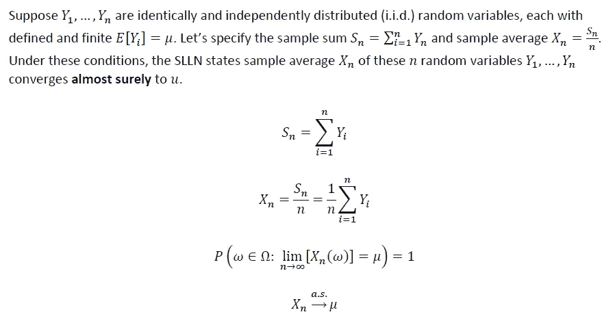
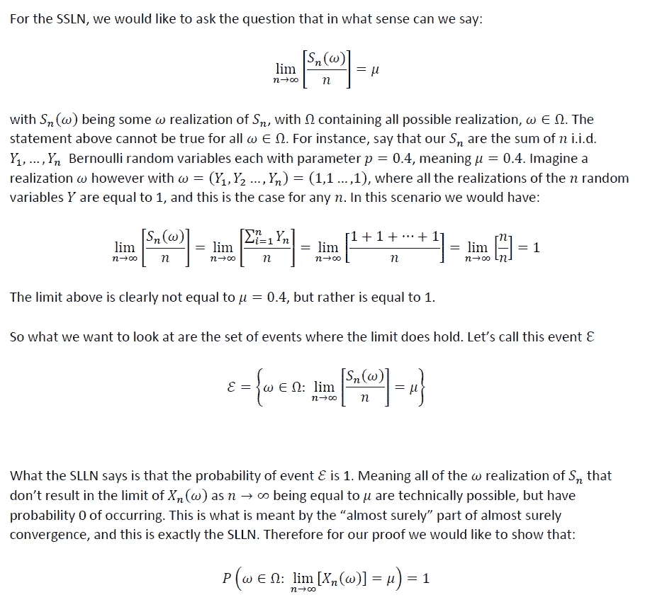
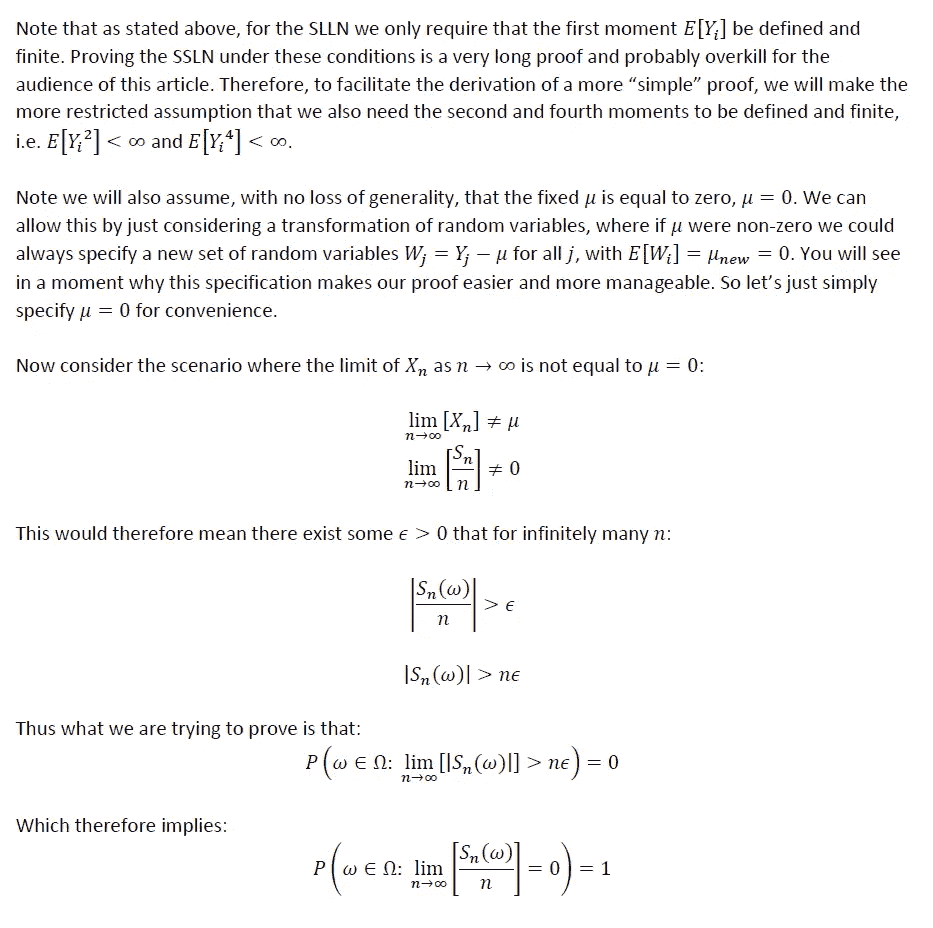
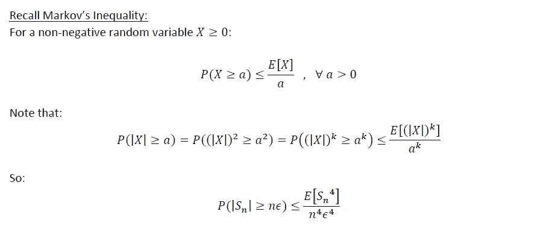
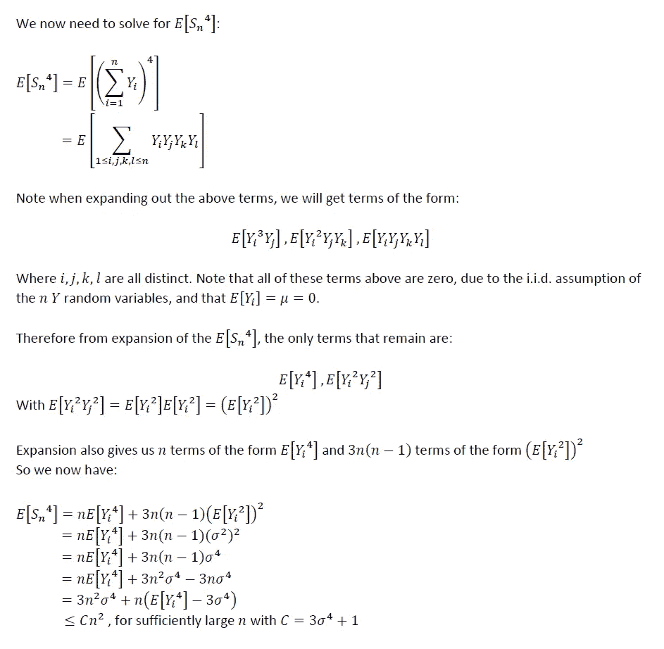
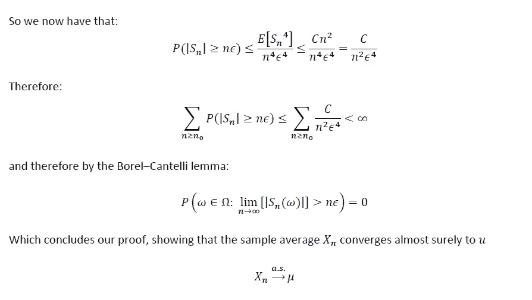

# 大数定律的证明第二部分:强定律

> 原文：<https://towardsdatascience.com/proof-of-the-law-of-large-numbers-part-2-the-strong-law-356aa608ca5d?source=collection_archive---------28----------------------->

## SLLN 的证据

照片来自 [Adobe Stock Images](https://stock.adobe.com/)

# 背景和动机

大数定律(LLN)是概率论中最重要的定理之一。尽管这个定理远远超出了概率和统计的范畴。实际上，LLN 是一种手段，通过这种手段，科学努力甚至有可能被复制，允许我们用科学方法研究我们周围的世界。

LLN 实际上有两个主要版本:弱大数定律(WLLN)和强大数定律(SLLN)。它们之间的区别在于它们依赖于不同类型的随机变量收敛。弱定律处理概率收敛，强定律几乎必然收敛。

[在我之前的文章中，我们提供了弱大数定律(WLLN)](/proof-of-the-law-of-large-numbers-part-1-the-weak-law-daf412178d3a) 的证明。作为后续，正如所承诺的，本文作为第 2 部分，强大的大数定律(SLLN)的证明。

# 强大数定律(SLLN)的定义

SLLN 的数学定义如下:

我发现**几乎可以肯定**的衔接会有点难以把握；比其他类型的随机变量更难收敛。因此，让我们试着在 SLLN 的背景下对其进行一点解构:

# SLLN 的证据

# 最终想法:

希望以上有见地。正如我在以前的一些文章中提到的，我认为没有足够的人花时间去做这些类型的练习。对我来说，这种基于理论的洞察力让我在实践中更容易使用方法。我个人的目标是鼓励该领域的其他人采取类似的方法。我打算在未来写一些基础作品，所以请随时在 [**LinkedIn**](http://www.linkedin.com/in/andrew-rothman-49739630) 上与我联系，并在 Medium 上 [**关注我的更新！**](https://anr248.medium.com/)