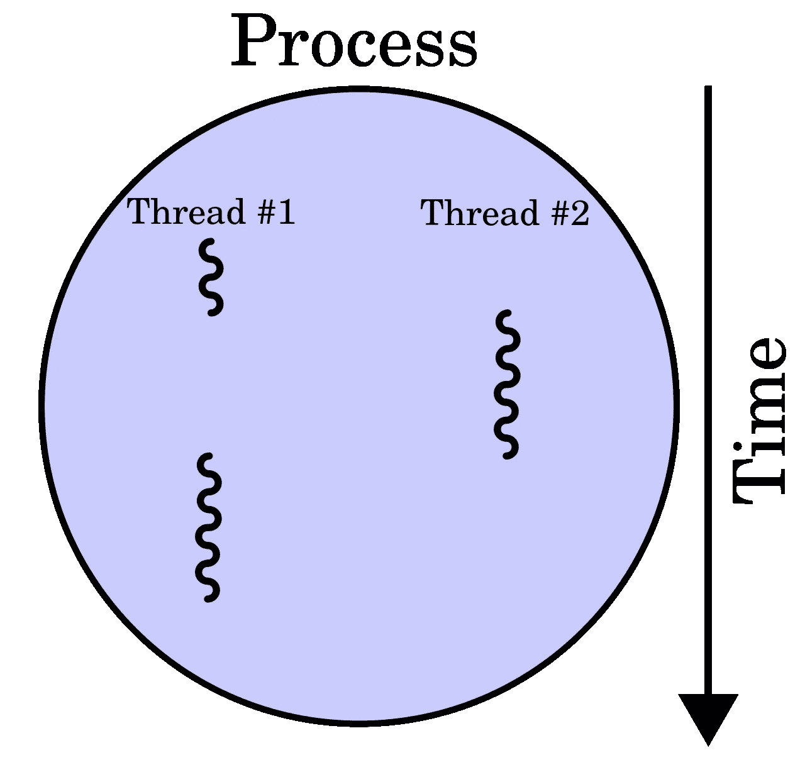
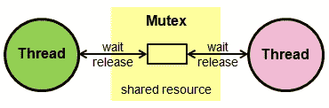
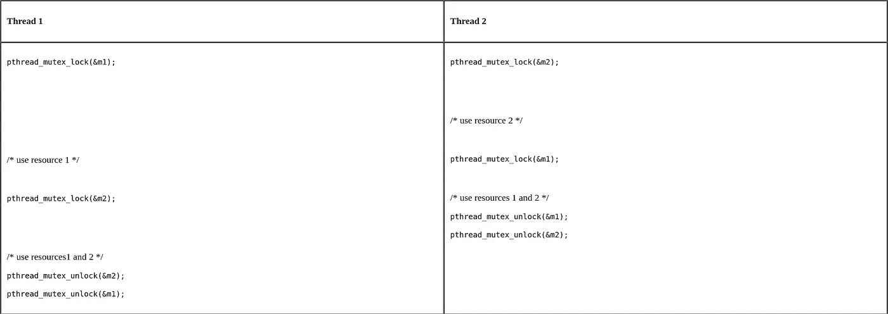

# 适当的多线程——让我们再次提醒自己它是什么

> 原文：<https://towardsdatascience.com/proper-multithreading-have-perfect-multithreading-in-your-program-4cbbf8270af3?source=collection_archive---------27----------------------->

这听起来很理想，但是如何才能拥有真正的多线程，并使用适当的锁来保护您的程序，使它可以平稳运行，而不用担心是否会出现死锁或竞争情况呢？只是一些锁、信号量和大量的思考时间。

我是说，还能怎样？要求它自己做多线程安全是疯狂的。我们可以从如何锁定程序和防止死锁开始。

# 什么是适当的多线程以及如何做？

为了使程序工作时不出现死锁和数据丢失，必须达到某个特定的程序流。**当您同时从多个线程访问共享资源时，可能会发生死锁或竞争情况**。当你用多线程运行一个程序时，很难调试到底什么时候发生了什么，以及哪个线程比其他线程更优先访问共享资源。这就是锁发挥作用的地方，我们用它来防止同样的死锁。

还有一点要提的是**上下文切换**，其中是计算机的 CPU(中央处理器)在保证任务不冲突的情况下，从一个任务(或进程)切换到另一个任务(或进程)所遵循的程序。如果计算机要提供用户友好的多任务处理，有效的环境切换是至关重要的。

让我们更详细地讨论锁。

## 锁

有几种不同的锁:

> M 执行程序和条件变量

# 互斥体

代表**互斥**并保护正在被多个线程使用的共享资源。**共享资源**需要受到保护，以确保正在写入/读取的数据得到正确处理。

简单地说，可以有一个全局变量，并且可以被多个线程访问。你锁定它是因为一个线程可以写，其他线程可以读，但这需要以一定的顺序发生。

这就是互斥体简化的工作方式

## 例子

C 语言中的互斥示例

有许多与互斥控件相关的函数，你可以在这里的[中查看所有的函数。锁的大多数功能在所有语言中都是相似的。](http://www.cplusplus.com/reference/mutex/mutex/)

# 条件变量

条件变量允许任意数量的线程等待另一个线程发出条件信号，然后它们可以开始工作。

当它的一个*等待函数*被调用时，它使用一个 unique_lock(通过互斥锁)来锁定线程。该线程保持阻塞状态，直到被另一个线程唤醒，该线程在同一个 condition_variable 对象上调用*通知函数*。

它沿着互斥体工作，你可以在这里查看所有的特性。

# 结论

这是一个简短的概述，并提醒您使用互斥锁和条件变量来锁定程序，以便实现完美的多线程。