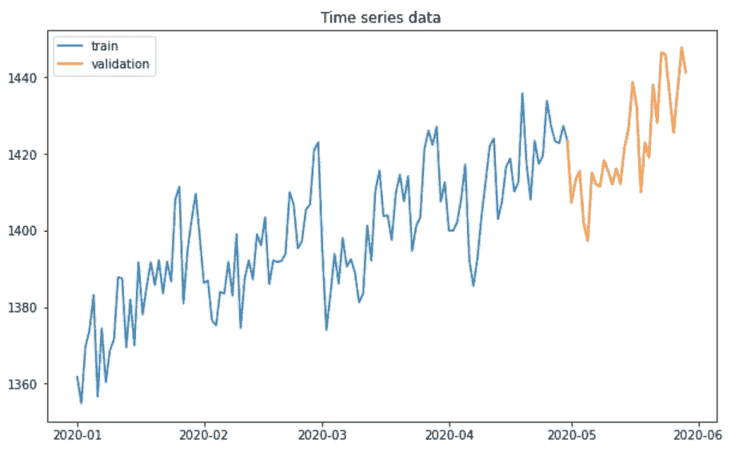
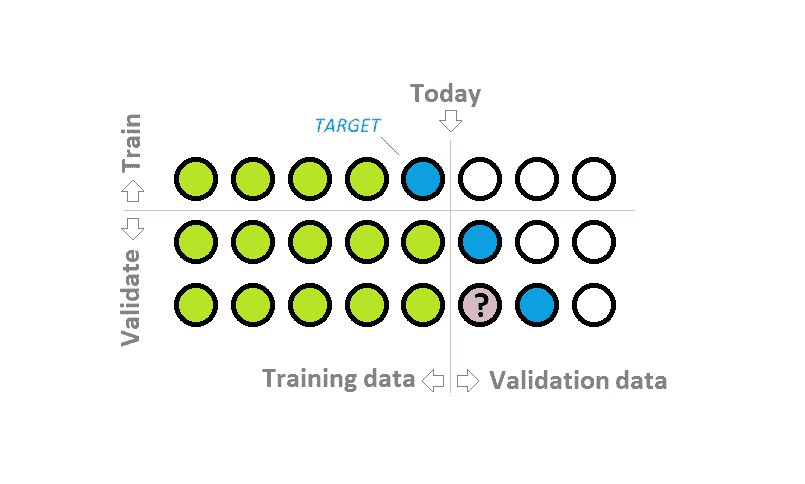
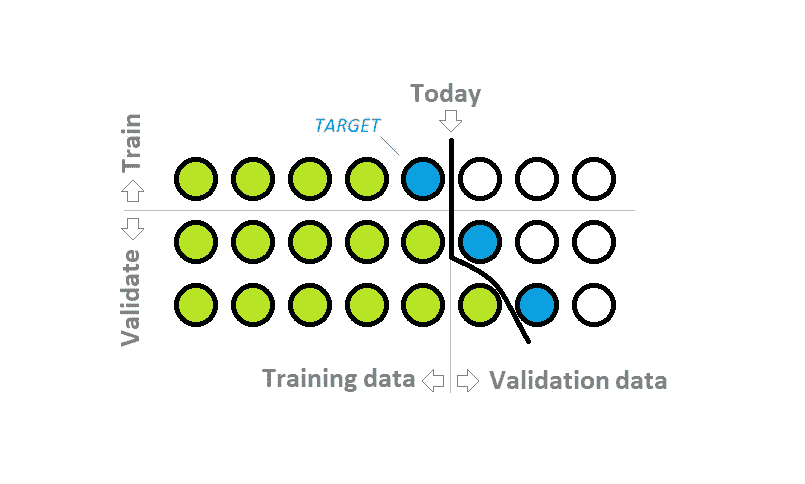
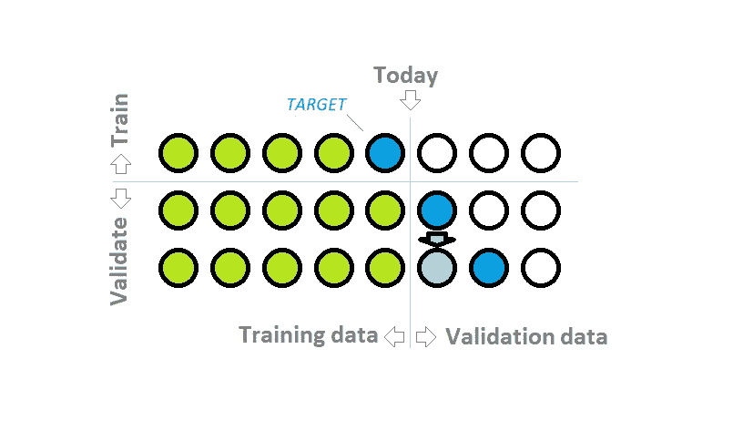
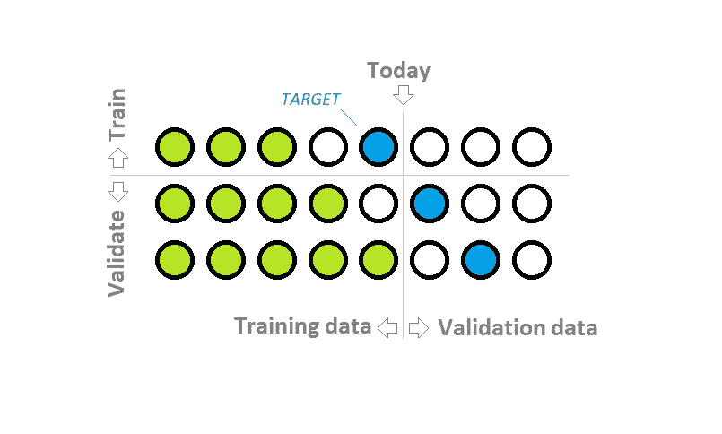

# 时间序列模型的适当验证

> 原文：<https://towardsdatascience.com/proper-validation-of-a-time-series-model-5c1b54f43e60?source=collection_archive---------13----------------------->

## 关于典型错误以及如何避免它们

在本文中，我将通过几个设置来评估机器学习模型在时间序列数据上的性能。有几种方法可以正确地做这件事。但是也有很多方法是错误的。两者我都举几个例子。对于这里的所有例子，我将使用我以前的文章中描述的时间序列和模型，关于用基于树的模型处理时间序列的[，但是这里描述的方法是通用的，也适用于其他模型。](/approaching-time-series-with-a-tree-based-model-87c6d1fb6603)

由 [patricia serna](https://unsplash.com/@sernarial?utm_source=medium&utm_medium=referral) 在 [Unsplash](https://unsplash.com?utm_source=medium&utm_medium=referral) 上拍摄的照片

所以我们有了一个时间序列预测模型，现在想看看它的表现有多好。常见的方法是使用验证集。该集合不用于训练，仅用于评估预测的质量，这种方式提供了一种可信的方法来评估模型对未知未来数据的性能。

对于简单的表格数据，一种典型的方法是随机选择验证维持集，或者使用几个折叠的交叉验证。然而，对时间序列这样做可能不是我们想要的。原因是，通过选择随机数据点进行验证，我们可能最终得到比验证更新的训练数据。基本上，我们会根据未来的数据进行训练，并预测过去。这并不是我们在实践中对模型的预期。

因此，时间序列更典型的方法是按时间进行选择，将最新的数据作为验证集，如下图所示。

到目前为止，一切看起来简单明了，但是，让我们更仔细地看看验证部分。

## 验证数据的差距

在给定的例子中，我们有一个月的验证数据。在验证期的第一天，一切都很清楚。我们有以前数据点的完整连续历史数据，可以像计算训练数据一样计算所有特征。但是现在我们来看看验证期的第二天。如果我们想预测两天前的值，这意味着我们错过了一天的真实值。为了更好地理解这个问题，请看下面的可视化图。

历史中的验证期间隔(由作者创建)

训练数据是连续的，但现在在验证集中，我们有一个缺口。在真实/测试数据中，如果我们想提前 2 步或更多步预测值，我们也会有这种差距。对于验证数据，我们实际上知道该数据点的真实值，但是如果我们不能对真实的未来数据做同样的事情，那么使用它是一个好主意吗？为了使模型准确，为了使验证可信，我们需要使训练、验证和真实/测试数据尽可能相似。

对此，基本上有 3 种可能的解决方案:

*   我们可以通过用真相填充来消除验证数据中的缺口；
*   我们可以用预测来填补验证数据中的空白；
*   我们可以引入训练数据的差距。

让我们把这些都过一遍。

## 用真值填补验证数据中的空白

这意味着我们使用部分验证数据(预测当前点之前的数据点)来生成特征。这反过来意味着我们假设我们在预测时知道这些真值。对于真实的未来数据，只有我们提前一步做出预测，这才有可能。

> 如果我们使用历史验证集数据点来计算特性，这将模拟一种情况，即我们的模型总是只提前**步预测值。**

在验证中使用先前数据点的真实值(由作者创建)

这种方法是否有效，实际上取决于业务。如果我们的真实模型只提前一步预测值(例如，每天只预测明天的访问者数量)，那么这样的验证设置是非常好的。

但是，如果在现实中，我们想要获得下一个整月的预测，这样的验证方案将会过拟合，并且估计的模型准确性将会过于乐观。

## 用以前的预测填补验证数据中的空白

在这种情况下，我们在循环中进行预测。首先，我们预测验证集第一天的值。然后，我们预测第二天的值，使用我们的第一个预测作为真实值来填补空白。以类似的方式，我们遍历所有的验证集，使用前几天的预测作为真实值，一天一天地预测。

使用以前对历史的预测(由作者创建)

好消息是，我们可以对真实/测试数据进行完全相同的处理。因此验证分数将代表真实的模型性能。

然而，有一个明显的问题——通过使用以前的预测作为真实值，我们使模型相信它们是正确的。但是它们绝对不会是完美的。因此，通过这种方式，我们引入了验证数据与训练数据之间的差异。在训练数据中，所有的历史值都是真实的，但在验证数据中，部分历史值实际上不是真实的，而只是带有一些误差的预测。

> 当预测进一步的值时，使用以前数据点的预测可能会导致预测误差累积，从而导致以后验证日的性能非常差。

如果我们使用相同的方法来预测真实的未来数据，这种方法可以作为一种验证方法。在这种情况下，验证分数将与真实模型性能相匹配，从验证的角度来看，这是可以接受的。但是我们必须意识到，对于更远的未来预测，预测的准确性会显著降低。

## 在训练数据中引入相同的差距

这意味着我们对每天的预测使用不同的模型和特征。为了预测验证集的第一天，我们使用了基于完整训练数据训练的模型。为了预测验证集的第二天，我们在特征上训练模型，从训练数据中跳过一天进行计算。对于接下来的每一天，我们使用一个模型，该模型根据在训练中跳过的相应天数的特征进行训练。

第二个验证日预测的独立模型(由作者创建)

在此架构中，数据模型接受训练，与用于进行预测的数据一致。此外，验证分数将代表未知的未来数据预测。这种方法的主要缺点是需要许多模型，这需要更多的时间来准备多个特征集和训练多个模型。

> 对每个验证日预测使用不同的模型和特征集可能是最方便的方法，但就计算资源而言也是最昂贵的。

## 典型错误

最后，我想列出一些典型的错误，以及在进行时间序列验证时应该注意和避免的事情:

*   在预测超过一个时间步长的值时，忘记了之前数据点的间隔，导致验证设置失败。
*   计算验证集的要素与计算真实/测试数据的要素不同，导致验证估计精度与真实模型性能不匹配。
*   将未来数据包括在用于训练和/或验证数据的特征中，从而导致数据泄漏和对真实/测试数据的更差的模型性能。示例:在预测一周的第一天时，计算所有工作日的“每周”特征的统计数据。
*   对比验证中使用的数据点更新的数据点进行训练，这在某些情况下可能会导致数据泄漏，因为训练数据特征实际上包括验证数据目标。

对于如何进行时间序列验证，有几种方案。它们中的每一个都有一些细节，在每种情况下，最佳选择可能取决于问题本身和业务细节/需求。

感谢您的阅读，希望这篇文章能让您对时间序列模型验证以及如何避免一些典型错误有更好的直觉。