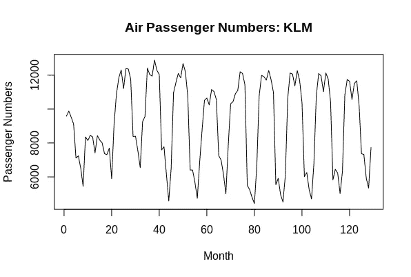
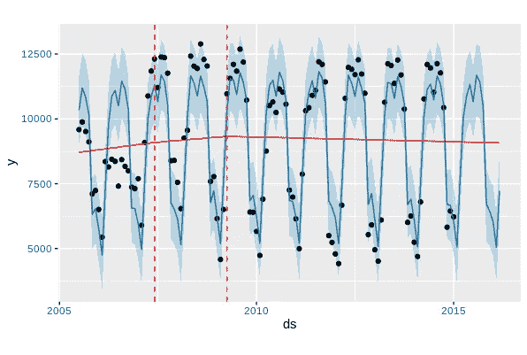
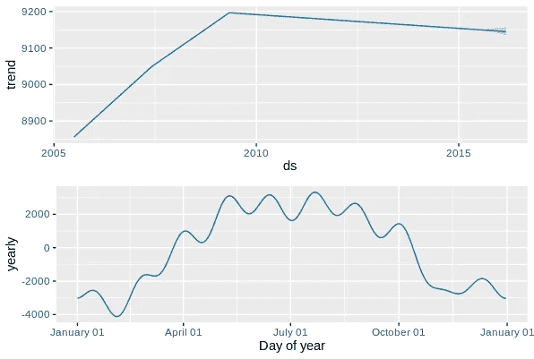

# 预言家和 R:预测航空乘客数量

> 原文：<https://towardsdatascience.com/prophet-and-r-forecasting-air-passenger-numbers-193097184422?source=collection_archive---------35----------------------->

## 预言者和时间序列预测


来源:来自 [Pixabay](https://pixabay.com/photos/aircraft-plane-airport-airplane-5611528/) 的 [Kim_R_Hunter](https://pixabay.com/users/kim_r_hunter-18496478/) 的照片

这是上一篇[文章](/time-series-analysis-with-prophet-air-passenger-data-6f29c7989681)的后续文章，该文章展示了使用 Python 进行时间序列预测，其中构建了一个 Prophet 模型，以便使用 Python 预测航空乘客数量。有问题的数据来自旧金山开放数据。

在本例中，将进行相同的分析，但使用 r。

# 背景

数据集来源于**旧金山国际机场关于航空公司**月度客运量统计的报告，该报告可从 *data.world(原始来源:旧金山开放数据)*获得，如下文参考资料部分所示。

具体来说，对航空公司**荷航** (enplaned)调整后的乘客人数进行过滤，作为从 2005 年 5 月**到 2016 年 3 月**期间的时间序列进行分析。



资料来源:RStudio

使用 Prophet 的目的是:

*   识别数据中的季节性模式
*   模型“变化点”——或数据中重大结构变化的时期
*   使用季节和变点参数预测未来航空乘客数量

在这方面，Prophet 通过识别时间序列中的结构突变，并通过考虑变化点和季节性模式进行预测，可能会产生优于 ARIMA 等更传统的时间序列模型的结果。

# 模型结构

为了让 Prophet 分析相关数据，必须确保其格式正确，即标题为 **ds** 的列表示日期，标题为 **y** 的列表示时间序列值。

将加载 prophet 库，并导入相关数据。

```
library(prophet)
mydata<-read.csv("klm.csv")ds<-mydata$Date[1:115]
y<-mydata$Adjusted.Passenger.Count[1:115]train<-data.frame(ds,y)
train
```

在这种情况下定义的 Prophet 模型将自动检测季节模式。但是，我们也想指出模型中的相关变化点。

四个变化点规定如下:

```
m <- prophet(train, n.changepoints = 4)
m
```

然后举例说明已确定的变化点:

```
$changepoints
[1] "2007-06-01 GMT" "2009-04-01 GMT" "2011-03-01 GMT"
[4] "2013-02-01 GMT"
```

然后，使用该模型预测未来 14 个月，并将预测值与测试集(实际值)进行比较。

```
future <- make_future_dataframe(m, periods = 14, freq = 'month')
tail(future)forecast <- predict(m, future)
tail(forecast[c('ds', 'yhat', 'yhat_lower', 'yhat_upper')])plot(m, forecast) + add_changepoints_to_plot(m)
```

这是一个变化点间隔图:



资料来源:RStudio

以下是趋势图和年度构成图:

```
prophet_plot_components(m, forecast)
```



资料来源:RStudio

我们可以看到，总体而言，春季和夏季的乘客数量较高，冬季的乘客数量较低。

此外，我们发现，虽然航空旅客人数在 2010 年前呈强劲增长趋势，但此后人数开始缓慢但稳步下降。

使用**指标**库，可以计算均方根误差，然后与月平均值进行比较:

```
> ds<-mydata$Date[116:129]
> y<-mydata$Adjusted.Passenger.Count[116:129]
> 
> test<-data.frame(ds,y)
> test
           ds     y
1  2015-02-01  5012
2  2015-03-01  6327
3  2015-04-01 10831
4  2015-05-01 11745
5  2015-06-01 11633
6  2015-07-01 10562
7  2015-08-01 11510
8  2015-09-01 11669
9  2015-10-01 10221
10 2015-11-01  7366
11 2015-12-01  7321
12 2016-01-01  5930
13 2016-02-01  5338
14 2016-03-01  7726
> 
> library(Metrics)
> rmse(forecast$yhat[116:129],test$y)
[1] 587.1803
> 
> mean(test$y)
[1] 8799.357
```

RMSE 为 587，与月平均值 8799 相比相对较低。这表明我们的 Prophet 模型在预测航空乘客数量方面做得相当好。

然而，值得注意的是，在 R 中选择的变化点与 Python 略有不同。具体来说，R 将其中一个变更点标识为**2009 年 4 月**，但是 Python 将变更点标识为**2009 年 5 月**。

如果我们用 2009 年 5 月来手动定义 R 中的变更点会怎么样？这会提高预测模型的准确性吗？

```
m <- prophet(train, changepoints=c("2007-06-01", "2009-05-01", "2011-03-01", "2013-02-01"))
```

以下是预测结果:

```
> ds<-mydata$Date[116:129]
> y<-mydata$Adjusted.Passenger.Count[116:129]
> 
> test<-data.frame(ds,y)
> test
           ds     y
1  2015-02-01  5012
2  2015-03-01  6327
3  2015-04-01 10831
4  2015-05-01 11745
5  2015-06-01 11633
6  2015-07-01 10562
7  2015-08-01 11510
8  2015-09-01 11669
9  2015-10-01 10221
10 2015-11-01  7366
11 2015-12-01  7321
12 2016-01-01  5930
13 2016-02-01  5338
14 2016-03-01  7726
> 
> library(Metrics)
> rmse(forecast$yhat[116:129],test$y)
[1] 496.1832
> 
> mean(test$y)
[1] 8799.357
```

我们现在看到，RMSE 进一步减少到 496，与月平均值 8，799 相比仍然很低。这表明变化点的手动配置导致了更高的预测准确度。

# 结论

在这个例子中，您已经看到了如何在 r 中运行 Prophet 模型。

具体来说，本文研究了:

*   如何正确设置时间序列的格式以便使用 Prophet 进行分析
*   变更点的自动和手动配置
*   如何使用**指标库**测量预测准确性

非常感谢您的阅读，非常感谢您的任何问题或反馈。

*免责声明:本文是在“原样”的基础上编写的，没有任何担保。本文旨在提供数据科学概念的概述，不应以任何方式解释为专业建议。*

# 参考

*   [cran-r-project . org:prophet](https://cran.r-project.org/web/packages/prophet/prophet.pdf)
*   [data.world:空中交通乘客数据](https://data.world/data-society/air-traffic-passenger-data)(原始来源:[旧金山公开数据](https://data.sfgov.org/Transportation/Air-Traffic-Passenger-Statistics/rkru-6vcg))
*   [facebook.github.io](https://facebook.github.io/prophet/)
*   [GitHub:Facebook/prophet](https://github.com/facebook/prophet)