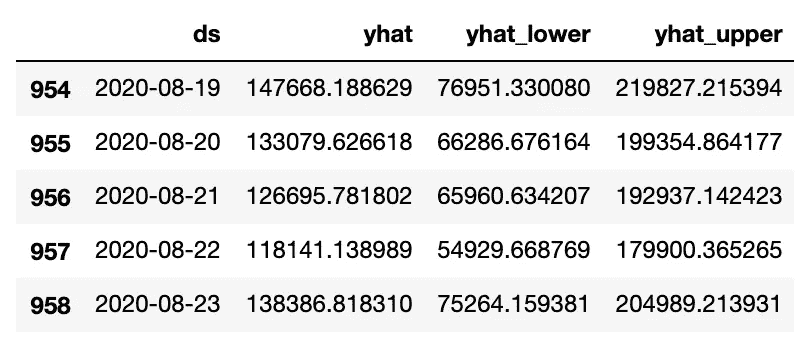
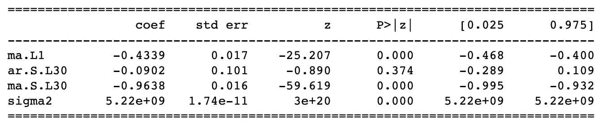

# 使用 scipy.signal.butter 组装 Prophet/ SARIMA 模型

> 原文：<https://towardsdatascience.com/prophet-sarima-model-ensembling-using-scipy-signal-butter-1fb721eb98ef?source=collection_archive---------33----------------------->

## 案例研究:通过使用 scipy.signal.butter 集成 FB Prophet & SARIMA 模型，提高每日预测准确性并降低 RMSE


在 [Unsplash](https://unsplash.com/s/photos/musicians?utm_source=unsplash&utm_medium=referral&utm_content=creditCopyText) 上[万圣业](https://unsplash.com/@wansan_99?utm_source=unsplash&utm_medium=referral&utm_content=creditCopyText)拍摄的照片

你见过两个伟大的音乐家同时和谐地演奏他们自己的乐器吗？结果比看他们单独比赛要好得多。这是我们预测公司每日收入的方法。虽然有许多模型可以解决这一挑战，但在我们的案例中，集合不同的模型可以产生最准确的结果。

**挑战是什么？**

我们比较了两种不同的模型:脸书的先知和萨里玛。

Prophet 是脸书创造的一种预测方法，它能够创建每日销售预测。Prophet 的主要好处是可以让你输入和分析周期长的数据(365 天的周期，至少需要 2 年的数据)。对我们来说，不利的一面是，在我们监测其表现的 10 个月里，预言者的预测准确率很低。

SARIMA 是另一种预测方法，在过去的 10 个月里，它对月度预测非常准确。然而，使用 365 天周期的输入数据计算 SARIMA 模型需要大量资源，并且在大多数机器上可能会失败。

**什么是 FB 先知？**

[Prophet](https://facebook.github.io/prophet/) 是一个开放的 Python/R 库，用于基于加法模型的时间序列预测，其中非线性趋势符合每年、每周和每天的季节性。它最适用于具有强烈季节效应的时间序列和几个季节的历史数据。

在这个案例研究中，我们将从我公司的数据库中随机抽取一组产品，为模型提供 2.5 年的每日在线销售数据(出于数据匿名的目的)。

让我们加载数据和库:

```
import pandas as pd
from fbprophet import Prophetdf = pd.read_csv('Random_Products_SALES.csv')
df.head()
```


我们现在可以运行模型，并为未来 84 天(或 12 周)创建预测:

```
m = Prophet()
m.fit(df)
future = m.make_future_dataframe(periods=84)
forecast = m.predict(future)
forecast[['ds', 'yhat', 'yhat_lower', 'yhat_upper']].tail()
```



输出的可视化:

```
fig1 = m.plot(forecast)
```


**萨里玛是什么？**

[SARIMA](https://machinelearningmastery.com/sarima-for-time-series-forecasting-in-python/) 将季节性添加到超参数:自回归(AR)、积分或差分(I)和移动平均(MA)中，以创建一种最受欢迎的单变量时间序列数据预测方法。

让我们使用我们的数据尝试 SARIMA 进行 30 天的周期计算，我们可以从加载库开始:

```
import warnings
import itertools
import numpy as np
import matplotlib.pyplot as plt
import statsmodels.api as sm
import matplotlib
```

我们必须调整数据集以将 ds 设置为索引:

```
y = df.set_index([‘ds’])
```

SARIMA 需要趋势元素的配置:

p:趋势自回归顺序。
d:趋势差序。
问:趋势移动平均线下单。

和季节因素:

p:季节性自回归序列。
D:季节性差异订单。
问:季节移动平均订单。
m:单个季节周期的时间步数。

让我们找出 P，D，Q，P，D，Q 任意组合的最佳 AIC:

```
p = d = q = range(0, 2)
pdq = list(itertools.product(p, d, q))
seasonal_pdq = [(x[0], x[1], x[2], 30) for x in list(itertools.product(p, d, q))]for param in pdq:
    for param_seasonal in seasonal_pdq:
        try:
            mod = sm.tsa.statespace.SARIMAX(y,order=param,seasonal_order=param_seasonal,enforce_stationarity=False,enforce_invertibility=False)
            results = mod.fit()
            print('ARIMA{}x{}30 - AIC:{}'.format(param,param_seasonal,results.aic))
        except: 
            continue
```

ARIMA(0, 0, 0)x(0, 0, 0, 30)30 — AIC:23755.302023704375
ARIMA(0, 0, 0)x(0, 0, 1, 30)30 — AIC:22717.295494658476
ARIMA(0, 0, 0)x(0, 1, 0, 30)30 — AIC:22483.193953066246
ARIMA(0, 0, 0, 0, 1, 30)30 — AIC:21435.565748542045
ARIMA(0, 0, 0)x(1, 0, 0, 30)30 — AIC:22383.511004484564
ARIMA(0, 0, 0)x(1, 0, 1, 1, 30)30 — AIC:22164.97784280904
ARIMA(0, 0, 0, 0, 0, 0 30)30 — AIC:23131.646912989316
ARIMA(0, 0, 0, 1)x(0, 1, 30)30 — AIC:22281.513637258548
ARIMA(0, 0, 1, 0, 30)30 — AIC:21950.950544055235
ARIMA(0, 0, 1, 1, 30)30 — AIC:21027.22720284167
ARIMA(0, 0, 1, 0, 1, 0, 30)30 — AIC:22291.20146896413
ARIMA(0, 0, 1, 0, 1, 30)30 — AIC:22196.6257289
ARIMA(0, 0, 1, 1, 0, 30)30 — AIC:21140.70479338173 【T】 30)30 — AIC:20701.342066955454
ARIMA(0, 1, 0)x(0, 1, 0, 30)30 — AIC:21322.37708503959
ARIMA(0, 1, 0, 30)30 — AIC:20086.59997264333
ARIMA(0, 1, 0, 0)x(1, 0, 30)30 — AIC:20723.00369864943
ARIMA(0, 1, 0, 0)x(1, 0, 1, 30)30 — AIC:20702.784158890106
ARIMA(0, 1, 0, 0, 0)x(1, 0, 30)30 — AIC:20378.827165586816
ARIMA(0, 1, 1, 0, 0)30 — AIC:2006 30)30 — AIC:21199.715947455446
ARIMA(0, 1, 1) x(0, 1, 1, 30)30 — AIC:20053.5642980343
ARIMA(0, 1, 1, 0, 30)30 — AIC:20605.04579611025
ARIMA(0, 1, 1, 1, 0, 30)30 — AIC:20558.518359458823
ARIMA(0, 1, 1, 1, 0, 30)30
AIC:20318.704493510733 **ARIMA(0, 1, 1, 1, 1, 1, 30)30 — AIC:20052.683141618152** ARIMA(1, 0, 0, 0, 0, 30)30 — AIC:2 1, 1, 30)30 — AIC:20153.52687638274
ARIMA(1, 0, 0)x(1, 0, 0, 30)30 — AIC:20711.50592060887
ARIMA(1, 0, 0)x(1, 0, 1, 30)30 — AIC:20713.27590112759
ARIMA(1, 0, 0)x(1, 0, 30)30 — AIC:20352.991087769
ARIMA(1, 0, 0)x(1, 1, 1, 1, 30)30 — AIC:20154.2263185353
ARIMA(1, 0, 0, 0, 0, 0, 30)30 — AIC:21284.027618019507
ARIMA(1, 0, 0, 1, 0, 1, 30)30 — AIC:20579.42678 0, 0, 30)30 — AIC:20603.300227055624
ARIMA(1, 0, 1)x(1, 0, 1, 30)30 — AIC:20580.575096299734
ARIMA(1, 0, 1)x(1, 0, 30)30 — AIC:20294.59890330388
ARIMA(1, 0, 1)x(1, 1, 1, 30)30 — AIC:20052.39937573138
ARIMA(1, 0, 0, 0, 30)30 — AIC:21339.144939704944
ARIMA(1, 0, 0, 0, 1, 0, 30)30 — AIC:20633.488277537876 【T51) ARIMA(1, 0, 0, 0, 0, 30)30 — AIC:21267 0, 1, 30)30 — AIC:20634.703230420448
ARIMA(1, 1, 0)x(1, 1, 0, 30)30 — AIC:20327.151794423327
ARIMA(1, 1, 0, 30)30 — AIC:20104.25721828914
ARIMA(1, 1, 1)x(0, 0, 0, 30)30 — AIC:21260.535839126904
ARIMA(1, 1, 1, 1)x(0, 1, 30)30 — AIC:20554.5720707192
ARIMA(1, 1, 1, 1)x(0, 0, 30)30 — AIC:21194.875022056338
ARIMA(1, 1, 1, 1, 1, 1, 1, 1, 30)30 — AIC:20053.7153

我们还可以打印最佳组合(0，1，1，1，1，1)的统计数据摘要，并创建一个包含同一时间段(84 天)预测的图表:

```
mod = sm.tsa.statespace.SARIMAX(y,
                                order=(0, 1, 1),
                                seasonal_order=(1, 1, 1, 30),
                                enforce_stationarity=False,
                                enforce_invertibility=False)
results = mod.fit()
print(results.summary().tables[1])
```



```
import datetime as dt
pred_uc = results.get_forecast(steps=84)
index_date = pd.date_range(y.index[-1], periods = 84, freq = ‘D’)forecast_series = pd.Series(list(pred_uc.predicted_mean), index = index_date)pred_ci = pred_uc.conf_int()
ax = y.plot(label=’observed’, figsize=(14, 4))
#print(pred_uc.predicted_mean)
forecast_series.plot(ax=ax, label=’Forecast’)
ax.fill_between(forecast_series.index,
 pred_ci.iloc[:, 0],
 pred_ci.iloc[:, 1], color=’k’, alpha=.1)
ax.set_xlabel(‘Date’)
ax.set_ylabel(‘Sales’)
plt.legend()
plt.show()
```


我们现在可以放大到预测期，黄线代表 SARIMA 的结果，红线代表 FB Prophet 的结果，蓝线代表预测的 84 天中前 43 天的实际销售额。我们可以看到，萨里玛的数字更接近真实值(94%的准确率)，但线看起来是平面的。另一方面，Prophet 呈现了一种趋势，这种趋势随着日常销售和谐地变化，但规模不同(61%的准确率)。

在一个完美的场景中，我们希望萨里玛的比例每天都有变化，类似于先知的模型:


**什么是黄油？**

[scipy.signal.butter](https://docs.scipy.org/doc/scipy/reference/generated/scipy.signal.butter.html) 是 Python 上的一个库，用于[过滤信号](https://en.wikipedia.org/wiki/Filter_(signal_processing))，我们将使用频率 11(我尝试了其中的几个，但我想保持这篇文章简短)，我们将把这个过滤器应用于 prophet 的结果(prophet_df)。

然后，该过滤器的输出将被添加到 SARIMA 的结果中，并与真实数据(data_df)进行比较。

```
filter_freq = 11
sos = signal.butter(10, filter_freq, 'high', fs=91, output='sos')
filtered = signal.sosfilt(sos, list(prophet_df.yhat))

sarima_df['ensembled'] = sarima_df.sales + filtered

ensembled_list = np.array(sarima_df.loc[(sarima_df['date'] >= data_df['Date'].iloc[0]) & ((sarima_df['date'] <= data_df['Date'].iloc[-1])),'ensembled'])

real_list = np.array(data_df.Real
```

**结果**

如下图所示，萨里玛和先知的组合比萨里玛(更好的 RMSE)更符合真实趋势，比萨里玛或先知(95%)更准确:


**最终注释**

像新冠肺炎这样的特殊情况迫使我的公司调整每日预测，以提高准确性并减少 RMSE。这并不意味着这种组合将提高您的特定数据集的性能，如果您的 SARIMA 月度数据更准确，但 Prophet 显示更好的每日变化，这可能会有所帮助。

当你试图将你的预测拟合到如此接近一个特定的时间段时，你也应该考虑到[过度拟合](https://en.wikipedia.org/wiki/Overfitting)的风险。我做了 6 个月同样的练习，尝试了不同周期的萨里玛和不同频率的黄油，以确保我选择的组合对所有月份都有益。

马里奥·卡马戈
mario.andres.camargo@gmail.com