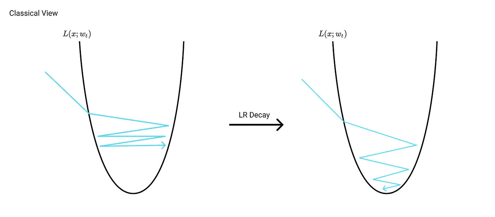
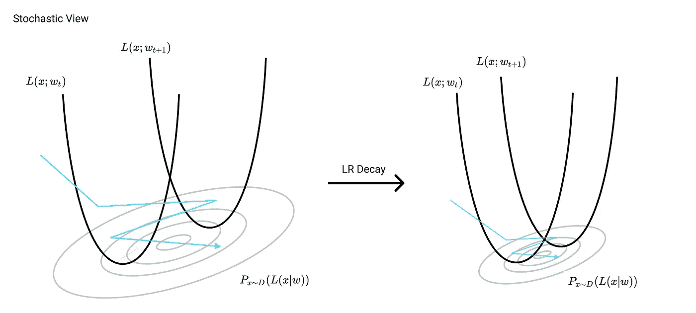
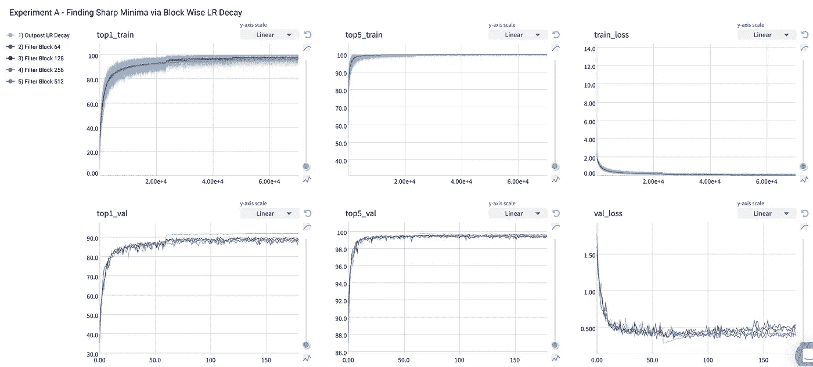
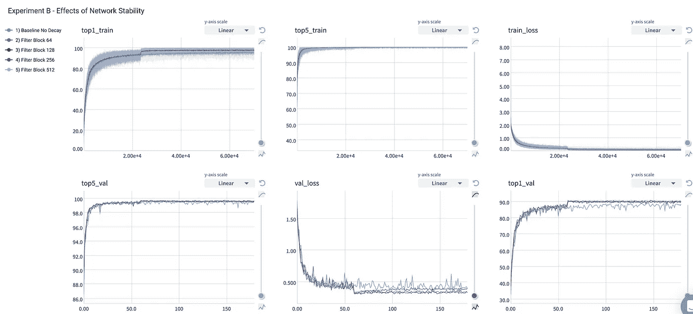
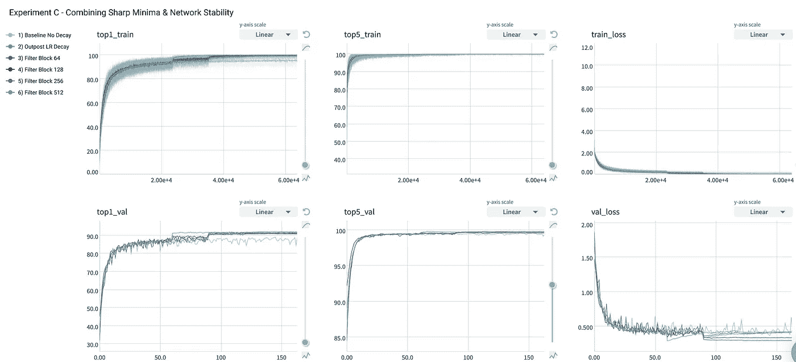
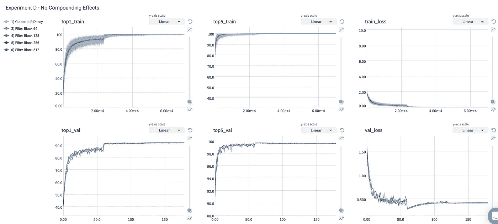

# 随机网络稳定性

> 原文：<https://towardsdatascience.com/proposing-a-new-effect-of-learning-rate-decay-network-stability-c4b4ef3bae5e?source=collection_archive---------54----------------------->

## 揭示学习率是随机梯度下降中的一种正则化形式

# 摘要

现代文献表明，学习速率是调整深度神经网络的最重要的超参数。[1]如果学习率太低，梯度下降在一个长而陡的山谷或鞍点会很慢。学习率太高时，梯度下降有超过最小值的风险。[2]已经开发了自适应学习速率算法，以考虑动量和累积梯度，从而对非凸优化问题的这些情况更加稳健。[3]

一个常见的主题是，在一定数量的时期后，通过允许权重设定为更精确的尖锐最小值，衰减学习率可以帮助模型收敛到更好的最小值。这个想法是，在一个给定的学习速率下，你可能会不断地错过实际的最小值。因此，通过降低学习率，我们允许我们的权重固定在这些尖锐的最小值上。

随着深度学习社区不断改进和建立调整学习率的新方法，如循环学习率计划，我相信我们更深入地了解学习率对我们的优化问题有什么影响是很重要的。

在这项研究中，我想提出一个被忽略的学习率衰减效应:**网络稳定性**。我将在不同的环境中实验学习率的衰减，并展示网络稳定性是如何产生的，以及网络稳定性如何在训练过程中使子网受益。

我认为学习率衰减对优化问题有两个影响:

1.  允许重量停留在更深的最小值
2.  在训练过程中提供正向传播激活和反向传播损耗信号的网络稳定性

首先，我想通过一些数学符号来建立我所说的网络稳定性。

然后，我将通过在 CIFAR-10 数据集上对 ResNet-18 架构进行的实验来展示这两种影响是如何发生的。

# 理论

什么是网络稳定性？更重要的是，它如何影响损失情况？

让我们从概率的角度来看待我们的损失情况。

对于单个例子 x，给定网络 w 的当前权重，我们可以计算损耗 L，

从所有图像空间上的分布 D 中选取一个例子 x。

然后，我们可以从概率上来看损失情况

对于给定的一组权重 w，为单个图像 x 计算的损失函数通过反向传播产生每个权重的梯度阵列，即，

我们从上面的概率损失图中观察到这个梯度的概率是相应的

使用批量样本对给定数据集执行随机梯度下降的过程可以被视为通过点估计在概率损失场中导航。

在一批图像中，权重保持不变。在时间步长 t 的每次更新都经过以下条件场景，

通过对足够大的 n 批进行平均，我们希望

因此，对于给定的一组权重，我们采用的梯度步长是一个预期步长。

然后，在以下条件下执行每个步骤 t:

通过降低网络上的学习速率，我们减少了 w 的变化。

现在，批量梯度下降的后续迭代在与前一次迭代更加**相似的概率损失场上操作。这在训练期间在我们的网络中加强了某种程度的稳定性，对于足够小的 w 变化，**

通过降低学习率，我们强制**随机梯度下降在权重**上的更严格的条件概率上操作，而不是在权重机制和它们相应的条件概率场之间跳跃。这就是我对网络稳定性的看法。

学习率衰减的经典观点是能够收敛到尖锐的极小值，这是对随机过程的过度简化，并将损失情况视为常数。

从概率的角度来看，我建议将学习率视为随机难题的一部分。我们应该随机地对待随机梯度下降的过程。

我对这一概率过程中稳定性影响的假设是深层和早期两方面的:

1.  当深层经历前向传播信号的不稳定性时，它们被迫推广到变化的收敛的早期子网。当我们引入早期层的稳定性时，深层可以依靠稳定的正向传播信号来发展稳定的等级特征。
2.  当早期层经历反向传播损耗信号的不稳定性时，它们不能获得损耗的清晰静态图像。相反，随着梯度下降的每次迭代，通过深层呈现给他们的损失图像发生变化。当我们引入更深层的稳定性时，早期的层可以通过 SGD 更有效地收敛到一个解决方案。

# 实验

对于我们的实验，我们将在 CIFAR-10 数据集上考虑 ResNet 架构。

通常，在一定数量的时期之后应用学习率衰减，这结合了稳定到急剧最小值和提供网络稳定性的效果。

在一系列的 4 个实验中，我想单独分开这些影响，展示它们是如何结合的，并最终表明它们都是学习速度衰减的一部分。

> 实验 A:没有网络稳定性的尖锐极小值

在我们的第一个实验中，我们将研究学习速度衰减对单个模块的影响。

ResNet 架构由大小为 64、128、256 和 512 的四个滤波器模块组成。

每个尺寸为 64、128、256、512 的滤光块都有不同的颜色[4]

在这个实验中，我们将训练一个前哨模型，其中学习率在整个网络范围内衰减，然后是只在某个过滤器块中衰减学习率的模型。这个实验应该揭示单个块在多大程度上稳定到更尖锐的最小值，以及它在不给网络的其余部分增加更多稳定性的情况下这样做的能力，因为我们为网络的其余部分保持更高的学习速率。

> 实验 B:没有尖锐最小值的网络稳定性

在第二个实验中，我们将研究冻结块的效果，以加强稳定性，同时在未冻结的块上保持恒定的学习速率。通过保持一个恒定的学习速率，我们不会引入陷入更尖锐的最小值的影响。我们希望在冻结块时看到更快的收敛以减少损失，就像我们对网络范围的 LR 衰减所做的那样。

> 实验 C:结合稳定性和尖锐的最小值

在本实验中，我们将结合上述两个实验的效果，对单个模块采用学习速率衰减，然后完全冻结其他模块。这将允许腐烂的石块沉淀成更尖锐的极小值，然后通过冻结其他石块来进一步获得稳定性的好处。

> 实验 D:无复合效应

在这个实验中，我们将衰减整个网络的学习速率，然后尝试通过冻结除一个块之外的所有块来引入稳定性效应。如果网络范围的 LR 衰变没有发现进一步的稳定性效应，我们已经有效地证明了 LR 衰变替代并提供了由冻结效应实现的增益。

## 实验 A:尖锐的最小值

我们将培训以下 5 个模型:

1.  具有逐步 LR 衰减的前哨模型

LR 从 0.1 开始。在时期 60 衰减到 0.01，然后在时期 120 衰减到 0.001。

2.滤波器模块 64 LR 衰减

3.滤波器模块 128 LR 衰减

4.滤波器模块 256 LR 衰减

5.滤波器模块 512 LR 衰减

我们的假设是，每一个区块应该能够解决一些较低的最小值。随着学习率的下降，我们应该会看到训练损失的减少，并且 top-1 验证的准确性会增加。

结果如下:

放大前 1 名训练准确度图和前 1 名验证准确度图，

我们观察到以下情况:

*   在我们的前哨模型中，60 个时期和 120 个时期的 LR 衰减允许模型收敛到训练集上的较低损失和验证集上的较高精度。
*   在我们的滤波器块衰减模型中，我们看到 LR 衰减点有助于滤波器块进入更深的最小值。
*   前哨模型收敛到一个稳定的验证精度，在 SGD 迭代中的方差小于滤波器衰减对应模型。

从该实验中，我们看到每个块上的 LR 衰减能够有助于潜在地将权重设置为更尖锐的最小值。前哨模型显示了由于整个网络学习速率的衰减而引起的网络稳定性的特性。验证准确度的高方差表明，对于其他块，将学习速率保持在 0.1 会导致我们学习的网络的逐时不稳定性。

## 实验 B:网络稳定性

对于这个实验，我们保持任何正在训练的块的学习率为 0.1，没有衰减。这样，我们就避免了由于陷入更尖锐的极小值而模糊我们的结果。

为了模拟网络稳定性的影响，我们将在每个实验中冻结除一个以外的所有滤波器模块。这应该有助于加强我们前面提到的网络稳定性的属性，

我们将培训以下 5 个模型:

1.  无 LR 衰减的基线模型
2.  用 LR 0.1 过滤块 64，其他块在时期 60 被冻结
3.  用 LR 0.1 过滤块 128，其他块在时期 60 被冻结
4.  用 LR 0.1 过滤块 256，其他块在时期 60 被冻结
5.  用 LR 0.1 过滤块 512，其他块在时期 60 被冻结

通过比较网络不同深度的影响，我们可以确定稳定效应是一种网络范围的效应。它不应该只对较深的区块或较早的区块更好。

我们的假设是，持续训练的每个块应该获得网络稳定性的好处，并在下面的情况下收敛到更好的最小值

其中 *j* 到 *k* 是给定滤波器块中的权重指数。

我们的期望是每个实验都应该取得比基线更好的结果。此外，所得到的网络应该具有更稳定的解决方案，在随机梯度下降的时期上具有更低的训练/验证损失和准确性的方差。

结果如下:

放大前 1 名验证准确性图表，

通过简单地在时期 60 冻结网络的其余部分，我们看到验证准确性的明显提高。

没有混淆我们的结果与尖锐的最小值的影响，我们在这里建立了网络稳定性是收敛的一个重要因素。

此外，我们对这些模型的验证精度高于实验 A 模型的精度。这表明，在帮助网络收敛方面，稳定性可能比尖锐的极小值效应起着更大的作用。

## 实验 C:结合尖锐最小值和网络稳定性

在这个实验中，我们希望证实，在没有网络范围的 LR 衰减的情况下，我们能够组合急剧最小值和网络稳定性的影响。我们将通过在时期 60 仅衰减给定块的学习速率来做到这一点，然后在时期 90 冻结网络的其余部分。我们将培训以下 6 个模型:

1.  无 LR 衰减的基线模型
2.  具有 LR 衰减的前哨模型
3.  用 LR 衰减过滤块 64，其他块在时期 90 被冻结
4.  用 LR 衰减过滤块 128，其他块在时期 90 被冻结
5.  用 LR 衰减过滤块 256，其他块在时期 90 被冻结
6.  用 LR 衰减过滤块 512，其他块在时期 90 被冻结

结果如下

放大前 1 名训练准确度图和前 1 名验证准确度图，

通过将 LR 衰减的效果组合在单个块上，然后冻结网络的其余部分，我们复制了具有网络范围 LR 衰减的前哨网络的特征。正如所料，网络范围的 LR 衰减模型仍然比我们的滤波器块模型表现更好。然而，我们的组合方法能够很好地模拟 LR 衰减的影响，就稳定性、有效性和训练准确性/损失而言。

当在时期 90 ( 3.5 * 10⁴迭代)应用块冻结时，我们使得深度滤波块模型 256 和 512 能够收敛到 100%的训练精度。继续训练早期块的模型，如 64 和 128，没有达到相同的训练精度水平，并且它们在验证集 top 1 精度上击败了其他模型。这给了我们一些证据，表明随着训练的进行，过度拟合在更深的层中发生得更多。

如果我们看看验证损失，这也向我们展示了网络深度和过度拟合之间的有趣关系。

在前哨站模型的 LR 在第 60 纪元衰减之后，验证损失处于最低。随着训练进展超过时期 60，训练集上的损失减少，但是与我们预期的相反，对于网络范围的衰减模型，验证损失增加，而验证前 1 名的准确度也增加。

我们使用交叉熵损失来训练我们的模型，这意味着对于增加的损失，我们必须观察以下两种情况之一:

1.  正确预测的可信度较低
2.  对错误预测更有信心

由于训练损失持续减少，而训练前 1 名的准确性已经达到 100%，这表明该模型通过输出更有把握的预测来最小化训练损失。

我们会认为有把握的预测是过度拟合的，不能很好地推广到验证集。然而，验证前 1 名的准确性随着训练而增加，但是我们注意到验证前 5 名的准确性降低。这意味着随着训练随着网络范围的 LR 衰减而进行，当模型是错误的时，在预测的前 5 个标签中找到真正的标签会更加困难。这可以归因于其他标签的信心增强，因此验证损失增加。

看一下块冻结模型，过滤块中更深的层被连续训练，像在 256 或 512 中，我们观察到与前哨模型相同的过度拟合效应。随着训练的进行，这些模型增加了它们的验证损失，并且收敛到与网络范围的 LR 衰减模型相似的验证损失。

然而，在早期层被训练而较深层被冻结的滤波器块模型中，如模型 64 或 128 中，我们观察到验证损失没有以同样的方式随着训练而增加。前 5 名的验证准确性也没有受到影响。

当我们冻结早期层时，保持训练的深层能够更好地适应来自早期子网的稳定信号。这表明了高学习率实际上是一种通过给随机过程添加噪声的正则化形式。通过设置权重转移的速率，我们定义了我们转移损失的条件概率云的多样性。从我们的实验中，我们看到，在深层冻结时保持训练的早期层在过度适应训练集的复杂性方面有更艰难的时间。它们对验证集损失的改善最大。

当我们冻结深层时，早期层在验证损失和准确性方面立即改善最多。这表明早期层具有反向传播损耗的稳定图像以收敛到更好的特征是多么重要。

这两个观察都支持我在摘要中详述的关于早期地层、深层和稳定性之间关系的两个假设。

**实验 D:无复合效应**

在我们的最后一个实验中，我想要展示的是，一旦我们将 LR 衰减应用到整个网络，稳定性就不再能够通过冻结块来实现。这将表明 LR 衰变产生了这些稳定性效应，而进一步冷冻实际上没有任何有益的效应。

我们将培训以下 6 个模型:

1.  具有 LR 衰减的前哨模型
2.  过滤跨网络具有 LR 衰减的块 64，其他块在时期 140 被冻结
3.  过滤跨网络具有 LR 衰减的块 128，其他块在时期 140 被冻结
4.  过滤跨网络具有 LR 衰减的块 256，其他块在时期 140 被冻结
5.  过滤跨网络具有 LR 衰减的块 512，其他块在时期 140 被冻结

在时期 140，在我们应用网络范围的 LR 衰减之后，我们应用块冻结。如果网络稳定性是 LR 衰减的结果，那么块冻结的收益将不再是可实现的。

结果如下:

正如预期的那样，我们在我们的模型中没有看到 epoch 140 的额外增益。因此，我们有效地证明了网络稳定性的影响确实是由学习率衰减引起的。

# 结论

我们发现学习率衰减存在两种效应:

1.  在优化领域达到更清晰的极小值
2.  前向传播信号和后向传播信号的稳定性

不稳定源于不断的变化。梯度下降更新每批的所有权重，有效地将噪声添加到向前和向后传播的信号中。通过冻结层和提高准确性，我们显示了网络稳定性的优点，作为学习率衰减的积极影响。

按照这种观点，更高的学习率是一种正规化的形式。降低学习速率类似于降低模拟退火优化器的温度。这影响了概率损失情况。与吉洪诺夫正则化影响先验概率以支持较小权重的方式相同，我们选择的学习率应用影响随机优化过程中可发现的最小值的先验概率。

# 引文

[1] Smith，Leslie N .“训练神经网络的循环学习率” *2017 年 IEEE 计算机视觉应用冬季会议(WACV)* 。IEEE，2017。

[2] Dauphin，Y. N .等人，“RMSProp 和非凸优化的平衡自适应学习速率”。arXiv 2015。” *arXiv 预印本 arXiv:1502.04390* 。

[3]古德费勒、伊恩、约舒阿·本吉奥和亚伦·库维尔。*深度学习*。麻省理工学院出版社，2016 年。

[4]李、雍、曾、、张、解、戴、安波、阚、美娜、山、、陈、西林.(2017).KinNet:用于亲属关系验证的由细到粗的深度度量学习。13–20.10.1145/3134421.3134425.