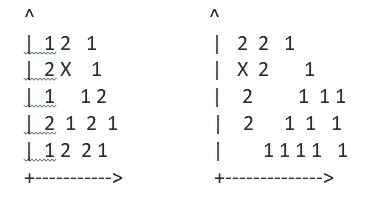
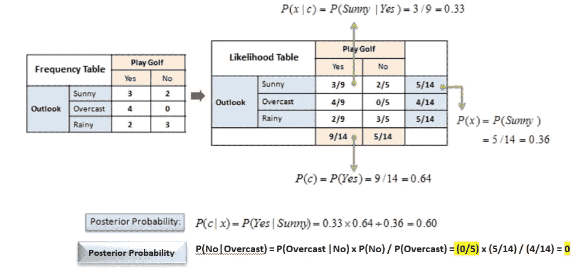

# 各种机器学习算法的利弊

> 原文：<https://towardsdatascience.com/pros-and-cons-of-various-classification-ml-algorithms-3b5bfb3c87d6?source=collection_archive---------1----------------------->

来源:Pixabay

机器学习中有很多分类算法。但是曾经想知道哪种算法应该用于什么目的和什么类型的应用。如果是，那么请阅读分类中使用的各种机器学习算法的利弊。我还列出了它们的用例及应用。

# SVM(支持向量机)

**优点**

1.  **在更高维度表现出色。**在现实世界中有无限的维度(不仅仅是 2D 和 3D)。例如图像数据、基因数据、医学数据等。有更高的维度，SVM 在这点上很有用。基本上，当特征/列的数量较高时，SVM 做得很好

2.**类可分时的最佳算法。**(当两个类的实例可以很容易地用直线或非线性分开时)。为了描述可分离的类，让我们举一个例子(这里以线性分离为例，类也可以是非线性可分离的，例如通过画一条抛物线等)。在第一张图中，你很难判断 X 是属于第一类还是第二类，但是在第二种情况下，你很容易判断出 X 属于第二类。因此，在第二种情况下，类是线性可分的。

首先是不可分的类，其次是可分的类。

3.**离群值**影响较小。

4.SVM 适合极端情况下的二元分类。

**缺点:**

1.**慢:**对于较大的数据集，需要大量的时间来处理。

2.**重叠类的性能不佳**:在重叠类的情况下性能不佳。

3.**选择合适的超参数很重要:**这将考虑到足够的泛化性能。

4.选择合适的内核函数可能很棘手。

**应用:**

单词包应用(许多特征和列)、语音识别数据、图像分类(非线性数据)、医学分析(非线性数据)、文本分类(许多特征)

# 朴素贝叶斯

**赞成者**

1.  **实时**预测:非常快，可以实时使用。

2.**可扩展**大型数据集

3.**对无关特征不敏感。**

4.在朴素贝叶斯中有效地完成了多类预测

5.**高维数据的良好性能**(特征数量大)

**缺点**

1.  **特征的独立性不成立:**基本的朴素贝叶斯假设是每个特征对结果做出独立且相等的贡献。然而，这个条件在大多数情况下并不满足。

2.**不好的估计量:【predict _ proba 的概率输出不要太认真。**

3.**训练数据应能很好地代表总体:**如果某个类别标签和某个属性值没有同时出现(例如 class="No "，shape = " govern ")，那么后验概率将为零。因此，如果训练数据不代表总体，朴素贝叶斯就不能很好地工作。(这个问题可以通过平滑技术来解决)。

**应用:**

朴素贝叶斯用于文本分类/垃圾邮件过滤/情感分析。它用于文本分类(它可以对多个类别进行预测，并且不介意处理不相关的特征)、垃圾邮件过滤(识别垃圾邮件)和情感分析(在社交媒体分析中，用于识别积极和消极的情感)、推荐系统(用户接下来会购买什么)

# 逻辑回归

**优点**

1.  **简单的**实现

2.**有效**

3.**不需要要素缩放:**不需要缩放输入要素(也可以处理缩放后的要素，但不需要缩放)

3.**不需要调整超参数。**

**缺点**

1.  **非线性数据的性能不佳**(例如图像数据)

2.**不相关和高度相关特征表现不佳**(使用博鲁塔图去除相似或相关特征和不相关特征)。

3.**不是很强大的**算法，很容易被其他算法超越。

4.**高度依赖数据的正确呈现**。所有重要的变量/特征都应该被识别，以使其工作良好。

**应用:**

任何分类问题，最好是二进制的(它也可以执行多类分类，但二进制是首选)。例如，如果你的输出类有两个结果，你可以使用它；癌症检测问题，学生是否会通过/失败，在客户贷款的情况下违约/不违约，客户是否会流失，电子邮件是否是垃圾邮件等。

# 随机森林

**优点:**

1.随机森林可以**去相关树**。它挑选训练样本，并给每棵树一个特征子集(假设训练数据是[1，2，3，4，5，6]，因此一棵树将得到训练数据的子集[1，2，3，2，6，6]。注意，训练数据的大小保持不变，两个数据都具有长度 6，并且特征‘2’和特征‘6’在给予一棵树的随机采样的训练数据中重复。每棵树都根据它所具有的特征进行预测。在这种情况下，树 1 只能访问特征 1、2、3 和 6，因此它可以基于这些特征进行预测。其他一些树将访问特征 1、4、5，因此它将根据这些特征进行预测。如果特征高度相关，那么问题可以在随机森林中解决。

2.**减少误差:**随机森林是决策树的集合。为了预测特定行的结果，随机森林从所有树中获取输入，然后预测结果。这确保了树的单个误差被最小化，并且总体方差和误差被减少。

3.**在不平衡数据集上表现良好**:也可以处理不平衡数据中的错误(一个类是多数，另一个类是少数)

4.**海量数据的处理:**可以处理变量维度更高的海量数据。

5.**很好的处理缺失数据:**可以很好的处理缺失数据。因此，如果你的模型中有大量的缺失数据，它会给出很好的结果。

6.**离群值的影响很小:**由于最终结果是通过咨询多个决策树得出的，因此离群值的某些数据点不会对随机森林产生很大影响。

7.**没有过拟合的问题:**在随机森林中只考虑特征的子集，最终的结果取决于所有的树。所以泛化多，过拟合少。

8.**对提取特征重要性有用**(我们可以用它来进行特征选择)

**缺点:**

1.**特性**需要有**一些预测能力**否则它们不会工作。

2.**树的预测需要不相关**。

3.**以黑匣子的形式出现:**很难知道发生了什么。您最多可以尝试不同的参数和随机种子来改变结果和性能。

**应用**:

信用卡违约，欺诈客户/不是，容易识别病人的疾病与否，电子商务网站的推荐系统。

**决策树**

**优点**

1.**不需要数据的标准化或缩放**。

2.**处理缺失值**:缺失值影响不大。

3.**便于向非技术团队成员解释**。

4.**轻松可视化**

5.**自动** **特征选择**:无关特征不会影响决策树。

**缺点**

1.**容易过度拟合。**

2.**对数据敏感。**如果数据稍有变化，结果可能会发生很大变化。

3.**训练**决策树所需的时间更长。

**应用**:

确定产品的购买者，预测违约的可能性，哪种策略可以使利润最大化，找到成本最小化的策略，哪些特征对吸引和留住客户最重要(是购物的频率，是频繁的折扣，是产品组合等)，机器的故障诊断(持续测量压力、振动和其他措施，并在故障发生前进行预测)等。

# XGBoost

**赞成者**

1.**需要较少的特征工程**(不需要缩放、归一化数据，也可以很好地处理缺失值)

2.**可以求出特征重要性**(它输出每个特征的重要性，可以用于特征选择)

3.**快速**解读

4.**离群值**影响最小。

5.**很好地处理大规模数据集**。

6.**执行好**速度

7.**良好的模特表现**(赢得大部分卡格尔比赛)

8.**不易过度拟合**

**缺点**

1.**难解读**，可视化难

2.**如果参数调整不当，可能会出现过拟合**。

3.**由于超参数太多，更难调整**。

**应用**

任何分类问题。如果您有太多的要素和太大的数据集，存在异常值，有许多丢失的值，并且您不想进行太多的要素工程，这将非常有用。它赢得了几乎所有的比赛，所以这是一个你在解决任何分类问题时必须牢记在心的算法。

# K 近邻

**优点**

1.**简单的**理解和实现

2.**没有关于数据的假设**(例如，在线性回归的情况下，我们假设因变量和自变量线性相关，在朴素贝叶斯中，我们假设特征彼此独立，等等。，但是 k-NN 对数据不做任何假设)

3.**不断进化的**模型:当它暴露于新数据时，它会改变以适应新的数据点。

4.**多类**问题也可以解决。

5.**一个超参数:** K-NN 在选择第一个超参数时可能会花费一些时间，但在此之后，其余的参数会与之对齐。

**缺点**

1.**慢速**用于大型数据集。

2.**维数灾难**:在具有大量特征的数据集上效果不佳。

3.**数据绝对必须的缩放**。

4.**不适用于不平衡数据。**因此，在使用 k-NN 之前，要么欠采样多数类，要么过采样少数类，并拥有一个平衡的数据集。

5.对**异常值**敏感。

6.无法很好地处理**缺失值**

**应用:**

当数据集较小且具有较少数量的特征时，可以将其用于任何分类问题，因此 k-NN 花费的计算时间较少。如果您不知道数据的形状以及输出和输入相关的方式(类是否可以由直线、椭圆或抛物线等分隔)。)，那就可以用 k-NN 了。

**结论**

随着模型的出现，它们变得越来越先进。因此，如果你严格从性能的角度来看一个模型，那么通常是神经网络、XGBoost 等。是最好的模型，因为它们相对较新。然而，不同的模型更适合不同的数据。

例如，如果特征是高度独立的，那么朴素贝叶斯将非常有用。如果有太多的要素并且数据集是中等大小的，那么 SVM 就不错。如果因变量和自变量之间存在线性关系，那么线性回归、logistic 回归、SVM 都是好的。如果数据集很小，并且您不知道因变量和自变量之间的关系，那么您可以使用 k-NN。因此，在你决定使用哪种最大似然算法之前，你必须了解并分析数据。如果您无法专注于一种机器学习算法，那么您可以评估所有模型，并在训练和测试集上检查它们的准确性，然后最终确定一个模型。