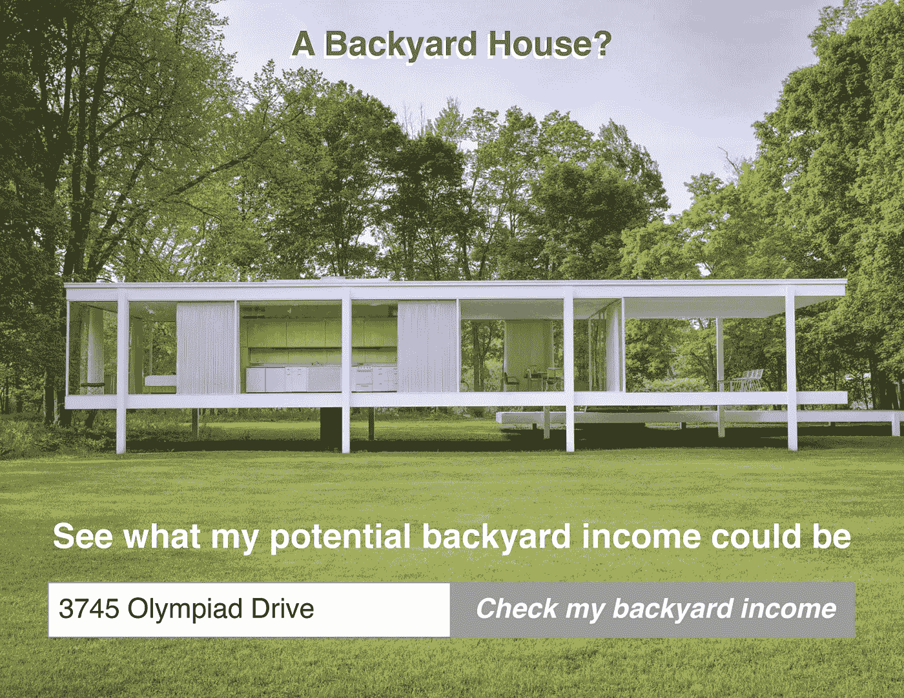
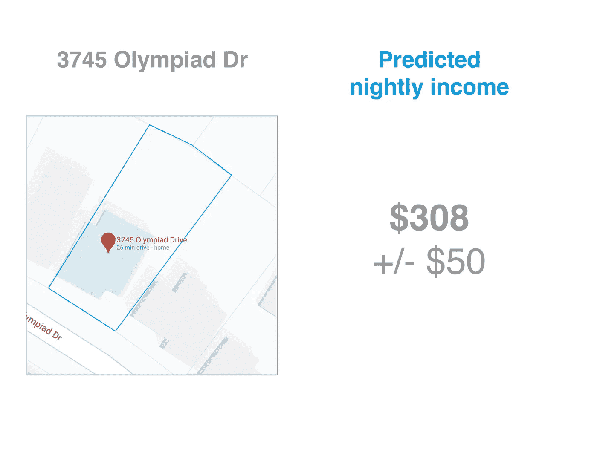
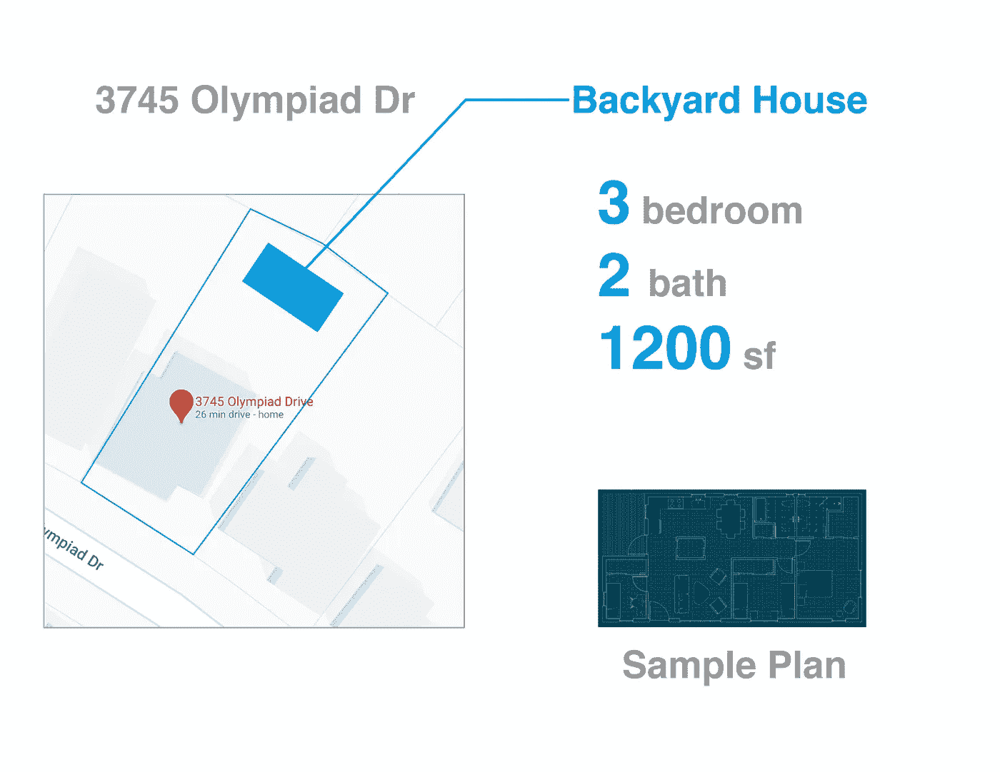
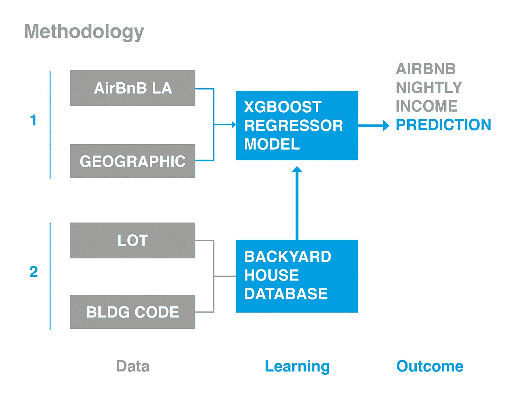
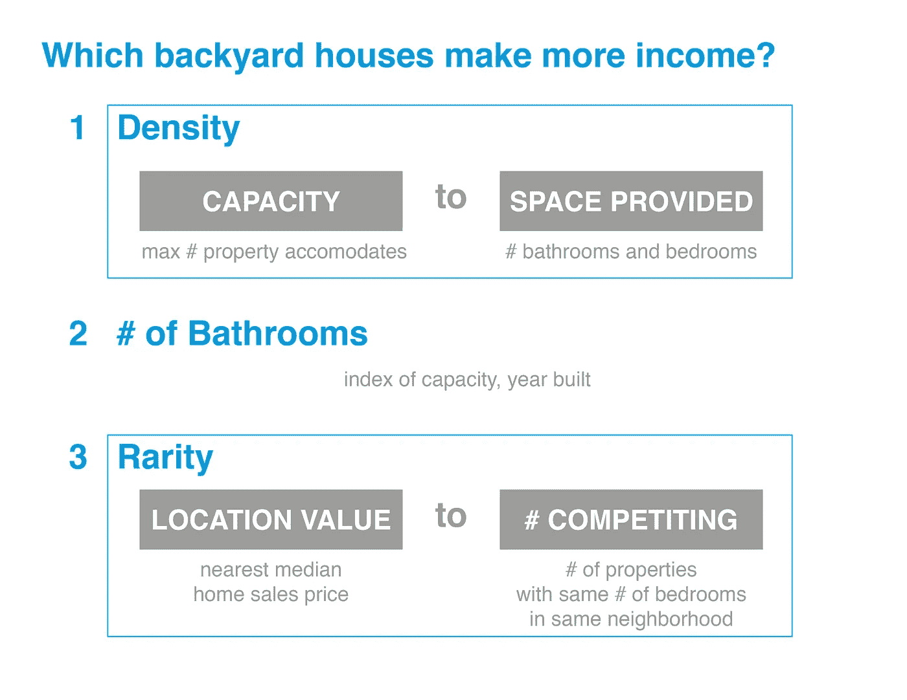
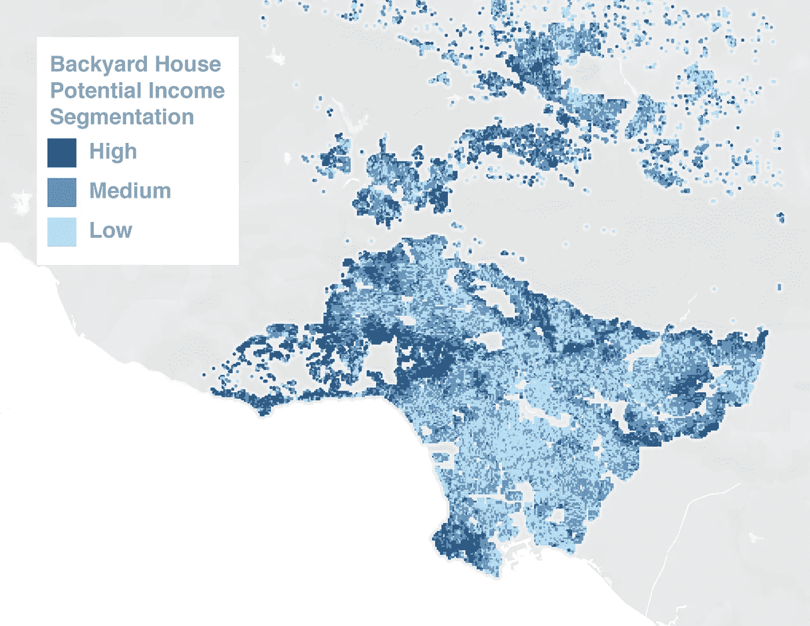
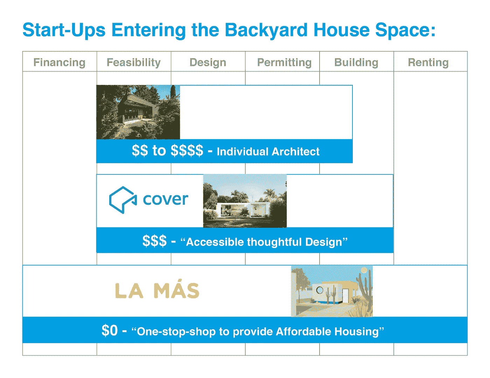
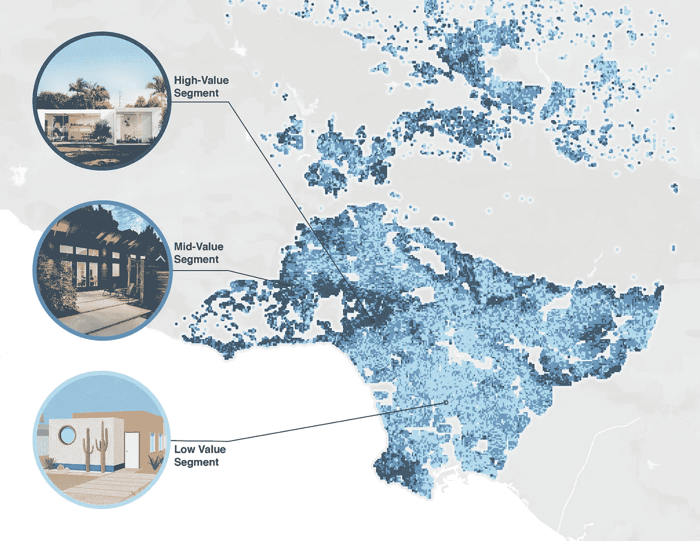

# 用机器学习探测洛杉矶的后院房屋

> 原文：<https://towardsdatascience.com/prospecting-las-backyard-houses-with-machine-learning-8fdc191e1cf?source=collection_archive---------25----------------------->

## *一个端到端的数据科学管道，解释了如何使用公开可用的 AirBnB 数据和 LA Geo 数据集来学习预测后院房屋的夜间收入。你可以在* [*YouTube*](https://www.youtube.com/watch?v=aJdUw9M4beY&list=PLDJn5ohuM65bD09kmOc7BwSUkDww0no6s&index=6) *上找到我解释这个项目的视频。你可以在*[*GitHub*](https://github.com/Pamaland1)*上找到这个项目的文件。你可以在*[*Heroku*](https://yimbyme.herokuapp.com/)*找到我的测试版应用 YIMBYme。*

后院房屋预制单元承蒙[封面](https://buildcover.com/)

# 动机

这个项目着眼于如何用一个由数据科学驱动的工具来影响洛杉矶的住房(*因为我真的很想尽快租房/买房*)。

很多 LA 房主都有这样的疑问: ***该不该建后院房子？***

LA Mayor Garcetti 最近签署了许多简化后院房屋建设的措施，反映出目前这些房屋通常是出租的，通常是供家庭成员使用。然而，一些出租作为被动收入，特别是对年轻家庭或老年人。我想知道这些房子在哪里能赚大钱。

# 目标

创建一个工具来确定:

*   后院房子的潜在收入
*   它在房主后院的可行性

# 工具演示

房主只需输入他们的地址:

Anupama Garla 制作的工具主页模型，带有来自[住宅](https://www.dwell.com/article/farnsworth-house-flooding-ludwig-mies-van-der-rohe-a1d85bbd)的[法恩斯沃思住宅](https://www.dwell.com/article/farnsworth-house-flooding-ludwig-mies-van-der-rohe-a1d85bbd/6566485711244447744)的背景图像

并输出他们潜在后院房屋的预期夜间收入、单元类型和容量:

Anupama Garla 的夜间收入预测输出模型

Anupama Garla 输出的单元类型和批量生产能力，以及加州大学洛杉矶分校城市实验室 ADU 指南[的样本计划](https://citylab.ucla.edu/adu-guidebook)

# 方法学

为了进行这种预测，我首先建立了一个预测房产收入的模型。然后，我建立了一个可以容纳任何大小后院房子的房产数据库。然后，我使用迁移学习将我的后院房屋数据库插入到我的价格预测模型中，以获得每个房产的潜在后院房屋的预测夜间收入。

下面将详细介绍数据管道。

Anupama Garla 的方法图

**第一部分:建立模型预测夜间收入**

我用 AirBnB LA 的数据来代表收入。这个数据集有大约 100 个特征，我选择了最重要的设施以及位置和大小细节。我还将我的数据集限制为超级主机状态，以确保我的目标特性的质量:夜间价格。

为了评估位置质量，我比较了该物业与各种地理要素数据集的接近程度，包括文化景点、由地铁站和高速公路入口组成的交通、公园，以及最重要的，最近的房屋销售价格中位数。

平均来说，房子是 142 美元/晚，我的模型是 51 美元。

**第二部分:生成潜在后院房屋数据库**

为了确定潜在的后院房屋，我使用了洛杉矶县评估办公室的地块数据，这些数据提供了地址、坐标、地块面积和该地产上主要房屋的面积。

为了找到可以容纳后院房屋的房产以及该房屋的大小，我根据洛杉矶市政后院房屋建筑规范处理了地块数据。该法规定义了地产线的 5 '后退，现有房屋的 10 '后退，将一块土地的整个可建筑面积限制在 50%，并将后院房屋的最大面积设定为 1200 平方英尺或主房屋面积的一半。

我确定了 160 万块土地，这些土地可以根据最大面积合法建造一到三间卧室的后院房屋。

这些地块创建了我的后院房屋数据库，其中包括查找地址、卧室和浴室的数量以及经度和纬度坐标位置。我把这个后院房子数据库插入我的模型来预测他们的收入。

# **特征工程**

我用这个模型来确定哪个后院的房子会赚更多的钱。我发现越密集、浴室越多、越稀有的房子越有价值。我设计了密度和稀有特征。

三大预测特征图片由 Anupama Garla 提供

密度特征偏爱声称可以容纳很多人的房产，实际上为这些人提供了很多空间，卧室和浴室的数量证明了这一点。浴室的数量是原始数据，它本身就表明了容量，但也表明了建造年份，因为越老的房子往往浴室越少。稀有特征偏好高价值位置的房产——由最近的房屋销售价格中值确定，如果它们在该位置是唯一的——由该社区中具有相同数量卧室可供出租的房产数量确定。

# 结论

对于一个住在有空间容纳一个大单元的高价值社区的个人来说，出租你的后院的收益会更高。对于一个居住在空间较小、不太令人向往的社区的人来说，你的收益会更低。然而，仍然会有可量化的收益。

使用我们的后院房屋数据库，并通过 Tableau 将其可视化，我们可以确定潜在后院房屋市场的三个不同细分市场——高、中、低价值。

由 Anupama Garla 划分为三层的预期洛杉矶后院住宅区地图

许多不同的初创企业已经进入后院房屋建筑领域，并可能在该数据集中找到用途。通常，后院住宅项目的生命周期有几个阶段，从最初的融资到最终出租。虽然单个建筑师会提供一个非常具体的设计，只涵盖生命周期的一部分，价格高度可变，但进入该领域的初创公司正在简化建筑流程，并提前提供价格。例如，Cover 旨在通过房主最少的努力生产一个高端后院房屋，在 3 天内提供他们工厂建造房屋的 3 个定制设计，包括可行性、设计和建造的所有专业知识。而 La Más 为没有资金的房主提供服务，并提供端到端的资金，此外还设计和建造后院房屋，以换取向无家可归者或第 8 节住房券持有者出租至少 5 年的承诺。

Anupama Garla 的后院住宅的生命周期与后院住宅的启动有关，图片由 [Propel Studio](https://www.propelstudio.com/the-wedge-adu-portland-or) 、 [COVER](https://buildcover.com/) 和 [La Más](https://www.mas.la/affordable-adus) 提供

对于 COVER 这样的初创公司来说，这个高价值物业密集的地区是一个值得关注的好市场。对于像 La Más 这样的非盈利初创企业来说，这个低价值物业密集的地区将是一个值得关注的好市场。1.最后，中等价值的财产介于两者之间，难以预料。对于根据特定需求定制解决方案的个人建筑师来说，这可能是一个很好的市场。

不同初创企业发展接受型客户群的战略方法阿努帕马·加拉(Anupama Garla)的作品，带有由[画出的圆圈图像，涵盖](https://buildcover.com/)、 [Propel 工作室](https://www.propelstudio.com/the-wedge-adu-portland-or)和 [La Más](https://www.mas.la/affordable-adus)

这个由机器学习驱动的数据库对于 ADU 的初创企业和房主来说都是一个有用的工具。我也从规划的角度看到了潜力。该城市能够针对城市不同区域的不同人群调整其激励措施。