# 通过 AWS 控制台用户更改的实时通知来保护您的基础架构

> 原文：<https://towardsdatascience.com/protect-your-infrastructure-with-real-time-notifications-of-aws-console-user-changes-3144fd18c680?source=collection_archive---------15----------------------->

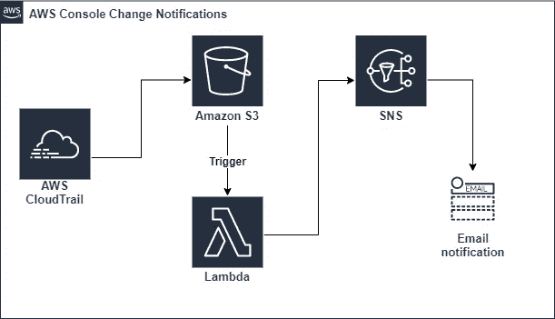

您已经接受了基础设施即代码(IoC ),并煞费苦心地创建了 Terraform 或 CloudFormation 来建模您的 EC2 实例、自动扩展组、ECS 集群和其他一切。devops 和开发团队承诺只使用您选择的 IoC 工具来修改和创建基础设施——但是，令人惊讶的是，有些人就是不遵守。也许有人在特性开发过程中偷懒，或者在事件响应过程中走捷径。也许你已经外包了你的一级支持，但你还没有完全信任那个团队。无论是什么原因，您都想知道用户何时登录 AWS 控制台网站并手动更改内容。

围绕这个话题的担忧是有可信的理由的。环境漂移是一个术语，通常用来描述期望状态(在您的基础设施中用代码表示)和您的基础设施的实际、实时状态之间的差异。这种漂移最终会导致部署失败、影响客户的扩展问题、安全漏洞，或者最糟糕的是数据泄露。

在本文中，我们将构建一个系统来监控您的 AWS 基础设施，并在用户直接从 AWS 控制台做出更改时发送通知。我们将利用 CloudTrail 来记录事件，并将其写入 S3。S3 触发器将调用 Lamba 函数。该功能将过滤事件，并将相关事件发布到您的团队可以订阅的 SNS 主题中。如果这听起来很吓人，不要担心；AWS 完成了繁重的工作，我们只需要连接各个部分。下面详细介绍了每个步骤，让我们开始吧。

# 启用 CloudTrail

CloudTrail 是这个项目中关键的 AWS 服务。您也许可以用功能等同的组件替换其他组件，但是 CloudTrail 会监控整个 AWS 帐户的变化，并将数据发布到 S3 的日志文件中。

CloudTrail 通常用于安全调查、合规性和审计目的。您可以使用它的 web 界面来搜索它记录的事件。需要知道是谁启动了那个闲置的昂贵实例吗？查看 CloudTrail 日志。追踪谁修改了启动配置以找出原因？云迹。CloudTrail 的基本搜索功能就在它的 AWS web 界面上，您还可以使用 AWS Athena 对事件日志执行 SQL 风格的查询。

默认情况下，CloudTrail 会在您的帐户中保留过去 90 天活动的事件日志。但是这些日志在 S3 是无法获取的；为此，我们需要创建一个新的线索。AWS 允许为[免费](https://aws.amazon.com/cloudtrail/pricing/)创建一个管理事件的踪迹。

导航到 CloudTrail 控制台并选择“创建轨迹”提供一个名称，并为事件过滤器选择“只写”,因为这是我们唯一感兴趣的。

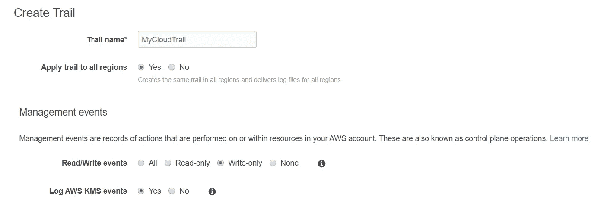

向下滚动到存储位置部分，选择或创建一个 S3 存储桶来存储您的日志。

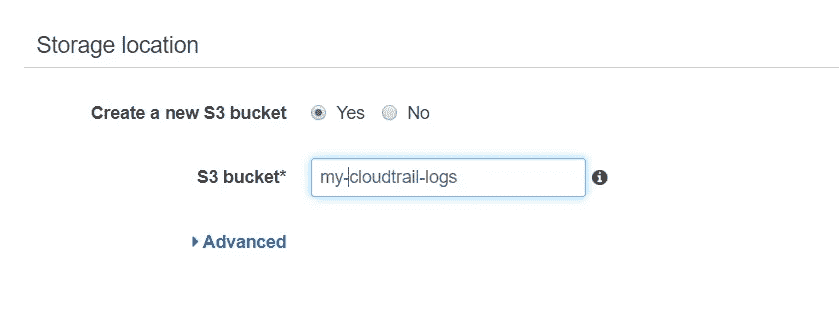

现在，为了测试这一点，继续在您的 AWS 环境中进行一些更改——启动一个 t.2 微实例，创建一个空的 Lambda 函数，任何事情都可以。然后看看应该包含我们的 CloudTrail 日志的 S3 桶:

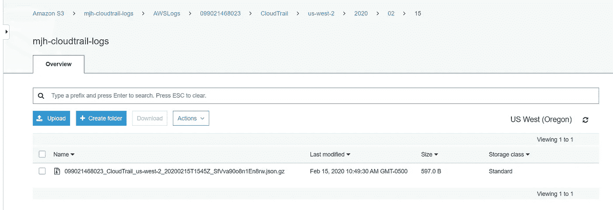

如果您从这个 bucket 下载一个日志文件，您将看到一个事件数组(“记录”)。每个事件都有大量的元数据——下面是一个示例事件(简称),它是在启动一个新的 EC2 实例时生成的:

# 创建一个 Lambda 来处理 CloudTrail 日志

既然对 AWS 基础设施的每次修改都记录到了 S3，我们需要编写一个函数来解析数据。我们将在 Lambda 中这样做，因为它是无服务器的，这符合我们只在记录新事件时调用函数的需求。

导航到 Lambda 控制台并创建一个新函数。选择空函数和 Python 3.8 作为运行时环境。

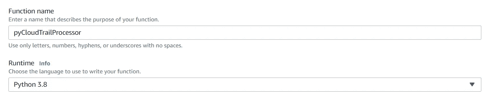

该功能需要从 S3 读取和向 SNS 发布通知的权限。选择“从 AWS 策略模板创建新角色”，并从策略模板下拉列表中选择“S3 对象只读”和“SNS 发布”。为您的角色提供一个名称，然后选择创建功能。

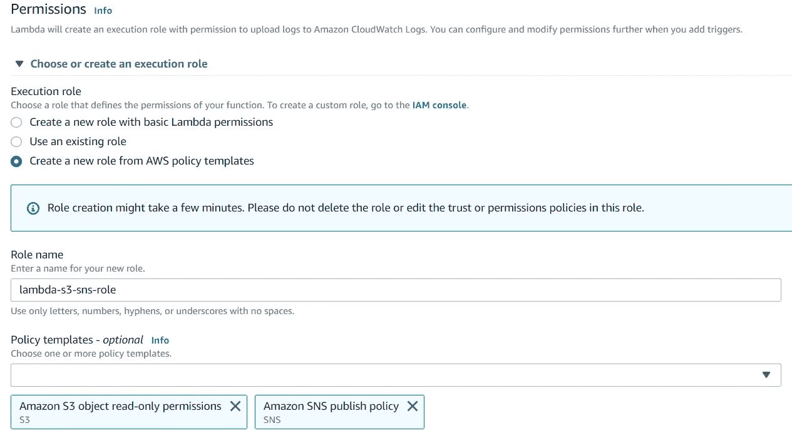

创建函数后，向下滚动找到内联代码编辑器和一个非常基本的 Python 函数。

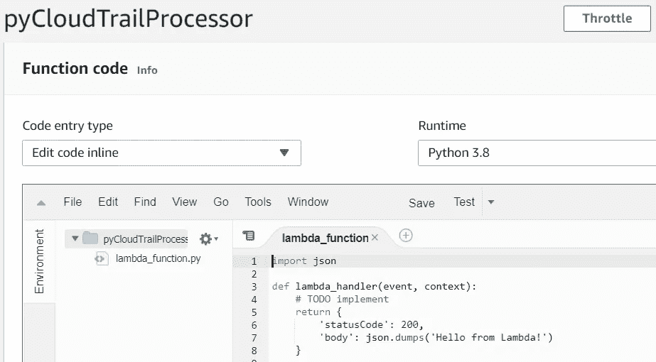

继续复制下面的所有代码，并将其粘贴到编辑器中，替换所有现有的代码:

让我们回顾一下代码。向下滚动找到**lambda _ handler**——这是我们应用程序的入口点。因为 Lambda 是由 S3 触发器调用的，所以参数“event”包含 S3 事件的列表。每个事件都包含一个对象的键，该对象是在我们的 CloudTrail 日志写入的 S3 桶中创建的。我们遍历列表，对于每个事件，我们从 S3 下载指定的文件并解压。

在每个文件中，我们都有一个 JSON 格式的 CloudTrail 事件列表。我们不希望每个 CloudTrail 事件都被通知；这个练习的目的是只捕捉用户通过 AWS 控制台触发的事件。Amazon 没有提供一种简单的方法来区分手动用户更改和由 SDK 或命令行调用的用户更改。Arkadiy Tetelma 写了一个很棒的博客[在这里](https://arkadiyt.com/2019/11/12/detecting-manual-aws-console-actions/)，他在其中致力于解决同样的问题。我们将按照 Arkadiy 在 Lamda 中描述的方式过滤 CloudTrail 事件。

为了执行过滤器，我们使用 Python list comprehension 对日志中的每个项目运行 **filter_user_events** ，并创建仅包含匹配项的 *output_dict* 。

**filter_user_events** 函数根据我们指定的过滤器检查事件中的相关字段。首先，它查看*用户代理*，并尝试匹配一系列模仿 AWS 控制台 URL 的正则表达式。然后，它筛选只读事件，如以“Get”或“Describe”开头的事件。第三项检查是针对一组我们忽略的特定事件名(比如 AWS 控制台登录。)最后检查事件是否由“AWS 内部”调用

在我们得到感兴趣的事件子集后，我们想要发送实际的通知。我们将使用亚马逊的简单通知服务(SNS)，这是一个非常简单的服务，允许您创建一个主题，然后发布/订阅它。发布到 SNS 主题的代码在我们的 sns_publish 函数中，有两个包装器方法( **post_to_sns** 只发布用户名和 eventName，而 post_to_sns_details 发布整个 JSON 事件。)

注意这里引用的 sns_arn 变量，它是在文件顶部附近定义的；您需要将它替换为您想要发布到的 SNS 主题的 ARN。单击屏幕右上角附近的 save，用您粘贴的代码更新您的 Lambda 函数；此更改将立即生效。然后导航到 AWS 控制台的 SNS 部分，选择主题，并创建主题。

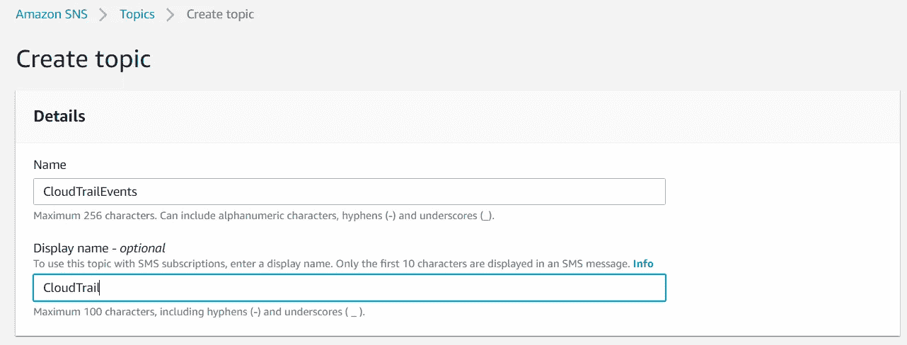

适当地命名主题，并对所有其他部分使用默认设置。或者，您可以编辑访问策略设置；默认策略是只允许主题所有者发布和订阅该主题。对于本演示来说，这很好，但是如果您想在一个更大的组织中使用它，您需要根据自己的喜好来定制策略。选择“创建主题”以完成设置过程。

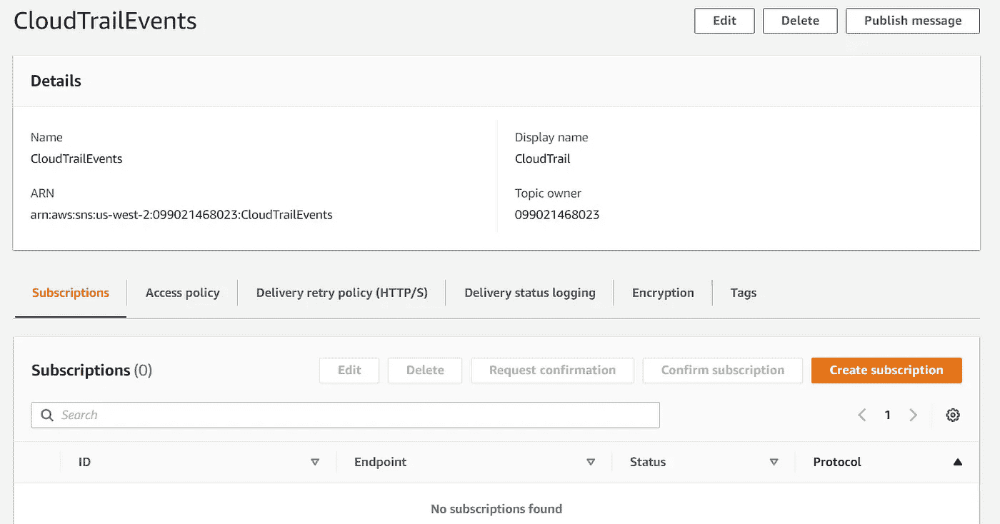

在这个屏幕上，你可以复制你的主题的 ARN，然后返回 Lambda 来更新代码(替换变量 *sns_arn* 的值)。)您还会注意到这个主题没有订阅；选择“创建订阅”，选择电子邮件作为协议，输入您的电子邮件地址，然后再次选择“创建订阅”。

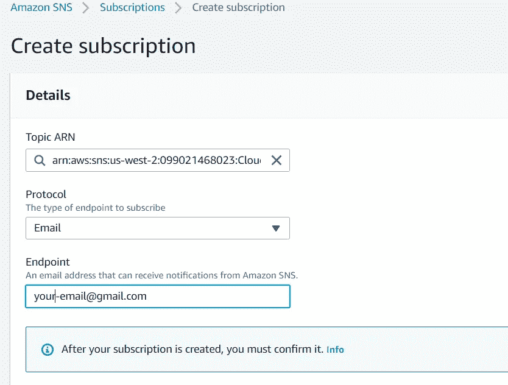

请务必检查您的电子邮件并确认订阅，否则您将不会收到任何发布到该主题的消息。

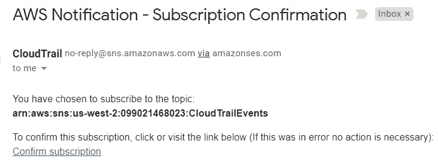

# 在 S3 事件上触发 Lambda

所以，快速回顾一下。启用了 CloudTrail 日志记录，存在一个 SNS 主题并且我们订阅了它，我们的 Lambda 函数是活动的(并且 sns_arn 变量被更新。)剩下要做的就是创建触发器，以便每当在 S3 桶中创建新的 CloudTrail 日志时调用我们的 Lambda 函数。

导航回 Lambda 控制台，点击您的函数详细信息，并选择靠近设计器窗口顶部的“添加触发器”选项。

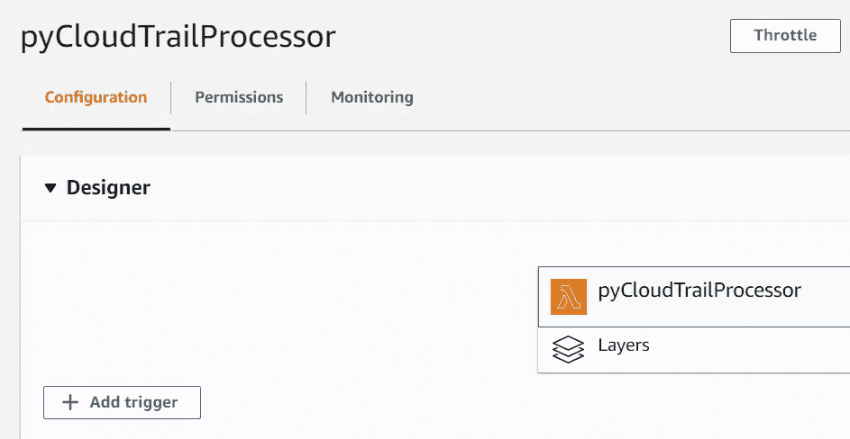

选择写入 CloudTrail 日志的 S3 存储桶。对于事件类型，选择“所有对象创建事件”,以便每当在存储桶中创建新对象时调用我们的函数。确保选择“启用触发器”以立即激活此触发器，然后单击“添加”

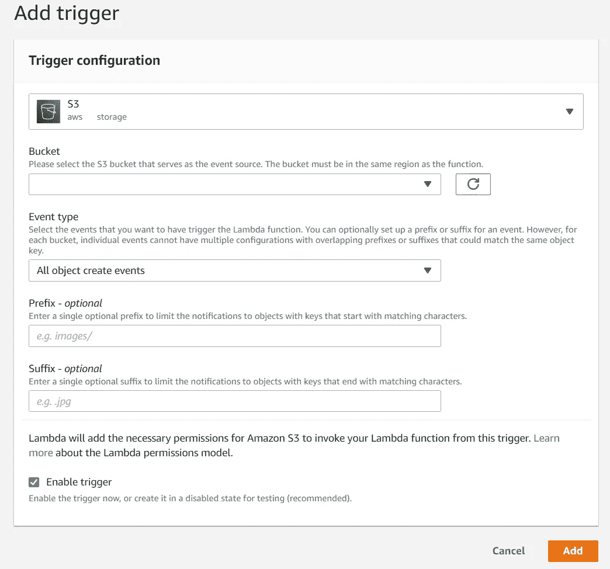

创建触发器后，您应该会在设计器视图中看到它。

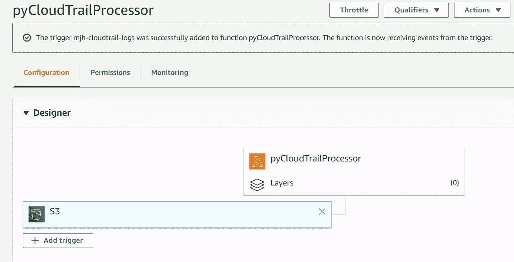

# 测试一下

现在来测试一下吧！一个简单(且免费)的方法是创建一个新的 Lambda 函数来触发我们的警报。如果一切正常，在函数创建后不久，您将会收到如下电子邮件:

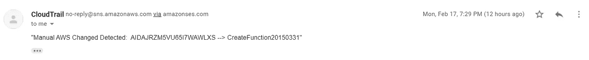

由于代码设置为将消息的简短和详细版本发布到 SNS，您应该会收到另一封包含完整 JSON 消息的电子邮件。如果一切正常，您就万事俱备了！请随意更改代码或设置以满足您的需求。如果您对脚本进行了任何改进，请向 GitHub repo 发送 PR。如果有些地方不太对劲，请查看下面的故障排除提示。

# 解决纷争

*   检查 CloudTrail S3 桶；是否正在创建日志？
*   检查 Cloudwatch 日志中的 Lambda 函数。每次你期望 Lambda 被触发时，日志应该存在。在日志中查找写消息。
*   检查 Lambda 函数的 S3 触发器；它在监控正确的桶吗？
*   检查分配给 Lambda 的 IAM 角色；它有适当的权限从 S3 读取内容并发布到社交网站吗？
*   Lambda Python 代码中的 sns_arn 变量和你的 sns 话题匹配吗？
*   你用你的邮箱地址订阅了 SNS 话题，并确认订阅了吗？
*   如果所有这些都失败了，您可以在本地机器上取消注释并运行 Python 代码中的单元测试。您还可以向代码中添加更广泛的 print()日志记录，并查看 Cloudwatch 日志，以便更好地了解函数执行时发生了什么。

# 资源

[检测手动 AWS 控制台动作— Arkadiy Tetelman](https://arkadiyt.com/2019/11/12/detecting-manual-aws-console-actions/)

[PyCloudTrailProcessor GitHub Repo](https://github.com/matthew-harper/pyCloudTrailProcesser)