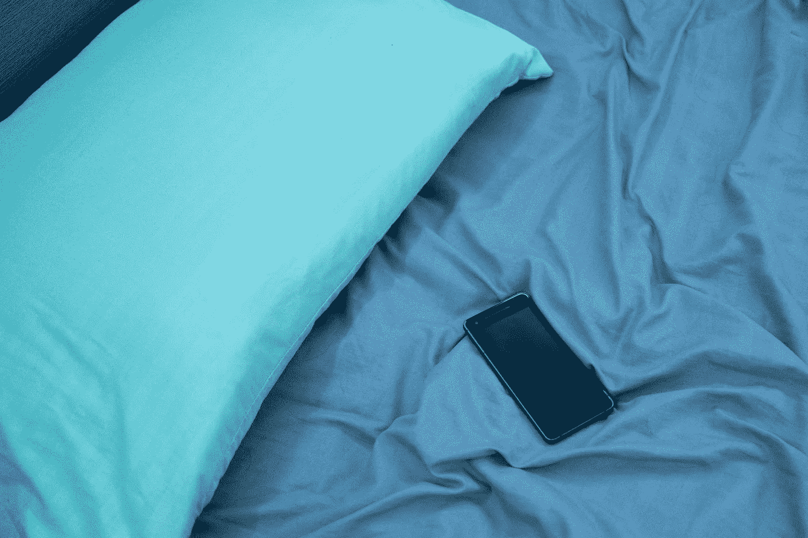
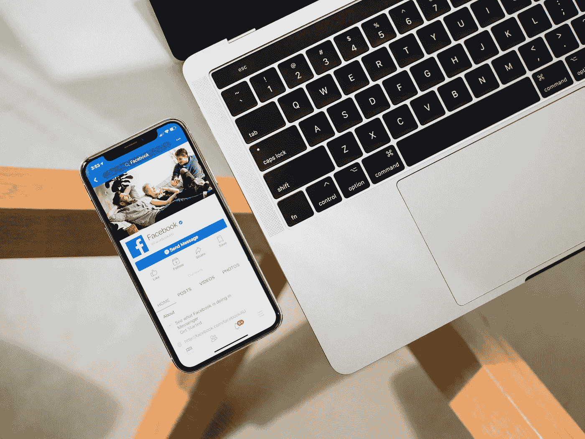
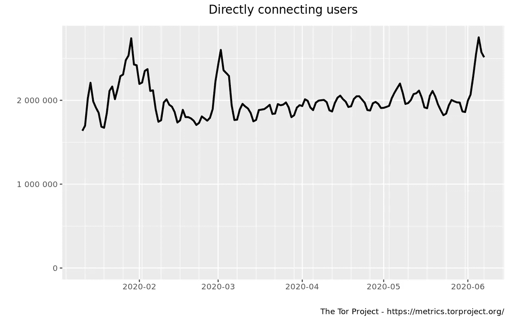

# 抗议时保护和加密您的数据

> 原文：<https://towardsdatascience.com/protecting-and-encrypting-your-data-while-protesting-c8b54f26c58f?source=collection_archive---------84----------------------->

## 努力实现社会变革和进步是一个正常运转的社会的当务之急，但数据隐私权也是如此

席卷美国的关于警察暴行和种族不平等的抗议活动[一直遭到警察发起的暴力](https://www.theverge.com/2020/5/31/21276044/police-violence-protest-george-floyd)以及[联邦调查局(FBI)等各种机构的恐吓](https://www.businessinsider.com/fbi-no-intelligence-antifa-weekend-violence-george-floyd-protests-2020-6)。

照片由 [NASA](https://unsplash.com/@nasa?utm_source=unsplash&utm_medium=referral&utm_content=creditCopyText) 在 [Unsplash](https://unsplash.com/s/photos/digital?utm_source=unsplash&utm_medium=referral&utm_content=creditCopyText) 上拍摄

穿戴合适的装备对于确保一个人的安全无疑是至关重要的，但保护隐私和你的隐私权也同样重要，尤其是在与同伴组织、与官员交谈以及广泛保留你的匿名权时。为了保护自己和他人的健康，也为了避开各个城市的面部识别措施，不要忘记戴上口罩。

鉴于面部识别技术在纽约等城市和 NYPD 等部门使用的主要问题，以各种形式遮住你的脸有助于规避它从你的面部特征提取生物特征数据的方式。

无数的公司实体一直站在推进面部识别技术使用的最前沿，包括但不限于以下公司:

1.  [Face-Six](https://www.face-six.com/) " [希望通过承诺帮助医院](https://thehill.com/opinion/cybersecurity/498113-facial-recognition-the-other-reason-we-may-need-a-face-mask)"通过希望"[在必要时识别患者，无论是有意识还是无意识](https://www.face-six.com/patient-identification/)"来减少医疗差错和欺诈
2.  根据*卫报*的一篇文章，ISM Connect 在泰勒·斯威夫特的演唱会上使用面部识别来“[根除跟踪者](https://www.theguardian.com/technology/2019/feb/15/how-taylor-swift-showed-us-the-scary-future-of-facial-recognition)
3.  [Clearview AI](https://clearview.ai/) 已经被"[超过 600 家执法机构使用…据该公司称，该公司拒绝提供基于*纽约时报*的一篇文章的名单](https://www.nytimes.com/2020/01/18/technology/clearview-privacy-facial-recognition.html)

随着大型社交媒体平台、反恐国家监控法案等的出现，监控达到了前所未有的高度，保护您的隐私、数据和身份变得越来越必要。

这里有 5 个绝对必要的预防措施，你应该在参加抗议之前采取。

## 1.把你的手机留在家里

当你在街上行进时，最不需要技术来确保你的数字隐私的方法可能就是把你的手机留在家里。虽然有些人可能需要他们的手机与他人沟通，但你可能没有必要去任何地方都带着手机。

照片由马丁·巴拉科夫提供

然而，如果你决定带着你的手机去参加抗议，确保你采用了下面列出的建议。如果没有必要使用您的手机，请确保将其留在家中，因为官员可能会要求搜索您的设备，以获取他们可能会用来攻击您或您认识的人的信息。默认情况下，大多数智能手机都开启了基于位置的跟踪功能，这可能会妨碍你保持匿名在线的能力。

此外，如果你绝对有必要拥有一部手机，但你不希望通过大量的措施来确保你的隐私，那么至少试着拿起一部便宜的一次性手机，你可以在抗议期间使用它来保持联系，同时不会有任何个人信息与你直接相关。

## 2.保护您的设备

在离开家之前，请确保积极保护您的设备。如果你不使用密码，没有比今天更好的开始时间了。最好的选择是使用强密码，而不是标准的 4 位数密码，但这两种密码都适用于基本的先发制人措施。

然而，不要使用面部识别来解锁手机，也不要使用指纹。虽然一名联邦法官在 2020 年 1 月裁定警察无权强迫你使用指纹或面部生物特征解锁你的设备，但为了确保你的隐私权安全起见，这并无大碍。

此外，让你的手机关机或处于飞行模式可以帮助你保护你的隐私和匿名。

[KOBU 社](https://unsplash.com/@kobuagency?utm_source=unsplash&utm_medium=referral&utm_content=creditCopyText)在 [Unsplash](https://unsplash.com/s/photos/google-maps?utm_source=unsplash&utm_medium=referral&utm_content=creditCopyText) 上拍摄的照片

如果您的设备上有敏感信息，包括但不限于特定人员的机密数据、警察暴行的证据等，加密您的数据也是一种有价值的先发制人措施。加密也已经成为大多数设备的核心功能。

对于 Android 设备，您需要按照以下顺序导航(取决于设备的型号和品牌):

*设置→安全→高级→加密&凭证→加密手机*

对于 iPhone 等苹果设备，这与在安卓设备上的操作方式极其相似:

*设置→触控 ID 和密码→打开密码*

## 3.创建有价值信息的备份

备份您的数据可以让您安全地删除重要和机密的信息，或者在您的设备被盗或被当局拦下时不会引起您的恐慌。确保您的备份也是安全的，因为执法不是您应该警惕的唯一数字，因为云备份(取决于提供商)可能容易受到具有恶意目的的第三方的影响。

重要的是要说明，备份您的数据不仅应该在参加抗议活动时进行，而且应该作为一项常规工作来进行，以确保一切都是最新的，并且您在未来的任何给定时刻都不会有风险。

## 4.使用安全应用程序

使用 Facebook Messenger、WhatsApp 或默认短信与抗议者交流并不是确保数字隐私的最安全方法。除此之外，在不影响易用性的同时，还有 Signal 等应用程序。

蒂姆·班尼特在 [Unsplash](https://unsplash.com/s/photos/facebook-messenger?utm_source=unsplash&utm_medium=referral&utm_content=creditCopyText) 上拍摄的照片

[Signal](https://signal.org/) 是一款适用于 Android 和 iOS 设备的消息应用，提供非常强大的加密级别，以确保短信和电话的安全。此外，该平台最近宣布为应用程序内发送的照片添加面部模糊功能，以确保匿名性，而不仅仅是语音和文本消息，这是一个非常有用的发展。

此外，该平台零广告，消除了“联盟营销人员”和“信号中令人毛骨悚然的跟踪”的可能性。Signal 提供的端到端加密是开源的，并声明“[我们不能阅读你的消息或监听你的电话，其他任何人也不能](https://www.signal.org/#signal)”，建立在隐私对他们的应用程序是永久的概念上。

## 5.安全浏览

除了通过使用 Signal 进行安全通信之外，不要低估使用安全浏览器(如 [Tor](https://www.torproject.org/) )的重要性。虽然窃听者可能会看到您正在使用 Tor 浏览器，但他们无法区分您和 Tor 网络上的其他用户，这使得该浏览器无疑是最安全的。

Tor 浏览器特别棒是因为很多不同的原因。首先，它完全匿名化了你的浏览，以至于浏览习惯甚至无法追溯到你的具体会话。Tor 旨在使网络上的所有用户看起来彼此相同，以消除各种行为者的指纹识别和监视威胁。

其次，它阻止可能与广告商或黑客有关联的追踪者。这意味着这些实体不能跟随你从互联网上的一个地方到另一个地方。

所有通过 Tor 网络的流量都经过三次加密，根据您的会话和位置提供完全匿名。流量总是通过所谓的 [Tor 中继](https://www.eff.org/torchallenge/what-is-tor.html)，这些中继最容易被描述为网络上的志愿者运行的服务器。

Tor 始终拥有 150 万至 300 万的强大用户群(截至 Q1-Q2 2020 年)。

洋葱浏览器可在 App Store 上获得，而官方的 T2 Tor 浏览器可在 Google Play 上获得。

如果您决定继续使用标准浏览器，如 Google Chrome、Mozilla Firefox 和其他浏览器，以下工具有助于查看您的浏览器和设备组合发出的独特指纹:

1.  [BrowserLeaks](https://browserleaks.com/) 让你超越以你的 IP 地址和 cookies 为中心的常规工具，看到你的数字指纹。它提供的信息从画布指纹到你的浏览器是否支持地理定位权限。
2.  AmIUnique 提供了一个界面，可以让你量化自己在互联网上的独特性。它根据浏览器类型、操作系统、时区、HTTP 头属性、JavaScript 属性等常见标识符显示您的唯一性百分比。
3.  [设备信息](https://www.deviceinfo.me/)在提供基于标识符的信息方面类似于 AmIUnique，但在指纹内容方面提供更多信息。它不会将你与其他用户进行比较，也不会量化你的指纹，但它提供了无数的隐私测试工具。
4.  [Panopticlick](https://panopticlick.eff.org/) 是由电子前沿基金会(EFF)创建的一个研究项目，该项目在有或没有跟踪公司的情况下进行测试(根据你的决定)，并提供有关你的指纹的信息，包括与你的结果相似的浏览器数量(“十个浏览器中有一个有这个值”)。

EFF 还有一个非常有组织的网站，通过各种文章、指南和工具来帮助相关的平民保护他们的数据、隐私和在线通信，这些不仅对动乱时期的保护有用，而且对整体也有用。

关于去抗议，最重要的是确保你的安全。这样做的结果是你未来在个人和网络上的幸福。