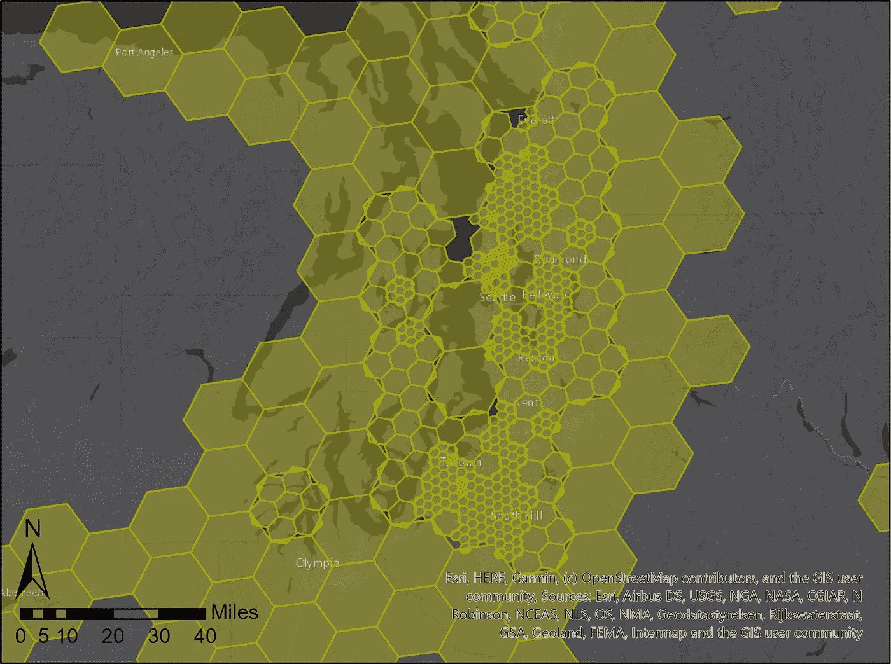
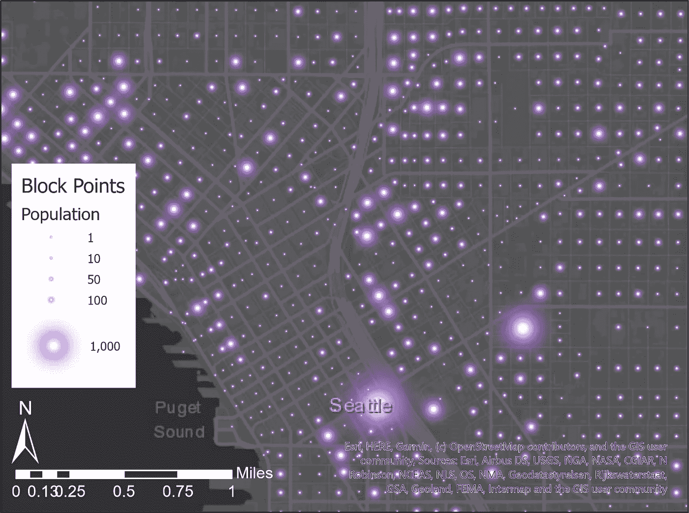
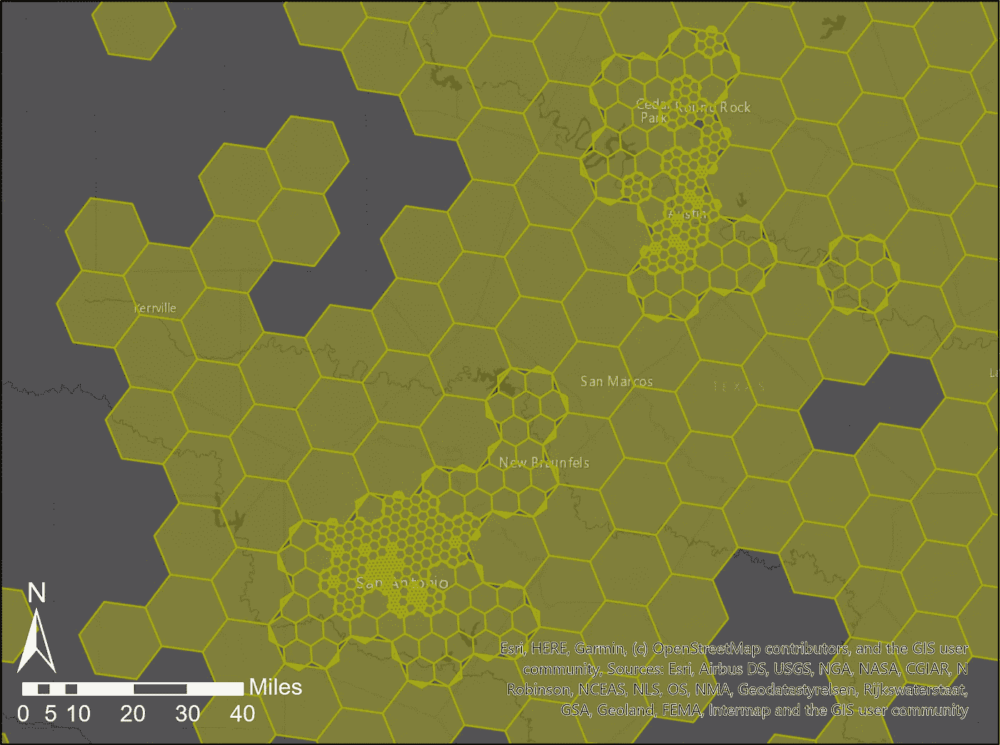
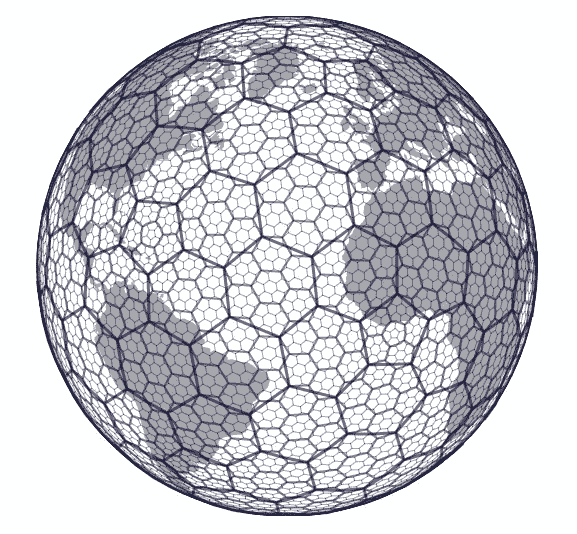
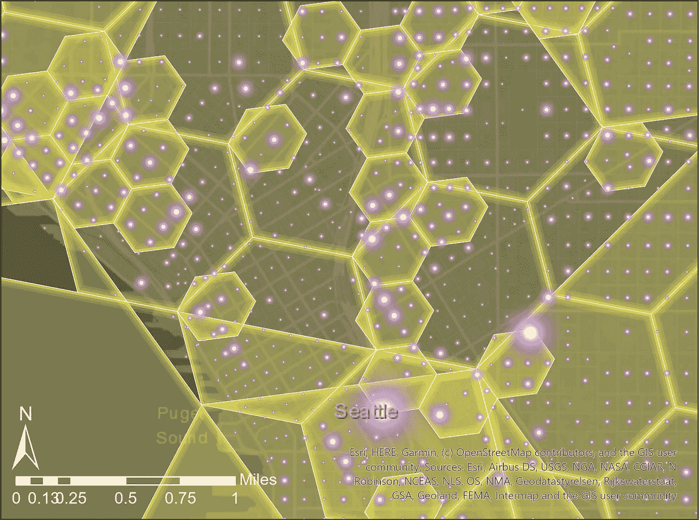
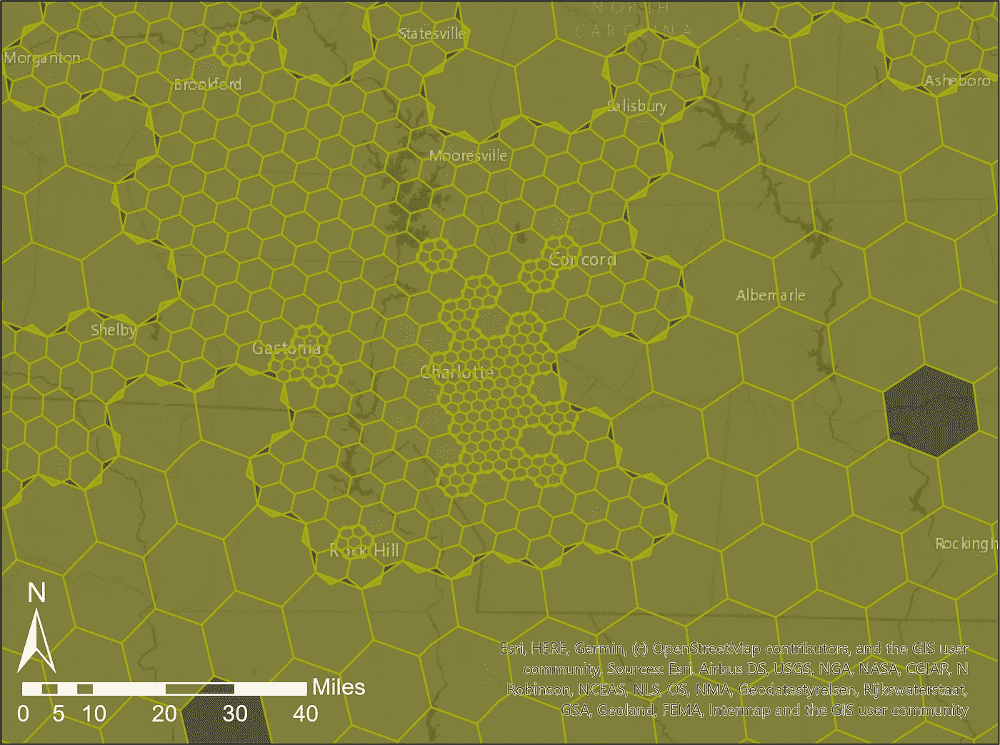

# 保护 PII 和实现地理准确性

> 原文：<https://towardsdatascience.com/protecting-pii-and-achieving-geographic-accuracy-97bebc99ac14?source=collection_archive---------40----------------------->

## 创建等级优步 H3 六边形以实现最大的地理精度，同时保护个人隐私。

疫情冠状病毒揭示了对地理精确位置信息的突出需求，以及对保护确诊病例的个人可识别信息(PII)的同样突出的需求。优步的 H3 是一个分层的六边形宁滨库，可用于基于最小计数阈值创建多分辨率六边形镶嵌。这种基于密度的多分辨率镶嵌在保持 PII 的同时实现了可能的最大地理精度。

使用优步 H3 为西雅图建造的六边形，使用 1，000 人的人口阈值

准确的位置信息对于流行病学建模至关重要。当我写这篇文章的时候，在纽约市这个 800 多万人口的城市，有超过 13000 例确诊病例。遗憾的是，当你读到这篇文章时，这个数字可能要大得多。随着疾病的传播，当务之急是利用现有的数据来预测这种疫情的传播。世界上最伟大的建模头脑正在全力支持创建一个流行病学模型。甚至还有一个 Kaggle 竞赛，试图向大众征集最佳解决方案。然而，病例数据仅在美国的县一级被报道，这使得在社区内传播建模极其困难。对地理位置准确的病例信息的需求从未像现在这样迫切。

这种对地理上准确的病例信息的需求必须与保护这种高度传染性疾病的感染者身份的同样突出的需求相平衡。在这次疫情中，保护 PII 比仅仅为了保护个人尊严要重要得多。正如[早期对全球亚裔的种族主义攻击所表明的那样](https://people.com/health/coronavirus-racist-attacks-against-asians/)，轻易保护 PII 也可能是一个突出的个人安全问题。

# 使用优步 H3 的分层六边形镶嵌

所有点并非生而平等-西雅图的人口加权块点

优步的 H3 图书馆可用于聚合地理上分布的可测量现象，方法是将指定位置的观测结果组合成包含不少于指定阈值计数的六边形。为了保护 PII，这种现象典型的是人口。使用群体作为可测量的现象，可以使用 H3 创建多分辨率六边形镶嵌。在镶嵌中，没有单个六边形区域包含任何小于指定群体阈值的区域。

使用 1，000 人的人口阈值创建的多分辨率六边形镶嵌

在本文顶部的西雅图图和上面的德克萨斯州图中，这两个多分辨率镶嵌都使用块点，即美国人口普查块的质心点，每个点都有一个关联的人口计数字段。此人口权重字段用于计算 1，000 人的数量，并根据每个六边形面的阈值进行评估。如果六边形不满足阈值，则使用下一个更高的分辨率。如果在达到最大六边形级别时没有达到阈值，则该区域就不会被使用。结果是一个多分辨率的六边形镶嵌，其中一些区域只是为了保护 PII 而被显示出来。

# 使用的资源

谢天谢地，特别是对于数据科学家来说，在 [h3-py](https://github.com/uber/h3-py) 库中有 Python 绑定可以轻松利用 H3 库。由于编译依赖，从源代码安装确实需要一些配置。谢天谢地，特别是对于我们这些使用 Windows 的人来说，有一个 [Conda 包](https://anaconda.org/conda-forge/h3-py)可以简化安装。

优步的 H3 等级六边形镶嵌系统

为了进一步简化在 ArcGIS Pro 中使用 H3 的过程，我构建了 [h3-arcgis](https://github.com/knu2xs/h3-arcgis/) 。H3-arcgis 提供了基于点计数或每个点的权重因子创建多分辨率 H3 镶嵌的功能，从而解决了平衡地理精度和 PII 的难题。

# 如何应用它

这适用于优步 H3 图书馆中指定的[缩放级别的指定范围。在上面西雅图的例子中，这些缩放级别从 5(最大区域)到 9(最小区域)。](https://uber.github.io/h3/#/documentation/core-library/resolution-table)

创建六边形是一个两步过程。首先，如果六边形在最大缩放级别(最小区域)包含最小阈值，则评估并创建六边形。任何不符合阈值的区域都在下一个较小的缩放级别(递增的较大区域)进行评估。重复该过程，直到评估了最后(最大区域)的缩放级别。任何未达到此阈值的区域都不会包含在最终输出中。

解除冲突前重叠的六边形

由于 H3 的等级性质，每个父六边形包含七个更小的子六边形。通常，虽然父区域中的一些子六边形符合阈值并被创建，但并非所有子区域都符合阈值。因此，创建父六边形时，父六边形中包含一些子六边形，但不是所有子六边形。这种重叠在第二步中得到解决，在第二步中，包含在较大六边形中的任何六边形被累加到较大六边形中，以创建最终的输出镶嵌。

北卡罗来纳州夏洛特的 H3 六边形镶嵌—再次使用 1000 人阈值

# 为什么选择 Python 和 ArcGIS？

H3-arcgis 是用 Python 实现的，因为我懂 Python。它设计用于 ArcGIS Pro，因为我每天都在使用它，并希望在这个前所未有的时代帮助 Esri 的客户应对这一挑战。

# 请用我的作品！

创建等级镶嵌的逻辑不依赖于 ArcGIS 的使用。它主要使用 H3 的能力来分配一个六边形地址给一个坐标对，查找父 H3 地址，并使用熊猫数据帧评估计数。因此，任何有专业知识的人都有可能在任何数量的平台上实现这种方法，包括在 H3 图书馆中，或者在 Scala 中使用大数据。

# 参考资料和资源

*   优步·H3
*   [H3-py](https://github.com/uber/h3-py)
*   [H3-py 康达套餐](https://anaconda.org/conda-forge/h3-py)
*   [H3-ArcGIS](https://github.com/knu2xs/h3-arcgis)
*   [Joel McCune](https://joelmccune.com) 在 [GitHub](https://github.com/knu2xs) 、 [LinkedIn](https://www.linkedin.com/in/joelmccune/) 和 [GeoNet](https://community.esri.com/people/jmccune-esristaff) 上