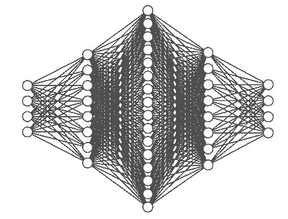
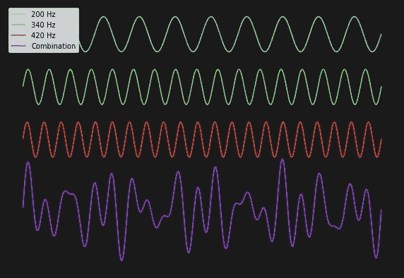
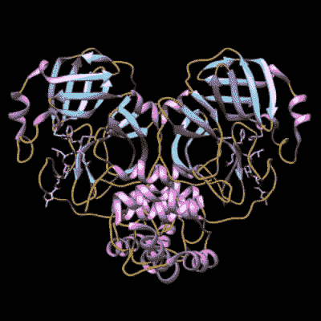
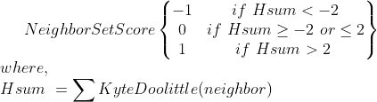
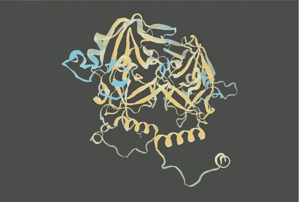
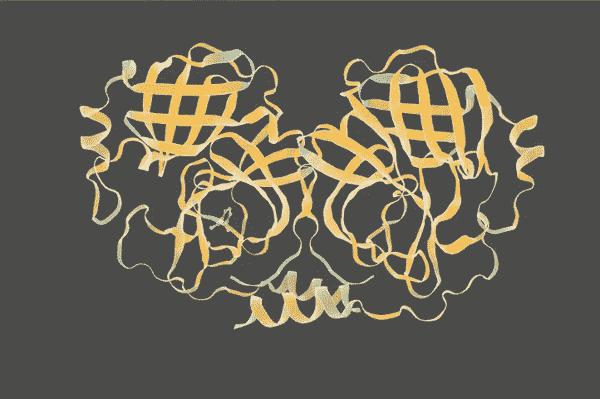

# 把蛋白质变成音乐(三)——递归神经网络

> 原文：<https://towardsdatascience.com/protein-music-with-python-part-3-applying-a-recursive-neural-net-c841aee25126?source=collection_archive---------52----------------------->

## 从 RNN 产生的蛋白质序列中创造音乐



作者用 [NN SVG](http://alexlenail.me/NN-SVG/index.html) 创建的图像

在之前的两篇文章中，我演示了如何将蛋白质转换成音乐。[的第一篇文章](https://levelup.gitconnected.com/turning-a-protein-into-music-with-python-ba655c694097)解释了组成蛋白质的分子——单个氨基酸的分子振动是如何转变成音符的。[第二篇](https://levelup.gitconnected.com/turning-a-protein-into-music-with-python-part-2-harmony-a3c2ffa748be)介绍了和声和节奏；蛋白质结构中相邻的氨基酸可以一起弹奏产生和弦，氨基酸的二级结构分类可以决定其音符长度。在这里，我展示了如何通过在一组相似的蛋白质上训练 RNN 来创建一种蛋白质音乐的*流派*，然后使用它来生成新的序列，这些序列可以被转换成音乐。

**蛋白质发音背景**

麻省理工学院马库斯·布勒的原子和分子力学实验室的一篇论文是我对蛋白质发音的介绍。作者使用我在以前的文章中描述的技术对蛋白质进行超声处理，然后在产生的音乐序列上训练一个[递归神经网络](https://en.wikipedia.org/wiki/Recurrent_neural_network#Long_short-term_memory) (RNN)。一旦经过训练，RNN 就被用来生成新的音乐序列。重要的是，这些新序列将包含训练中使用的序列的特征。这在应用于蛋白质结构研究时有着有趣的含义。要了解原因，了解 RNNs 的基础知识是很有用的。



作者图片

**递归神经网络**

rnn 是多种类型的神经网络架构中的一种。它们通常与顺序信息一起使用，因为它们有一种记忆形式，*即*，它们可以在执行计算时回顾以前的信息*。*对于序列，这意味着 rnn 通过考虑序列中的下一个字符之前的内容来预测它。有许多方法可以实现这一点，我推荐阅读迈克尔·菲的这篇[优秀文章](/illustrated-guide-to-lstms-and-gru-s-a-step-by-step-explanation-44e9eb85bf21)来了解更多。Buehler 论文的作者使用 TensorFlow 提供支持的 [Magenta](https://magenta.tensorflow.org/) 库来构建他们的 RNN，其中包括 LSTM 和注意力层。我的模型基于一个由 tensor flow[生成文本的模型。](https://www.tensorflow.org/)

**数据集**

蛋白质的功能是由其结构决定的，而结构又是由其序列决定的。蛋白质执行许多功能，如运输分子、识别抗原或发送应答信号，这些不同的功能是由不同的结构实现的。由此可见，有几类蛋白质结构具有相似的功能。为了让 RNN 生成*有趣的*序列，它需要接受某种信息类别的训练。**我所说的有趣，是指生成的序列包含一些训练数据中存在的信息或特征。**这就是 RNNs 研究蛋白质序列的潜力。



[新型冠状病毒](https://pdb101.rcsb.org/learn/videos/coronavirus-main-protease)主蛋白酶含抑制剂 N3(白棍代表)【1】

这些是我用来建立数据集的资源:

*   [uni prot](https://www.uniprot.org/)【2】是一个包含蛋白质序列和功能信息的数据库。截至 2020 年 5 月 15 日，它目前包含 560，000 个人工审查的序列。
*   蛋白质数据库 (PDB)[3]是一个包含蛋白质结构的数据库。截至 2020 年 5 月 15 日，它目前包含约 160，000 个。
*   [BLAST](https://blast.ncbi.nlm.nih.gov/Blast.cgi)【4】是一个用来寻找相似生物序列的工具。蛋白质 BLAST ( [blastp](https://blast.ncbi.nlm.nih.gov/Blast.cgi?PROGRAM=blastp&PAGE_TYPE=BlastSearch&LINK_LOC=blasthome) )是该工具用于蛋白质序列的版本。

我需要一套相似的蛋白质结构来训练 RNN。我选择了 SARS 冠状病毒主要蛋白酶， [PDB ID 1Q2W](https://www.rcsb.org/structure/1Q2W) ，作为我的出发点。我使用 blasp 在 PDB 搜索类似的结构，我的训练数据包含 26 种蛋白质结构。

**准备数据**

我之前描述了蛋白质结构的 3D 空间中的氨基酸邻居如何被用来构建蛋白质音乐中的和声。对于创作音乐来说，这很好，但对于训练 RNN 来说，这就产生了一个问题。按照[德劳内镶嵌](https://en.wikipedia.org/wiki/Delaunay_triangulation)的定义，蛋白质中的一个氨基酸通常有大约 8 个邻居。因为有 20 个标准氨基酸，这意味着有超过 250 亿个 20⁸，可能的邻居组合。我不想丢弃谐波信息，而是想找到一种方法来描述邻居组的整体特征。这是疏水性进入的地方。

被水吸引的分子称为亲水分子，被水排斥的分子称为疏水分子。20 种氨基酸中的每一种对水都有不同的亲和力，有不同的尺度来衡量这一点。Kyte 和 Doolittle【5】量表为每种氨基酸指定一个数字。在这个标度上，数字越大，越疏水，数字越小，越亲水。使用 Kyte 和 Doolittle 标度，可以计算每个邻居的疏水性得分的总和。**这个和保存了关于邻居集合的信息，*例如*，如果它非常正，那么大多数邻居是疏水的。**为了进一步简化该分数，使用了以下转换函数；它将邻居集疏水性分值定义为-1、0 或 1。



邻居集疏水性得分转换函数

# 准备数据的 Python 代码

## 数据收集

我选择了蛋白质 1Q2W，SARS 冠状病毒的主要蛋白酶，作为我的数据集的目标蛋白质，并使用 [blastp](https://blast.ncbi.nlm.nih.gov/Blast.cgi?PAGE=Proteins) [4]寻找类似的蛋白质。下面是 blastp 结果的几行结果。粗体文本包含相似蛋白质的 PDB id。

```
1Q2W:A|PDBID|CHAIN|SEQUENCE **4RSP_A** 51.792 307 140 4 3 ... 67.75
1Q2W:A|PDBID|CHAIN|SEQUENCE **4YLU_A** 51.792 307 140 4 3 ... 67.75
1Q2W:A|PDBID|CHAIN|SEQUENCE **5WKJ_A** 51.792 307 140 4 3 ... 67.75
```

为了建立数据集，下载了相似蛋白质的 PDB 文件。下面的代码分两步完成。首先，它从 blastp 结果中提取相似的蛋白质 id，然后，它下载这些蛋白质的 PDB 文件。

接下来，可以检索蛋白质序列、坐标和二级结构分类。这些数据存储在 PDB 文件的特定行和位置。你可以在这里了解更多关于 PDB 格式[的信息，但是下面的代码提取了相关的数据。首先，从标题行获得蛋白质 ID，然后收集二级结构信息。螺旋线和片线包含所有二级结构元素的起始和结束位置。因此，对于每个螺旋线或表线，代码填充每个元素的内部位置，并将所有位置分别添加到`helices`和`sheets`。接下来，从原子线中提取每个原子的序列位置和坐标。在这种情况下，c-α碳的坐标用于每个氨基酸。最后，检查每个位置，看它是否存在于`helices`或`sheets`中。如果是，那么一个 *H* 螺旋片或 *E* 片被添加到二级结构(SS)序列中。如果没有，则增加一个 *C* 线圈。下面的代码将这些信息存储在`data`字典中。](http://www.wwpdb.org/documentation/file-format-content/format33/v3.3.html)

下面是通过 Delaunay 镶嵌定义氨基酸邻居的函数。它接受一组坐标，在这种情况下是蛋白质中每个氨基酸的 c-α碳的位置，并返回一个字典，其中每个键是序列中的一个位置，每个值是邻居的集合。

数据收集的最后一部分是创建一个包含数据集中蛋白质所有相关信息的长序列。下面的代码遍历每个蛋白质，并为序列中的每个位置创建一个`entry`。`entry`包含一个由三个元素组成的字符串。第一个是氨基酸单字母符号。接下来，是二级结构分类。最后一部分是邻居集疏水性得分，如上所述。每种蛋白质的所有序列条目加在一起形成一个长序列。

## 数据准备

有了`sequence`，我们现在可以建造和训练 RNN。我使用本[教程](https://www.tensorflow.org/tutorials/text/text_generation)中描述的模型作为我的模板。首先，我们将`alphabet`定义为`sequence`中的唯一条目。然后，我们为序列中的每个条目创建一个到唯一整数的映射，并使用这个映射来创建`int_sequence`，它包含整数形式的序列。

为了训练，`sequence`需要分解成更小的序列。我任意选择了 100 的`seq_length`，但是最佳值可以通过实验来确定。使用这个长度，数据集可以被分割成输入示例和目标。首先，数据被分成长度为`seq_length + 1`的块。**输入示例将包含前 100 个条目，目标将包含从 1 到 101 的条目。**给定一个输入示例，RNN 尝试预测下一个条目。

接下来，将训练数据集中成批。批量大小决定了在更新权重之前要为 RNN 提供多少训练样本。基于多个训练实例更新权重使得训练过程更加稳定。你可以在这里了解更多关于这个概念的信息[，这里](/all-you-need-to-know-about-rnns-e514f0b00c7c)有一个很好的可视化效果[。](https://stats.stackexchange.com/questions/153531/what-is-batch-size-in-neural-network)

## 模型架构

现在我们可以建造 RNN 了。我使用了这里的架构[T2，它有三层。有一个**嵌入层**，为字母表中的每个条目创建一个给定大小的密集向量。嵌入的概念一开始可能很难理解。我发现考虑嵌入将每个条目映射到 N 维空间中的一个位置是有帮助的，其中 N 是你选择的向量的大小。这很有用，因为在这个 N 维空间中，您可以使用](https://www.tensorflow.org/tutorials/text/text_generation)[余弦相似度](https://en.wikipedia.org/wiki/Cosine_similarity)或[欧几里德距离](https://en.wikipedia.org/wiki/Euclidean_distance)来计算条目之间的关系。你可以在这里或者通过研究 [word2vec](https://pathmind.com/wiki/word2vec) 模型来了解关于主题[的更多信息，其中嵌入是核心概念。](/illustrated-guide-to-lstms-and-gru-s-a-step-by-step-explanation-44e9eb85bf21)

GRU 层使这个网络成为 RNN。它为网络提供了短期记忆。有一篇关于 GRUs 和类似架构的优秀文章，叫做 LSTMs，[这里](/illustrated-guide-to-lstms-and-gru-s-a-step-by-step-explanation-44e9eb85bf21)。最后是**密集层**；这个就是模型的输出层。它是生成字母表大小的向量的层，该向量包含逻辑或预测概率。下面的代码是构建网络的一个方便的函数。

以下代码使用上述函数来构建模型。前几行是模型的参数，除了前面定义的`batch_size`。为了训练，模型需要损失函数和优化器。损失函数将预测值与真实值进行比较，并计算误差的严重程度。这里，使用了[稀疏分类交叉熵](https://cwiki.apache.org/confluence/display/MXNET/Multi-hot+Sparse+Categorical+Cross-entropy)。Adam 用于优化学习速率。你可以在作者的[论文](https://arxiv.org/pdf/1412.6980.pdf)中读到更多关于 Adam 优化器的内容。

训练前的最后一步是告诉模型在哪里保存检查点。这些用于在训练过程中从不同点加载模型权重。

## 训练模型

我对这个模型进行了 100 个时期的训练，花了不到一个小时，产生了令人惊讶的好结果。

## 生成序列

下面的代码是生成序列的函数；它基于这里描述的张量流函数。

有了上面的函数，我们就可以为序列生成准备模型了。使用相同的体系结构重新构建模型，只是批量大小设置为 1，并且加载来自上一个检查点的权重。

现在，RNN 可以用来生成新的序列。在下面的代码中，随机选择一个种子序列，然后将其输入网络。

# **结果**

这是 RNN 产生的两个氨基酸序列:

1.  vkmshpsgdveacmvqvtcgsmtlngwldntvwcprhvmccpadql sdpnydallismtnhsfsvqkhigapanlrvvghamqgtllkkltvdvanpttvnlvlkvnqvnpntpehkfksvrpgesfnilacyegccpgsvygvnmrsqgtikgsfiagcgsvgyvlengtlyfvyvyvymhllgngsgngsglegemyggyed qpsmqmqlegtnvmssdnvvalyayangerwvtntsmslessynt
2.  glrwgdvekfngytvssvdafsylaaktvsveqmlgvkglrkmqpsvgvpecivrvaygnngwlgdevcprhviasdsrvinyenelssvrlhnfsiaknnavlgvvsakygvnlvlkvnqvnpntpehkfksvrpgesfnilacyegcpgsvygvnmrsqgtikgsfiagacgspgynnggtvefcylhqlelgsgsgchvgsdldgvmygeqptlqvegasslftenvlaflyaal

## 与生成序列相似的蛋白质

为了看看 RNN 是否了解了数据集中蛋白质的特征，我对生成的序列运行了 blastp。这两个序列的大多数热门都是针对病毒蛋白酶或蛋白酶的。并且，前 100 个命中中大约有 90 个是冠状病毒蛋白质**。**回想一下，RNN 是在 SARS 冠状病毒的主要蛋白酶上被训练的，**所以这些结果表明网络确实学习了冠状病毒蛋白酶的关键特征。**

## 蛋白质结构预测



[瑞士模型](https://swissmodel.expasy.org/)【6】生成序列的蛋白质结构预测 1。

蛋白质结构预测模型进一步支持了这一观点。上面报道的第一个序列使用[瑞士模型](https://swissmodel.expasy.org/) [6]建模，该模型使用[同源建模](https://en.wikipedia.org/wiki/Homology_modeling)的技术。在这个过程中，一个目标序列被提交给服务器，SWISS-MODEL 将该序列与具有已知结构*的其他蛋白质序列的数据库进行比较。数据库包含蛋白质结构是关键，因为一旦发现一组相似的序列，与这些序列相关的结构就可以用作*模板。*模板用于构建提交序列的结构预测。上图和下图分别显示了第一个生成序列和第二个生成序列的瑞士模型预测。*

**

*[SWISS-MODEL](https://swissmodel.expasy.org/)【6】蛋白质结构预测生成序列 2。*

*上述结构和新型冠状病毒主蛋白酶结构之间的相似性，如文章顶部所示，是显而易见的。这进一步支持了 RNN 捕获了病毒蛋白酶的序列特征。有像 [FATCAT](http://fatcat.godziklab.org/) 这样的工具可以用来定量比较这些结构，但是我将把它留到另一篇文章中。*

## *蛋白质音乐和未来的工作*

*我下载了生成结构的 PDB 文件，并使用我之前描述的技术来创建蛋白质音乐。你可以听下面的旋律，和声，以及两者的结合。我对未来的工作有两个目标。第一个目标是创建一个更大的相似蛋白质数据集用于训练；这里的数据集很小，但是可以使用更大的蛋白质家族。第二个目标涉及使用和生成的数据类型。在这里，我使用蛋白质序列数据进行训练，并将生成的序列转换成音乐。在未来，我打算增加一个抽象层；我想用[品红](https://magenta.tensorflow.org/)直接在蛋白音乐上训练一个 RNN，这样输出的就是音乐。如果你喜欢我的作品，请继续关注并鼓掌！*

## *参考*

1.  *插图来自 PDB-101，作者:大卫·古德塞尔和 RCSB·PDB*
2.  *UniProt 联盟
    **UniProt:全球蛋白质知识中心**
    [核酸研究 47:D506–515(2019)](https://doi.org/10.1093/nar/gky1049)*
3.  *H.M. Berman，J. Westbrook，Z. Feng，G. Gilliland，T.N. Bhat，H. Weissig，I.N. Shindyalov，P.E. Bourne。
    (2000)蛋白质数据库 [*核酸研究*，28:235–242。](http://dx.doi.org/10.1093/nar/28.1.235)*
4.  *Altschul，S.F .，Gish，w .，Miller，w .，Myers，E.W. & Lipman，D.J. (1990)“基本局部比对搜索工具。”J. Mol。生物。215:403–410.[考研](https://www.ncbi.nlm.nih.gov/pubmed/2231712?dopt=Citation)*
5.  *J.摩尔。生物。157:105–132(1982)*
6.  *瑞士车型参考:*

*   ***SWISS-MODEL Workspace/GMQE**
    water house，a .，贝尔托尼，m .，Bienert，s .，Studer，g .，Tauriello，g .，Gumienny，r .，赫尔，F.T .，de Beer，T.A.P .，Rempfer，c .，Bordoli，l .，Lepore，r .，Schwede，T. SWISS-MODEL:蛋白质结构和复合物的同源性建模。核酸研究第 46 号，W296-W303 (2018 年)。*
*   ***瑞士模式库**
    Bienert，s .、Waterhouse，a .、de Beer，T.A.P .、Tauriello，g .、Studer，g .、Bordoli，l .、Schwede，t .瑞士模式库—新特性和功能。核酸第 45 号决议，D313-D319 (2017 年)。*
*   ***Swiss-PdbViewer/ DeepView 项目模式**
    Guex，n .、Peitsch，M.C .、Schwede，t .使用 SWISS-MODEL 和 Swiss-PdbViewer 进行自动比较蛋白质结构建模:历史观点。电泳 30，S162-S173 (2009)。*
*   ***QMEANDisCo**
    Studer，g .、Rempfer，c .、Waterhouse，A.M .、Gumienny，g .、Haas，j .、Schwede，t . qmean disco——应用于模型质量估计的距离约束。生物信息学 36，1765–1771(2020)。*
*   *Benkert，p .，Biasini，m .，Schwede，t .对单个蛋白质结构模型绝对质量的估计。生物信息学 27，343–350(2011)。*
*   ***四级结构预测/ QSQE**
    贝尔托尼、m .、基弗、f .、比亚西尼、m .、博尔多利、l .、施韦德、t .通过同源性模拟同源和异源寡聚体的蛋白质四级结构。科学报告 7 (2017)。*