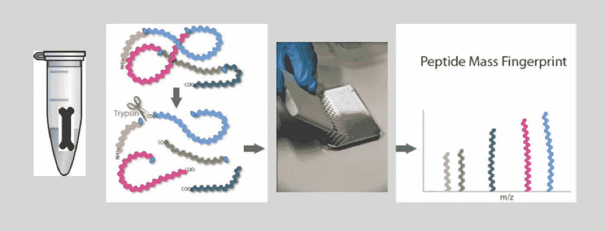
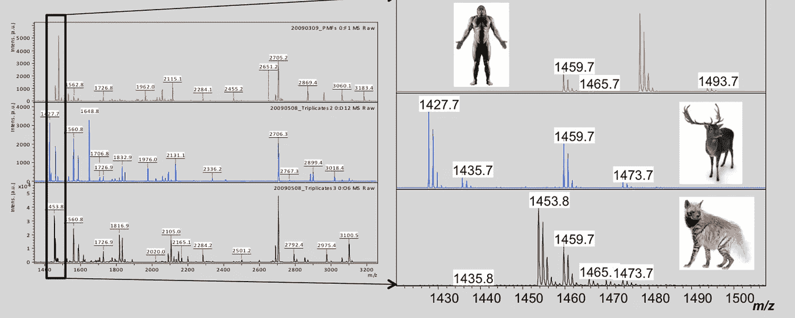
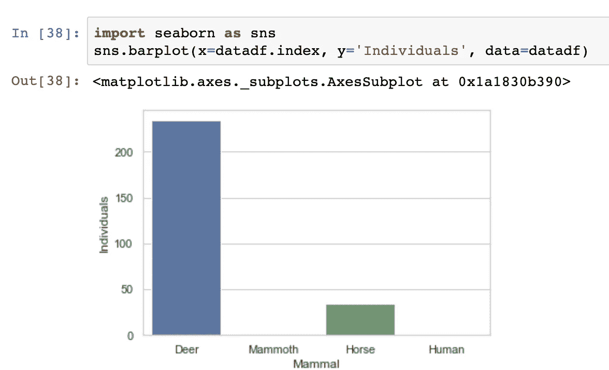

# 蛋白质，蟒蛇和骨头，天啊！

> 原文：<https://towardsdatascience.com/proteins-python-and-bones-oh-my-27d49f071ba5?source=collection_archive---------38----------------------->

在考古学领域内，近几十年来生物技术有了相当大的发展。一开始，对一些人来说，这似乎是科幻小说的领域。关于从永冻层克隆猛犸象、重建灭绝人类物种的面孔的可能性的报道频频见诸报端，等等。考古科学的进步是惊人的，但随之而来的是大量的数据需要被处理、消化并形成一种可理解的形式。蛋白质组学是生物学研究的一个例子，在考古学中有很大的用途。

在这篇博文中，我打算向你展示这个术语的确切含义，它如何改变了我们看待过去的方式以及编程在其中的地位。在我们开始讨论古代蛋白质的研究之前，有一件事要提一下，很抱歉，侏罗纪公园是不可能的。虽然这可能很悲伤，但琥珀(保存昆虫的树脂)不能保持柔软的有机物质新鲜，所以没有恐龙的血液([https://www . nhm . AC . uk/discover/could-scientists-bring-恐龙-back.htm)](https://www.nhm.ac.uk/discover/could-scientists-bring-dinosaurs-back.html) 。

羞愧

蛋白质组学，作为我自己为我的理学硕士研究的东西，是生物学信息对学术研究的效用的一个迷人的例子。它被简单地定义为对蛋白质的研究，但这掩盖了它的复杂性。我将尝试从我自己的经历中展示一个蛋白质组学的实际例子。

在考古学中，有一种非常神奇的技术叫做 ZooMS，或者叫做“质谱动物考古学”。细分来说，动物考古学是对与人类有过互动的古代动物的研究。在这种情况下，“人类”的定义可以从智人*智人*(即我们)到其他物种，如智人*尼安德特人*(尼安德特人)。“动物考古学”的一个例子是一块古老的鹿骨，上面有石器工具的划痕，在那里一个原始人(对“人属物种”的别称)刮掉了肉。质谱是一个化学术语，意思是测量一个原子或其他这样的粒子在磁场中偏转的程度。简单来说，想象一下，如果你在风洞里扔两个球，一个是岩石做的，一个是泡沫做的，后者会被风推得(偏转)更多。

它处理骨头的方式有点复杂，但需要理解的是，你可以通过分析当你将骨头分解成其组成成分胶原蛋白(一种蛋白质)时发现的蛋白质片段(肽)来测量骨头属于什么动物。蛋白质结晶，然后激光折射(反弹)通过它。折射角给出了碎片的长度。下面是我在大学参与的项目的信息图

骨头碎片(左)被溶解到液体蛋白质(胶原蛋白)中，然后被修剪成更小的“肽”(蛋白质碎片)。[http://www.palaeochron.org/zooms](http://www.palaeochron.org/zooms)

这将产生一组如下所示的结果:

碎片结果显示在左侧，称为光谱。“峰”对应右边的动物。http://www.palaeochron.org/zooms

所以亚历克斯的

我能听到你说。

“这与数据科学和分析有什么关系？”

很高兴你问了！当我写论文的时候，我要切下大约 2000 块骨头碎片，最终要分析 900 个光谱。现在有一个软件，叫 Mascot，可以用来搜索这类结果。当时，作为一名学生，我无法接触到这些。话虽如此，但是，如果我用现在的知识回到过去，我怎么能让我的 900 个结果更容易清理、研究和可视化呢？

回到 2017 年那段令人热血沸腾的日子！

事实上，有几种方法可以让我的蛋白质组学研究变得更容易、更漂亮、更有用。我将在这里介绍一些。

1.  根据我的结果制作一个熊猫数据框架，并在上面执行功能

如果我能够轻松地计算出我生成的数据的各种统计元素，我的生活将会得到很大的改善，Pandas 使这比用 Excel 甚至(恐怖地)用笔和纸写我糟糕的笔迹容易得多。

我的数据看起来像什么的一个基本例子

使用 Pandas 和 Seaborn，我能够在很短的时间内做出更好的可视化效果，尽管是基本的可视化效果，而不需要使用 Excel。

当然，这是从我的数据集的汇总总数的基本重建。进一步的改进可以通过使用熊猫来创建总数、平均数等，以查看我发现的各种潜在的个体数量。

2.快速轻松地从我的数据中剔除噪音。通过使用。替换和。是空函数，我可以排除那些我不能识别任何特定属的结果(属的复数)。有上百个这样的东西！

3.将来也许可以用机器学习来识别模式，这样我就不用全靠眼睛了！

机器学习的基本工作方式

我的计划是利用其他人用同样的技术产生的大量数据，然后把我自己的数据加入其中。我想，这最终会让我避免大约三周的眼睛疲劳。

4)任何科学考古学家的终极梦想——潜在地创造一个能帮我切割骨头碎片的机器人。这是一项需要非常小心的任务，正确完成这项任务极其重要。大多数合适的古老股票的骨头碎片是非常罕见的，所以如果你的机器人咀嚼它并把它变成灰尘，没有太大的希望找到另一个。真正锤这个家——丹尼索瓦人的物种是通过分析一个手指骨发现的！

当然，事情远不止如此。我基本上只使用了我在熨斗的课程中不到一个月学到的技术和战术。尽管如此，即使是基本的观想。sum()命令和其他 python 函数会让我的生活变得简单很多。像 Biopython 这样的库使得生物分析进行起来更加顺利，甚至可以对基因组数据进行操作！

谁知道呢，也许再过几个月，我就能制作一个模型来再次检查我所有的数据点，并发现我在那些年前漏掉了一个人类。

我真的真的希望我没有…