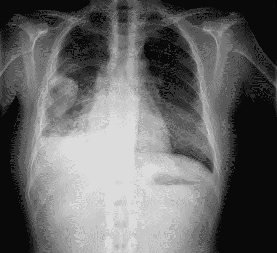
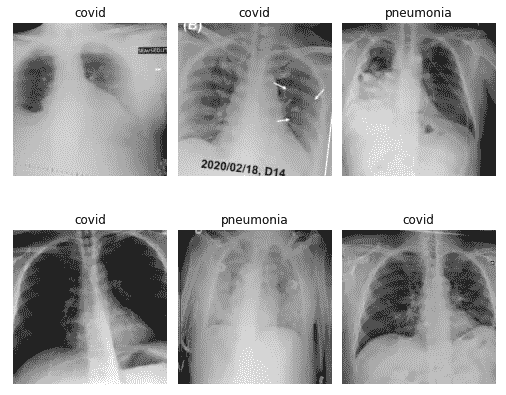
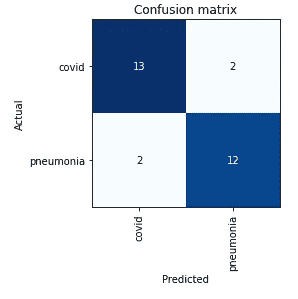
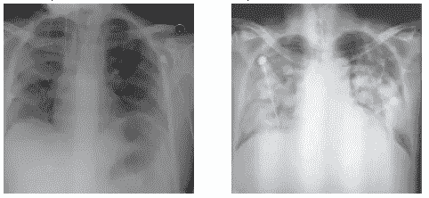
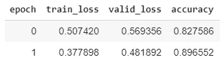

# 原型神经网络从胸部 X 线诊断新冠肺炎

> 原文：<https://towardsdatascience.com/prototyping-a-cnn-to-diagnose-covid-19-from-chest-x-ray-e1224a8e7795?source=collection_archive---------30----------------------->

胸部 x 光显示肺炎

想象一个患有严重肺炎的病人走进急诊室。你(护士、医生)担心是新冠肺炎。你取一个鼻拭子，送去化验。根据您所在医院的位置，结果将在大约 12-24 小时内返回。在漫长的等待中，出于谨慎，患者被隔离，占用宝贵的空间，每次互动都需要戴上 N95 口罩，使用或许更昂贵的个人防护设备。这种长时间的等待是低效率的，并且卫生保健提供者需要信息来支持他们的决策。

我读过一些文章，讨论 AI 如何在胸透(CXR)上准确区分新冠肺炎的肺炎和其他形式的肺炎。这篇文章的目的是试图复制这一发现。如果这是真的，给病人一个 CXR 并用人工智能进行分析可能有助于医疗保健提供商更快地识别新冠肺炎，并促进资源的合理使用。

**数据集:**

该数据集包括来自新冠肺炎患者的 73 张后-前(PA)胸部 x 光片和来自非 Covid 肺炎患者的 73 张 PA 胸部 x 光片，总共 146 幅图像。

新冠肺炎的图像取自多个来源，包括一个意大利放射学网站，讨论 60 个新冠肺炎病例和在 Pubmed 上发现的研究文章。非 covid 肺炎图像取自 Kaggle 上的 [RSNA 肺炎检测挑战赛](https://www.kaggle.com/c/rsna-pneumonia-detection-challenge)中的训练图像。请注意，Kaggle 上还有另一个标签很好的[肺炎数据集](https://www.kaggle.com/paultimothymooney/chest-xray-pneumonia)，但我认为在这种情况下使用它是一个错误，因为它的儿科人群。成人和儿童的 cxr 非常容易区分，特别是在胸腔的模式中，并且该算法可能使用该特征而不是疾病固有的特征来区分类别。

让我们来看一些样本数据。

正如你所看到的，这两个类看起来非常相似。

样本图像

**迁移学习 ResNet34:**

迁移学习用于适应小数据集。ResNet34 被选为模型架构的基础，并被训练了 7 个时期，结果如下:

7 个时期的训练结果

验证准确率约为 86%。

验证集的混淆矩阵显示在 29 张图像上只出现了 4 个错误！

对于这么小的数据集来说，这已经很不错了。

仔细看看错误，下面和左边是一个肺炎病例的例子，模型确定是新冠肺炎，右边是一个新冠肺炎病例，模型确定是肺炎:

左:肺炎被归类为新冠肺炎。右图:新冠肺炎被归类为肺炎

接下来，我们来试试微调。

**微调:**

我们解冻网络的层，并允许它们以非常小的梯度变化。这允许更新参数以更好地适应数据集，同时有望防止过度适应。

我们微调了 2 个时期，我们的准确率从 86%到 89.7%！

在这篇文章中，我们已经建立了一个卷积神经网络的原型，它可以在胸部 x 射线上区分新冠肺炎和老式肺炎，准确率接近 90%！

最令人印象深刻的是这是用很少的数据完成的，只有 146 张图片。对于 500 或 1000 张图像，我怀疑准确率可以达到 95%以上。

小数据集是这项研究的最大弱点，因为它可能会发生一些过度拟合。鉴于数据匮乏，这可能是不可避免的。此外，只要验证损失大于训练损失，我们就不能过度拟合。

已经发表的研究表明，人工智能可以区分新冠肺炎和肺炎。使用 CT 扫描，似乎比 CXR 更能够可视化新冠肺炎，研究人员开发了一个[人工智能系统](https://pubs.rsna.org/doi/10.1148/radiol.2020200905)，它可以区分新冠肺炎和肺炎，灵敏度为 90%，特异性为 96%！

这些是非常令人印象深刻的结果，并有望刺激医疗保健界考虑将放射图像与人工智能结合作为诊断新冠肺炎的潜在方法，直到更快速的诊断技术变得普遍。

像往常一样，在评论中留下你的想法。谢了。