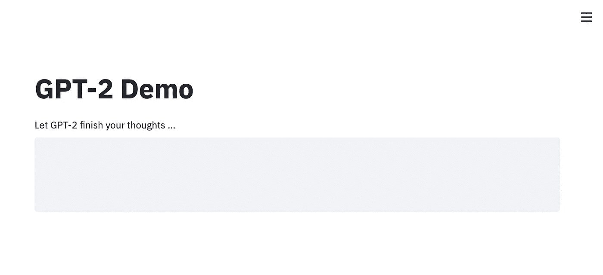
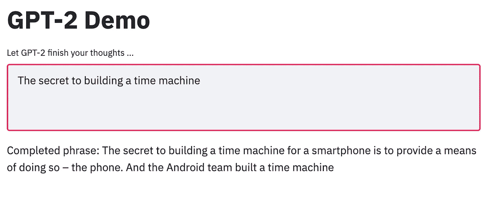

# 用 Streamlit 构建机器学习模型原型

> 原文：<https://towardsdatascience.com/prototyping-machine-learning-models-with-streamlit-1134c34e9620?source=collection_archive---------38----------------------->

## 使用 Streamlit 在不到 5 分钟的时间内设置好 GPT-2 演示


照片由[在](https://unsplash.com/@halacious?utm_source=medium&utm_medium=referral) [Unsplash](https://unsplash.com?utm_source=medium&utm_medium=referral) 上的拍摄

**GitHub Repo:**[ml-streamlit-demo](https://github.com/happilyeverafter95/ml-streamlit-demo)

在笔记本电脑环境之外引入机器学习模型，并将其转化为漂亮的数据产品，过去需要做大量工作。幸运的是，在这个领域有很多工具正在开发中，以使原型制作更容易。不久前，我偶然发现了 [Streamlit](https://www.streamlit.io/) ，这是一个用于构建定制 web 应用的开源 Python 库。

它的入门既快速又简单，我用了不到 30 分钟的时间就用一个预先训练好的模型构建了一个应用程序。从那以后，我一直在使用 Streamlit 进行模型原型制作，并展示它们的功能。与使用我的控制台进行预测相比，漂亮的用户界面是一个令人耳目一新的变化。

我将在本文中分享这个过程，以 GPT-2 为例。

## 在本文中，我们将:

*   从 [HuggingFace 的变压器库](https://github.com/huggingface/transformers)加载 [GPT-2](https://openai.com/blog/better-language-models/)
*   使用 Streamlit 在一个简单的 web 应用程序中提供文本生成器

# 从变压器加载 GPT-2

GPT-2 是在非常大的英语语料库上训练的变形金刚模型，用于预测短语中的下一个单词。它最近的继任者， [GPT-3](https://openai.com/blog/openai-api/) ，用它的能力震惊了世界。

让我们从安装所有 Python 先决条件开始。这就是我的`requirements.txt`的样子。虽然代码中没有提到，但 GPT-2 要求安装 TensorFlow 2.0 或 PyTorch。

```
streamlit==0.56.0
tensorflow==2.2.0
transformers==3.0.2
```

在本例中，我们将使用一个 Python 脚本。这是加载 GPT-2 的类，当给定一个起始短语时，用它来生成文本。`max_length`属性表示生成文本的最大长度。

# 用 Streamlit 服务模型

我将定义另一个函数来实例化生成器。这个函数的目的是帮助缓存`load_generator`方法，以便更快地进行后续预测。

`st.cache` decorator 告诉 Streamlit，如果函数已经执行了，就跳过执行。

这个文件的入口点定义了 UI 的布局。

# 快速演示

要启动应用程序，请运行`streamlit run filepath.py`。如果你使用我的库，这将是`streamlit run models/gpt_demo.py`

该应用程序应该会在浏览器中自动启动。如果没有，就在 [http://localhost:8501/](http://localhost:8501/) 。加载生成器后，预测应该会快得多！



我还没有使用过这个，但是如果你点击汉堡菜单(右上角的 3 条水平线)，有一个使用 Streamlit 录制你的演示的选项。相当整洁。

# 让 GPT-2 完成一些想法！

## 我渴望…


## 建造时间机器的秘密…



这就是你所拥有的——一个在 5 分钟内构建的漂亮的网络应用程序。

如果你有兴趣学习更多关于自然语言处理的知识，可以看看这个 Coursera 课程。

[](https://click.linksynergy.com/link?id=J2RDo*Rlzkk&offerid=759505.11503135394&type=2&murl=https%3A%2F%2Fwww.coursera.org%2Flearn%2Flanguage-processing) [## 自然语言处理

### 本课程涵盖了从基础到高级的自然语言处理的广泛任务:情感分析…

click.linksynergy.com](https://click.linksynergy.com/link?id=J2RDo*Rlzkk&offerid=759505.11503135394&type=2&murl=https%3A%2F%2Fwww.coursera.org%2Flearn%2Flanguage-processing) 

# 感谢您的阅读！

[通过 Medium](https://medium.com/@mandygu) 关注我的最新动态。😃

作为一个业余爱好项目，我还在[www.dscrashcourse.com](http://www.dscrashcourse.com/)建立了一套全面的**免费**数据科学课程和练习题。

再次感谢您的阅读！📕