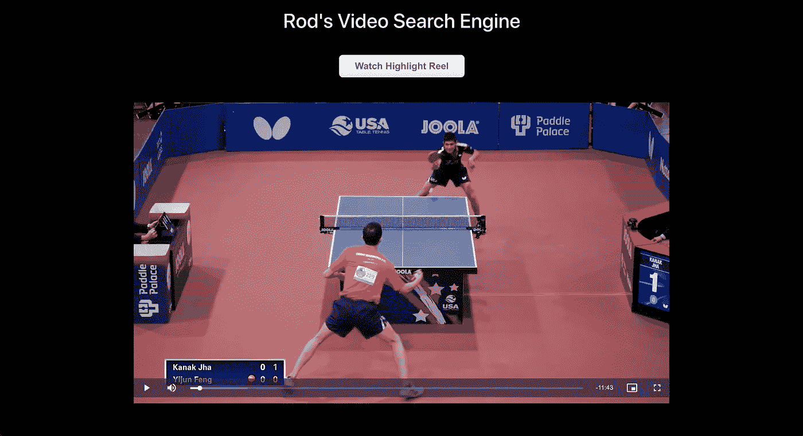
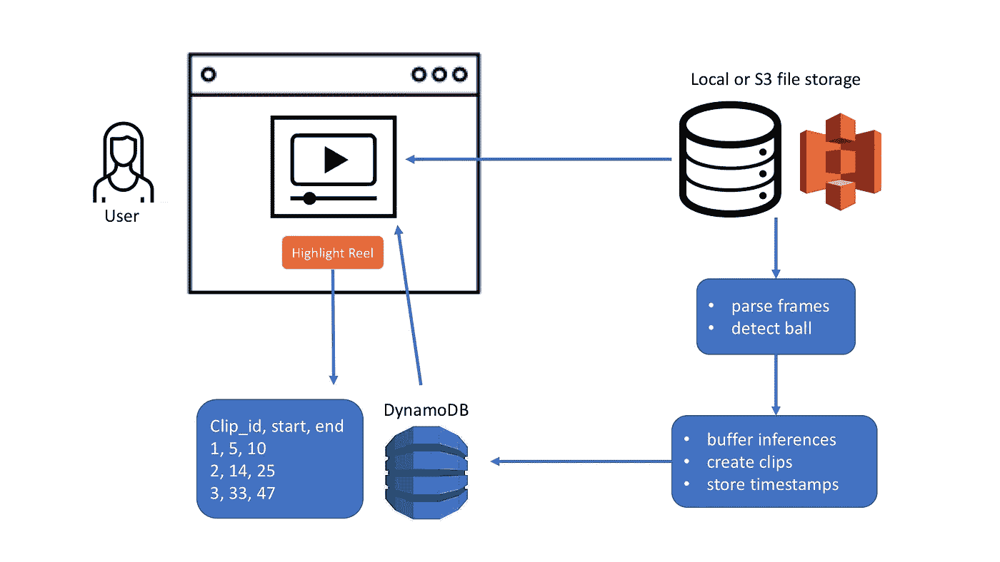
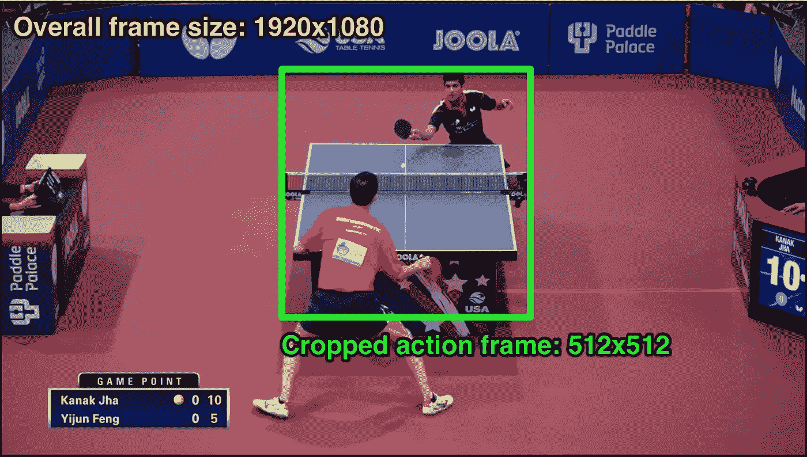
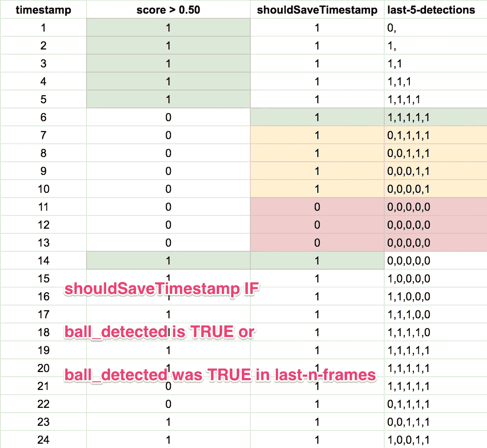
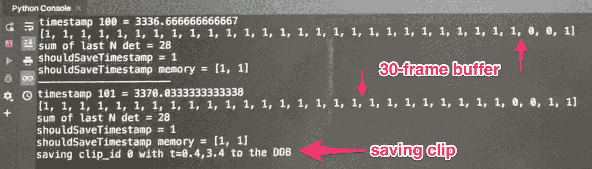
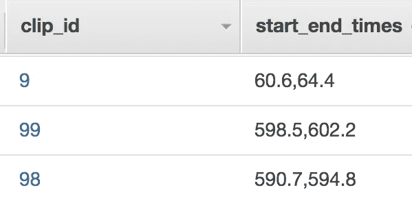
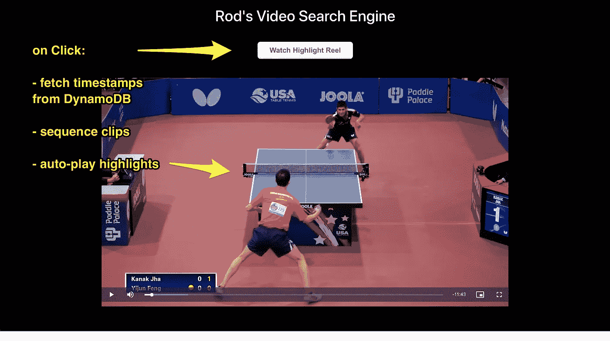
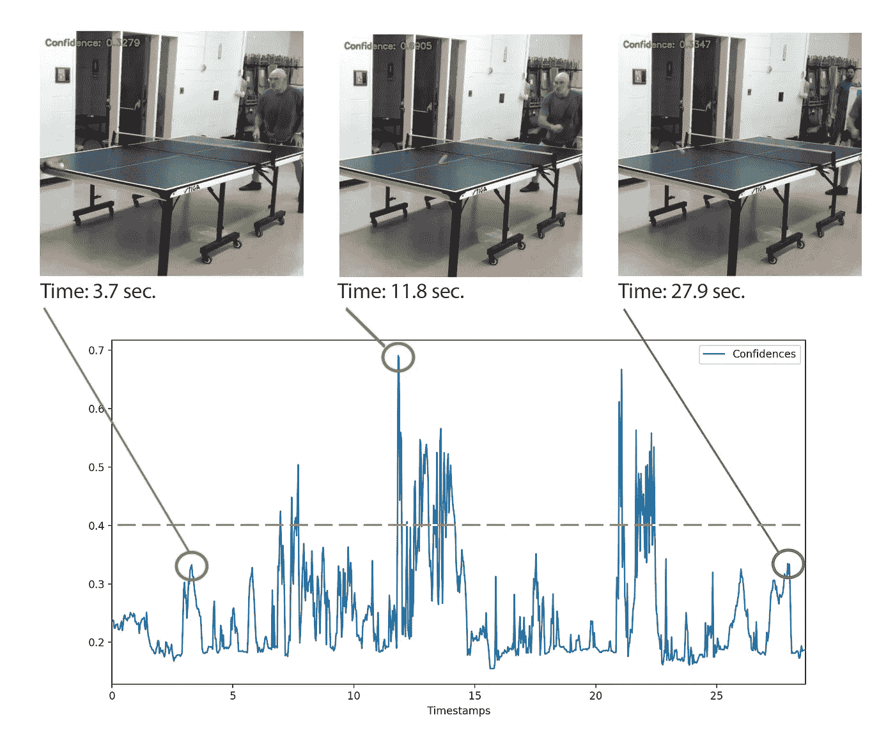

# 我的视频搜索引擎原型

> 原文：<https://towardsdatascience.com/prototyping-my-video-search-engine-d6fb03c9bcd1?source=collection_archive---------57----------------------->

在[的上一篇文章](/evaluating-the-accuracy-of-my-video-search-engine-1235f375bd5)中，我评估了我的物体探测器的准确性，它在一场视频录制的比赛中发现了一个乒乓球。平均精度为 0.57，模型的例子在以前从未见过的镜头上推广得很好，我鼓起勇气组装了这个原型:

概括地说，我分享了这个问题和关于走向数据科学的建议:

> 制作视频很容易，但是谁有时间看完呢？我提出一个视频搜索引擎来寻找相关的时刻。。。。我的目标是建立一个原型，它将视频记录乒乓球比赛，当球在比赛时提取视频剪辑，并向用户显示相关剪辑。

这篇文章展示了我的视频搜索引擎的端到端原型。

## 系统设计

我喜欢从最终结果开始，然后反向工作来规划整个系统。我的目标是提供一个简单的浏览器体验，播放完整长度的视频，并为用户提供观看精彩片段的选项。



我制作了一个系统图，这样我就可以理解我将要编码的每个组件。总体而言，我的系统包括三大要素:

1.  函数获取视频文件，解析它的帧，在每帧上调用我的机器学习算法，并存储每个剪辑的相关时间戳；
2.  一个剪辑时间戳的数据库，当用户点击“观看精彩片段卷”按钮时，可以从浏览器调用该数据库；和
3.  根据用户输入播放全长视频或精彩片段的 web 体验。



以下部分包括 Python 代码和对每个元素的解释。

## 1.用我的物体检测算法处理视频

我首先导入相关的包并初始化变量:

```
import boto3
import cv2
import datetime
import json
import pytz
from pytz import timezone
import os

dynamodb = boto3.resource('dynamodb', region_name=os.environ["AWS_DEFAULT_REGION"],                          aws_access_key_id=os.environ["AWS_ACCESS_KEY_ID"],
aws_secret_access_key=os.environ["AWS_SECRET_ACCESS_KEY"])ddb_table = dynamodb.Table("pp-video-clips")runtime_client = boto3.client('sagemaker-runtime')
endpoint_name = 'pp-ball-detector-endpoint'test_video_file = 'tt-video-1080p.mp4' # from local in example to save time & money
crop_x1 = 710
crop_x2 = crop_x1 + 512
crop_y1 = 183
crop_y2 = crop_y1 + 512
timestamps = [0.0]
detection_threshold = 0.50
lookback_frames = 30
last_n_detections = [0] * lookback_frames
nth_iteration = 0
shouldSaveTimestamp = 0
last_n_shouldSaveTimestamp = [0, 0]
nth_iteration_shouldSaveTimestamp = 0
ith_frame = 0
clip_id = 0
clip_start_time = None
clip_end_time = None
```

在这个例子中，我使用 2018 年美国国家乒乓球锦标赛视频作为`test_video_file`:

我用 [CV2](https://pypi.org/project/opencv-python/) 打开视频文件，并把它放在一个`cap`变量中。然后，我存储视频中的最后一帧，因为它将帮助我处理剪辑没有其他结束时间戳的边缘情况。(*详见下一节。*)

```
cap = cv2.VideoCapture(test_video_file)
cap.set(cv2.CAP_PROP_POS_AVI_RATIO,1) # fast forward to video end
last_frame = cap.get(cv2.CAP_PROP_POS_FRAMES) - 1 # get final frame
cap.set(cv2.CAP_PROP_POS_AVI_RATIO,0) # rewind to beginning
```

接下来，我在一个`while`循环中处理每个视频帧。虽然有许多摄像机角度，但大多数相关内容都出现在桌面周围。由于我的 ResNet-50 对象检测器需要一个 224 x 224 像素的输入图像，因此我简化了这个原型，在每一帧中裁剪一个固定的正方形来检测正在运动的球。

```
while (cap.isOpened()):
    frame_exists, frame = cap.read()
    if frame_exists == False:
        break
    if frame_exists:
        timestamp = cap.get(cv2.CAP_PROP_POS_MSEC)
        crop_frame = frame[crop_y1:crop_y2, crop_x1:crop_x2]
```

例如，大多数匹配都是从这个摄像机角度发生的:



我的代码使用带有`crop_frame = frame[crop_y1:crop_y2, crop_x1:crop_x2]`的绿色方块，并将其传递给我的 Sagemaker 模型端点:

```
height = crop_frame.shape[0]
width = crop_frame.shape[1]
success, encoded_frame = cv2.imencode('.png', crop_frame)

response = runtime_client.invoke_endpoint(EndpointName=endpoint_name, ContentType='image/png', Body=encoded_frame.tobytes())result = response['Body'].read().decode('ascii')detections = json.loads(result)
```

`detections`结果包括按置信度降序排列的 N 次检测。我选择列表中的(第一个)最佳检测，因为我的领域特定的应用程序假设在任何给定时间只能有一个乒乓球在运动。我还获取最佳检测的置信度得分，并计算边界框的 x，y 坐标:

```
best_detection = detections['prediction'][0]
(klass, score, x0, y0, x1, y1) = best_detection
xmin = int(x0 * width)
ymin = int(y0 * height)
xmax = int(x1 * width)
ymax = int(y1 * height)
```

接下来，我通过比较`best_detection`得分和`detection_threshold`来确定是否检测到球。我尝试了各种阈值，我发现 0.5 到 0.7 之间的值效果最好，前提是我们使用 30 帧的缓冲区(下面的将详细介绍*)。*

```
if score > detection_threshold:
    ball_detection = 1
else:
    ball_detection = 0
```

到目前为止，一切顺利。我们现在有了视频中每一帧的检测输出！

## 2.将剪辑存储在数据库中

但是有一个问题。鉴于视频压缩模糊和球的高速度，在`frame-n`中，球检测器可能会错过球(得分刚好低于 detection_threshold)，在`frame-n+1`中找到球，然后在`frame-n+2`中错过球。如果我们从这个信号中创建视频剪辑，它将导致短暂、不连贯的突出显示。这个信号处理问题被称为[去抖](https://my.eng.utah.edu/~cs5780/debouncing.pdf)。

为了解决这个问题，我创建了一个缓冲区来确定是在当前帧还是在上一个`n-frames`中检测到球。目标是获得变量`shouldSaveTimestamp`的输出模式:



这个帧缓冲器允许球检测器偶尔出错，否则有一个总的肯定信号表明有球在运动。

使用`shouldSaveTimestamp`变量，我们可以通过在`shouldSaveTimestamp`从 0 → 1 时保存`start_timestamp`和在`shouldSaveTimestamp`从 1→ 0 时保存`end_timestamp`来进一步识别剪辑。

```
# create n-Frames buffer; feed latest detection back one position
for nth_frame in range(len(last_n_detections)):
    if nth_frame < len(last_n_detections) - 1: # if not the last element, then:
        last_n_detections[nth_frame] = last_n_detections[nth_frame+1]
    else:
        last_n_detections[nth_frame] = ball_detection# identify when the ball is in play using the buffer
if (ball_detection > 0 or sum(last_n_detections) > 0 ):
    shouldSaveTimestamp = 1
else:
    shouldSaveTimestamp = 0# create a buffer to identify 0->1 and 1->0 clip conditions
last_n_shouldSaveTimestamp[0] = last_n_shouldSaveTimestamp[1]
last_n_shouldSaveTimestamp[1] = shouldSaveTimestamp# if shouldSaveTimestamp goes from 0 to 1, save "start timestamp"
if last_n_shouldSaveTimestamp[0] == 0 and last_n_shouldSaveTimestamp[1] == 1:
    clip_start_time = timestamp

# if shouldSaveTimestamp goes from 1 to 0, save "end timestamp"
if last_n_shouldSaveTimestamp[0] == 1 and last_n_shouldSaveTimestamp[1] == 0:
    clip_end_time = timestamp# handle some edge cases:
if ith_frame == last_frame and clip_start_time is not None:
    # take the last timestamp as the end time
    clip_end_time = timestamp

if ith_frame == last_frame and clip_start_time is None:
    # take the whole video as a clip :(
    clip_start_time = 0
    clip_start_time = timestamp
```

如果我们有有效的开始和结束时间戳，剩下的就是在数据库中保存一个剪辑。我选择 DynamoDB 是因为它具有无模式的设计，以及与前端框架(如 React)的简单、有据可查的连接。

```
if (clip_start_time is not None and clip_end_time is not None):
    # Persist clip to DynamoDB
    clip_start_time = round(clip_start_time/1000, 1)
    clip_end_time = round(clip_end_time/1000, 1)
    ddb_item = {
        'video_filename': str(clip_id),
        'start_end_times': '{},{}'.format(clip_start_time, clip_end_time)
    }
    ddb_table.put_item(Item=ddb_item)
    # reset clip start/end times
    clip_start_time = None
    clip_end_time = None
    clip_id += 1# increment the frame counter before looping back to the top
ith_frame += 1
```

就是这样！下面是代码处理一个示例视频时我的日志输出:



然后，验证数据的甜蜜喜悦传到了 DynamoDB:



我应该提到，出于诊断目的，我在主`while`循环中添加了以下代码:

```
draw_bb_on_frame(ith_frame, crop_frame, score, xmin, ymin, xmax, ymax)# where this function is defined earlier:
def draw_bb_on_frame(ith_frame, image, score, x0, y0, x1, y1):
    cv2.rectangle(image, (x0,y0),(x1,y1), (0, 0, 255), 1)
    cv2.putText(image, "Confidence: {:.4f}".format(score), (10, 30),
                cv2.FONT_HERSHEY_SIMPLEX, 0.6, (0, 255, 0), 2)
    if not cv2.imwrite('cv2-test-' + str(ith_frame) + '.jpg', image):
        raise Exception("Could not write image")
```

该代码片段在每个视频帧上绘制分数和边界框。不需要或不建议在最终原型中包含这一步骤，因为(1)它通过为每一帧写入一个图像来限制运行速度，并且(2)产生 21，000 多个图像(1.35 千兆字节！)同时处理一个 12 分钟的视频。但是当我调试系统和调整`detection_threshold`值时，这个函数对于诊断发生了什么非常有用。

## 3.为 Web 浏览器构建精彩片段卷

接下来，我将展示如何加载视频，并使用获取的时间戳从浏览器调用数据库，以便在用户单击“highlight reel”按钮时对剪辑进行排序和自动播放。



我从一个基本的 React 应用程序`npx create-react-app pp-web-ui && cd pp-web-ui`开始。然后，我添加一个视频播放器。虽然有许多选项可用，但我还是推荐 [Video.js](https://www.npmjs.com/package/video.js/v/7.0.3) ，因为:

*   它支持[媒体片段协议](https://www.w3.org/TR/media-frags/)使用开始/结束时间戳标记剪辑，并且
*   它支持一个[播放列表插件](https://www.npmjs.com/package/videojs-playlist)来排序和自动播放多个这样的剪辑。

我运行`npm install video.js && npm install videojs-playlist`，在 web 应用程序中实例化一个视频播放器，并加载完整的视频剪辑。为此，我在 React 应用程序的`/components`目录中创建了一个新组件`VideoPlayer.js`。

```
import React from 'react';
import videojs from 'video.js'
import 'video.js/dist/video-js.css';
import './VideoContainer.css';export default class VideoPlayer extends React.Component {

  componentDidMount() {
    // instantiate Video.js
    this.player = videojs(this.videoNode, this.props.vidOptions, function onPlayerReady() {
      console.log('onPlayerReady', this)
    });
  }// destroy player on unmount
  componentWillUnmount() {
    if (this.player) {
      this.player.dispose()
    }
  } render() {let playerStyle = {      
            margin: '10px auto',      
          }return (
      <div> 
        <div data-vjs-player>
          <video  ref={ node => this.videoNode = node } 
                  className="video-js"
                  style={playerStyle}
          >        
          </video>
        </div>
      </div>
    )
  }
}
```

然后，我将那个`VideoPlayer.js`组件放在一个单独的容器组件中，在那里我处理数据库逻辑:

```
import React, { Component } from 'react';
import VideoPlayer from './VideoPlayer';
import './VideoContainer.css';const videoJsOptions = {
          autoplay: true,
          controls: true,
          height: 480, 
          sources: [{
                        src: '[http://localhost:3000/tt-video-1080p.mp4'](http://localhost:3000/tt-video-1080p.mp4'),
                        type: 'video/mp4'
                    }]
        }class VideoContainer extends Component {
    constructor(props) {
        super(props);
    }componentDidMount(){

    } render() {
         return (
                <div>
                    <VideoPlayer className="center" vidOptions={videoJsOptions} />;
                </div>
            </div>
        )
    }
}export default VideoContainer;
```

然后，我将`VideoContainer.js`组件添加到主 App.js 文件中，以在浏览器中显示视频:

```
import React from 'react';
import logo from './logo.svg';
import './App.css';
import VideoContainer from './components/VideoContainer';
import 'bootstrap/dist/css/bootstrap.min.css';function App() {
  return (
    <div className="App">
      <VideoContainer />
    </div>
  );
}export default App;
```

简单——源视频现在可以在网络浏览器上播放了！另外，上面的三个组件代表了前端体验的整个框架。在下面的剩余部分中，我更新了`VideoPlayer.js`和`VideoContainer.js`来获取时间戳，对它们进行排序，并在用户单击“highlight reel”按钮时自动播放剪辑。

## 从 DynamoDB 获取时间戳 onClick

在本节中，我添加了 [AWS-SDK 包](https://www.npmjs.com/package/aws-sdk)并调用 DynamoDB 的`.scan`函数来获取数据库中的所有时间戳。

首先，我执行`npm install aws-sdk`，导入包，并初始化`VideoConainer.js`中的变量:

```
import * as AWS from 'aws-sdk';AWS.config.update({
  region: 'us-east-1',
  endpoint: 'dynamodb.us-east-1.amazonaws.com',
  accessKeyId: 'USE-YOUR-OWN',
  secretAccessKey: 'USE-YOUR-OWN'
});
```

注意:我在这个例子中硬编码了 DynamoDB 凭证，只是出于教学目的。`accessKeyId`和`secretAccessKey` [不应该硬编码](https://docs.aws.amazon.com/sdk-for-javascript/v2/developer-guide/setting-credentials.html)在应用程序或浏览器脚本中。

接下来，我更新`componentDidMount`来初始化 DynamoDB:

```
componentDidMount(){
        this.dynamodb = new AWS.DynamoDB();
        this.docClient = new AWS.DynamoDB.DocumentClient();

    }
```

然后，我添加了一个 click handler 函数，它从 DynamoDB 获取时间戳，按照剪辑 ID 的升序对剪辑进行排序(在我的代码中称为`video_filename`，并创建一个`videojs-playlist`插件所期望的`sources`数组:

```
onClickHandler(){
        var params = {
          TableName: 'pp-video-clips',
         };this.dynamodb.scan(params, (error, result) => {
            if (error) {
                console.log(error);
            } const allVideosObjects = result.Items const sortedVidObj = allVideosObjects.sort((a, b) => (a.video_filename.S > b.video_filename.S) ? 1 : -1) const videosObjects = sortedVidObj.map(item => { return {
                    sources: [{
                         src: '[http://localhost:3000/tt-video-1080p.mp4#t='+item.start_end_times.S](http://localhost:3000/tt-video-1080p.mp4#t='+item.start_end_times.S),
                        type: 'video/mp4'
                    }]
                }      
            })

            this.setState(videosObjects);
        })            
    }
```

您会注意到`src`键/值对包括这个特殊的标记`#t='item.start_end_times.S'`，它表示一个媒体片段。这告诉视频播放器只播放来自`time = {start_time},{end_time}`的一个片段，然后暂停。

然后，我更新了`VideoContainer.js`组件的`render()`块，以(1)获取状态变量(在那里我存储了`sources`的数组)，(2)根据视频播放器应该播放完整长度的剪辑还是高亮剪辑的数组，有条件地呈现视频播放器，以及(3)如果单击了“观看高亮卷”按钮，则调用 onClickHandler 函数:

```
render() {        
        let videosObjects = this.state; 
        var videoSourcesArray = Object.values(videosObjects);let videoBlock;
        if (videoSourcesArray && videoSourcesArray.length) {
          videoBlock = <VideoPlayer className="center" vidOptions={videoJsOptions} vidSources = {videoSourcesArray} />;
        } else {
          videoBlock = <VideoPlayer className="center" vidOptions={videoJsOptions}/>;
        }return (
            <div>
                <h2 className="center big">Rod's Video Search Engine</h2>
                <div className="pad20">
                    <button className="btn_reel" onClick={() => { this.onClickHandler() }}>
                        Watch Highlight Reel
                    </button>
                </div>
                <div>
                    {videoBlock}
                </div>
            </div>
        )
    }
```

## 使用 Video.js 播放列表自动播放剪辑

在这一节中，我将演示如何使用 Video.js 播放列表来自动播放剪辑。

首先，我导入包并在`VideoPlayer.js`中注册插件:

```
import videojsPlaylistPlugin from 'videojs-playlist';
videojs.registerPlugin('playlist', videojsPlaylistPlugin);
```

然后我修改`componentDidUpdate`来接收来自 DynamoDB 的视频源数组，并开始自动播放剪辑，每个剪辑之间间隔 0 秒:

```
componentDidUpdate() {
     this.player.playlist(this.props.vidSources);
     this.player.playlist.autoadvance(0);    
  }
```

一个挑战是媒体片段在每个剪辑的结尾“暂停”视频，而不是使用“结束”事件。因此，为了让播放列表前进到下一个视频剪辑，我必须创建一个`onPause`处理程序:

```
onPause(){
    if(this.props.vidSources && this.props.vidSources.length > 0) {
      this.player.playlist.next();
    }
  }
```

这种方法的一个缺点/优点是点击视频算作一个`onPause`事件，它会自动快进到下一个剪辑。让我们把它记为一个*特性，而不是一个 bug* 😉

最后，我更新了`render()`块中的`return`语句来监听`onPause`事件，该事件调用`onPause`处理函数:

```
return (
      <div> 
        <div data-vjs-player>
          <video  ref={ node => this.videoNode = node } 
                  className="video-js"
                  style={playerStyle}
                  onPause={() => { this.onPause() }}
          >        
          </video>
        </div>
      </div>
    )
```

转眼间。完整长度的视频在加载网络应用程序时播放，当用户点击“观看精彩片段卷”按钮时，*球在剪辑帧*视频剪辑自动播放。以下是完整视频(左)和高亮显示的视频片段(右)的对比:

在未来的版本中，我应该改进一些东西:

*   这些剪辑并不完美，有时这个原型在不到 2 秒的时间内就能剪辑好一个剪辑。我应该考虑一个更长的帧缓冲区来防止这种情况。
*   我用`clip_id`的`string`而不是`integer`创建了 DynamoDB 表，因此对剪辑的排序是不正确的(例如，剪辑 99 在剪辑 10 之前播放)

## 在真实场景中评估原型

虽然上面的精彩镜头感觉很神奇，但它的工作应该不会令人惊讶，因为我在来自同一视频源的 2000 帧上训练了我的算法。

真正的问题是:

> 这个系统与真实世界的录音相比表现如何？

幸运的是，我的朋友保留了记录的比赛，供他的教练训练他。

哦，哦…一个白色的球在白色的墙上…🤦‍♂️

我没有被吓住，处理了视频。但该系统产生的剪辑非常短，可能是由于摄像机角度和白墙上的白球的置信度较低。该图绘制了相对于视频时间戳的置信度得分:



在 0.30 的`detection_threshold`处有很多好的(真阳性)检测，但是也有同样多的假阳性，如果不是更多的话。将阈值提高到 0.40(橙色虚线)消除了大多数假阳性，尽管我留下了一些真阳性(参见时间戳 27.9 秒处的红色标记)。).我觉得这是一个可以接受的权衡，我重新处理了视频，耗时 4.76 小时。

以下是我的“集锦卷”(右)与完整视频(左)的对比:

我的模型删除了大约 4 分钟的无趣内容(当*球不在*时，36%的录制时间)。在给 Sandeep 看了“精彩片段”之后，他点了点头，笑了笑，并感叹道“太棒了！”

## 未来方向

有许多问题值得探讨。举个例子，

*   如果玩家使用橙色乒乓球，模型会失败吗？
*   对于探测比赛中的球来说，一些摄像机角度更差吗？
*   我可以升级前端体验，允许用户上传他们自己的视频并识别“感兴趣的领域”吗？
*   我可以通过使用 PyTorch 或 Keras 滚动我们自己的卷积神经网络来提高模型精度吗？
*   我可以加快视频处理时间吗？(剧本花了 6 个小时处理了 12 分钟的视频！)
*   我能多快多容易地将这个原型推广到其他运动，比如击剑或网球？
*   如果我们需要预测多个类别(例如，“比赛中的球”与“比赛中的球”或“发球中的球”)，性能会如何变化？

在未来的几个月里，我将继续探索这些问题。如果你对我的结对编程感兴趣，请在评论区留言，我们可以在周末找到时间！