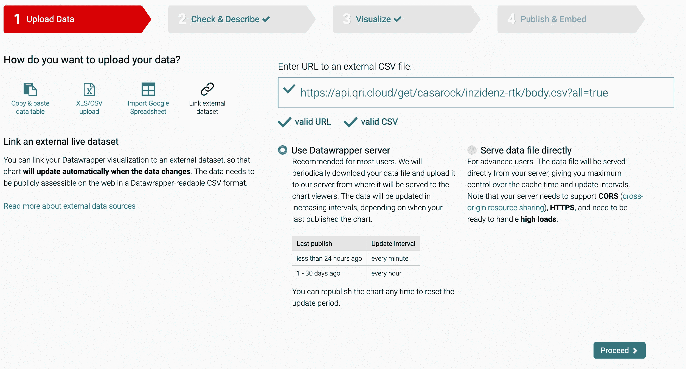
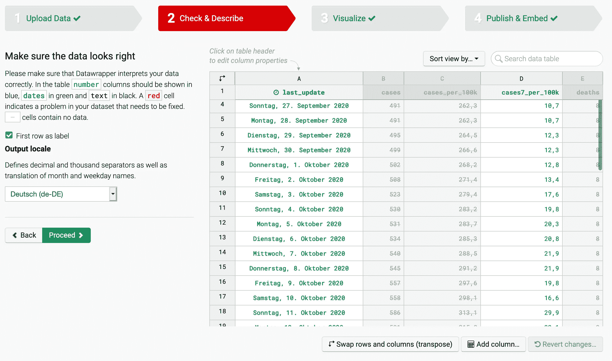
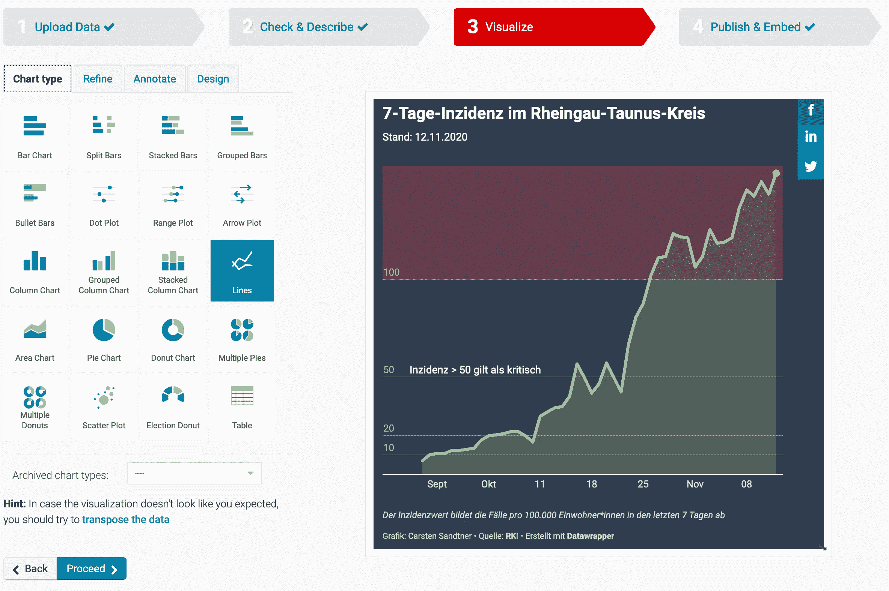

# 通过免费服务提供和绘制数据非常简单

> 原文：<https://towardsdatascience.com/providing-and-plotting-data-with-free-services-is-easy-c3176f4323f7?source=collection_archive---------58----------------------->

## 从开放数据提供商那里收集和提取数据，将它们放在一个新的数据集中，通过使用免费服务来发布和可视化数据？这比你想象的要容易。


照片由[艾萨克·史密斯](https://unsplash.com/@isaacmsmith?utm_source=medium&utm_medium=referral)在 [Unsplash](https://unsplash.com?utm_source=medium&utm_medium=referral) 拍摄

由于科罗纳疫情提供了大量免费的可访问数据，我有了将我在德国居住的农村地区的 7 天发病率可视化的想法。[罗伯特-科赫研究所](https://www.rki.de) (RKI)提供了一个[开放数据集](https://opendata.arcgis.com/datasets/917fc37a709542548cc3be077a786c17_0)，包含德国每个县的所有数字。对于可视化部分，我想尝试一些易于使用的服务。最近，我在德国新闻网站上偶然发现了一些很棒的可视化效果。他们(以及更多人)正在使用德国一家名为 [Datawrapper](https://datawrapper.de) 的初创公司提供的服务。他们还提供一些免费服务——太好了，让我们使用它们吧！最后，我想使用一个用于发布数据的开放平台 [Qri](https://qri.io) 来发布我收集的数据。

让我们看看这些步骤，直到我可以创建和发布可视化。

1.  定期收集和保存数据
2.  将数据推送到存储库中
3.  连接数据并创建可视化效果

## 定期收集和保存数据

不幸的是，RKI 没有公布我想要使用的数字的时间序列数据。只有实际日期的数字。我创建了一些 Python 脚本来收集实际数据，提取我想要使用的数字，添加并保存到我的 CSV 文件中。该脚本每天在我的家庭办公室的一个简单的 Raspberry Pi 上使用 cronjob 运行。我正在使用熊猫打开远程 CSV 的内置功能。这个脚本非常小，几乎不言自明。

```
import pandas as pd
import os.path

# Get Data
df = pd.read_csv("https://opendata.arcgis.com/datasets/917fc37a709542548cc3be077a786c17_0.csv")

# Get desired row (128 - Rheingau-Taunus)
rtk = df.loc[[128], ['last_update', 'cases','cases_per_100k', 'cases7_per_100k', 'deaths']]

# Update data type
rtk['last_update'] = pd.to_datetime(rtk['last_update'], format="%d.%m.%Y, %H:%M Uhr")

# Add row to CSV
use_header = False if os.path.isfile('rtk.csv')  else True
rtk.to_csv('rtk.csv', mode='a', header=use_header, index=False)
```

我算出我的县的 ID 是 128。现在很容易提取数据。由于数据集使用了奇怪的德国日期格式，我用熊猫`to_datetime`转换了它们。

最后，我将我的数据添加到 CSV 中。就是这样！下一步是使用 Qri 提供数据。

## 将数据推送到存储库中

Qri 是一个开源项目，旨在为数据集同步、版本控制、存储和协作构建软件。有点像数据集的 GitHub。它们提供了 GUI 客户端和 CLI 工具。我正在使用 CLI 工具来进行版本控制，并定期将我的数据集推送到他们的(免费)云空间，我可以将我的数据集作为开放的免费资源分享给其他对做酷的事情感兴趣的人。您可以提供一个自述文件，并为您的数据集添加一些元信息(字段描述等)。).关于设置说明，我参考了他们的 [CLI 快速入门指南](https://qri.io/docs/getting-started/qri-cli-quickstart)。使用 CLI 工具初始化和发布数据后，您的数据将可在其云空间中访问。[我的数据就在这里](https://qri.io/docs/getting-started/qri-cli-quickstart)。

当我得到我的数据的更新版本时，我只需*保存*新版本并*将它推*到云中。

```
$ qri save --body ../inzidenz-rtk.csv
$ qri push
```

这个过程仍然是手动的，因为 CLI 工具不能在 Raspberry Pi 上工作。我的计划是将这些步骤添加到我的 cron 作业中，以实现完全自动化的发布。到目前为止，手动就足够了。

我不会深入 Qri 的细节，并参考他们的文档来获得更多的见解。上面的过程对我来说有效，但可能不是最好的。如果有什么我可以改进的，请评论！

Qri 最棒的是[集成部分](https://qri.cloud/casarock/inzidenz-rtk/integration)。您可以获得最新`.csv`的链接，以便在您最喜欢的数据分析工具中使用。此外，其他 Qri 用户可以*派生*您的数据集。

最后，我使用数据集通过 [Datawrapper](https://www.datawrapper.de/) 创建一个图。

## 连接数据并创建可视化效果

Datawrapper 是一个非常棒的可视化工具。它不像 Tableau、Mode 或 Datorama 那样用于构建复杂的仪表板。Datawrappers 主要关注的是制作干净漂亮的可视化效果本身。您可以使用标准的图表，如条形图、折线图、饼图、圆环图等。他们专注于创建独特的图表。每个情节看起来都棒极了。Datawrapper 还提供了几个非常棒的地图绘图。有了免费帐户，你可以使用所有这些，但你在风格上受到限制。但是它们的默认样式和模板已经很棒了，随时可以使用。

最好的功能是，您可以链接一个外部数据集，为您的数据提供一个 URL。当然，我使用的是我的数据集在 [Qri](https://qri.cloud/casarock/inzidenz-rtk) 的 URL。



在 Datawrapper 中使用 CSV 的 URL

下一步是检查和描述您的数据集，以便以后在图中使用



选择要在可视化中使用的字段

在我的例子中，我使用了两列:`last_update`和`cases7_per_100k`。现在我们可以创建可视化。



在 Datawrapper 中设计和注释可视化

您可以细化、注释和设计可视化。使用免费版本，设计仅限于选择一个布局。您可以为某些部分选择颜色，如线条或注释，但您无法使用您公司的 CI 创建可视化效果。那是他们付费产品的一部分。对我来说，默认值已经足够了。

使用 Qri(或任何其他服务)连接数据的最大好处是:

如果您的数据已经更新，您只需重新发布您的图表，它就是最新的！

因为我使用了一些注释，比如日期和突出显示的范围，所以我需要做一些手工工作。其他一切都已经存在了。无需复制新数据、选择字段等。

我最终的可视化看起来是这样的(是的，Medium 可以嵌入 Datawrapper 可视化！)

嵌入媒体的最终可视化

## 结论

收集数据、为他人提供数据以及创建可视化效果比看起来容易。你不需要成为数据科学、数据工程或设计师方面的专家。即使不是开发人员，也可以使用许多很棒的工具。你专注于好的视觉化吗？关注[数据包装器](https://datawrapper.de)。它能很好地帮助你创建可嵌入的图表，将它们作为图片下载，甚至允许在他们的服务 [River](https://river.datawrapper.de/) 中重用。有了 Qri ，你可以为大量受众提供数据集。使用他们的桌面客户端可以帮助那些不喜欢命令行界面的人。您关注的是结果，而不是创建结果的过程！

**免责声明**:我既没有参与 *Datawrapper* 也没有参与 *Qri* ！

[1]: 7 天发病率是每 100，000 名居民在 7 天内新感染的人数。
【2】:[数据](https://opendata.arcgis.com/datasets/917fc37a709542548cc3be077a786c17_0)许可:[数据许可德国—归属—版本 2.0/dl-de/by-2–0](http://www.govdata.de/dl-de/by-2-0)