# 证明伯努利幂和

> 原文：<https://towardsdatascience.com/proving-bernoullis-sum-of-powers-22f50df188e9?source=collection_archive---------22----------------------->

## 如何计算 n 个第一整数的 p 次方之和

图片来自[皮克斯巴伊](https://pixabay.com/fr/?utm_source=link-attribution&utm_medium=referral&utm_campaign=image&utm_content=1746837)的[加里克·巴尔塞吉安](https://pixabay.com/fr/users/insspirito-1851261/?utm_source=link-attribution&utm_medium=referral&utm_campaign=image&utm_content=1746837)。

在他的众多重要贡献中，著名的瑞士数学家[雅各布·伯努利](https://en.wikipedia.org/wiki/Jacob_Bernoulli)(1655–1705)，他的家族(伯努利家族是总共八位世界著名数学家的起源)中的众多著名数学家之一，在 1713 年提供了一个关于第一个整数 *n* 的 *p* 次方之和的表达式(他称之为 [Summae Potestatum](https://en.wikipedia.org/wiki/Faulhaber%27s_formula#Summae_Potestatum) )。他的解的形式是一个次数为( *p* + 1)的[多项式函数](https://en.wikipedia.org/wiki/Polynomial#Polynomial_functions)，其中包含的系数涉及无处不在且现在著名的[伯努利数](https://en.wikipedia.org/wiki/Bernoulli_number)(一个出现在数学和理论物理众多领域的分数序列)。

[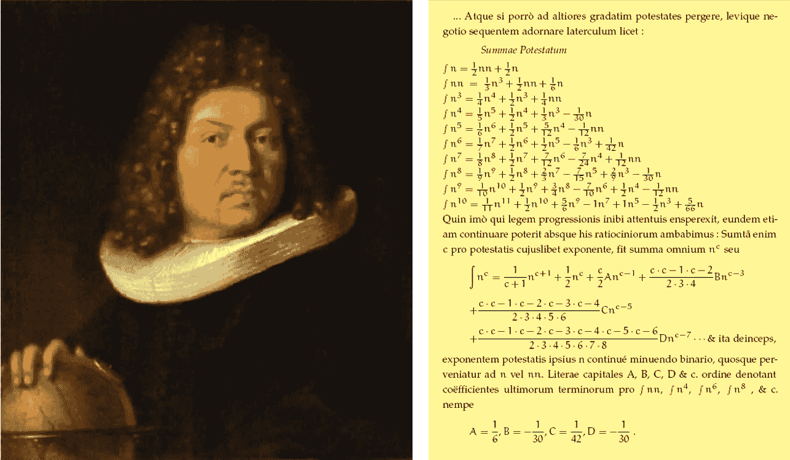](https://en.wikipedia.org/wiki/Faulhaber's_formula#Summae_Potestatum)

图 1:1713 年，杰出的瑞士数学家雅各布·伯努利([来源](https://en.wikipedia.org/wiki/Jacob_Bernoulli))发表了 *Summae Potestatum，*第一个整数的*p*次方之和的表达式([来源](https://en.wikipedia.org/wiki/Faulhaber%27s_formula))。

这个和被称为[福尔哈伯公式](https://en.wikipedia.org/wiki/Faulhaber%27s_formula)(以德国数学家[约翰·福尔哈伯](https://en.wikipedia.org/wiki/Johann_Faulhaber)(1580–1635)的名字命名)，他的结果伯努利以标题[Summae*Potestatum*](https://en.wikipedia.org/wiki/Faulhaber%27s_formula#Summae_Potestatum)**，*发表，是由下面的表达式给出*

*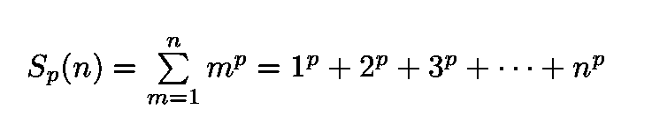*

*等式 1:第一个 *n 个*正整数的 *p* 次方之和，称为 [Faulhaber 公式](https://en.wikipedia.org/wiki/Faulhaber%27s_formula)。*

*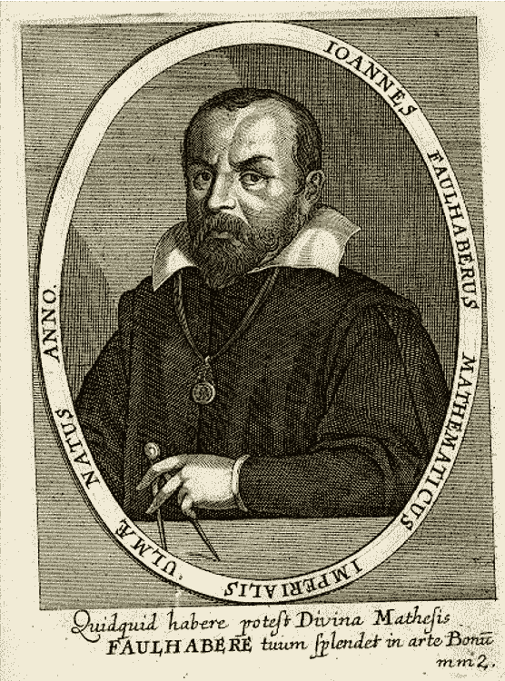*

*图 2:德国数学家约翰·福尔哈伯(1580-1635)。Faulhaber 是一个博学的人，他被训练成一个纺织工人，在几个城市的防御工事中工作，为军队建造水车和几何仪器，还有其他的事情([来源](https://en.wikipedia.org/wiki/Johann_Faulhaber))。*

*正如这些关于数论的特殊讲座所指出的，如果把从索引 *m* =0 开始到索引 *m* = *n* -1 结束的总和写出来，计算会变得更加简洁。有了这种可供选择的指数，总和就变成了:*

*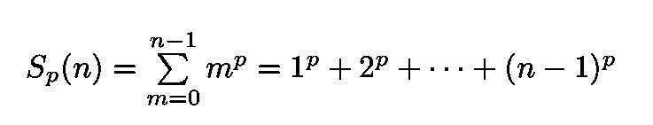*

*等式 2:等式。1 写入的和从索引 *m* =0 零开始，到索引 *m* = *n* -1 结束。选择这组新的指数“整理”了计算。*

*现在考虑所谓的[母函数](https://en.wikipedia.org/wiki/Generating_function) **S** ( *n* ， *t* )，一个[幂级数](https://en.wikipedia.org/wiki/Power_series)，它具有方程中的和。1 和 2 作为系数:*

*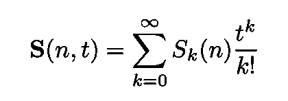*

*等式 3:生成函数具有等式 3 给出的和。1 和 2 作为系数。根据[维基百科](https://en.wikipedia.org/wiki/Generating_function)的说法，生成函数“是一种通过将数字视为幂级数的系数来编码无限序列的方式”。*

*代入等式。等式中的 2。3 我们得到双和:*

*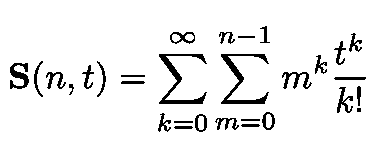*

*等式 4:等式。3 在等式的替换之后。2.*

*其中 *k* 为整数。经过几个代数步骤用来重新排列总和，我们可以重新表达方程。4 由以下两个函数的乘积得出:*

*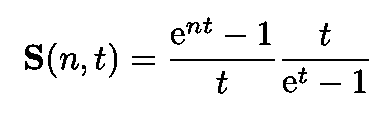*

*等式 5:等式。4 重写为两个函数的乘积。这个表达式是在重新排列和并执行一些简单的(但不是很有启发性的)代数运算后得到的。*

*情商。5 是通过重新排列等式中的双和得到的。并执行一些简单的(但不是很有启发性的)代数操作。现在， **S** ( *n* ， *t* )的第一个因子可以用指数函数的泰勒展开式写成一个幂级数:*

*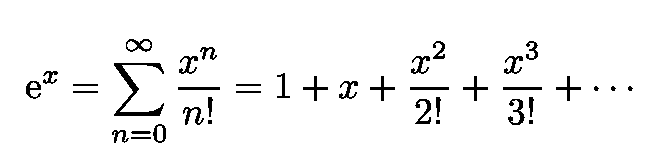*

*等式 6:指数函数的幂级数展开。*

*(你只要从 Eq 的左边减去 1 就可以了。6 并将两边除以 *x* )。要写出 **S** ( *n* ， *t* )的第二项，就必须引入前面提到的[伯努利数](https://en.wikipedia.org/wiki/Bernoulli_number)。等式中的函数 *t* /(e *ᵗ* -1)。5 变成了:*

*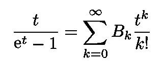*

*等式 7:为了写出等式中 **S** ( *n* ， *t* )的第二个因子。5 一个介绍伯努利数。*

*跳过几个步骤(为了避免混乱)，生成函数 **S** ( *n* ， *t* )变成下面这个错综复杂的表达式:*

*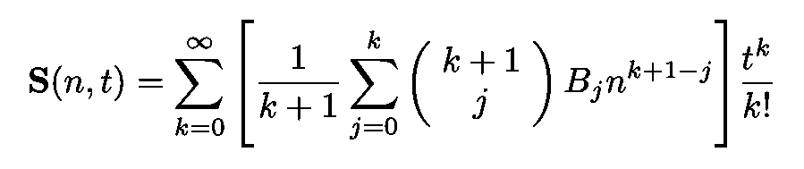*

*等式 8:等式 8 最初给出的生成函数。3 使用指数函数时间序列和 Eq。7(包含伯努利数)。*

*现在，下一步是定义所谓的伯努利多项式:*

**

*等式 9:下面图 3 所示的伯努利多项式的定义。*

*下图显示了对应于不同伯努利数值的伯努利多项式的几个示例。*

*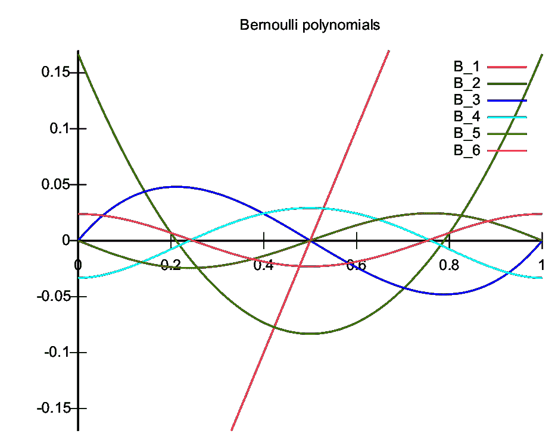*

*图 3:伯努利数的几个值的伯努利多项式([来源](https://en.wikipedia.org/wiki/Bernoulli_polynomials))。*

*将母函数 **S** ( *n* ， *t* )的原始表达式与等式进行比较。8 和使用伯努利多项式的定义，我们得到:*

*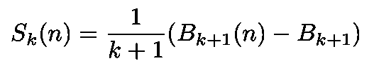*

*等式 10:我们所追求的第一个整数的 p 次幂之和的最终表达式。*

*请注意，生成函数可以优雅地写成:*

*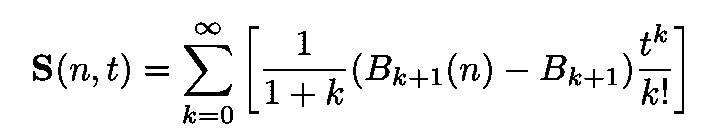*

*等式 11:生成函数的最终表达式，用伯努利多项式和伯努利数表示。*

*在[之前的一篇文章](/on-the-sums-of-series-of-reciprocals-6711437ad893)(见下文)中，我推导出了前五个伯努利数。它们由以下各项给出:*

**

*等式 12:在[这篇文章](/on-the-sums-of-series-of-reciprocals-6711437ad893)中导出的前五个伯努利数。*

**

*图 4:左边，日本数学家小和田硕。右边是他的作品*胜代山保(1712)中的一页，在那里他*将二项式系数和伯努利数制成表格。*

* [## 关于倒数级数的和

### 伟大的数学家欧拉和他的伟大发现

towardsdatascience.com](/on-the-sums-of-series-of-reciprocals-6711437ad893) 

使用 Eq。9 我们得到一些伯努利多项式(见图 3):

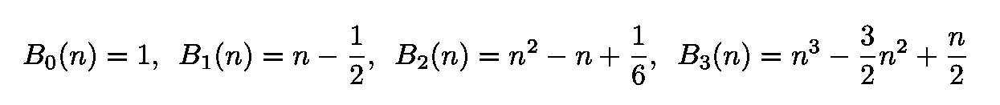

等式 13:第一个伯努利多项式。

现在我们有了所有需要的工具！下面是两个简单的例子，我们的总和后，但所有其他情况下可以平凡地获得:

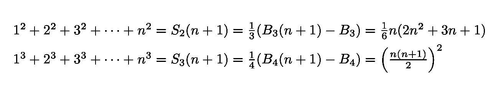

等式 14:第一个整数的 *p* 次方之和的两个简单例子。* 

*我的 [Github](https://github.com/marcotav) 和个人网站 [www.marcotavora.me](https://marcotavora.me/) 有一些关于数学和其他主题的有趣材料，如物理、数据科学和金融。看看他们！*