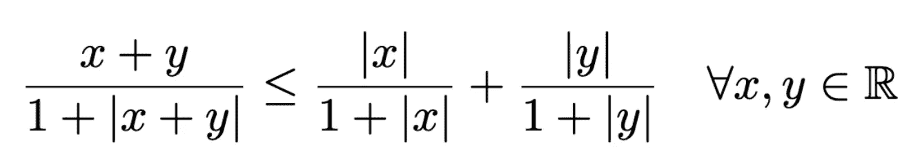
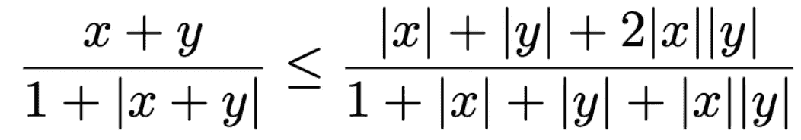

# 如何证明不等式

> 原文：<https://towardsdatascience.com/proving-inequalities-aab03b0588d5?source=collection_archive---------12----------------------->


照片由 [Antoine Dautry](https://unsplash.com/@antoine1003?utm_source=medium&utm_medium=referral) 在 [Unsplash](https://unsplash.com?utm_source=medium&utm_medium=referral) 上拍摄

## 帮助证明一个< b

When you develop an interest in mathematics and start working with material that takes proof seriously, sooner or later you’ll be trying to find proofs of inequalities.

Proving that something is *等于另一个*的技术通常更容易一些。你以同样的方式操纵两边，直到你得出有问题的等式。你可能需要做一些巧妙的替换，但是你能做的事情也就这么多了。

由于传递性，不等式可能有点棘手。如果你想让某些人`a`和`b`看到那个 `a < b`，那看起来可能会非常困难。如果没有显而易见的解决方案，可能有必要想出一些`c`，为此你可以显示`a < c < b`，从而暗示`a < b`。

让我们看看这两种情况的例子，我们将从一个“简单”的例子开始，我们不需要发明中间产品。

例中所有的数字都是实数。

# 简单的例子

给定实数`r`和`s`，显示如下:


## 发展直觉

让我们先花点时间对它说的话发展一种直觉。让我们为`r`和`s`挑选一些数字，看看会发生什么:

```
1/2 < 2/3 < 3/4 < 9/10 < 99/100
```

好吧，我明白了。我可以接受。

现在我们如何证明它总是正确的呢？

## 扩展到相同的分母

为了比较分数，它有助于扩展分数，使它们具有相同的分母。我们必须用`(1+s)`延长左边，用`(1+r)`延长右边

让我们这样做，看看我们的立场。


现在分母相等了，原来我们可以把它们去掉。我们知道`(1+r)`和`(1+s)`都是正数，所以我们知道它们的乘积`(1+r)(1+s)`是正数。逆`1/((1+r)(1+s))`也是如此。我们可以把两边都乘以倒数，有效地去掉分数。

我们不需要翻转不等式的方向，因为我们要乘的数是正数。

我认为这是进步。让我们开始吧。我们只剩下:


## 简化括号中的总和

将总和相乘，我们发现我们最终得到了两边的一个共同项:`rs`。我们两边都减去它，根据我们的给定得到一个真实的陈述。


## 颠倒您的步骤，提供易于遵循的证据

为了给出一个正式的证明，我们只需颠倒我们的探索步骤，所以从上到下阅读时，推理是有意义的。


我们的证明，吉文斯证明的每一步都是我们探索步骤的逆过程

从某种意义上说，这个证明很简单，因为它不需要我们在任何中间表达上有创造性。我们可以像处理等式证明一样处理这个证明。

让我们继续做一些更难的事情。

# 棘手的案子

给定任意两个实数`x`和`y`，表明如下



## 发展直觉

哦天啊。那个看起来要求更高一点。首先，让我们对它所说的有一个直觉。让我们挑选`x = y = 2`，我们得到:

```
4/5 <= 2/3 + 2/3
```

好吧，让我们试试另一双:`x = 2, y = -3`

```
-1/2 <= 2/3 + 3/4
```

好的，看起来我们会一直保持在 1 以下，甚至低于 0。右边可以增长到 1 以上，永远不会低于 0，因为单个项永远不会变成负数。

注意，当我们选择`x = 0`或`y = 0`时，左右两边变得相等。

好的，我们对正在发生的事情有一点直觉。让我们看看是否能证明这一点。

## 扩展到相同的分母

右边是分数的和。我们可以尝试形成总和，看看它如何与左边的相比较。我们需要用`1+|y|`展开左边的项，用`1+|x|`展开右边的项


好吧。所以这就是我们总结右手边时的样子。要证明的不等式变成了:



## 寻找已知的不平等

证明不等式时，你经常需要引入一个或多个额外的术语，这些术语介于你已经看到的两个术语之间。这通常意味着拿走或增加一些东西，这样第三个术语就滑了进来。

经常检查你的课本，寻找你应该知道的不等式，看看它们是否有用。练习也会经常建立在彼此的基础上。有时练习 a)的结果在练习 b)中很关键。所以不要“忘记”你之前的成绩。

在我们的例子中，我们看到两边看起来都类似于我们在第一个证明中处理过的熟悉的`something/(1+something)`模式。

让我们看看怎样才能让双方都符合我们已证明的不等式，这样我们就可以利用它了。

## 左边越来越长

让我们看看我们的左手边。


如果我们取分子`x+y`的绝对值，我们可以用`r=|x+y|`代替，我们的左手边将是`r/(1+r)`的形式。这样做肯定会增加期限。`x+y`的绝对值在`x+y<0`的情况下更大，或者在`x+y≥0`的情况下相等。

所以我们有:


看起来我们在左侧完成了。

## 收缩右手边

让我们看看我们的右手边。


为了达到我们想要的`s/(1+s)`形式，我们必须做些什么？

如果我们用`s=|x|+|y|+|x||y|`代替，我们会得到`(s+|x||y|)/(1+s)`。我们的分子中多了一个`|x||y|`。如果我们放弃它，我们的项要么保持不变——如果`x`或`y`是`0`就会是这种情况——要么收缩。因为如果`x`和`y`都不是`0`，那么`|x||y|`就是正的，所以我们要减少分子的值。

因此，我们有:


我们已经达到了我们想要的形式`s/(1+s)`

## 把我们的鸭子排成一排

我们已经将两边分别转化为`r/(r+1)`和`s/(s+1)`形态。这些是我们想要在我们最初的左手边和右手边之间滑动的术语。

如果我们能证明`0 ≤ r < s`，我们可以用我们的第一个结果

```
r/(r+1) < s/(s+1)
```

我们替换了`r=|x+y|`和`s=|x|+|y|+|x||y|`。我们立即看到`0≤r`，因为它是一个绝对值。通过[三角形不等式](https://en.wikipedia.org/wiki/Triangle_inequality)我们知道`|x+y|≤|x|+|y|`是真的，所以我们可以证明:


太好了！我们知道`0 ≤ r ≤ s`，可以用`r/(r+1) ≤ s/(s+1)`。我们可以把所有的条款都整理好。


我们做到了！

我们最初的左侧和右侧术语很难直接比较。但是我们可以在它们之间加入一些我们知道如何比较的术语，从而形成一个证明我们最初陈述的链。

# 结论

当证明不等式时，寻找以可控方式收缩或增长项的方法是有用的，这样它们就符合已知的不等式并形成传递链。

如果你觉得你已经记下来了，为什么不测试一下自己，从头开始证明这两个不等式呢？你刚刚读了解答，所以…这能有多难？

他们又来了。

第一个不等式:


第二个不等式:


你能行的！