# 用初等微积分证明素数的无穷性

> 原文：<https://towardsdatascience.com/proving-the-infinity-of-primes-using-elementary-calculus-3386699801f4?source=collection_archive---------14----------------------->

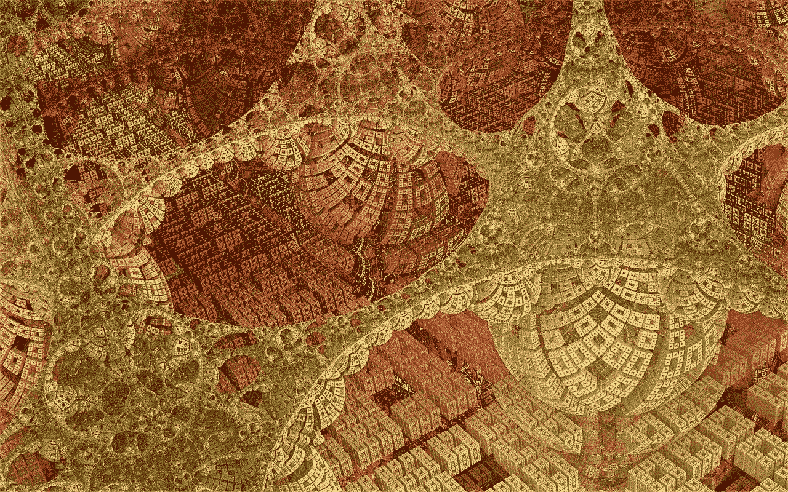

图片由来自[皮克斯拜](https://pixabay.com/fr/?utm_source=link-attribution&utm_medium=referral&utm_campaign=image&utm_content=880676)的[皮特·林福思](https://pixabay.com/fr/users/TheDigitalArtist-202249/?utm_source=link-attribution&utm_medium=referral&utm_campaign=image&utm_content=880676)拍摄

## 如何用一个简单的积分证明有无穷多个素数

为了正式定义[素数](https://en.wikipedia.org/wiki/Prime_number)，我将使用 G. H. Hardy 和 E. M. Wright 的经典数论著作《数论导论[》中的定义的“改编”版本](https://books.google.com.br/books?id=FlUj0Rk_rF4C&printsec=frontcover&dq=hardy+number+theory+book+pdf&hl=en&sa=X&ved=2ahUKEwiUxqiY_PrqAhWBK7kGHavdAKUQ6AEwAXoECAIQAg#v=onepage&q&f=false)

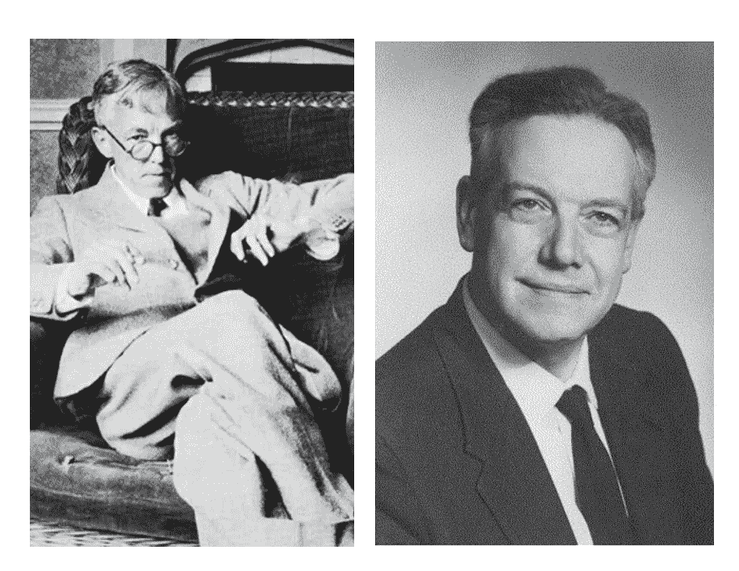

图 1:英国数学家 G. H .哈代([来源](https://en.wikipedia.org/wiki/G._H._Hardy))和 E.M .莱特([来源](https://academic.oup.com/blms/article-abstract/39/5/857/343298?redirectedFrom=fulltext))，著有名著**(*[*来源*](https://academic.oup.com/blms/article-abstract/39/5/857/343298?redirectedFrom=fulltext) *)。**

*让我们只考虑正整数。其中，有一个特别重要的子类，即[素数类](https://en.wikipedia.org/wiki/Prime_number)。一个数 p 被称为质数，如果:*

*   **p* > 1:数字 1 被认为[既不是质数也不是合数](https://books.google.com.br/books?id=EgJrQgAACAAJ&dq=The+Penguin+Dictionary+of+Curious+and+Interesting+Numbers+Paperback+pdf&hl=en&sa=X&ved=2ahUKEwiP6pyhvvjqAhWVA9QKHSFJDXMQ6AEwBXoECAMQAg)。T4 不称 1 为质数的一个很好的理由是为了避免修改算术基本定理。这个著名的定理说“除了因子重排，一个整数只能用一种方式表示为质数**的乘积**。”考虑到 1 是质数，这种因式分解的唯一性将会丢失(例如，我们可以将 3 写成 1×3，1×1×1×3，1⁴⁷⁴⁷⁵×3，等等)。*
*   **p* 除了 *1* 和 *p* 之外，没有正约数*

*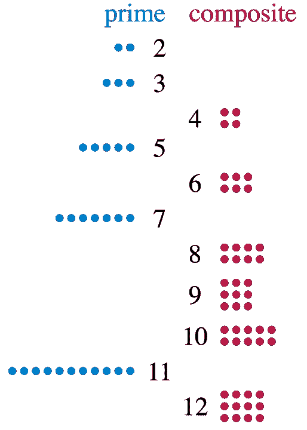*

*图 2:与合数相反，质数不能排列成矩形([来源](https://en.wikipedia.org/wiki/Prime_number))。*

# *素数的无穷大*

*素数的数目是无限的。第一组是:2，3，5，7，11，13，17，19，23，29，31，37 等等。这个重要定理的第一个证明是由古希腊数学家欧几里德提供的。他的证明被称为[欧几里德定理](https://en.wikipedia.org/wiki/Euclid%27s_theorem)。*

*在这篇文章中，我将描述伟大的瑞士数学家莱昂哈德·欧拉只用基本微积分做的一个简单证明。我会看艾格纳和齐格勒的书。*

*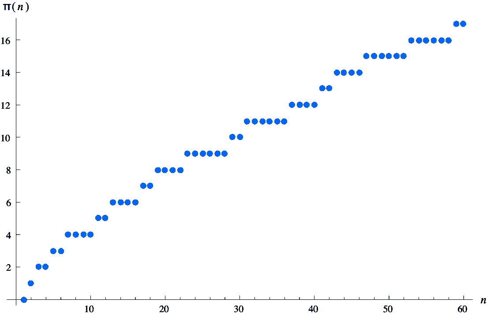*

*图 3:下面等式定义的 *π* ( *x* )的值。1 为前 60 个整数([来源](https://en.wikipedia.org/wiki/Prime-counting_function))。*

*让我们首先考虑小于或等于某个 *x* ∈ **R** 的素数的个数，其中 **R** 表示实数的集合:*

*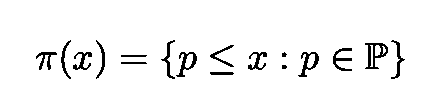*

*等式 1:小于或等于某 x ∈ ***R.*** 的素数个数*

*这个函数被称为[素数计数函数](https://en.wikipedia.org/wiki/Prime-counting_function)。我们可以随意给质数编号，但让我们按升序编号:*

*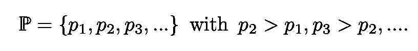*

*等式 2:以递增顺序编号的素数。*

*现在考虑下面举例说明的函数 f( *x* )=1/ *x* 。*

*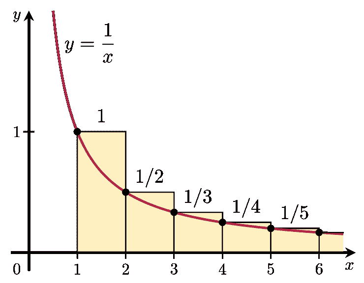*

*图 4:函数 f(*x*)= 1/*x(*[*来源*](https://en.wikipedia.org/wiki/Integral_test_for_convergence) *)。**

*这个函数在区间[1，∞)上的积分是 *x* 的对数*

*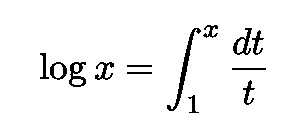*

*等式 3:1/x 从 1 到 x 的积分等于 *x.* 的对数*

*现在将 1/ *x* 下方的区域与图中所示阶跃函数下方的区域进行比较。我们稍后将更仔细地验证，对于整数*

*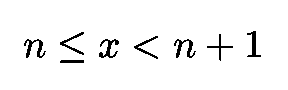*

*等式 4:x 的区间。下面的 5 是服从的。*

*遵循以下两个不等式:*

*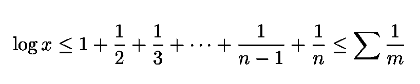*

*等式 5:证明所需的不等式。最后的和扩展到所有的*m*∈***N***只拥有小于或等于 x 的素数。*

*其中最后的总和延伸到所有的*m*∈***N***只拥有个质因数 *p* 使得:*

**

*为了清楚起见，让我们考虑一个例子，比如说 *n* =6。在这种情况下，等式中的间隔。4 是*x*∈【6，7】，不等式变成:*

*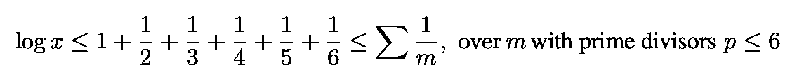*

*等式 6:等式的例子。5 代表 n=6。*

*第一个不等式可以从图 4 中读出。第二种呢？在这种情况下，上面不等式中的*m*∈***N***有哪些值？*

*   *数字 2、3 和 5 只有一个素数。因为它们是素数，所以它们唯一的除数小于 6。*
*   *合数 4 = 2 和 6 = 2 x 3 只有 2 和/或 3 作为质因数，并且都小于 6*

*加上项 1，刚刚列出的数(即 2、3、4、5 和 6)的倒数之和已经等于等式(1)中不等式之间的和。6 既然有无限多的 *m* s(即[调和级数](https://en.wikipedia.org/wiki/Harmonic_series_(mathematics))发散到∞)，那么等式中的第二个不等式。6 是服从。更正式的演示见[这个链接](https://books.google.com.br/books?id=E6rvCAAAQBAJ&printsec=frontcover&dq=proofs+from+the+book+pdf&hl=en&sa=X&ved=2ahUKEwjXu7yIt_rqAhV1IbkGHUVCBO4Q6AEwAHoECAQQAg#v=onepage&q&f=false)。*

*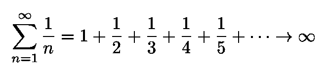*

*等式 7:调和级数→ ∞*

*现在，[算术基本定理陈述](https://books.google.com.br/books?id=FlUj0Rk_rF4C&printsec=frontcover&dq=hardy+number+theory+book+pdf&hl=en&sa=X&ved=2ahUKEwiUxqiY_PrqAhWBK7kGHavdAKUQ6AEwAXoECAIQAg#v=onepage&q&f=false)“除了因子的重排，一个整数只能用**的一种方式表示为质数的乘积**所以情商里的每一个 *m* 。5 可以用以下形式的乘积来唯一地表示:*

*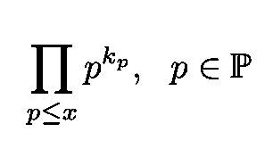*

*等式 8:等式中的每一个 *m* 。5 可以唯一地表示为形式的乘积。*

*其中 *k* s 是每个素数因子在 *m* 的因式分解中出现的次数。因此，等式中的总和超过了 m。4 可以表示为:*

*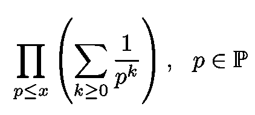*

*等式 9:等式中 m 的和。6.*

*(读者可以通过一个例子来验证这一点)。现在，括号内的和是一个简单的几何级数:*

*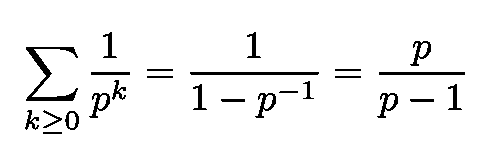*

*等式 10:等式括号内的几何级数。9.*

*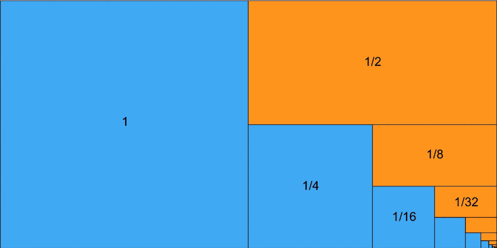*

*图 5:比值= 1/2，第一项= 1 的收敛几何级数([来源](https://en.wikipedia.org/wiki/Geometric_series))。*

*等式中的乘积。9 是所有小于或等于 x 的质数。*因此，比较等式。9 带情商。1，我们为 Eq 获得。5:**

**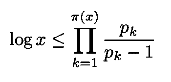**

**等式 11:等式。1 使用等式。9.**

**因为通常遵守下面的不等式**

**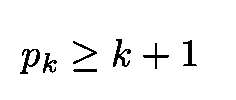**

**我们获得:**

**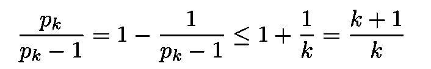**

**这意味着:**

**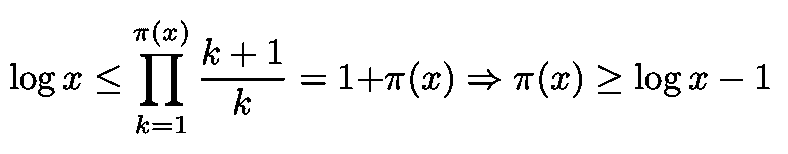**

**由于 log( *x* )是无界的，如下所示，**

**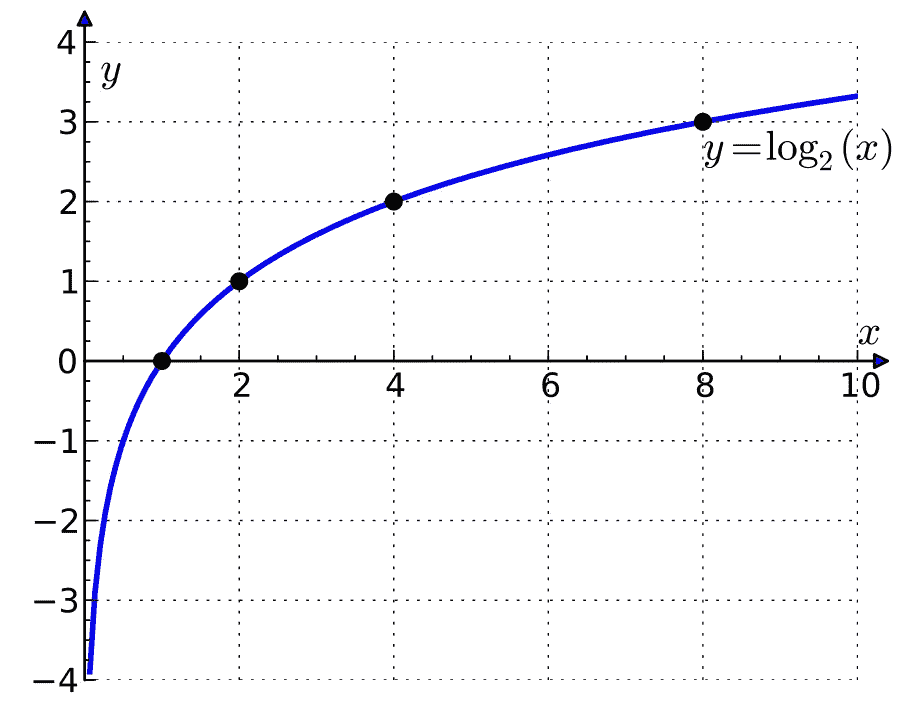**

**图 log x 函数([来源](https://en.wikipedia.org/wiki/Logarithm))。**

**素数计数函数π( *x* )也是无界的。因此，我们得出结论，存在无穷多个素数。**

**感谢您的阅读，再见！一如既往，我们随时欢迎建设性的批评和反馈！**

**我的 [Linkedin](https://www.linkedin.com/in/marco-tavora/) 、个人网站 [www.marcotavora.me](http://www.marcotavora.me/) 、以及 [Github](https://github.com/marcotav) 都有一些关于数学以及物理、机器学习、深度学习、金融等其他话题的其他有趣内容！看看他们！**