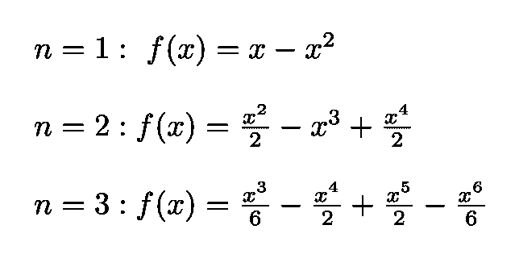

# 证明π的不合理性

> 原文：<https://towardsdatascience.com/proving-the-irrationality-of-%CF%80-10bc5d84ea11?source=collection_archive---------13----------------------->

## 一个显著结果的简单证明

图片由来自 [Pixabay](https://pixabay.com/fr/?utm_source=link-attribution&utm_medium=referral&utm_campaign=image&utm_content=989124) 的 [Gerd Altmann](https://pixabay.com/fr/users/geralt-9301/?utm_source=link-attribution&utm_medium=referral&utm_campaign=image&utm_content=989124) 提供。

[根据定义，无理数](https://en.wikipedia.org/wiki/Irrational_number)是不能由整数的分数(或比率)构成的[实数](https://en.wikipedia.org/wiki/Real_number)。像 1/2、3/5 和 7/4 这样的数字被称为[有理数](https://en.wikipedia.org/wiki/Rational_number)。像所有其他数字一样，无理数可以用小数来表示。然而，与实数的其他子集(如图 1 所示)相比，无理数的十进制扩展永远不会终止，也不会像[循环小数](https://en.wikipedia.org/wiki/Repeating_decimal)(例如 1/3 = 0.333……)那样，以重复自身的序列结束(参见此[链接](https://en.wikipedia.org/wiki/Irrational_number))。在这组无理数中有π，它是圆的周长与直径的比值(如图 2 所示)。

图 1:这个图展示的是实数 R 的集合，它包括有理数 Q、Q 内部的整数 Z、Z 中包含的自然数 N 和无理数 R\Q(无理数集合不像其他的那样有一个符号)([来源](https://en.wikipedia.org/wiki/Irrational_number))。

π的值已经被几个古文明用数值估算过了(见此[链接](https://kconrad.math.uconn.edu/blurbs/analysis/irrational.pdf))。然而，在 17 世纪，艾萨克·牛顿和戈特弗里德·莱布尼茨 T20 发现微积分之后，无穷级数开始被用来获得更好的近似。一个例子是:

它是由印度数学家桑加玛格拉玛的马达瓦首先发现的。对于 *x* =1，它变成了所谓的[莱布尼茨π](https://en.wikipedia.org/wiki/Leibniz_formula_for_%CF%80) 公式:

其缺点是收敛非常慢。

图 2: π是无理数的一个例子。它是圆的周长与直径的比值。

无理数的另一个著名例子是 2 的平方根，它是由传奇哲学家萨摩斯的毕达哥拉斯的追随者发现的。据说最初，他们隐瞒了他们的发现，并根据传说，谋杀了梅塔蓬图姆的哲学家希帕索斯，因为他最终揭示了这个发现。

图 3:2 的平方根是无理数的一个例子([来源](https://en.wikipedia.org/wiki/Irrational_number))。

我们在这里的目标是提供一个简单的证明π的无理数。为了做到这一点，我们将遵循[尼文](https://en.wikipedia.org/wiki/Ivan_M._Niven)并从定义一个辅助函数 *f* ( *x* )开始。

# 引入辅助功能

让我们首先考虑以下(显然不相关的)函数:

等式 1:这个函数 f(x)将用于π的无理数的证明。

其中 *n* 为整数。这个函数可以写成幂展开式。例如，对于 n = 1、2 和 3，我们有:

等式 2:等式 2 给出的 f(x)展开的例子。1 表示 n =1、2 和 3。

一般来说，人们有以下等式:

等式 3:等式中的函数。1 写成幂展开。

这些系数很容易确定。例如对于 *n* =1，

并且对于 *n=* 3:

## **f(*x*)**的性质

对于 0< *x*1，我们有:

等式 4:f(x)的第一性质。

这是 *f* ( *x* )的第一个重要性质。这是因为:

我们将需要 *f* ( *x* )的其他三个属性。其中两个是:

等式 5:f(x)服从的另外两个性质。

其中( *m* )是 *m* 阶导数。

我们需要的最后一个属性是:

这是一个整数。因此请注意， *f* ( *x* )的所有导数都是整数。同样，因为如果我们互换 *x* 和 1- *x，*函数本身及其导数在 *x* =1 时也是整数，所以 *f* ( *x* )保持不变。

这些特性可以通过一个简单的例子来说明。设 *n* =4。然后我们有:

从这里我们可以读出 *c* 系数的值:

我们可以看到所有的属性都被遵守(为了避免过度混乱，省略了情况 *m* =6 和 *m* =7):

# 证明π的不合理性

这个证明是由加拿大裔美国数学家伊凡·尼文提出的。人们从假设与我们想要证明的相反的情况开始。更具体地说，我们假设π是有理的:

等式 6:π有理的假设，和我们要论证的正好相反。

然后，我们构建以下函数:

其二阶导数(下面需要用到)是:

其中 Eq。5 用于消除比 2 *n.* 高的 *f* ( *x* )的导数

图 4:加拿大裔美国数学家伊万·m·尼文([来源](https://en.wikipedia.org/wiki/Ivan_M._Niven))。

正如我们刚刚看到的， *f* ( *x* )及其所有导数在 *x* =0 和 *x* =1 时都是整数。这意味着 *F* (0)和 *F* (1)，因此 *F* (1) + *F* (0)，也是整数。我们现在使用以下标识:

其中 Eq。6 被用来消除 *b* 。综合双方，我们得到:

使用 Eq。4 我们得到:

但是对于足够大的 *n* :

这与我们之前发现的 *F* (1) + *F* (0)是整数相矛盾。最初的假设 Eq。6 因此是假的，π一定是无理数。如果π是理性的，π也会是理性的。因此π也一定是无理数，这就结束了证明。

这个证明的优雅和简单是不可否认的。它们让我们意识到纯数学可以有多美好。

我的 [Github](https://github.com/marcotav) 和个人网站 [www.marcotavora.me](https://marcotavora.me/) 有一些关于数学和其他主题的有趣材料，如物理、数据科学和金融。看看他们！