# 证明 e 的超越性

> 原文：<https://towardsdatascience.com/proving-the-transcendence-of-e-65aaa2de69c3?source=collection_archive---------23----------------------->

## 欧拉数超越性的初等证明

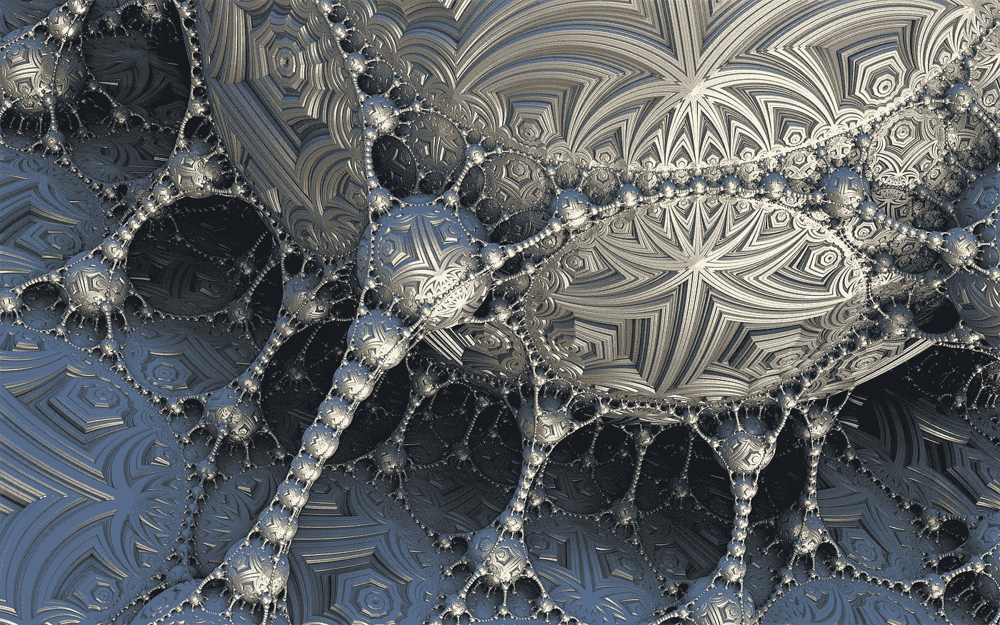

图片由来自[皮克斯拜](https://pixabay.com/fr/?utm_source=link-attribution&utm_medium=referral&utm_campaign=image&utm_content=1943505)的[皮特·林福思](https://pixabay.com/fr/users/TheDigitalArtist-202249/?utm_source=link-attribution&utm_medium=referral&utm_campaign=image&utm_content=1943505)拍摄

[欧拉数*e*T7 是一个数学常数~2.718，定义如下:](https://en.wikipedia.org/wiki/E_(mathematical_constant))

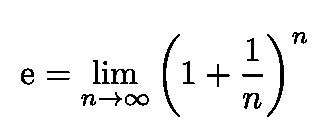

等式 1:欧拉数 e 的一个可能定义。

这个常数是瑞士数学家雅各布·伯努利发现的。初等函数

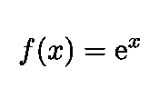

等式 2:指数函数，唯一等于其导数的函数。

被称为[指数函数](https://en.wikipedia.org/wiki/Exponential_function)，它等于它自己的导数(它是唯一具有这种性质的函数)。

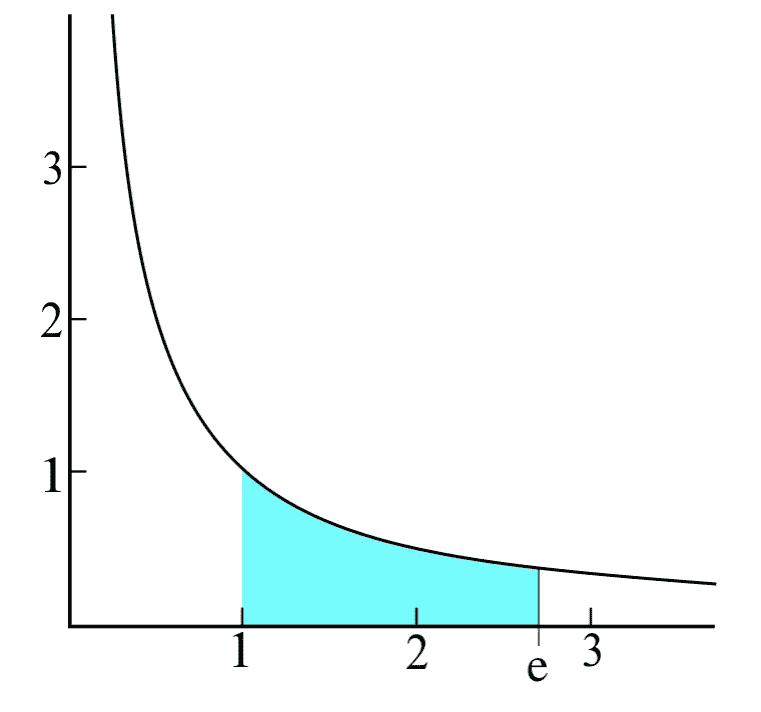

图 1:方程 *y* = 1/ *x 的绘图欧拉数 e* 是唯一使阴影面积等于 1 的数(大于 1)([来源](https://en.wikipedia.org/wiki/Exponential_function))。

# **超越数**

实数可以是代数的，也可以是超越的。根据定义，n 次代数数 *n* 满足具有整系数的多项式方程，例如:

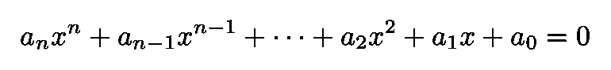

方程 3:整系数多项式方程。它由代数数来满足。

一个代数数为 n 次的事实意味着 xⁿ的系数非零。[超越数](https://en.wikipedia.org/wiki/Transcendental_number)是**不**满足等式等方程的实数。3.

# e 的超越

我们在这篇文章中的目标是证明 *e* 是一个超越数。这个证明的最初版本是由法国数学家查尔斯·埃尔米特提供的，但这里给出的版本是由德国数学家戴维·希尔伯特简化的。

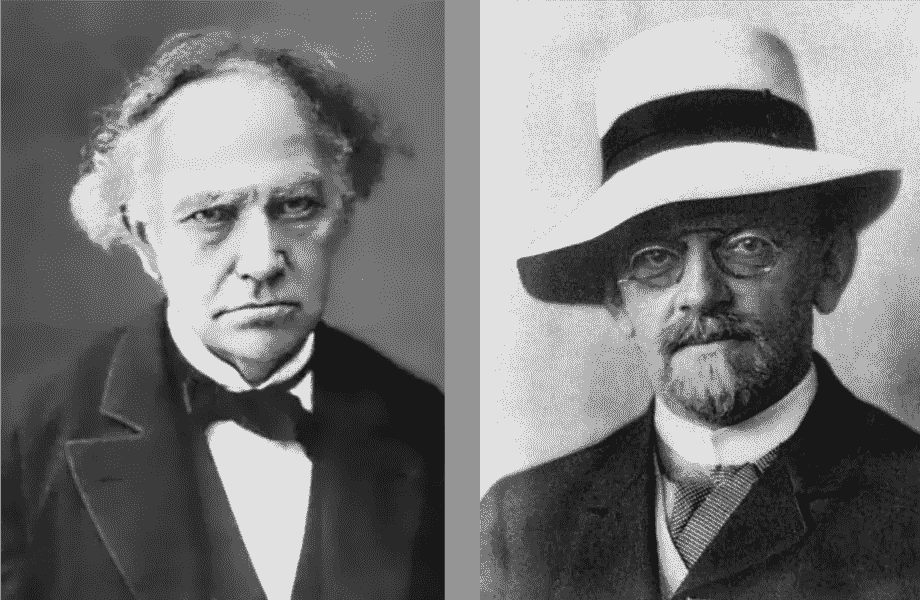

图 2:法国数学家查尔斯·埃尔米特([来源](https://en.wikipedia.org/wiki/Charles_Hermite))和德国数学家戴维·希尔伯特([来源](https://en.wikipedia.org/wiki/David_Hilbert))。

我们首先假设与我们试图证明的相反的情况，即 *e* **是**次数为 *n:* 的代数数

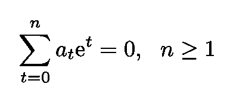

等式 4:如果 e 在 n 次代数数中，它满足这个等式，其中第一个和最后一个 a 系数非空。

我们开始证明用有理数逼近 e 的幂。我们定义了以下对象:

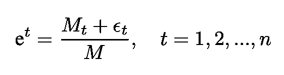

等式 5:用有理数逼近 e 的幂。

在哪里

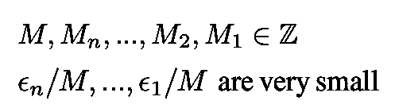

对于等式中 *e* 的每个功率。5 我们有:

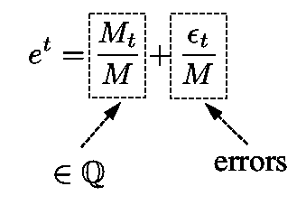

对于非常小的ϵ来说，这个等式意味着所有的 eᵗ都非常接近于一个有理数。我们现在用等式代替。5 转换成等式 4 并抵消因子 *M* 。我们获得:

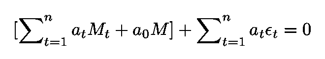

等式 6:代入等式的结果。情商 5。4.

注意等式中的 *n* 。4 和 Eq。6 是相同的数量。情商。6 有两个明显的特点:

1.  第一个括号内的表达式是一个整数，并且选择了 M 个整数，使得表达式不为零
2.  在第二个表达式中， *ϵ's* 将被选择得足够小，使得表达式的绝对值为< 1

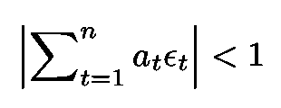

等式 7:等式中第二项所服从的性质。6.

我们的证明将包括证明那个等式。6 不可能是真的，它构成了一个矛盾。这是因为一个非零整数和一个带绝对值的表达式的和< 1 cannot vanish.

## Defining the M’s and *ϵ's*

埃尔米特从定义 m 和ϵ开始。首先，他将 m 定义为:

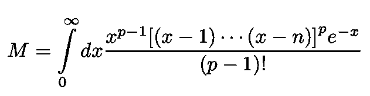

等式 8:定义 m 的积分。

其中 *p* 被选为素数，这将在后面确定。质数 *p* 可以取我们想要的那么大(但是 *M* 对于 *p* 的任意值都是整数)。其他 m 和 *ϵ* 定义如下:

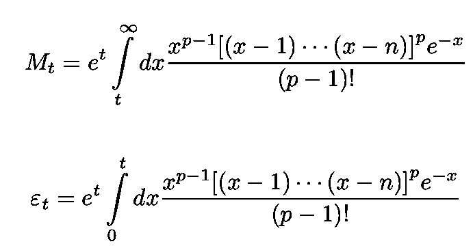

等式 9:定义等式中引入的 Ms 和ϵs 的积分 6.

我们现在通过选择 *p* 来继续，以便满足上面的属性 1 和 2。

让我们首先计算积分 *M.* 乘以分子中的二项式并将结果提升到 p，我们得到

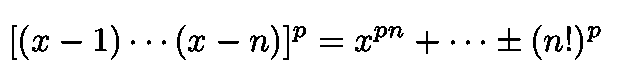

等式 10:将等式分子中的二项式相乘。9

其具有整系数。将其代入 *M* 并使用

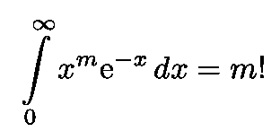

等式 11:阶乘 m 的积分表达式。

我们得出:

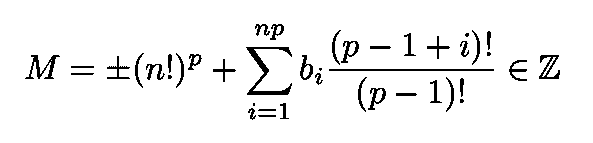

等式 12:等式。8 限制 p 大于 n。

将我们自己限制为大于 *n* 的素数，我们立即看到这个等式的第一项是**而不是**可被*p*整除，然而，我们可以很快看到第二项**是** *。*展开阶乘:

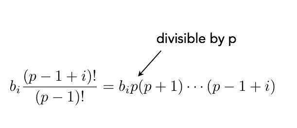

方程式 13:方程式中的第二项。12 能被 p 整除。

由于 M 不能被 *p* 整除，等式中的第一个括号。6 也不能被 p 整除。现在考虑等式中的顶部积分。9.引入变量 y:

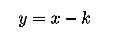

积分变成:

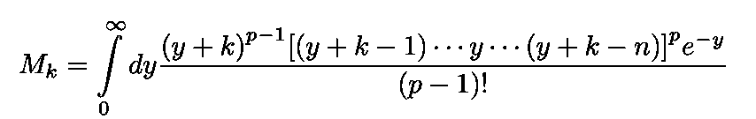

分子中括号内的多项式具有整系数，其项从

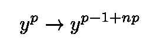

几步之后，我们到达:

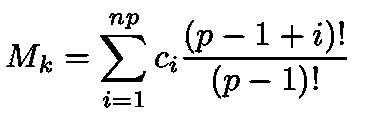

对于整数 *c* s(其中等式使用了 11)。每个 M( *k* )是一个可被 *p* 整除的整数，因此等式中的第一个括号。6 不能被 p 整除，因此我们得出结论，等式第一个括号中的项。6 是非零整数。如果它是零，它会被 p 整除，我们只是得出结论，它不是。

剩下的最后一块就是展示那个情商。假设我们选择足够大的 *p* 值，则 7 为真。使用 Eq。9、经过几个步骤后我们发现:

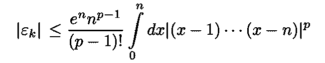

如果二项式乘积的绝对值对于 x ∈ [0， *n* )有一个上界 B，我们得到:

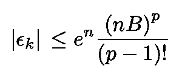

由于 RHS → 0 as *p* →∞，证明结束。

我的 [Github](https://github.com/marcotav) 和个人网站 [www.marcotavora.me](https://marcotavora.me/) 有一些关于数学和其他主题的有趣材料，如物理、数据科学和金融。看看他们！