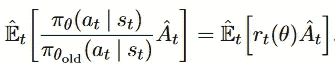
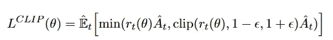
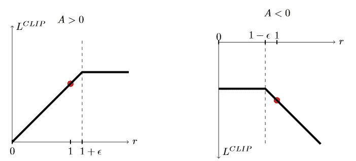
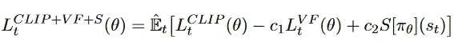

# TensorFlow 2.x 的近似策略优化(PPO)

> 原文：<https://towardsdatascience.com/proximal-policy-optimization-ppo-with-tensorflow-2-x-89c9430ecc26?source=collection_archive---------10----------------------->

## 理解 PPO 强化学习算法并用 TensorFlow 2.x 实现

Neenu Vimalkumar 在 [Unsplash](https://unsplash.com/s/photos/clip?utm_source=unsplash&utm_medium=referral&utm_content=creditCopyText) 上拍摄的照片

在本文中，我们将尝试理解 Open-AI 用于强化学习的近似策略优化算法。在一些基础理论之后，我们将使用 TensorFlow 2.x 实现 PPO。在你进一步阅读之前，我建议你看一下来自[的演员-评论家方法，因为我们将为 PPO 修改那篇文章的代码。](/actor-critic-with-tensorflow-2-x-part-2of-2-b8ceb7e059db)

## 为什么选择 PPO？

1.  **不稳定的策略更新**:在许多策略梯度方法中，由于较大的步长，策略更新是不稳定的，这导致坏的策略更新，并且当这个新的坏策略用于学习时，它导致甚至更坏的策略。如果步子迈得小，就会导致学习速度变慢。
2.  **数据低效**:很多学习方法是从当前经验中学习，在梯度更新后丢弃经验。这使得学习过程缓慢，因为神经网络需要大量的数据来学习。

PPO 可以很方便地克服上述问题。

## PPO 背后的核心理念

在早期的政策梯度方法中，目标函数类似于**LPG(θ)= Et[logπθ(At | ST)ˇAt]。**但是现在我们将采用当前策略和旧策略的比率，而不是当前策略的日志。

照片经由[https://arxiv.org/abs/1707.06347](https://arxiv.org/abs/1707.06347)

我们还将削减比率，并将削减和不削减两者中的最小值，即 b/w。

照片经由[https://arxiv.org/abs/1707.06347](https://arxiv.org/abs/1707.06347)

如下所示，这个缩减的目标将限制大型策略更新。

照片经由[https://arxiv.org/abs/1707.06347](https://arxiv.org/abs/1707.06347)

因此，最终目标包含 3 个部分，第一个是 Lclip，第二个是我们的 critic net 的 MSE，即预测的和目标的状态值的平方损失。第三部分是鼓励探索的熵。

照片经由[https://arxiv.org/abs/1707.06347](https://arxiv.org/abs/1707.06347)

# 算法步骤

1.  玩游戏 n 步，存储状态，行动概率，奖励，完成变量。
2.  将广义优势估计方法应用于上述经验。我们将在编码部分看到这一点。
3.  通过计算它们各自的损失来训练一些时期的神经网络。
4.  测试这个训练好的模型的“m”次发作。
5.  如果测试集的平均奖励大于您设定的目标奖励，则停止，否则从第一步开始重复。

# 密码

**神经网络:**

1.  在导入了所需的库并初始化了我们的环境之后，我们定义了我们的神经网络，类似于 Actor-Critic 文章中的神经网络。
2.  行动者网络将当前状态作为输入，输出每个动作的概率。
3.  批评家网络输出一个州的价值。

**动作选择:**

1.  我们定义我们的代理类，并初始化优化器和学习率。
2.  我们还定义了一个 clip_pram 变量，它将在演员损失函数中使用。
3.  对于动作选择，我们将使用 TensorFlow 概率库，它将概率作为输入，并将其转换为分布。
4.  然后，我们使用该分布进行动作选择。

**测试模型知识:**

1.  这个函数将用于测试我们代理的知识，并返回一集的总奖励。

**训练循环:**

1.  我们将循环“步骤”时间，即我们将收集“步骤”时间的经验。
2.  下一个循环是代理与环境交互的次数，我们将体验存储在不同的列表中。
3.  在上述循环之后，我们计算并添加最后一个状态旁边的状态的值，用于广义优势估计方法中的计算。
4.  然后，我们处理广义优势估计方法中的所有列表，以获得回报，优势。
5.  接下来，我们为 10 个纪元训练我们的网络。
6.  培训结束后，我们将在测试环境中对我们的代理进行五集测试。
7.  如果测试集的平均奖励大于您设定的目标奖励，则停止，否则从第一步开始重复。

**广义优势估计:**

1.  我们定义了一个预处理函数，它实现了计算回报和收益的 GAE 方法。
2.  将变量“g”初始化为零，将 lambda 初始化为 0.95。
3.  我们通过颠倒奖励列表从后面循环奖励。
4.  将 delta 计算为(当前动作的回报+ gamma *下一状态的值*对于终端状态为零的 done 变量-当前状态的值)。
5.  将变量“g”计算为(delta + gamma * lambda * done 变量* g)。
6.  将返回计算为(当前状态的 g +值)。
7.  反转返回列表，就像我们从后往前计算一样。
8.  优势的计算方式为(returns-values)。**这里我们使用值[:-1]。毕竟，**我们的值列表比所有其他列表大一个，因为为了计算的目的，我们添加了紧挨着最后一个状态的状态的值。

**学习功能:**

1.  学习函数将(在与环境交互期间存储或计算的状态、动作、优势、概率、回报的数组)作为输入。
2.  我们计算当前的概率和损失。评论家的损失是 MSE。
3.  该函数使用渐变抽头执行渐变更新。

**演员流失:**

1.  行动者损失将当前概率、行动、优势、旧概率和批评家损失作为输入。
2.  首先，我们计算熵并计算平均值。
3.  然后，我们循环遍历概率、优势和旧概率，计算比率、裁剪比率，并将其添加到列表中。
4.  然后，我们计算损失。**注意这里的**我们采取了负损失，因为我们想执行梯度上升，而不是梯度下降。

这就是关于编码的全部内容。现在让我们看看您的代理没有学习的原因和一些技巧。

# 实施时需要注意的事项:

在编写 RL 代码时，要记住以下几点。

1.  神经元的数量、隐藏层数、学习速率对学习有巨大的影响。
2.  张量和 NumPy 数组的形状应该是正确的。很多时候，实现是正确的，代码也是有效的，但是代理没有学到任何东西，仅仅是因为张量的形状不正确，并且当对这些张量进行运算时会给出错误的结果

你可以在这里找到这篇文章[的完整代码。敬请关注即将发布的文章，我们将在 TensorFlow 2 中实现更多 RL 算法和深度学习算法。](https://github.com/abhisheksuran/Atari_DQN/blob/master/PPO.ipynb)

所以，本文到此结束。谢谢你的阅读，希望你喜欢并且能够理解我想要解释的内容。希望你阅读我即将发表的文章。哈里奥姆…🙏

# 参考资料:

 [## 近似策略优化算法

### 我们提出了一种新的强化学习策略梯度方法

arxiv.org](https://arxiv.org/abs/1707.06347)