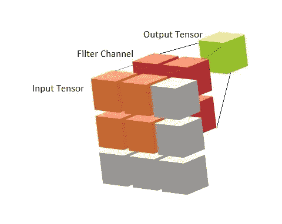

# 修剪卷积神经网络

> 原文：<https://towardsdatascience.com/pruning-convolutional-neural-networks-cae7986cbba8?source=collection_archive---------23----------------------->

机器学习是各行各业的新流行语，是 21 世纪的精灵。它承诺了一切，从在繁重的体力工作中代替人类劳动，到为决策提供高水平的见解和分析。当与物联网(IoT)结合时，这种魔力将进一步增强，并可能创造一个世界，在这个世界中，我们的环境是我们大脑的延伸，并对我们的突发奇想和愿望做出智能响应。

然而，精灵越强大，它所需要的神灯就越大。换句话说，机器学习软件通常计算量非常大，因此不适合轻量级物联网设备。在这里，我们探讨卷积神经网络的想法，这是图像识别和对象检测中机器学习的一个关键方面，以及它们为什么不需要像现在这样庞大。

图 1:CNN 层如何将过滤通道应用于输入张量的图示

[卷积神经网络(CNN)](https://medium.com/@RaghavPrabhu/understanding-of-convolutional-neural-network-cnn-deep-learning-99760835f148) 通过将 N 个滤波器通道应用于输入图像(以下称为张量)来工作。假设一个输入张量在形状中(高度、宽度、先前通道的数量)。每个滤波器通道都可以看作是一个小权重盒，它围绕输入张量的高度和宽度，对该位置的值执行元素级乘法，并将它们相加，以在该位置输出单个值。根据过滤器通道盒的大小及其在输入张量周围移动的方式，单个盒将输出形状的张量(new_height，new_width，1)。通过应用 N 个过滤通道，输出张量将具有(新高度，新宽度，N)的形状。因此，这构成了单一的 CNN 层。

图像分类和对象检测模型通常具有大量 CNN 层(在 MobilenetV2 中超过 50 层),并且每个 CNN 层可以具有从 10 到 100 以上的滤波器通道数量。因此，模型中存储了大量参数(权重),使得模型使用起来复杂且计算量大。这促使我们想出在不影响模型功能的情况下减小模型大小的方法。

我们在这里讨论的方式是通过移除被认为对模型不必要的参数来修剪训练的模型。剪枝的方法是受郝力等人的论文“高效神经网络的剪枝过滤器”的启发。

图 2:来源: [GDJ](https://pixabay.com/users/GDJ-1086657/) ，via [pixabay](https://pixabay.com/vectors/human-male-profile-man-a-i-ai-2099157/) ( [Pixabay 许可](https://pixabay.com/service/license/))

当我们查看一个完全训练好的神经网络时，我们可以看到它的许多权重非常接近于零。这表明这些权重在确定神经网络的输出中没有起重要作用。如果我们将神经网络视为大脑，这意味着只有一小部分大脑实际上用于解决给定的问题，而大部分大脑处于非活动状态。

应用这一思想，我们遍历模型中的 CNN 层，检查哪些滤波器通道具有非常接近于零的权重，并从该层中完全移除这些通道。此后，我们适当地重新连接各个 CNN 层(在需要的地方使用一个层来用零填充输入/输出张量以获得正确的形状)，以确保信息仍然可以正确地通过模型流动。结果是一个更加精简的模型，仍然可以执行它被训练要做的图像分类/对象检测。

图 3:对目标检测模型的精确度进行修剪的结果(mAP)

我们在 SSDnet 的一个版本上实现了修剪思想，以查看修剪如何影响模型的能力(由 mAP 表示，这是一种对检测对象的准确度的测量)。如图 3 所示，我们可以删除大约 76%的 CNN 频道，该模型仍然具有足够的弹性，可以对剩余的 24%的频道进行操作，并保持原来的精度水平。它还告诉我们，该模型基本上需要大约 24%的通道才能有效运行，任何进一步的减少都会严重影响其能力。代码可在网上[获得](https://github.com/siyuan0/pytorch_model_prune)。

对于一个模型在停止工作之前可以承受的信道丢失百分比，似乎没有硬性规定，这个数量因模型而异。然而，这告诉我们的结论是，卷积神经网络中的大部分参数并没有真正发挥重要作用。这个概念可能扩展到其他形式的神经网络，如前馈神经网络和递归神经网络，肯定值得进一步探索。这个概念在设计用于轻量级物联网设备的机器学习模型方面可能有潜在的价值。

## 参考资料:

[1]马克等， [MobileNetV2:反演残差和线性瓶颈](https://arxiv.org/abs/1801.04381)，2018，CVPR 2018

[2]郝力等，[高效神经网络的剪枝滤波器](https://arxiv.org/abs/1608.08710)，2016，2017

[3]刘威等， [SSD:单次多盒探测器](https://arxiv.org/abs/1512.02325)，2016，ECCV 2016