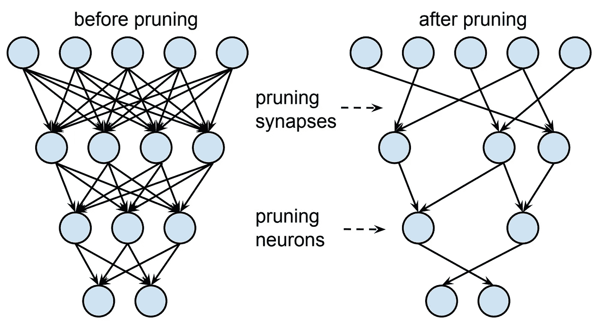
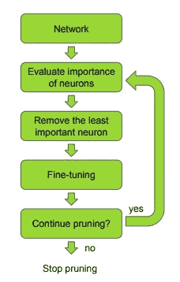

# 修剪神经网络

> 原文：<https://towardsdatascience.com/pruning-neural-networks-1bb3ab5791f9?source=collection_archive---------5----------------------->

## 通过移除连接或节点，神经网络可以变得更小更快

深度学习的大部分成功来自于建立越来越大的神经网络。这使得这些模型能够更好地执行各种任务，但也使它们的使用成本更高。较大的型号需要更多的存储空间，这使得它们更难分发。较大的模型也需要更多的时间运行，并可能需要更昂贵的硬件。如果您正在为真实世界的应用程序生产一个模型，这是一个特别值得关注的问题。

模型压缩旨在减少模型的大小，同时最大限度地降低准确性或性能的损失。神经网络修剪是一种压缩方法，包括从已训练的模型中移除权重。在农业中，修剪是剪掉植物不必要的枝或茎。在机器学习中，修剪是删除不必要的神经元或权重。我们将回顾神经网络修剪的一些基本概念和方法。

# 移除重量或神经元？

有不同的方法来修剪神经网络。(1)可以修剪权重。这是通过将单个参数设置为零并使网络稀疏来实现的。这将减少模型中的参数数量，同时保持架构不变。(2)您可以从网络中删除整个节点。这将使网络架构本身更小，同时旨在保持初始较大网络的准确性。

修剪权重/突触与节点/神经元的可视化([来源](https://arxiv.org/abs/1506.02626)

基于权重的修剪更受欢迎，因为它更容易做到而不会损害网络的性能。然而，它需要稀疏计算才能有效。这需要硬件支持和一定程度的稀疏性才能有效。

修剪节点将允许更优化的密集计算。这允许网络在没有稀疏计算的情况下正常运行。这种密集计算通常在硬件上得到更好的支持。然而，移除整个神经元更容易损害神经网络的准确性。

# 修剪什么？

修剪的一个主要挑战是决定修剪什么。如果要从模型中移除权重或节点，您希望移除的参数不那么有用。有不同的试探法和方法来确定哪些节点不太重要，可以在对准确性影响最小的情况下删除。您可以使用基于神经元的权重或激活的试探法来确定它对模型性能的重要性。目标是删除更多不太重要的参数。

最简单的修剪方法之一是基于权重的大小。移除重量实质上是将其设置为零。您可以通过移除已经接近于零的权重来最小化对网络的影响，这意味着量值较低。这可以通过移除低于某个阈值的所有权重来实现。要根据权重大小修剪神经元，可以使用神经元权重的 L2 范数。

不仅仅是权重，训练数据上的激活可以用作修剪的标准。当通过网络运行数据集时，可以观察到激活的某些统计数据。您可能会观察到一些神经元总是输出接近零值的值。这些神经元可能会被移除，而对模型几乎没有影响。直觉是，如果一个神经元很少以高值激活，那么它很少用在模型的任务中。

除了权重或激活的大小之外，参数的冗余也意味着神经元可以被移除。如果一层中的两个神经元具有非常相似的权重或激活，这可能意味着它们在做同样的事情。通过这种直觉，我们可以移除其中一个神经元，并保留相同的功能。

理想情况下，在神经网络中，所有神经元都有独特的参数和输出激活，这些参数和激活在数量上是显著的，并且不是冗余的。我们希望所有的神经元都在做一些独特的事情，并去除那些不独特的。

# 什么时候修剪？

修剪中的一个主要考虑是将其放在训练/测试机器学习时间线中的什么位置。如果您使用基于权重大小的修剪方法，如前一节所述，您可能希望在训练后进行修剪。但是，在修剪之后，您可能会发现模型性能受到了影响。这可以通过微调来解决，即在修剪后重新训练模型以恢复准确性。

迭代剪枝流程([来源](https://arxiv.org/pdf/1611.06440.pdf)

修剪的用法会根据应用程序和使用的方法而变化。有时微调或多次重复修剪是不必要的。这取决于网络被修剪了多少。

# 如何评价剪枝？

评估修剪方法时需要考虑多个指标:准确性、大小和计算时间。需要准确性来确定模型如何执行其任务。模型大小是模型占用多少字节的存储空间。要确定计算时间，您可以使用 FLOPs(浮点运算)作为度量。这比推理时间更容易衡量，并且不依赖于模型运行的系统。

通过修剪，在模型性能和效率之间有一个折衷。你可以大量修剪，得到一个更小更有效的网络，但也不太准确。或者，您可以稍微精简一下，拥有一个高性能的网络，但它也很大，运营成本也很高。对于神经网络的不同应用，需要考虑这种折衷。

# 结论

剪枝是提高神经网络效率的有效方法。在这个领域有很多选择和研究领域。我们希望继续在深度学习方面取得进展，同时保持我们的模型在能源、时间和空间方面的效率。

# 参考

[1] Blalock，Davis，等.[神经网络剪枝是什么状态？。](https://arxiv.org/pdf/2003.03033.pdf)*arXiv 预印本 arXiv:2003.03033* (2020)。

[2]韩，宋等.【学习权值和连接的高效神经网络】。*神经信息处理系统的进展*。2015.

[3] PyTorch 修剪教程[https://py torch . org/tutorials/intermediate/Pruning _ Tutorial . html](https://pytorch.org/tutorials/intermediate/pruning_tutorial.html)

[4] Keras / Tensorflow 剪枝教程[https://www . tensor flow . org/model _ optimization/guide/Pruning/Pruning _ with _ Keras](https://www.tensorflow.org/model_optimization/guide/pruning/pruning_with_keras)

[5] Molchanov，Pavlo，等.“[修剪卷积神经网络以进行资源高效的推理。](https://arxiv.org/abs/1611.06440)*arXiv 预印本 arXiv:1611.06440* (2016)。

6 Babaeizadeh、Mohammad、Paris Smaragdis 和 Roy H. Campbell。 [Noiseout:一种修剪神经网络的简单方法。](https://arxiv.org/abs/1611.06211)*arXiv 预印本 arXiv:1611.06211* (2016)。