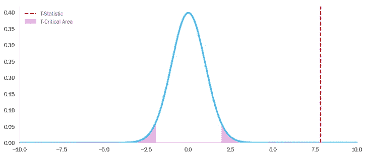

# PS4 vs XBone vs Switch——第八代主机谁赢了？

> 原文：<https://towardsdatascience.com/ps4-vs-xbone-vs-switch-who-won-the-8th-console-generation-1e8520ba474?source=collection_archive---------32----------------------->

## 使用假设检验一劳永逸地决定…

作者图片

随着索尼准备推出 PS5，微软集思广益，想出更多的方法将字母“X”包含在下一款游戏机的名称中，任天堂做任天堂在周末做的任何事情，这是一个回顾第八代视频游戏机的好时机，并决定其中哪一款(如果有的话)可以被描述为“最好的”。

索尼当然可以为转移的设备加冕，自 2013 年推出以来，已售出超过 1.1 亿台 ps4[(据估计，XBox One 在同一时间内售出了令人失望的 4700 万台，而 Switch 自 2017 年发布以来售出了 5500 万台)。当然，这些统计数据对消费者来说无关紧要，我们只能假设，消费者更关心的是游戏质量，而不是游戏机的商业性能。但是我们如何判断一款游戏的*品质*？正如一句谚语所说:一个人的垃圾是另一个人的](https://en.wikipedia.org/wiki/List_of_best-selling_game_consoles) [*使命召唤*](https://www.youtube.com/watch?v=Hi0pyPwxz6Y) 。

克服主观性是我以前在[钻研专辑评论的黑暗世界](/the-devils-music-622d29028c0b)时尝试过的，这是一个将在这里重复的技巧。特别是，我们将依靠游戏的'[元批评 T13 分数'来衡量它的“内在质量”。提醒一下，](https://www.metacritic.com/game)[MetaScore 是给定书名的所有可用评论家分数的加权平均值](https://www.metacritic.com/about-metascores)，并“根据[他们的]质量和整体地位”给予某些评论家额外的权重。因此，我们用于此分析的数据集是通过抓取 MetaCritic 网站生成的(这个过程在之前的[博客](/soup-of-the-day-97d71e6c07ec)中有深入介绍)。

对于收集到的数据，我们可以马上说一些事情:

*   我们在三个控制台(PS4、XBox One 和 Switch)上有 13，334 个条目。
*   许多游戏没有分配元分级。当没有足够的评论家评论来聚集一个时，就会发生这种情况。
*   相同的标题在不同的平台上有不同的条目。此外，给定标题的 MetaScores 可能变化很大，这取决于评论是针对哪个控制台的。

# kill all zombies——PS4 比 XBox One 高 10 分

让我们进一步研究这最后一点。有人可能会说，衡量两个游戏机中哪一个最好的最公平的方法是只检查在两个游戏机上都出现的游戏。事实上，如果我们看看每个平台上可用游戏数量的文氏图，我们会发现有很大的重叠——特别是在 PS4 和 XBox One 之间(它们在技术上更相似，并且大约在同一时间推出)。

使用 [Matplotlib-Venn](https://pypi.org/project/matplotlib-venn/) 创建的图表

让我们假设我们想要调查，对于 PS4 和 XBox One 上都可用的给定游戏，哪个版本更有可能拥有更好的 MetaScore。为了做到这一点，我们首先分离出至少在这两个平台上有 MetaScores 的游戏，然后在一个游戏接一个游戏的基础上，从另一个游戏中减去一个游戏的分数(在这种情况下，从 XBox One 中减去 PS4)。

XBox One MetaScore，每个游戏减去 PS4 MetaScore

让我们在 [KDE 图上](https://seaborn.pydata.org/generated/seaborn.kdeplot.html)形象化这些分数差异…

我们可以看到，与 PS4 相比，这两个平台上的游戏在 XBox One 上的平均 MetaScores 略高。话虽如此，但差别似乎很小(平均仅超过 1 分)，均值两边的范围都相当宽。综合考虑所有因素，我们是否可以得出平台之间的平均差异*显著*的结论？这听起来很像假设检验的基础，所以让我们想想这样的检验会是什么样子。

如果我们试图证明一款游戏在不同主机上的 MetaScore 之间存在显著差异，那么我们需要拒绝它们之间没有差异的假设。

一个稍微微妙的点将有助于我们了解如何继续进行——尽管我们已经收集了整个 MetaCritic，但我们仍然在处理一个游戏的*样本*，而不是一个群体(如果没有其他情况，有一些没有 MetaScores 的游戏我们已经从我们的分析中排除了，因此根据定义，我们正在处理两个控制台上可用的所有游戏的子集)。

想象一下，在*人口*水平上，任何两台游戏机上游戏的 MetaScore 之间的平均差异实际上为零。那么人口分布的平均值当然是 0。为了证明两个控制台之间存在显著差异，我们需要证明我们的样本极不可能来自这个假设的零均值总体。

当然，这是几乎任何单样本假设检验的逻辑基础，但是当我们解释我们的结果时，从基本原则(而不是仅仅盲目地将数字插入公式)考虑这些事情会很有用，并将有助于确保我们得出正确的结论。回到手头的问题——我们现在可以陈述我们的无效假设和替代假设:

*   **H₀:** 控制台之间的平均差异= 0
*   **Hₐ:** 表示控制台之间的差异≠ 0

下一步是定义我们的 *α* (当我们不应该拒绝 H₀时，我们可以接受的概率)。0.05 对大多数人来说已经足够好了 *α* ，所以对我们来说已经足够好了。换句话说，如果我们真的拒绝 H₀，那么只有 5%的可能性我们这样做是错的。

为了确定我们是否可以拒绝 H₀，我们现在需要创建“t 统计量”，它由以下公式给出:

其中 x-bar 是样本均值，μ是总体均值，s 是样本标准差，n 是样本大小

我们可以将其与 T 分布(具有适当的自由度)进行比较，并绘制 T 统计量，这里显示为一条垂直红线。该 T 统计生成一个 p 值，该值等于红色 T 统计右侧*的 T 分布下的面积。*

XBox One vs. PS4。蓝色曲线下总共有 5%的区域是粉红色阴影，反映了我们选择的 *α=0.05* 。

我们可以从可视化中看到，我们的 p 值将远低于阿尔法阈值 0.05。由此，我们可以拒绝零假设，并得出结论，对于同时出现在 PS4 和 XBox One 上的游戏，XBox One 版本*更有可能*拥有更高的元批评分数。

顺便提一下，我们可以按照完全相同的过程来说明:

*   游戏在 XBox One 上比在 Switch 上更有可能获得更高的分数。

XBox One 与 Switch

*   与 Switch 相比，游戏更有可能在 PS4 上获得更高的分数(尽管在这种情况下，对零假设的拒绝更加微不足道)。

PS4 与开关

# 游戏机独占怎么样？

那么我们能得出 XBox One 是最好的第八代游戏主机的结论吗？你们当中的游戏爱好者(和集合论者)会正确地注意到，通过只考虑跨多个控制台可用的游戏，我们基本上忽略了数据集中一半的游戏。事实上，如果我们调查 PS4 的十大 MetaScores，我们会发现其中七个是平台专有的(因为它们在 XBox 或 Switch 上不可用)。

[MetaCritic PS4 十大](https://www.metacritic.com/browse/games/score/metascore/all/ps4/filtered?sort=desc)，截至 2020 年 5 月

与此同时，任天堂 Switch 十大游戏中有一半在 XBox 或 PlayStation 上找不到…

截至 2020 年 5 月的十大

而且，为了完整起见，XBox One 的十大游戏中只有一款是主机独占的。

当我们分析整个数据集时，PS4 和 Switch 具有最佳排他性的观察似乎得到了证实——Switch 的排他性具有最高的平均 MetaScore，XBox One 最差。

怎样才能用更严谨的统计得出这个结论？同样，我们需要记住，我们处理的是样本，而不是总体。虽然我们的数据集包含许多现有的平台专有游戏，但有一些没有元得分，因此被排除在分析之外。

因此，我们应该再次采取假设检验的方法。如果我们想证明控制台 A 独占比控制台 B 独占有*显著*更高的元得分，我们需要以某种方式拒绝陈述相反情况的无效假设:

*   **H₀:** 表示控制台 a 独占≤控制台 b 独占的 MetaScore
*   **Hₐ:** 表示控制台 a 独占的 metascore>控制台 b 独占

请注意，尽管前面测试中的零假设检验了两个总体均值是否相同，但这里我们假设了一些稍微不同的东西—一个总体均值与另一个相同或小于另一个总体均值。这意味着我们将执行“单尾”测试。

当我们考虑我们的主机独占样本时，我们需要记住一些其他的事情:

*   样品有*个不同的尺寸*(例如 PS4 有 1675 个独占，而 XBox 只有 854 个)
*   样本的元得分具有*不同的标准偏差*
*   样本是否来自正态分布并不明显——它们的 KDE 图似乎都有一个[负偏斜](https://en.wikipedia.org/wiki/Skewness#Introduction)

我们如何进行在某种程度上取决于这最后一点。[韦尔奇的 T 检验](https://en.wikipedia.org/wiki/Welch%27s_t-test)是我们常规 T 检验的一种变体，它能更好地处理不同大小和差异的样本。但是，它仍然假设数据呈正态分布。如果我们得出结论，我们的样本是从正态分布的总体中抽取的，那么我们应该转向非参数方法，如排列测试(在之前的博客中详细讨论过)。

如果我们在专业环境中处理这个问题，我们可以运行一个[Kolmogorov-Smirnov 测试](https://en.wikipedia.org/wiki/Kolmogorov%E2%80%93Smirnov_test)来明确地决定我们样本的正态性。为了便于说明，我们暂时忽略这一点，尝试两种方法，看看会得到什么结果。

有点不寻常的是，我们看到参数和非参数检验在每种情况下都返回几乎相同的 p 值。这远非显而易见——事实证明，对我们的样本进行[Kolmogorov-Smirnov 测试](https://en.wikipedia.org/wiki/Kolmogorov%E2%80%93Smirnov_test)表明，它们确实极不可能*来自正态分布的人群(这有可能使参数测试不可靠)。*

从假设测试中我们可以得出的结论是，XBox One 绝对是三台游戏机中平台独占游戏最差的。虽然交换机的 exclusives 平均比 PS4 的 MetaScores 高，但这种差异在统计上似乎并不显著。

因此，决定“获胜”的第八代游戏机取决于你作为一个游戏玩家看重什么，尤其是你看重哪些游戏。作为一个在 2018 年花了很多时间在 Persona 5 上的人，我很难选择 PS4 以外的任何东西。

*感谢一路看完博客！我很乐意听到任何关于以上的评论，或者这篇文章涉及的任何概念。如果你还有其他的 Matplotlib 小技巧和窍门，欢迎在下面留言，或者通过*[*LinkedIn*](https://www.linkedin.com/in/callum-ballard/)*联系我。*