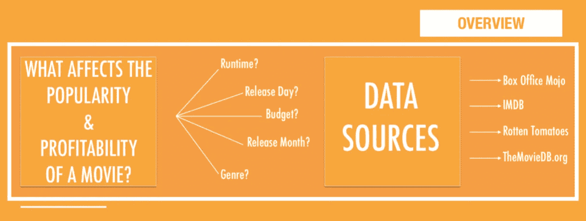
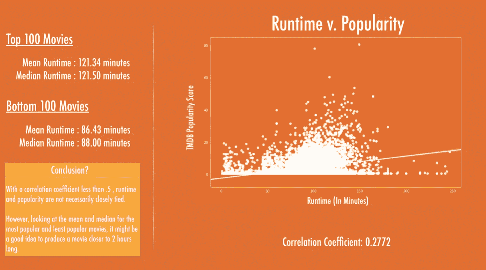
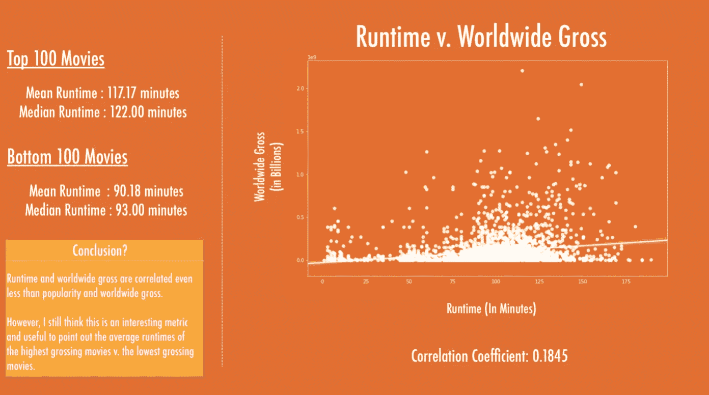
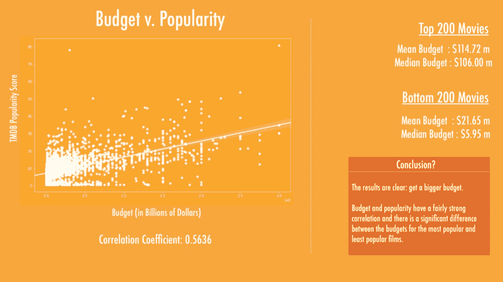
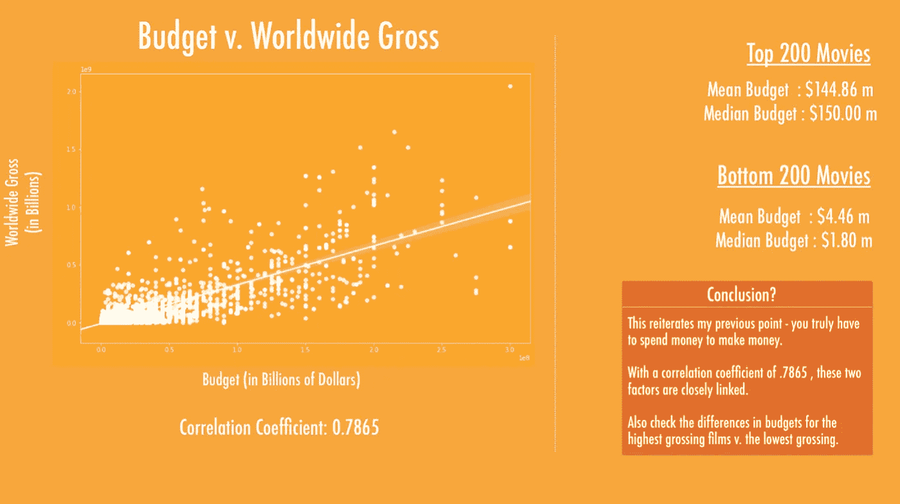
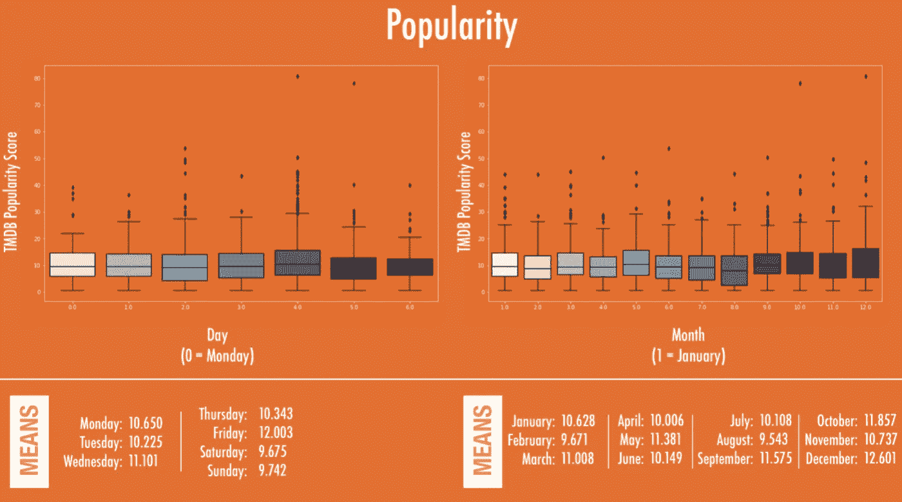
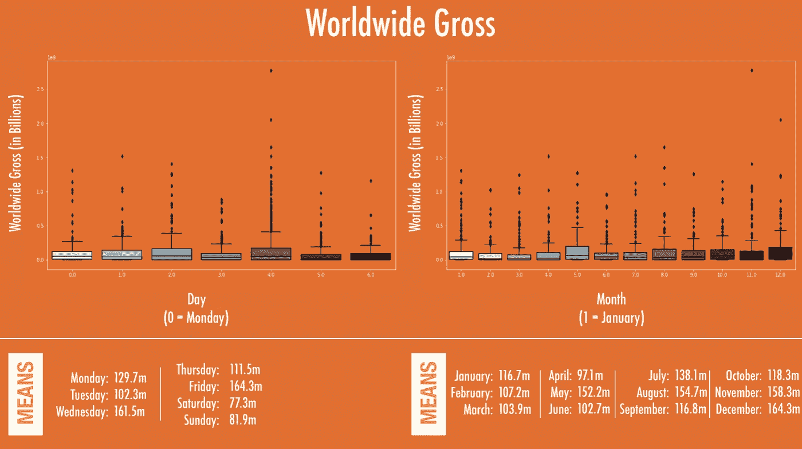
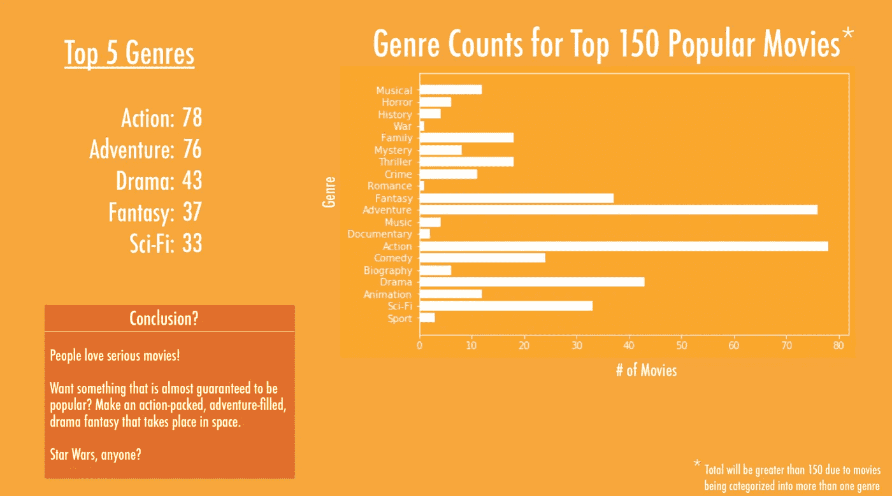
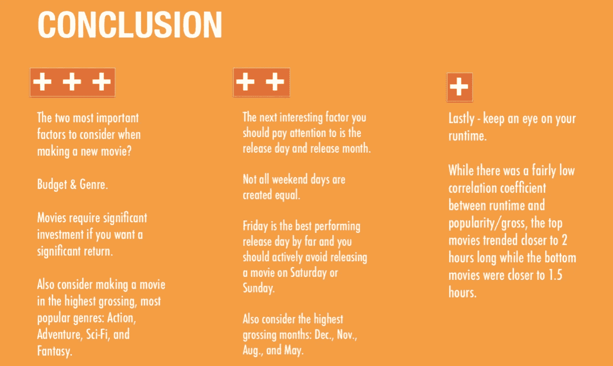

# PSA: EDA 很重要。

> 原文：<https://towardsdatascience.com/psa-eda-is-important-7d3ce6e3fc3c?source=collection_archive---------70----------------------->

## EDA 初学者指南

## 我的第一个数据科学项目的演练和 EDA 初学者指南。

这张照片的相关性很快就会变得清晰——继续读下去！(图片由作者提供)

这是我通过 Flatiron 的在线数据科学训练营完成我的第一个项目后学到的第一课。您可以获得许多有意义的见解，回答相关的业务问题，而无需构建单一的模型！当然，如果你正在建立一个模型，如果你花时间去了解你的数据，你将会建立一个更明智、更有效的模型。

这是我在 Flatiron 完成的第一个“项目”,但回想起来，这实际上只是整个生命周期中的“EDA”部分。啊，再次年轻。

没关系——我仍然从这个项目中学到了很多，并且在我继续更复杂的项目之前，它帮助我理解了一个重要的事实:

EDA 很重要。

# 项目概述

我们的任务是回答这样一个问题:“什么类型的电影票房最好？”

我最后一次演讲的幻灯片

# 数据

数据由 Flatiron 提供，主要来自四个来源(如上所示):

*   票房魔咒
*   IMDB
*   烂番茄
*   TheMovieDB.org

特征包括:`release_date`、`popularity`、`production_budget`、`domestic_gross`、`worldwide_gross`、`runtime`、`genre`以及与每部电影所涉及的演员/导演相关的其他特征。

请记住，这是本课程的第一个专题，因此不会建立模型。这是一个纯粹简单的 EDA，然后被打包成一个简洁的、面向业务的演示。

# 清理数据

也许我是少数不介意清理数据的人之一。我也不介意打扫我的公寓，所以也许这之间有联系…

我必须清理数据:

## 1️⃣

*   将`strings`转换为`datetime`对象，例如:

`df['release_date] = pd.to_datetime(df['release_date'])`

很简单。Pandas 有一个内置的方法来实现这一点，而`datetime`对象给了我们更多的选项来探索数据——这就引出了我的下一个观点…

## 2️⃣

*   基于`release_date`列创建一个`release_day`特征:

`df['release_day] = df['release_date].map(lambda x: x.weekday())`

好玩！将`release_date`转换成一个`datetime`对象允许我们调用它的`.weekday()`方法来给出电影上映的日期。

我还创建了一个`release_month`列用于以后的分析。

## 3️⃣

*   将所有数字转换成一个`integer`。令人惊讶的是，许多包含数字的列将它们存储为`strings`。不，谢谢你！

`df['domestic_gross'] = df['domestic_gross].str.replace('$','').str.replace(',','').astype('int')`

您可以看出这些数字实际上是以`$45,986,233`格式作为字符串存储的。在我将每个记录转换成一个`int`之前，我需要先移除`$`和`,`。

## 4️⃣

*   添加几个计算列。例如:

`df['worldwide_net'] = df['worldwide_gross'] — df['production_budget']`

这不一定是“清理”过程的一部分，但我喜欢在清理时添加我能想到的任何计算列，以便它们已经存在。

对于这个数据集来说，这就差不多了——没什么太复杂的。我也删除了一些我知道不会有帮助的功能，只是为了保持紧凑。

# 探索数据

我从这个项目中学到的一件重要事情是，你不能‘搞砸’数据探索。这是不可能的。

至少，这是我学到的重要一课。出于某种原因，当我第一次开始表演 EDA 时，我以为我会以某种方式做一些“错误”的事情。这是你应该尝试任何事情的时候！

如果你认为有值得探索的关系，那么你就自动对了。可能发生的最糟糕的事情是你找不到相关性，或者找到一种与你期望相反的关系。

但即使如此！那还是在告诉你一些你的数据！！

所以我不知道谁需要听这个，但是再一次为后面的人:

> 你不能搞砸数据探索。

好吧，现在我已经一吐为快了，让我告诉你我探索了什么。

## 1.R `untime`

我想看看`runtime`是否会影响电影的`popularity`或`worldwide_gross`。

这是我为`runtime`和`popularity`找到的

使用 Seaborn 创建的图表——这是我最后一次演示的幻灯片。

我发现`runtime`和`worldwide_gross`有些类似

使用 Seaborn 创建的图表——这是我最后一次演示的幻灯片。

虽然我们不一定会找到特别高的相关系数，但如果我们看看前 100 名和后 100 名电影的平均运行时间，我们可以看到电影在 120 分钟左右徘徊，而不是 90 分钟。

## 2.预算

我想看看更大的预算是否总是意味着更有利可图/更受欢迎的电影。让我们来看看。

`budget`和`popularity`

使用 Seaborn 创建的图表——这是我最后一次演示的幻灯片。

再次为`budget`和`worldwide_gross`

使用 Seaborn 创建的图表——这是我最后一次演示的幻灯片。

当谈到预算与运行时间时，我们肯定会看到更强的相关性。然而，数字很清楚——预算很重要！

## 3.发布的日期/月份

还记得我们如何将我们的`release_date`列转换成一个`datetime`对象，然后用它来计算`release_day`和`release_month`吗，即使它们没有被显式地给出？

现在是使用它的时候了！

让我们来看看一周中的某一天或者一年中的某一个月对一部电影的表现有什么影响。

`release_day` & `release_month`同`popularity`

使用 Seaborn 创建的图表——这是我最后一次演示的幻灯片。

`release_day` &同`release_month``worldwide_gross`

使用 Seaborn 创建的图表——这是我最后一次演示的幻灯片。

我肯定会期待周五和周六是电影发行的高峰期——不！

周五是`popularity`和`worldwide_gross`最好的一天，但是根据这个数据，周六和周日实际上是上映电影最差的两天。

12 月在这两个类别中也有相当大的领先优势。

又名——在 12 月的一个星期五发行一部电影！

## 4.类型

最受欢迎的流派有哪些？让我们看看！

我们先根据`popularity`来看。

使用 Seaborn 创建的图表——这是我最后一次演示的幻灯片。

而现在`worldwide_gross`。

使用 Seaborn 创建的图表——这是我最后一次演示的幻灯片。

酷！我们可以看到，动作片、冒险片在这两项指标上都名列前茅，科幻片和奇幻片也榜上有名。

喜剧在票房最高的电影中排名前五，戏剧在最受欢迎的电影中排名前五。

# 结论

总而言之:

这是我最后一次演讲的幻灯片。

这就是全部了！想出一些你想探索的想法，然后…探索它们。

有时你的假设会被证明是正确的，有时会被证明是错误的——没有一个比另一个更好。

**两个**都会告诉你一些关于你的数据的有用信息。

我希望这对某人有帮助！或者至少，让某人知道他们不是独自开始他们的数据科学之旅。

更多内容即将推出。