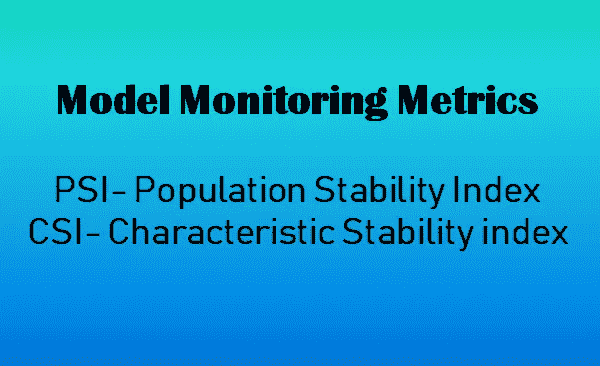
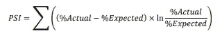
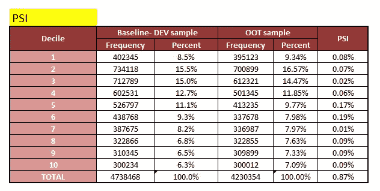
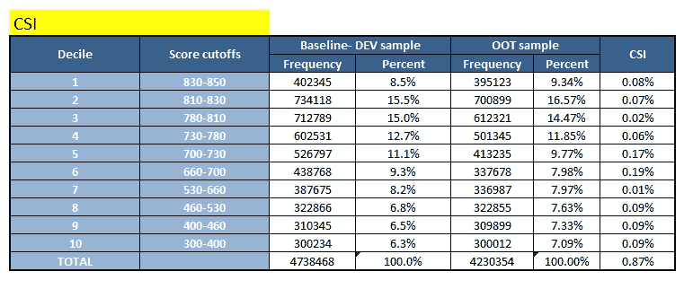

# PSI 和 CSI:前 2 个模型监控指标

> 原文：<https://towardsdatascience.com/psi-and-csi-top-2-model-monitoring-metrics-924a2540bed8?source=collection_archive---------2----------------------->

## 建模基础

## 种群稳定性指数和特征稳定性指数

作者图片

一旦一个模型被投入生产，需要定期的监控以确保这个模型仍然是相关的和可靠的。我写了一篇关于模型验证和模型监控以及这两个阶段的重要性的文章，你可以看看这篇文章的前传。

 [## 为什么模型验证如此重要，它与模型监控有什么不同

### 模型开发过程的支柱

towardsdatascience.com](/why-is-model-validation-so-darn-important-and-how-is-it-different-from-model-monitoring-61dc7565b0c) 

继续这篇文章的主题，我们将了解 PSI 和 CSI，即群体稳定性指数和特征稳定性指数，它们是在许多领域特别是信用风险领域使用的最重要的监控策略之一。

> PSI 和 CSI，这两个指标都关注**人口分布的变化。**

这两个监控指标基于这样一个前提，即当开发和验证/OOT(超时)样本在经济条件、基本假设、活动风格和关注点等方面没有显著差异时，预测模型效果最佳。

例如:如果我们建立一个预测模型来预测正常经济环境下信用卡客户的流失率，然后根据经济衰退时期的样本进行测试，该模型可能无法准确预测，因为不同收入阶层的人口分布可能发生了显著变化，这可能会导致实际流失率非常高，但该模型可能无法捕捉到它，从而预测出错误的结果。但是，正如我们现在理解的，如果我们继续检查 DEV 时间和当前时间之间的人口分布变化，我们可以得到一个公平的想法，如果模型结果是可靠的或不可靠的。这是通过 PSI 和 CSI 作为重要的监控指标来实现的。

# 人口稳定指数

> 这是一种度量标准，用来衡量一个变量在两个样本之间的分布随着时间推移发生了多大的变化。它被广泛用于监控人口特征的变化，以及诊断模型性能中可能存在的问题-很多时候，如果模型由于人口分布的重大变化而停止准确预测，这是一个很好的指示。

在这篇[研究论文](https://www.lexjansen.com/wuss/2017/47_Final_Paper_PDF.pdf)中，上述定义已经得到了非常恰当的解释。我也在这篇文章的末尾给出了一个参考链接。

最初，开发群体稳定性指数(PSI)是为了监控 OOT 和信贷风险记分卡分析中开发时间段样本之间的分布变化。PSI 的使用现在在本质上已经变得有些灵活，可以检查模型相关属性以及总体样本总体的分布变化，包括因变量和**自变量- CSI** ，我们将在下一节讨论这一点。

> PSI 倾向于总体人口转移，而 CSI 倾向于关注所使用的单个模型变量。

来源:[链接](https://www.lexjansen.com/wuss/2017/47_Final_Paper_PDF.pdf)

人口分布的变化可能是由于:

*   经济环境的变化，如经济衰退、新冠肺炎等
*   数据来源的变化
*   直接或间接影响人口分布的内部政策变化
*   数据集成中可能导致错误数据的问题
*   编程/编码时的问题，例如模型实现或缺少评分代码的一些关键步骤

由于分布变化不一定涉及因变量，PSI 也可用于检查任何样本之间的相似性/相异性，例如，在社会人口学研究中比较两个或多个人口的教育、收入和健康状况。

**计算 PSI 的步骤(参考:** [**链接)**](https://www.listendata.com/2015/05/population-stability-index.html)

1.  在评分样本中按降序对评分变量进行排序
2.  将数据分成 10 或 20 组(决定)
3.  根据评分样本计算每组中记录的百分比
4.  根据开发样本计算每个组中记录的百分比
5.  计算步骤 3 和步骤 4 之间的差异
6.  取(步骤 3 /步骤 4)的自然对数
7.  将步骤 5 和步骤 6 相乘

**PSI 的 EXCEL 制表:**

作者图片

**解释规则(参考:** [**链接)**](https://www.listendata.com/2015/05/population-stability-index.html)

1.  **PSI < 0.1** :无变化。您可以继续使用现有模型。
2.  **PSI > =0.1:** 但小于 0.2——需要轻微改变。
3.  **PSI > =0.2:** 需要重大改变。理想情况下，我们不应该再使用这种模式。应该重新校准/重新开发。

> 我们也可以使用条件格式范围，红色-琥珀色-绿色区域，红色是 PSI 超过 20%的警报状态，琥珀色是 10–20 %,模型应处于观察状态，绿色是模型被视为 fir 使用的阶段，即< 10%。

现在，根据用例，这些阈值根据业务相关性进行调整，但保持观察人口变化的想法是相同的。

# 特征稳定性指数

> 它回答了哪个变量导致了人口分布的变化。它将评分数据集中的**独立变量**的分布与发展数据集中的分布进行比较。它检测随时间推移提交评分的输入变量分布的变化。
> 
> **它有助于确定哪个变化的变量是导致模型得分变化的主要原因。**

当模型性能下降时，检查模型变量的分布变化有助于确定可能的原因。这是一个通常在检查了 PSI 并且它不在绿色区域之后采取的步骤(<0.1 in general) to check that the overall population distribution can be attributed majorly to which variables.

At least one variable that has changed significantly or if several variables have moved to some extent, it might be time to recalibrate or to rebuild the model.

CSI invariably has the same steps as PSI while calculating it. Just that the deciding is done on the dev sample values of a particular variable by binning it and setting those limits as hard cutoffs. Then, while calculating the frequency values for any validation/OOT sample, apply those same cutoffs to the data and calculate the frequency values and apply the same formula as we did while calculating PSI.

**CSI 的 EXCEL 表格:**

作者图片

因此，PSI 可以帮助我们确定总体人口分布与 DEV 样本的比较，如果它显示出显著的变化，那么 CSI 可以帮助我们进一步将其缩小到导致波动的几个变量。

**参考文献:**

 [## 人口稳定性指数及特征分析

### 本教程描述了人口稳定性指数和特征分析的含义和用途。简单来说…

www.listendata.com](https://www.listendata.com/2015/05/population-stability-index.html) 

https://www.lexjansen.com/wuss/2017/47_Final_Paper_PDF.pdf

如果你想知道更多关于等级排序的信息，这是信用风险建模中的一个基本概念，请查看下面的帖子:

[https://juhiramzai . medium . com/why-rank-ordering-is-so-important-BC 1 ff 8a 48764](/psi-and-csi-top-2-model-monitoring-metrics-924a2540bed8)

*观看此空间，了解更多关于数据科学、机器学习和统计学的信息！*

*快乐学习，快乐成长！*