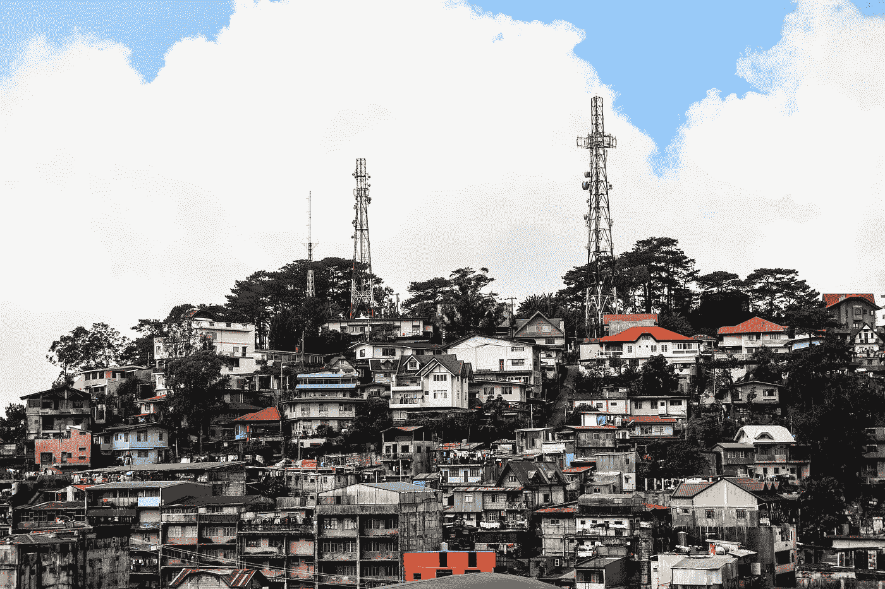
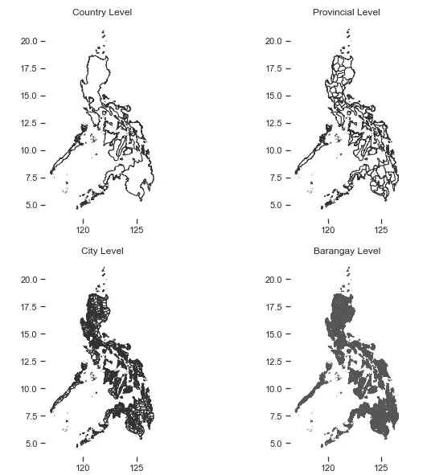
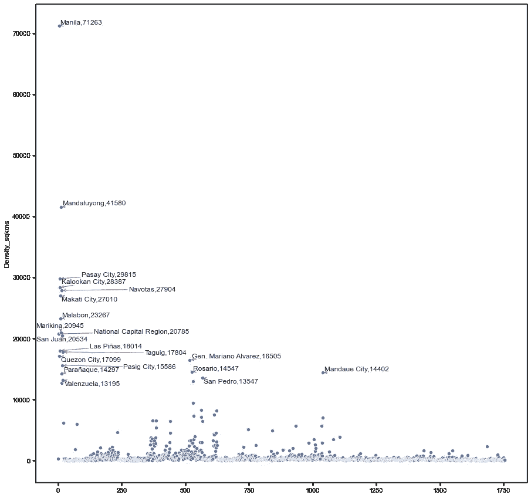
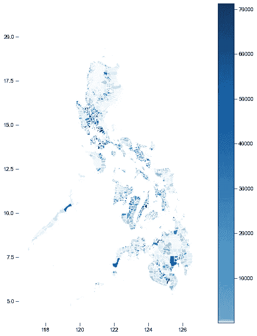
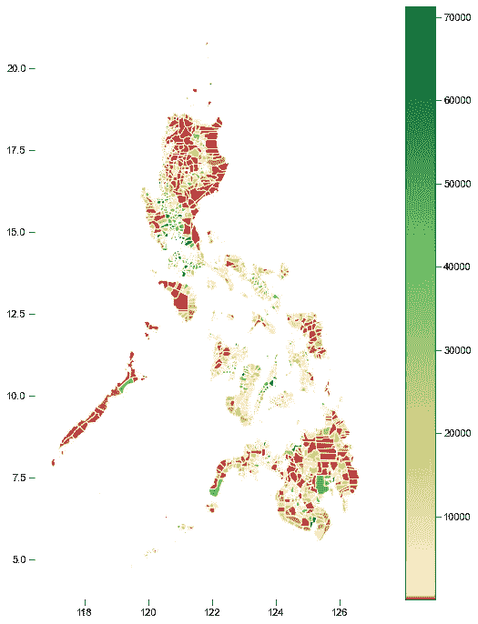

# 使用 GeoPandas 可视化菲律宾的人口密度

> 原文：<https://towardsdatascience.com/psvisualizing-the-philippines-population-density-using-geopandas-ab8190f52ed1?source=collection_archive---------35----------------------->

## 地理可视化/菲律宾。

## 使用 GeoPandas 可视化 2015 年菲律宾人口密度



塞巴斯蒂安·赫尔曼在 [Unsplash](https://unsplash.com?utm_source=medium&utm_medium=referral) 上的照片

人口密度是城市规划中的一个重要概念。关于它如何影响经济增长的理论存在分歧。一些人，如 Rappaport 所说，认为经济是一种形式的**【空间均衡】** : *即居民和就业的净流动逐渐趋于彼此平衡。*

密度与经济增长有某种关系的想法早已被多项研究所证实。但同样的理论是否适用于菲律宾以及先于什么的事物(密度跟随城市发展或城市发展跟随密度)是一个经典的数据科学问题。

然而，在我们测试任何模型之前，让我们做一个有趣的练习并可视化我们的数据集。

**2015 年菲律宾人口数据集**

菲律宾统计局每五年公布一次人口数据。在撰写本文时，仅发布了 2015 年的数据集，因此我们将使用该数据集。

**导入包**

```
import pandas as pd
import matplotlib.pyplot as plt
import matplotlib.colors as colors #to customize our colormap for legendimport numpy as np
import seaborn as sns; sns.set(style="ticks", color_codes=True)import geopandas as gpd
import descartes #important for integrating Shapely Geometry with the Matplotlib Library
import mapclassify #You will need this to implement a Choropleth
import geoplot #You will need this to implement a Choropleth%matplotlib inline
```

我们将使用的许多软件包都需要安装。对于那些安装 GeoPandas 有困难的人，请查看我关于这个的[文章。*请注意，geoplot 需要 cartopy 包，并且可以作为我文章中讨论的任何依赖项进行安装。*](https://medium.com/@francisadrianviernes/geopandas-installation-the-easy-way-for-windows-31a666b3610f)

**加载 shape file**

需要 Shapefiles 来创建地理或政治边界的“形状”。

下载 shapefile 并使用 GeoPandas 加载它。

> **解压 zip 包时需要注意的一点是:所有内容都应该放在一个文件夹中，即使您只是简单地使用。shp”文件，否则它将无法工作。(这意味着”。cpg“，”。dbf“，”。prj”等应与您的“在同一位置”。shp "文件。**

你可以在 gadm.org 下载菲律宾的 shape file([https://gadm.org/](https://gadm.org/))。

> 注意:你同样可以从菲尔吉斯([http://philgis.org/](http://philgis.org/))下载形状文件。菲律宾的数据可能会更好，虽然其中一些来自 GADM，但还是用 GADM 吧，因为我在这方面更有经验。

```
#The level of adminsitrative boundaries are given by 0 to 3; the details and boundaries get more detailed as the level increasecountry = gpd.GeoDataFrame.from_file("Shapefiles/gadm36_PHL_shp/gadm36_PHL_0.shp")
provinces = gpd.GeoDataFrame.from_file("Shapefiles/gadm36_PHL_shp/gadm36_PHL_1.shp")
cities = gpd.GeoDataFrame.from_file("Shapefiles/gadm36_PHL_shp/gadm36_PHL_2.shp")
barangay = gpd.GeoDataFrame.from_file("Shapefiles/gadm36_PHL_shp/gadm36_PHL_3.shp")
```

此时，您可以查看 shapefiles 并检查边界。您可以通过绘制形状文件来实现这一点。

```
#the GeoDataFrame of pandas has built-in plot which we can use to view the shapefilefig, axes = plt.subplots(2,2, figsize=(10,10));#Color here refers to the fill-color of the graph while 
#edgecolor refers to the line colors (you can use words, hex values but not rgb and rgba)country.plot(ax=axes[0][0], color='white', edgecolor = '#2e3131');
provinces.plot(ax=axes[0][1], color='white', edgecolor = '#2e3131');
cities.plot(ax=axes[1][0], color='white', edgecolor = '#2e3131');
barangay.plot(ax=axes[1][1], color='white', edgecolor = '#555555');#Adm means administrative boundaries level - others refer to this as "political boundaries"
adm_lvl = ["Country Level", "Provincial Level", "City Level", "Barangay Level"]
i = 0
for ax in axes:
    for axx in ax:        
        axx.set_title(adm_lvl[i])
        i = i+1
        axx.spines['top'].set_visible(False)
        axx.spines['right'].set_visible(False)
        axx.spines['bottom'].set_visible(False)
        axx.spines['left'].set_visible(False)
```



较暗的填充意味着更多的边界

**加载人口密度数据**

每平方公里的人口数据和密度通常由菲律宾统计局(PSA)收集。

你可以通过其他人口统计或宏观经济数据来做到这一点，因为菲律宾一直在提供这些数据。(好样的菲律宾！)

因为我们想增加挑战，所以让我们从最详细的开始:城市和自治市级别。

我们首先加载数据并检查它:

```
df = pd.read_excel(r'data\2015 Population Density.xlsx',
                  header=1,
                  skipfooter=25,
                   usecols='A,B,D,E',
                  names=["City", 'Population', "landArea_sqkms", "Density_sqkms"])
```

**清理数据**

在我们继续之前，我们必须清理我们的数据。我们应该:

*   删除值为空的行
*   删除名称后的非字母字符(*表示脚注)
*   删除每个城市名称后的“(首都)”和“不包括”字样
*   删除前导和尾随空格
*   还有更多…

在将数据与 shapefiles 合并时，清理确实会占用大量工作。

菲律宾就是如此，该国的一些城市以彼此相似的名字命名。(如圣依西多禄、圣胡安、圣佩德罗等)。

让我们跳过文章中的这一部分，但是对于那些想知道我是如何做到的人，请访问[我的 Github 库](https://github.com/francisadrianviernes/GeoVisualization)。该代码将适用于自治市/城市级别的任何 PSA 数据。

**探索性数据分析**

我最喜欢的实现 EDA 的方法之一是通过散点图。我们这么做只是为了以图表形式看看哪些城市密度高。

Matplotlib 是可行的，但我喜欢 seaborn plots 的风格，所以我更喜欢经常使用它。

```
#First sort the dataframe according to Density from highest to lowest
sorted_df = df.sort_values("Density_sqkms", ascending=False,ignore_index=True )[:50]fig, ax = plt.subplots(figsize=(10,15));
scatter = sns.scatterplot(x=df.index, y=df.Density_sqkms)#Labeling the top 20 data (limiting so it won't get too cluttered)
#First sort the dataframe according to Density from highest to lowest
sorted_df = df.sort_values("Density_sqkms", ascending=False)[:20]#Since text annotations,overlap for something like this, let's import a library that adjusts this automatically 
from adjustText import adjust_texttexts = [ax.text(p[0], p[1],"{},{}".format(sorted_df.City.loc[p[0]], round(p[1])),
          size='large') for p in zip(sorted_df.index, sorted_df.Density_sqkms)];adjust_text(texts, arrowprops=dict(arrowstyle="->", color='r', lw=1), precision=0.01)
```



菲律宾城市和自治市密度散点图。你可以直观地看到有些城市在密度上是异常值。注意，我使用了库 adjust_texts 来确保标签清晰易读。

从这张图表中，我们已经可以看出哪些城市高于“首都地区”的平均水平，即*曼达卢永*、*帕赛*、*卡洛坎*、*纳沃塔斯*、*马卡蒂*、*马拉邦*、*马里基纳*。

同样在前 20 名中，我们可以看到这些城市大多位于“国家首都地区”和附近的省份，如拉古纳。还要注意马尼拉市对于这个数据集来说是一个异常值。

**地质公园可视化**

根据瓦尔多 T26 托布勒 T27 的说法，地理第一定律 T25 是“一切事物都与其他事物相关，但近的事物比远的事物更相关。”

这就是为什么在房地产中，检查和想象邻近性如何影响价值是很重要的。最终，地理可视化是我们可以做到这一点的方法之一。

我们已经可以使用 GeoPandas 的内置绘图方法来可视化我们的数据。

```
k = 1600 #I find that the more colors, the smoother the viz becomes as data points are spread across gradients
cmap = 'Blues'
figsize=(12,12)
scheme= 'Quantiles'ax = merged_df.plot(column='Density_sqkms', cmap=cmap, figsize=figsize,
                          scheme=scheme, k=k, legend=False)ax.spines['top'].set_visible(False)
ax.spines['right'].set_visible(False)
ax.spines['bottom'].set_visible(False)
ax.spines['left'].set_visible(False)#Adding Colorbar for legibility
# normalize color
vmin, vmax, vcenter = merged_df.Density_sqkms.min(), merged_df.Density_sqkms.max(), merged_df.Density_sqkms.mean()
divnorm = colors.TwoSlopeNorm (vmin=vmin, vcenter=vcenter, vmax=vmax)# create a normalized colorbar
cbar = plt.cm.ScalarMappable(norm=divnorm, cmap=cmap)
fig.colorbar(cbar, ax=ax)
# plt.show()
```



使用 GeoPandas 的内置绘图方法进行可视化

一些分析师更喜欢单调的颜色图，如蓝色或绿色，但当数据高度倾斜(有许多异常值)时，我发现使用发散的颜色图更好。



发散的色彩映射表以可视化数据分散

使用发散色图，我们可以可视化密度值的分散。即使查看颜色条图例也可以看出菲律宾的密度值包含了偏高的异常值。

**使用 Geoplot 绘图**

除了 GeoPandas 的内置绘图功能之外，您还可以使用 geoplot 进行绘图。

```
k = 1600
cmap = 'Greens'
figsize=(12,12)
scheme= 'Quantiles'geoplot.choropleth(
    merged_df, hue=merged_df.Density_sqkms, scheme=scheme,
    cmap=cmap, figsize=figsize
)
```

在下一个系列中，让我们尝试更互动地绘制这一点，或者使用一些机器学习算法来提取更多见解。

完整代码，请查看[我的 Github 库](https://github.com/francisadrianviernes/GeoVisualization)。

对自治市和城市级别的数据进行预处理的代码也适用于其他 PSA 报告的统计数据。

让我知道你想让我们在未来尝试和可视化什么数据集。