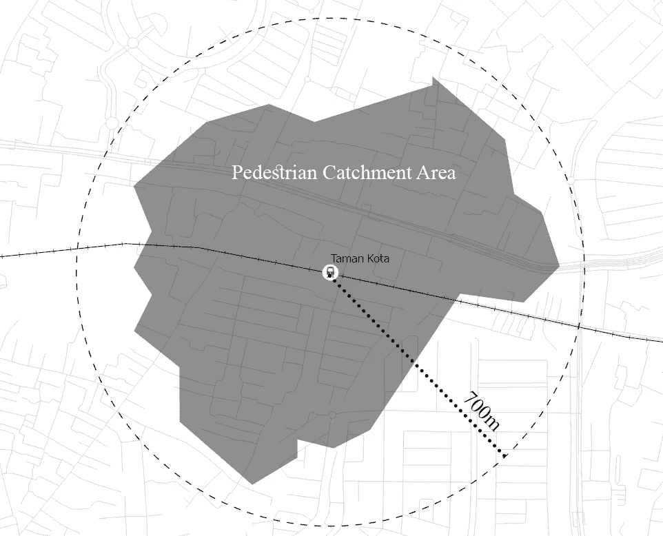
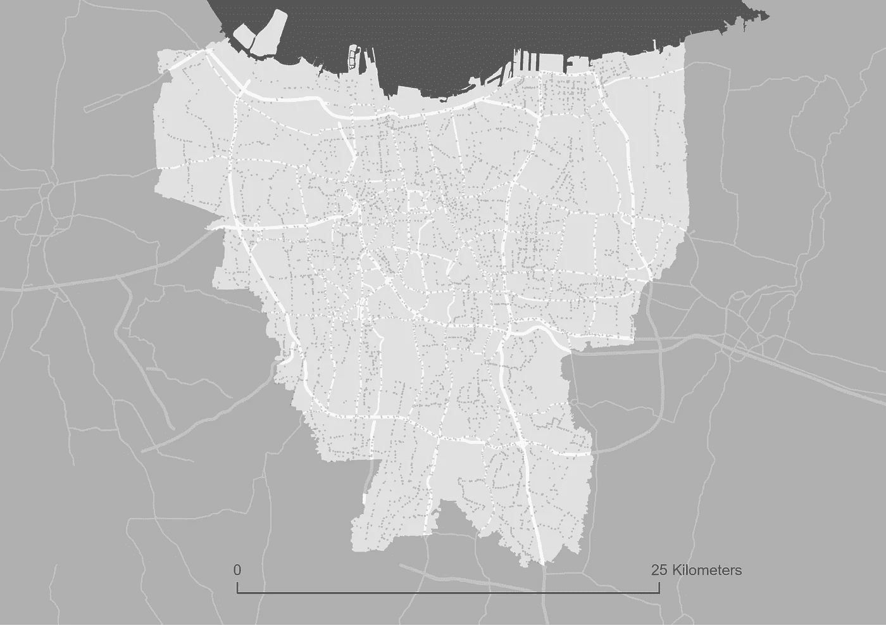
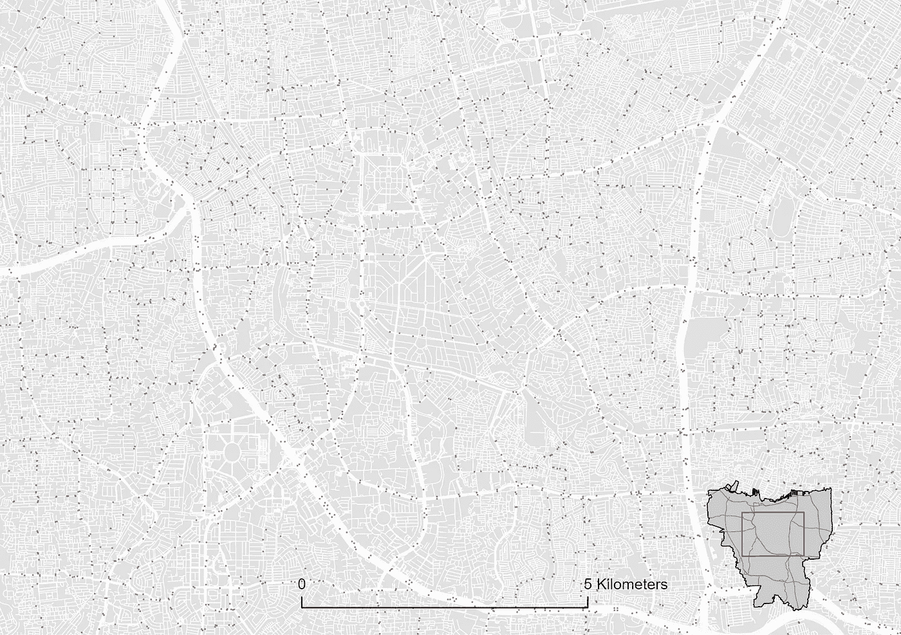
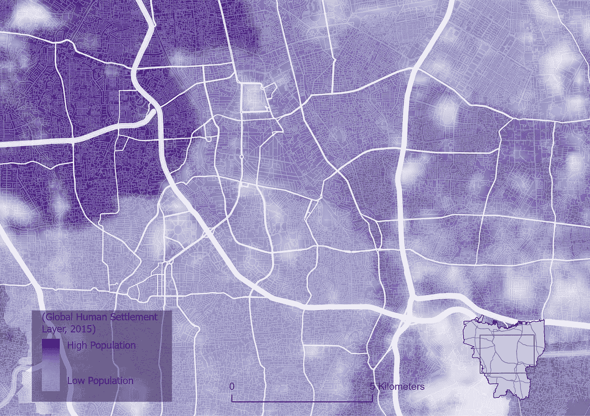
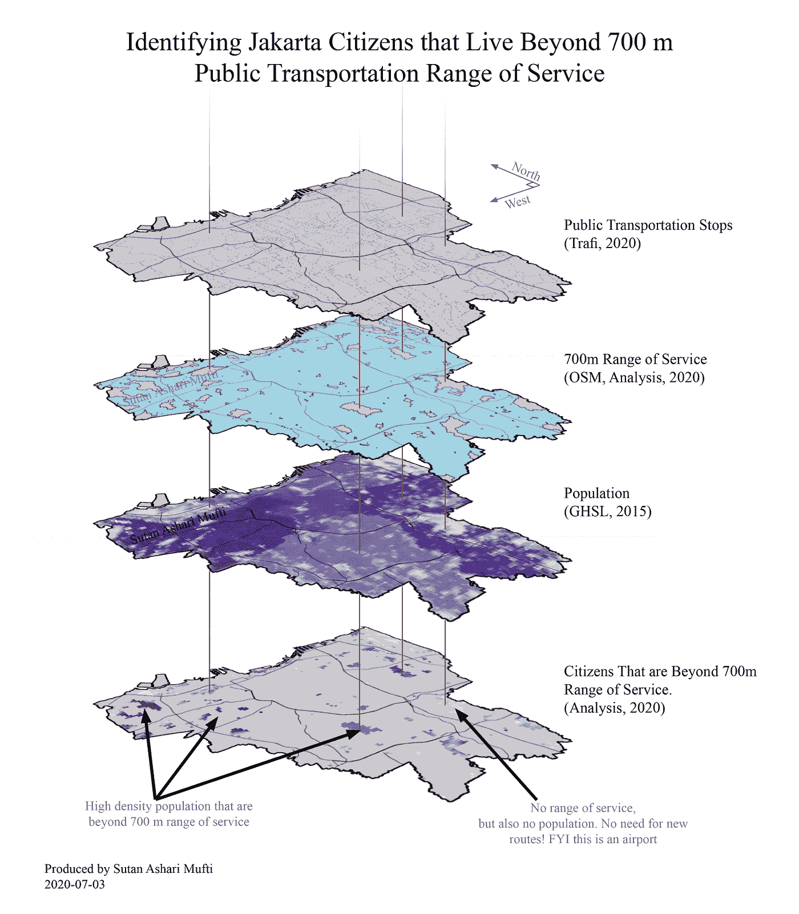

# 公共交通服务范围:识别印度尼西亚雅加达的无服务市民

> 原文：<https://towardsdatascience.com/public-transportation-range-of-service-identifying-the-unserved-citizens-in-jakarta-city-eaf8f3446fce?source=collection_archive---------36----------------------->

## 现实世界中的 DS

## 由于耐力有限，人们只能走一段时间或一段距离。为了促进公共交通的使用，公共交通服务的可及性应该在这个距离之内。使用地理信息系统，我们能够识别哪些区域不在步行距离内，并推断出未得到服务的市民。

> 概要:雅加达市是世界上最拥挤的城市之一。必须首先扩大对居民的服务覆盖面，以促进公共交通的使用。基于标准步行距离，该覆盖距离应该在 700 米以内，因为人类行走的耐力有限。所以，
> 
> 雅加达 700 米的公共交通服务范围是否覆盖了所有居民？
> 
> **答案是否定的。大约有**(近似值) **827.594** (一千万人中的**市民** **居住在现有公共交通步行距离之外。**64，752 公顷土地中的 9160.16 公顷(约 14%)不在服务范围内。为了减少数量，需要规划新的路线并产生一个空间规划，该空间规划或者包含该路线，或者被新路线包含。

# 介绍

如果我们谈论拥堵问题，雅加达是最糟糕的城市之一；它徘徊在世界十大拥堵城市中。由于拥堵而损失的时间可能在早上超过 19 分钟，在晚上超过 26 分钟。以至于每年每个雅加达市民有 7 天 6 个小时是花在交通拥堵上( [Tomtom，2019](https://www.tomtom.com/en_gb/traffic-index/jakarta-traffic/) )。此外，拥堵导致空气污染激增，也就是说，不用说，慢慢地毒害着市民。尽管许多机构进行了各种衡量标准和排名，但这并没有减少问题的紧迫性，这个问题仍然需要解决。

当然，必须采取措施来减少这种使用:将私人汽车消费转向公共交通。这可以通过降低公共交通的成本来实现，我说的成本不是指货币价值。成本的组成部分可以由经验、舒适性、感觉、便利性、票价和许多影响人们使用公共交通决策的因素组成(尽管使用一些统计方法的计算可能会将这些变量转换为货币单位)。我认为，人们使用公共交通的最根本变量是交通服务的范围；一个人乘坐公共交通工具应该步行的距离。

*(想象一下:即使有最好的火车或公共汽车，美丽的人行步道；你不会仅仅为了使用这项服务而步行 10 公里吧？)*

嗯，10 公里只是夸张。重点是，步行距离要短。这种说法有许多理由，但它将深入一些学术论文，将涉及大量的统计数据，我不希望这篇文章变得沉重。所以，让我们保持轻松(如果你想寻找论据，见[这个](https://www.sciencedirect.com/science/article/pii/S0967070X11000631)，和[这个](https://ppms.trec.pdx.edu/media/project_files/schlossberg_GIS_audits_1.pdf))。注意，我没有忽略其他导致变量。我的论点是，在我们实现其他变量之前，服务的范围应该是优先的。

在步行能力有限的情况下，服务范围必须在步行距离内:即 700 米。该数字由雅加达省法规设定，作为指定公交导向开发(TOD)区域的标准。超过这个数字，预计人们会使用其他交通工具**因为走路太累了！因此，我们必须确保雅加达的每个公民都在这 7 亿人口的范围内。**

**该范围是二维的，并产生一个区域，该区域定义了服务的运输范围。** [在我的另一篇文章](https://medium.com/swlh/assessing-railway-stations-in-jakarta-based-on-neighbourhood-built-environment-f44f7d89c8bc)中，我使用了其他命名法:行人汇水区(PCA)，但本质上是一样的。

行人聚集区(PCA)，一个人行走的最大距离。PCA 确定服务的经验范围(作者的分析，2020 年)

# **目标**

**本文旨在确定不在 700 米交通服务范围内的市民数量**。为此，使用了一些地理数据:

*   每个公共交通站的位置(交通设施)
*   道路几何；
*   人口分布

一些分析使用 700 米的距离作为圆形半径，但根据经验，人们不会飞。人走着转着；道路有交叉路口和弯道，所以这 700 m 的步行距离肯定在 700 m 半径内。

# 数据

本节解释输入数据:交通设施、道路几何和人口分布。

## 数据#1:交通设施

雅加达有许多运输供应商，包括私营和国有企业。虽然目前公布的交通服务清单可以在[官方开放数据网站](https://data.jakarta.go.id/dataset/daftartrayekangkutanumum/resource/8532ecf6-733d-4238-91e9-75d1e097f561)中找到，但 Trafi 已经收集并提供了全面的[数据收集](https://web.trafi.com/id/jakarta)，我必须承认这一点。圆点是设施的停靠点；在那里，你可以登上汽车或公共汽车。

所有雅加达的交通站有昂科特站、米克洛莱站、杰克林科站、雅加达站、火车站等等( [Trafi，2020](http://web.trafi.com/id/jakarta) )。从 [OpenStreetMap](https://www.openstreetmap.org/) 中收集道路几何图形

## **数据#2:道路几何形状**

从 [OpenStreetMap](https://www.openstreetmap.org/) (OSM)中检索道路几何图形。注意地图上的点。**圆点是从 Trafi 中检索到的公共交通站点。**道路几何包括所有道路等级(高速公路、一级公路、二级公路、住宅区、人行道等)。).放大可以看到雅加达道路设计的复杂程度。

道路几何和公共交通站(来源:[开放街道地图](http://openstreetmap.org)和[交通](http://web.trafi.com/id/jakarta)，2020)

## 数据#3:人口分布

我无意中发现了我的学长的文章，该文章讨论了印度尼西亚的城市化程度(就建筑区域和密度而言)和区域城市系统。其中一个论点是，为了定义和分析大都市区域，我们需要网格中的人口数据。我完全同意，幸运的是，这篇文章提到的全球人类居住层(T21)提供了这样的数据。

栅格数据的连续性为分析提供了灵活性。它忽略了聚集到行政边界的地理数据的离散性质(例如可以通过 [choropleth 地图](https://en.wikipedia.org/wiki/Choropleth_map#:~:text=A%20choropleth%20map%20(from%20Greek,density%20or%20per%2Dcapita%20income.)可视化的数据)。作为数据分析师，这种连续不断的数据，迸发出喜悦的火花！本文的分析需要连续的数据，而不是[离散的序数数据](https://learn.g2.com/discrete-vs-continuous-data)。

GHSL，通过双线性插值显示的人口密度(GHSL，2015 年)。实际数据是像元大小为 250x250m 的栅格。

# 分析

对于每个交通设施站点，我将行人集水区(PCA)确定为服务范围(PCA 和服务范围可以互换),并排除了已经被行人集水区覆盖的区域。这导致了行人聚集区**没有覆盖的区域，但是一些区域是 PCA 没有覆盖的，例如机场、空地、湖泊。**

因此，我通过将人口数据与没有交通设施的区域(超过 700 米的区域)叠加来提取。这就是为什么需要连续的人口数据，因为提取离散的地理数据(例如从行政边界进行空间提取)没有意义！

我想如果读者只看下面的图会更容易。

分析，未获得服务的市民的空间分布(作者的分析，2020 年)

# 结论

分析结果是一个栅格，其中包含当前公共交通服务范围之外的市民的值。正如目标所述，本文试图确定未得到服务的公民人数。

合计所有小区的值，**大约有 827，594 个市民没有得到服务。**请注意，我使用“大约”,这是因为人口数据的规模太小，需要根据当地情况进行重新评估。

此外，64，752 公顷土地中有 9，160.16 公顷(约 14%)没有这项服务。然而，这 14%中的一部分不应该被覆盖或者不需要被覆盖。这些部分是无人居住的区域:湖泊、机场、空地等。因此，总有一些地区没有交通服务。

…

# 一些评论和建议

本节阐述了建议以及整合交通规划和城市/空间规划的重要性。

## 交通城市规划与城市设计一体化

交通与城市规划/设计密不可分。[土地利用影响交通，交通影响土地利用。](https://transportgeography.org/?page_id=4882)由于这些相互作用，交通规划必须与城市空间规划相结合；交通规划不能孤立存在，因为交通是由周围的建筑环境定义和编制的。

与直觉相反，我们可以说，为了改善我们的交通，我们可以干预我们的城市环境，而不干预交通本身。举个例子，

*   修建更好更宽的人行道减少了私人车辆的需求，导致公共交通需求增加；
*   建设新的行人网络改善了行人聚集区，使车站服务于更多的居民，增加了车站的交通量；
*   混合土地使用提供了附近的服务，减少了前往城市的另一部分的需求。
*   减小城市街区的大小缩短了步行距离

## 建议

将它放入上下文中；**对于目前居住在 700 米交通服务范围之外的雅加达市民，我们应该怎么做**？

显然，**计划新的路线**为没有得到服务的居民服务。但是！确保路线周围的**步行网络包含新路线**，提供直达服务或更短距离的线路。这可以通过为一些优先地区制定新的城市设计计划来实现。

另一个相当激进的想法是重组建筑体量，以产生更高的渗透性。整合土地和重新组织空间，将没有得到服务的市民转移到附近已经得到服务的社区。感觉这个可能性比较小，但是哎！[日本人就是这么干的！](http://documents1.worldbank.org/curated/en/481571569562840686/pdf/Land-Readjustment-in-Japan-Case-Study.pdf)

## 该机构

为了实现该建议，运输机构(规划路线)、规划机构(规划空间规划)或任何其他实体必须合作。

至少以我的经验来看，(我也希望并需要了解更多这方面的知识)我们印尼机构实体(政府或非政府)的现实是，这些实体有时是独立运行的。例如，开发商正在开发他们自己私人获得的土地，旅行社正在规划他们自己的路线；同时需要协同这些独立的活动。如果土地开发商也是运输服务商岂不是很厉害？嘿！[日本人就是这么干的！](http://www.ejrcf.or.jp/jrtr/jrtr10/pdf/f02_sai.pdf)(我从日本人身上学到了很多！)

我并不是说这种努力不存在(我的意思是，这就是我们政府的目的)。我的信息是作为一个城市规划专业的毕业生，我认为我们必须意识到这种现象；交通和空间规划是相互依赖的。