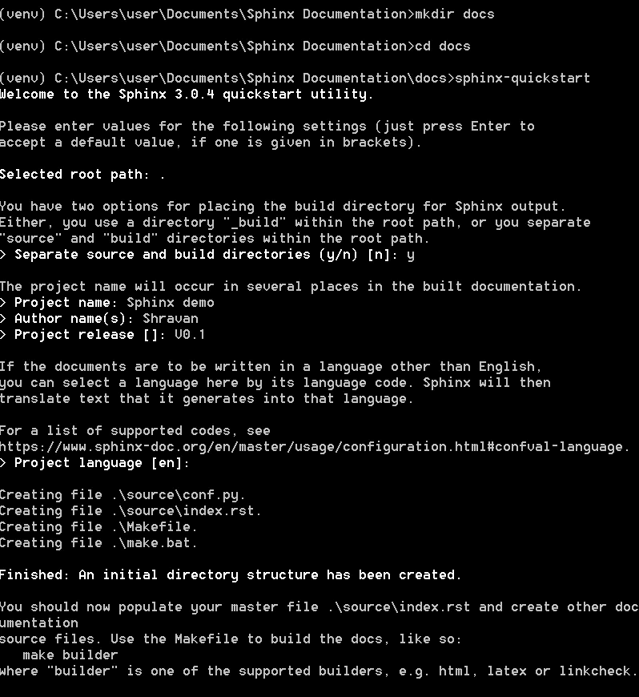

# 使用 Sphinx 在 Confluence/HTML 上发布 Python 项目文档

> 原文：<https://towardsdatascience.com/publish-python-project-documentation-on-confluence-html-using-sphinx-fad3a98b8eeb?source=collection_archive---------18----------------------->


代码文档在每个项目中都是必不可少的。代码文档可以分成多个部分。第一个是**注释块，**对程序员最有帮助；这些可以在每个解释类、方法、参数、可能的错误的文件中找到。然后是**档案文件**。这些通常是通过一个脚本生成的，该脚本将解析一个文件，并基于文档字符串中的描述，创建一个显式的 PDF。事后，应该有关于**代码库的位置的信息；此外，应该有如何运行项目的详细说明。**

在本文中，我们将研究由 [Sphinx](https://www.sphinx-doc.org/en/master/#) 生成的文件文档。这个文档生成器可以用来创建。pdf，。或者将技术文档页面发布到一个 [Confluence](https://www.atlassian.com/software/confluence) 实例。

## 为什么选择技术文档的融合？

[Confluence](https://www.atlassian.com/software/confluence) 是一个在一个地方创建、协作和组织所有工作的好地方。

1.  可在公司范围内使用
2.  允许你吸引同事和读者
3.  基于网络，无需下载任何软件
4.  敏捷环境的理想选择

创建一个 confluence 帐户，并创建一个存储文档的空间

## Sphinx 入门

Sphinx 是一个工具，它使得为 Python 项目创建智能和漂亮的文档(或由多个 reStructuredText 源组成的其他文档)变得容易，由 Georg Brandl 编写。它最初是为新的 Python 文档而创建的，并为 Python 项目文档提供了出色的工具，但也支持 C/C++，并且计划开发更多的语言。

Sphinx 使用 reStructuredText 作为其标记语言，它的许多优势来自于 reStructuredText 及其解析和翻译套件 Docutils 的强大和直接。

创建文档所涉及的步骤；

[GitHub 代码](https://github.com/Shravankumarhiregoudar/sphinxDocumentation)

1.  转到 python 项目的根目录。在小项目的情况下，转到包含所有。py 文件
2.  创建一个 Python 3 虚拟环境。在我的例子中， *venv* 是虚拟环境的名称

*打开 cmdshift +右键，在此打开命令窗口*

```
virtualenv -p python3 venv
```

3.激活虚拟环境。

```
cd venv/Scripts
activate.bat
```


确保您在整个项目过程中都处于虚拟环境中

4.安装所有项目需求

```
pip install -r requirements.txtORpip install Sphinx
pip install rinohtype# The recommended method of installation is using [pip](https://pip.pypa.io/) for confluencepip install sphinxcontrib-confluencebuilder
```

Sphinx 和 Rinohtype 已经在 requirements.txt 文件中。

5.创建一个 docs 目录并将 **cd** 放入该目录。这是所有文档文件将出现的地方。

```
mkdir docs
cd docs
```

6.设置 Sphinx

```
sphinx-quickstart
```



初始配置

> [用于 Sphinx](https://sphinx-rtd-tutorial.readthedocs.io/en/latest/docstrings.html) 文档的 Docstring 格式；


文档字符串格式

7.开源/conf.py

*   配置根目录的路径


取消第 15–17 行的注释，并粘贴以下代码

```
import os
import sys
sys.path.insert(0, os.path.abspath('../..'))
```

路径应该指向项目的根目录，查看项目结构，从 conf.py 我们应该通过向上两个父目录到达根目录。


主目录

*   在 conf.py 中添加这些扩展名

```
extensions = [
    'sphinx.ext.autodoc',
    'sphinx.ext.intersphinx',
    'sphinx.ext.ifconfig',
    'sphinx.ext.viewcode',
    'sphinx.ext.githubpages',
    'sphinxcontrib.confluencebuilder'
]# 'sphinxcontrib.confluencebuilder' is for confluence
```

*   在 conf.py 中添加 latex 元素

```
latex_elements = {
# The paper size ('letterpaper' or 'a4paper').
    'papersize': 'letterpaper',# The font size ('10pt', '11pt' or '12pt').
    'pointsize': '10pt',# Additional stuff for the LaTeX preamble.
    'preamble': '',# Latex figure (float) alignment
    'figure_align': 'htbp',
}
```

*   在配置文件中包含一系列与发布相关的设置:(*可选，仅当您希望在 confluence 中发布时)

```
confluence_publish = True
confluence_space_name = 'TEST'
*# (for confluence cloud)*
confluence_server_url = 'https://example.atlassian.net/wiki/'
confluence_server_user = 'myawesomeuser@example.com'
confluence_server_pass = '[myapikey](https://confluence.atlassian.com/cloud/api-tokens-938839638.html)'
*# (or for confluence server)*
confluence_server_url = 'https://intranet-wiki.example.com/'
confluence_server_user = 'myawesomeuser'
confluence_server_pass = 'mypassword'
```

例如:

```
confluence_publish = True
confluence_space_name = 'SPEC'
*# (for confluence cloud)* confluence_server_url = '[https://spectrra.atlassian.net/wiki/'](https://spectrra.atlassian.net/wiki/')
confluence_server_user = '[email@gmail.com](mailto:shravan@osiopt.com)'
confluence_server_pass = '[jhfgjsdfjhasdjfg](https://confluence.atlassian.com/cloud/api-tokens-938839638.html)'
```

*如何为你的项目获取 confluence _ server _ pass:*[*获取 API Key*](https://confluence.atlassian.com/cloud/api-tokens-938839638.html)

*详细安装:* [*斯芬克斯*](http://Atlassian Confluence Builder for Sphinx) 的亚特兰蒂斯合流建造者

8.打开 index.rst，将内容更改为以下内容。(点击 index.rst 链接查看完整内容)

```
Documentation for the Code
**************************
.. **toctree::
   :maxdepth:** 2
   **:caption:** Contents:codename1
===================
.. **automodule::** codename1
   **:members:**codename2
=====================
.. **automodule::** codename2
   **:members:****# In case of many modules;**main
===================
.. **automodule::** app
   **:members:**controller
=====================
.. **automodule::** main.controller
   **:members:**models
=================
.. **automodule::** main.models
   **:members:**
```

9.创建文档文件。

在 docs 目录中键入命令

*   创建 HTML

```
make html
```

如果您的 Python 版本≥3.7.0，构建 pdf 文件将会失败( [Github 问题参考](https://github.com/brechtm/rinohtype/issues/133))

HTML 页面的快照；


文档的快照；index.html


文档的快照；index.html

***这会在 docs/build/HTML/index . HTML***中产生 HTML 文件

*   在汇合处发布

```
make confluence
```

*注意:如果合流失败，在合流前运行 make clean。*

> IMP:您可以将 confluence 页面导出为 PDF 格式


从 Confluence 页面导出到 PDF

合流页面的快照；


汇合页面的快照

一旦一切就绪；如果您对代码的文档进行了任何更改，请打开 cmd 并运行以下命令:


命令

要了解更多信息，请参考以下链接；

*   编写文档字符串:[https://sphinx-RTD-tutorial . readthedocs . io/en/latest/doc strings . html](https://sphinx-rtd-tutorial.readthedocs.io/en/latest/docstrings.html)和[https://python hosted . org/an _ example _ pypi _ project/sphinx . html](https://pythonhosted.org/an_example_pypi_project/sphinx.html)
*   斯芬克斯:[https://www.sphinx-doc.org/en/master/index.html](https://www.sphinx-doc.org/en/master/index.html)
*   斯芬克斯的 atlassian Confluence Builder:[https://sphinxcontrib-Confluence Builder . readthedocs . io/en/latest/index . html](https://sphinxcontrib-confluencebuilder.readthedocs.io/en/latest/index.html)
*   GitHub 回购的链接:[https://GitHub . com/shravankumarihregoudar/sphinx documentation](https://github.com/Shravankumarhiregoudar/sphinxDocumentation)

谢谢你的时间。希望这篇文章对你有帮助。

[](https://www.buymeacoffee.com/shravanh)