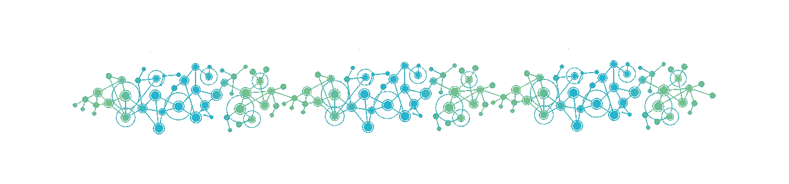
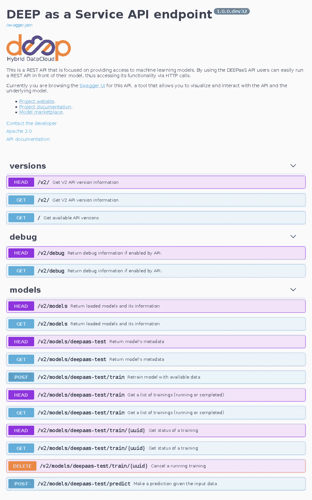

# 使用基于标准的 REST API 发布您的模型

> 原文：<https://towardsdatascience.com/publish-your-models-with-a-standard-rest-api-94de1e1da682?source=collection_archive---------21----------------------->

## 使用 DEEPaaS API 公开您的模型的逐步指南

无论您是在开发一个成熟的应用程序，还是只想与您的同事共享模型，您都可能面临这样的情况:您需要与其他人共享您新开发的模型。在这个简短的分步教程中，我们将展示如何使用 REST API 轻松共享您的模型，而无需从头开始开发。



构建机器学习模型的数据科学家没有一种简单而通用的方法来与他们的同事或任何有兴趣使用他们的人共享他们开发的应用程序。整个模型(即代码和任何需要的配置资产)可以共享，但是这要求模型的接收者需要有足够的知识来执行它。在大多数情况下，我们只是想分享模型以展示其功能(向其他同事或对我们的预测模型感兴趣的公司)，因此没有必要分享整个实验。

在我们工作的互联世界中，最直接的方法是通过 HTTP 端点公开模型，以便潜在用户可以通过网络远程访问它。这听起来可能很简单，但是开发一个合适且正确的 REST API 并不是一件容易的事情。首先，正如[在其他帖子](/search?q=rest%20api)中所展示的，数据科学家需要从头开始开发 API，这项任务需要 API 编程、网络、REST 语义、安全性等方面的知识。第二(可能是一个不太明显的问题)，如果每个科学家都提出一个实现，我们最终会有无数不同的、不可互操作的 API 做或多或少相同的工作，导致一个支离破碎的生态系统，我们需要知道如何与所有这些端点交互。

# DEEPaaS API:一个公开机器学习模型的 REST API

进入 [DEEPaaS API](https://deepaas.readthedocs.io/) :使用 [aiohttp](https://docs.aiohttp.org/) 搭建的机器学习、深度学习和人工智能 REST API 框架。DEEPaaS 是一个软件组件，它允许通过 HTTP 端点公开 Python 模型(使用您选择的框架实现)的功能。它不需要对原始代码进行修改，并有方法根据科学家的选择(输入参数、预期输出等)对其进行定制。)

DEEPaaS API 遵循 [OpenAPI 规范(OAS)](https://www.openapis.org/) ，因此它允许人类和计算机发现并理解底层模型的功能、其输入参数和输出值，而无需检查模型的源代码。



使用 DEEPaaS API 公开的测试模型的 Swagger web 用户界面。

让我们通过一个走过的例子来看看它是如何工作的。

# 使用 DEEPaaS 逐步发布模型

## 将模型插入 API

为了更好地说明如何将模型与 DEEPaaS 集成，我们将使用来自 [scikit-learn](https://scikit-learn.org/) 的一个最著名的例子:一个针对 [IRIS 数据集](https://scikit-learn.org/stable/auto_examples/datasets/plot_iris_dataset.html#sphx-glr-auto-examples-datasets-plot-iris-dataset-py)训练的[支持向量机](https://scikit-learn.org/stable/modules/svm.html)。在这个简单的例子中，我们定义了两个不同的函数，一个用于训练，一个用于执行预测，如下所示:

```
from joblib import dump, load                                                      
import numpy                                                                       
from sklearn import svm                                                            
from sklearn import datasets                                                       

def train():                                                                       
    clf = svm.SVC()                                                                
    X, y = datasets.load_iris(return_X_y=True)                                     
    clf.fit(X, y)                                                                  
    dump(clf, 'iris.joblib')                                                                                                                                          

def predict(data):                                                                 
    clf = load('iris.joblib')                                                      
    data = numpy.array(data).reshape(1, -1)                                        
    prediction = clf.predict(data)                                                 
    return {"labels": prediction.tolist()}
```

如您所见，按照 [scikit-learn 的教程](https://scikit-learn.org/stable/tutorial/basic/tutorial.html#model-persistence)，训练函数将训练好的模型保存到磁盘中。下一步是为您的培训和预测呼叫定义输入参数。因为这个例子非常简单，所以我们只为预测调用定义输入参数。通常你需要把它放在一个不同的文件中，这样它就不会干扰你的代码，但是为了简单起见，我们在 IRIS SVM 旁边添加了这个特殊的函数:

```
from joblib import dump, load                                                      
import numpy                                                                       
from sklearn import svm                                                            
from sklearn import datasets                                                       
from webargs import fields, validate                                                                                                                                 

def train():                                                                       
    clf = svm.SVC()                                                                
    X, y = datasets.load_iris(return_X_y=True)                                     
    clf.fit(X, y)                                                                  
    dump(clf, 'iris.joblib')                                                                                                                                     

def predict(data):                                                              
    clf = load('iris.joblib')                                                   
    data = numpy.array(data).reshape(1, -1)                                     
    prediction = clf.predict(data)                                              
    return {"labels": prediction.tolist()}                                      

def get_predict_args():                                                         
    args = {                                                                    
        "data": fields.List(                                                    
            fields.Float(),                                                     
            required=True,                                                      
            description="Data to make a prediction. "
                        "The IRIS dataset expects "  
                        "four values containing the "
                        "Sepal Length, Sepal Width, " 
                        "Petal Length and Petal Width.",                        
            validate=validate.Length(equal=4),                                  
        ),                                                                      
    }                                                                           
    return args
```

最后一步，为了将它与 DEEPaaS API 集成，你需要使它可安装(你应该这样做)，并使用 [Python 的 setuptools](https://docs.python.org/3.8/distutils/setupscript.html) 定义一个入口点。DEEPaaS 将使用这个入口点来了解如何加载以及如何将不同的函数插入到已定义的端点。我们目前使用的是`deepaas.model.v2`入口点名称空间，因此我们可以如下创建`setup.py`文件:

```
from distutils.core import setup                                                   

setup(                                                                             
    name='test-iris-with-deepaas',                                                 
    version='1.0',                                                                 
    description='This is an SVM trained with the IRIS dataset',                    
    author='Álvaro López',                                                         
    author_email='aloga@ifca.unican.es',                                           
    py_modules="iris-deepaas.py",                                                          
    dependencies=['joblib', 'scikit-learn'],                                       
    entry_points={                                                                 
        'deepaas.v2.model': ['iris=iris-deepaas'],                                 
    }                                                                              
)
```

## 安装、运行 DEEPaaS 并展示您的模型

一旦您准备好代码，您只需要安装您的模块和 DEEPaaS API，这样它就可以检测到它并通过 API 公开它的功能。为了以一种简单的方式做到这一点，让我们创建一个 virtualenv 并在其中安装所有内容:

```
$ virtualenv env --python=python3
    (...)
$ source env/bin/activate
(env) $ pip3 install .
    (...)
(env) $ pip3 install deepaas
    (...)
(env) $ deepaas-run

         ##         ###
         ##       ######  ##
     .#####   #####   #######.  .#####.
    ##   ## ## //   ##  //  ##  ##   ##
    ##. .##  ###  ###   // ###  ##   ##
      ## ##    ####     ####    #####.
              Hybrid-DataCloud  ##

Welcome to the DEEPaaS API API endpoint. You can directly browse to the
API documentation endpoint to check the API using the builtint Swagger UI
or you can use any of our endpoints.

    API documentation: http://127.0.0.1:5000/ui
    API specification: http://127.0.0.1:5000/swagger.json
          V2 endpoint: http://127.0.0.1:5000/v2

-------------------------------------------------------------------------

2020-02-04 13:10:50.027 21186 INFO deepaas [-] Starting DEEPaaS version 1.0.0
2020-02-04 13:10:50.231 21186 INFO deepaas.api [-] Serving loaded V2 models: ['iris-deepaas']
```

## 访问 API，触发训练和预测

如果一切正常，现在你应该能够将你的浏览器指向控制台中打印的 URL(`http://127.0.0.1:5000/ui`)并得到一个好看的 [Swagger UI](https://swagger.io/tools/swagger-ui/) ，这将允许你与你的模型进行交互。

因为这是一个简单的例子，我们还没有提供一个经过训练的模型，所以首先要做的是进行一次训练。这将调用`train()`函数并保存训练好的 SVM 以备后用。您可以通过用户界面或命令行来完成:

```
curl -s -X POST "http://127.0.0.1:5000/v2/models/iris-deepaas/train/" -H  "accept: application/json" | python -mjson.tool
{
    "date": "2020-02-04 13:14:49.655061",
    "uuid": "16a3141af5674a45b61cba124443c18f",
    "status": "running"
}
```

训练将异步完成，这样 API 就不会阻塞。您可以从 UI 中检查其状态，或者使用以下调用:

```
curl -s -X GET "http://127.0.0.1:5000/v2/models/iris-deepaas/train/" | python -mjson.tool
[
    {
        "date": "2020-02-04 13:14:49.655061",
        "uuid": "16a3141af5674a45b61cba124443c18f",
        "status": "done"
    }
]
```

既然模型已经定型，我们就可以进行预测了。鸢尾数据集由 3 种不同类型的鸢尾(Setosa、Versicolour 和 Virginica)花瓣和萼片长度组成。样本有四列，分别对应于萼片长度、萼片宽度、花瓣长度和花瓣宽度。在我们的示例中，让我们尝试获取`[5.1\. 3.5, 1.4, 0.2]`观察的结果，并获取结果。同样，您可以从 UI 或命令行进行设置，如下所示:

```
curl -s -X POST "http://127.0.0.1:5000/v2/models/iris-deepaas/predict/?data=5.1&data=3.5&data=1.4&data=0.2" -H  "accept: application/json" | python -mjson.tool
{
    "predictions": {
        "labels": [
            0
        ]
    },
    "status": "OK"
}
```

如您所见，结果包含了我们的 SVM 执行的预测。在这种情况下，输入数据的标签是`0`，这确实是正确的。

整个代码示例可以在这个[要点](https://gist.github.com/alvarolopez/850160d4681794d5292222d4ebbaf938)中找到。

# 结论

在这个简单的例子中，我们展示了机器学习实践者如何通过依赖于 DEEPaaS API 的 REST API 来公开任何基于 Python 的模型，而不是开发他们自己的自制 API。通过这样做，数据科学家可以专注于他们的工作，而不用担心编写和开发复杂的 REST 应用程序。此外，通过使用一个通用的 API，不同的模块将共享相同的接口，这使得它更容易在生产中部署和被不同的程序员使用。

## 承认

*DEEPaaS API 已在*[*DEEP-Hybrid-data cloud*](https://deep-hybrid-datacloud.eu/)*h 2020 项目(授权协议号 777435)中开发，该项目旨在为欧洲分布式电子基础设施上的机器学习和深度学习构建一个平台。*

*注:本帖原帖于*[*KD nuggets*](https://www.kdnuggets.com/2020/02/sharing-machine-learning-models-common-api.html)*。*