# 应用和数据接收流的发布者/订阅者模型

> 原文：<https://towardsdatascience.com/publisher-subscriber-model-for-apps-and-data-ingestion-flows-b8ba7e85e992?source=collection_archive---------23----------------------->

## 探索实时数据流应用模型中的 Google Cloud 发布/订阅

约纳斯·勒普在 [Unsplash](https://unsplash.com?utm_source=medium&utm_medium=referral) 上拍摄的照片

在本文中，我将向数据工程师和应用程序开发人员展示发布者/订阅者模型的特征。我将首先解释概念的定义及其架构，什么是 Google Cloud 发布/订阅云服务，最后以一个简单的演示作为使用示例。

## 议程

*   流式编程模型的概念和特征
*   发布者/订阅者模型的一般架构
*   谷歌云发布/订阅的概念和特征
*   谷歌云发布/订阅架构
*   演示

# 流式编程模型

编程模型是基于由一个名为*主题*的频道记录传输系统组织的工作流程编排。

在这个模型中有两个不同的角色，*生产者*和*消费者*(稍后将被称为发布者和订阅者)。生产者负责发布关于主题的记录，其中通常由分布式集群组成的数据中心接收记录，存储记录，并使消费者可以通过访问主题的记录队列来获得记录。

使用 Apache Kafka 集群的示例。出自[阿帕奇卡夫卡](https://kafka.apache.org/documentation/#gettingStarted)

当代理同时扮演两种角色时，就会出现实时流，通常从消费者接收发送到主题的记录开始，对接收到的信息应用某种处理或任务，最后在不同的主题上再次发布。

传输系统具有以下基本特征:

1.  允许发布和订阅记录流，类似于消息队列或企业消息传递系统。
2.  它有一个数据中心，以容错的持久方式存储记录流。
3.  进程在流发生时记录流。

然后，流编程模型封装数据管道和应用程序，这些数据管道和应用程序对它们接收的记录流进行转换或做出反应。

# 发布者/订阅者模型的体系结构

首先，让我们解决模型的主要抽象层次:**主题**

主题是记录发布到的类别或提要名称。它可以被理解为通过某种协议(FTP、TCP/IP、UDP、HTTP、SMTP 等)接收信息的通信信道，并且其信息按照到达的顺序被保留，并且可以被一个以上的咨询源(多订户)访问。

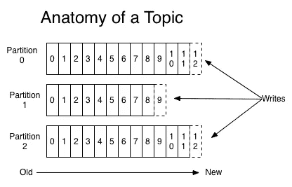

阿帕奇卡夫卡主题剖析。来自[阿帕奇卡夫卡](https://kafka.apache.org/documentation/#gettingStarted)

主题的结构可以根据我们实现的流系统而变化，如果您使用 Apache Kafka，您将有多个分区来确保复制并增加主题信息的可用性。

所有系统的共同点是，主题是由有序的、不可变的记录序列组成的，这些记录被不断追加到结构化提交日志中。主题中的每个记录都被分配了一个称为*偏移量*的顺序 id 号，它唯一地标识了主题中的每个记录。

另一方面，**发布者和订阅者**是流媒体系统的外部实体，它们可以通过上述相同的协议与之通信。该模型的一个优点是，发布者和订阅者可以是云系统，可以是用任何语言编写的作业，甚至可以是授权的第三方应用程序。如果需要，这种类型的大多数系统公开库和模板来构建定制客户机。

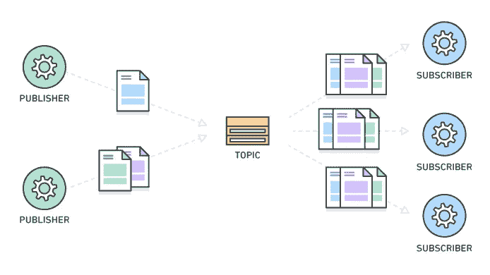

发布/订阅通用架构。来自[亚马逊网络服务](https://aws.amazon.com/pub-sub-messaging/)

# 介绍谷歌云发布/订阅

Google 云平台提供 Pub/Sub 作为异步消息服务，将产生事件的服务与处理事件的服务分离开来。基本上，它允许我们创建主题和订阅渠道，而不必担心存储和分发所需的数据中心基础架构。

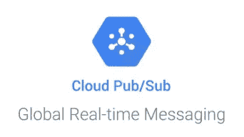

来自[谷歌云平台 YouTube 频道](https://www.youtube.com/watch?v=pU1zA-DMlWk)

使用 Google Cloud SDK，我们可以为订阅的发布和消费构建我们的客户端，依靠与平台其余服务的原生集成，这显然增加了我们系统在流模型下的潜力。

在 Google Cloud Pub/Sub 中，发布者应用程序创建消息并将其发送给主题*的*。订阅者应用程序创建一个对主题的*订阅*,以接收来自主题的消息。通信可以是一对多(扇出)、多对一(扇入)和多对多。

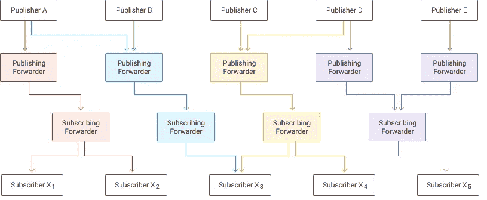

使用 Google Cloud 发布/订阅的发布者和订阅者关系。来自[谷歌云平台](https://cloud.google.com/pubsub/architecture)

# 谷歌云发布/订阅架构

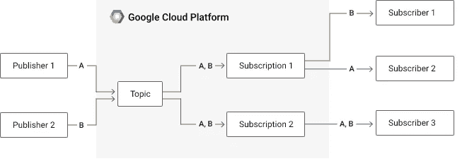

谷歌云发布/订阅架构流程示例。来自[谷歌云平台](https://cloud.google.com/pubsub/architecture)

Google Cloud Pub/Sub 通过其 API 使用 HTTP 协议通过互联网发送流量，允许灵活地发送记录(批量或在线)和接收记录(异步或同步)。

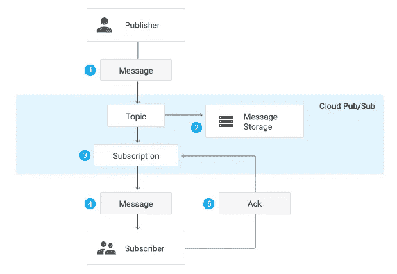

谷歌云发布/订阅内部架构。来自[谷歌云平台](https://cloud.google.com/pubsub/architecture)

使用此服务的任何解决方案的架构都必须通过 HTTP 将 base 64 格式的记录(称为消息)发送到主题(因此它可以是任何类型的数据),一旦接收到记录，它将在创建主题后的可配置时间内被存储和复制。然后，主题的订阅者接收消息，直到达到最大存储时间，或者直到订阅者用 ack 确认了消息，以先发生的为准。

# 演示

为了用一个应用程序的例子来解释应用程序和数据流的发布/订阅模型的功能，我将构建一个简单的架构，包含一个主题和一个 Google Cloud 发布/订阅。

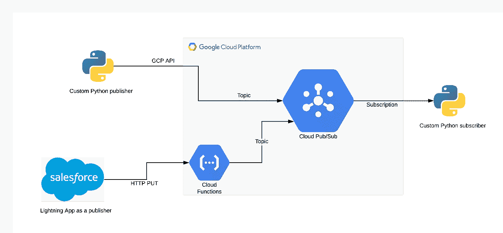

演示架构

演示将包括通过以下步骤构建解决方案:

1.  Google Cloud 发布/订阅主题和订阅创建。
2.  API 连接的设置。
3.  使用 GCP API 定制 Python 发布者和订阅者编码。
4.  通过云功能扩展连接可能性。
5.  面向第三方出版商的 Salesforce Lightning 应用程序示例。

最后，我将展示如何使用 Google Cloud Dataflow 和 Tableau 扩展该架构，以包括数据接收流和实时分析。

## Google Cloud 发布/订阅主题和订阅创建。

使用 GCP 控制台创建主题和订阅是一个非常简单的过程。首先，在菜单中查找 Pub/Sub。

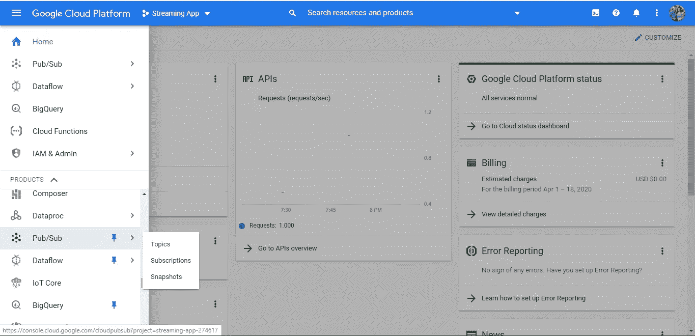

截图来自 [GCP 控制台](http://console.cloud.google.com/)

创建一个提供主题 ID 的主题(您可以使用自己的 AES 256 密钥加密主题)。

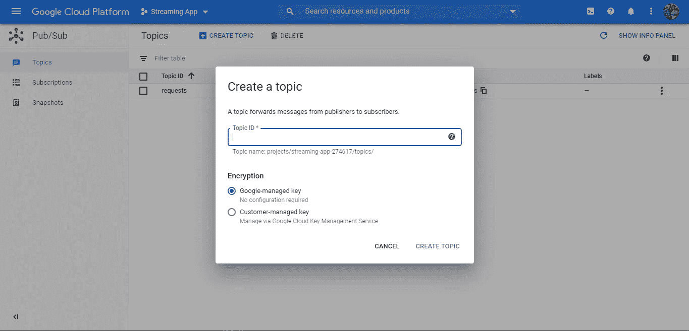

截图来自 [GCP 控制台](http://console.cloud.google.com/)

当主题准备好时，为它创建一个简单的订阅。

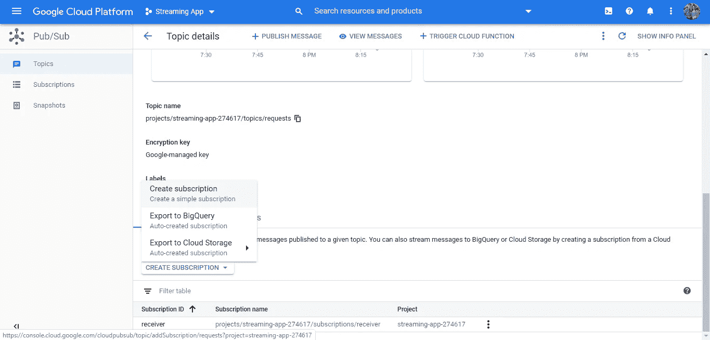

来自 [GCP 控制台](http://console.cloud.google.com/)的截图

仅此而已。记下主题和订阅名称，因为稍后会用到它们。

## API 连接的设置

为了将我们的应用程序与我们的 Google Cloud 项目连接起来，需要进行身份验证。在这种情况下，为了简化过程并确保安全性，我们将创建两个服务帐户，以 JSON 格式获取它们的凭证，并将它们用作身份验证方法。

第一个服务帐户将用于发布者，它只允许发布到主题权限。转到 IAM >服务帐户。

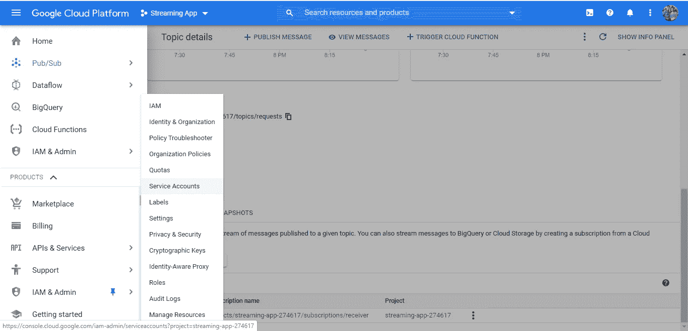

截图来自 [GCP 控制台](http://console.cloud.google.com/)

创建新的服务帐户，并提供名称和描述(服务帐户 ID 将自动创建)。

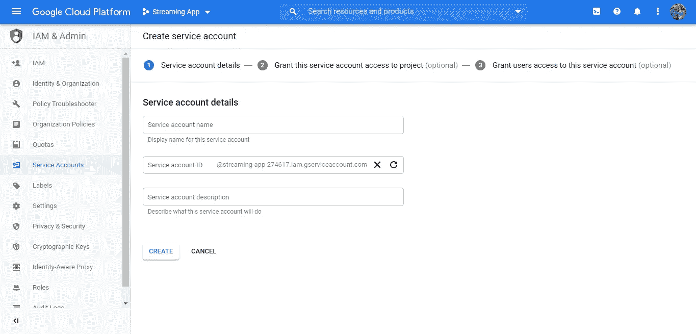

来自 [GCP 控制台](http://console.cloud.google.com/)的截图

在角色部分中，搜索发布/订阅发布者。

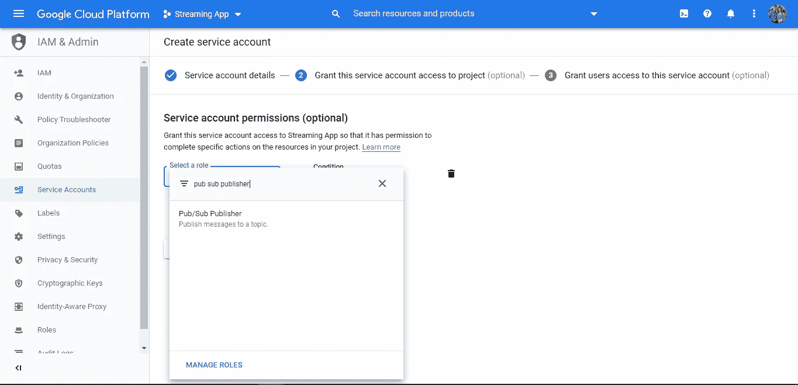

截图来自 [GCP 控制台](http://console.cloud.google.com/)

最后创建一个密钥，并以 JSON 格式下载它。

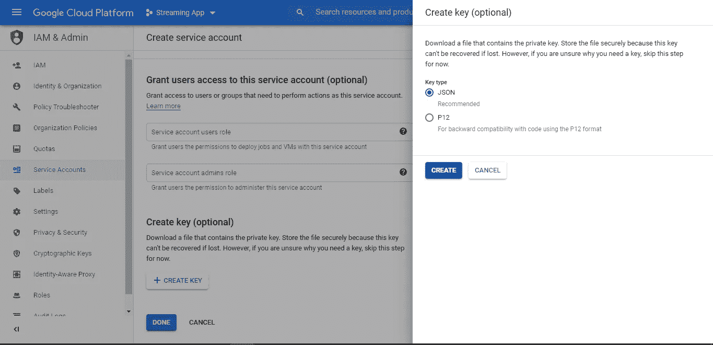

截图来自 [GCP 控制台](http://console.cloud.google.com/)

这就是发布者服务帐户，对于订阅者重复这些步骤，但是将选择的从发布/订阅发布者更改为发布/订阅订阅者。

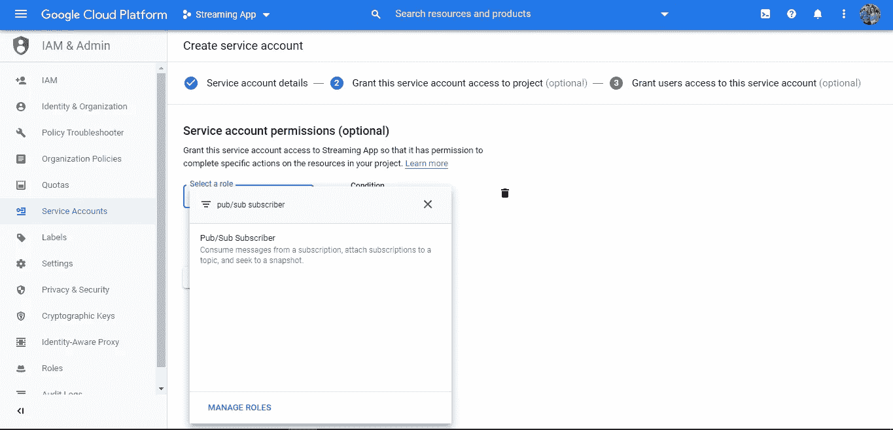

来自 [GCP 控制台](http://console.cloud.google.com/)的截图

两个服务帐户现在都可以使用了。

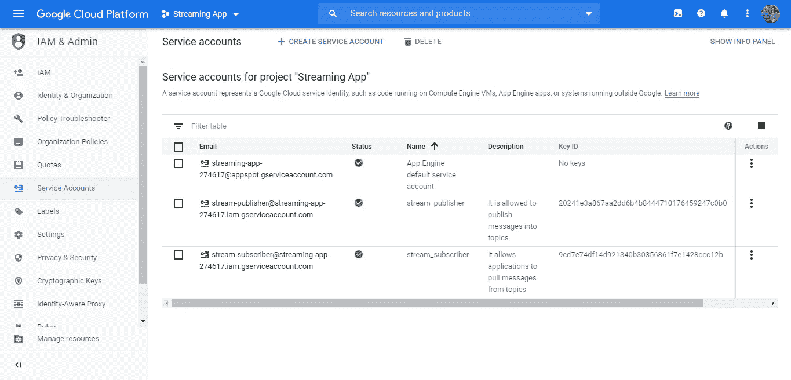

截图来自 [GCP 控制台](http://console.cloud.google.com/)

## 使用 GCP API 定制 Python 发布者和订阅者编码。

为了构建这两个定制的客户端，需要一个安装了 google-cloud-pubsub 库的 python 环境。

此外，我们必须创建环境变量 GOOGLE_APPLICATION_CREDENTIALS，它的值将是带有我们之前下载的凭证的 JSON 文件的路径。

在我的例子中，我使用 Anaconda 创建了一个环境，并使用 pip 安装了库。官方安装文件可以在[链接](https://googleapis.dev/python/pubsub/latest/index.html)中找到。

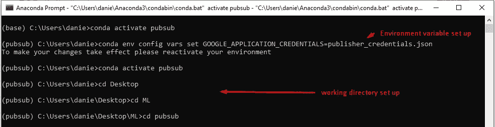

本地 Pyhton 环境设置。我将 JSON 文件重命名为一个有意义的名称。

现在环境已经准备好了，我们可以开始为我们的客户编码了。

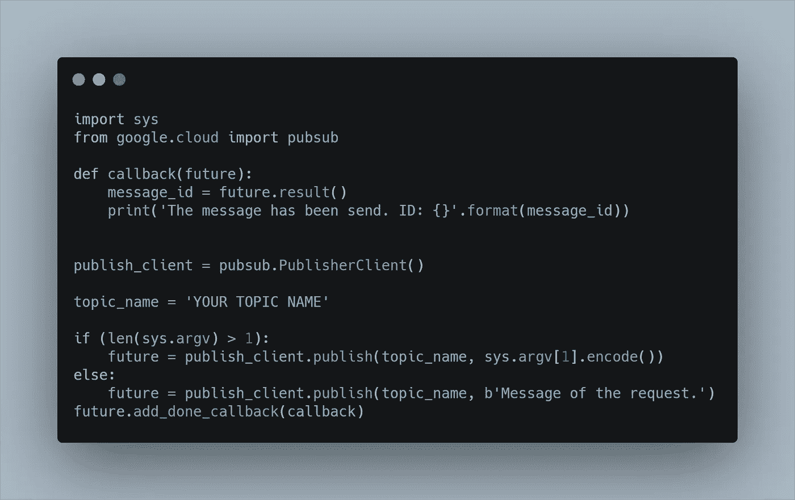

出版者

使用库和文档编写了一个简单的发布脚本，它将从系统参数中发布一条消息，或者在没有提供参数的情况下发布一条默认值。最后，它将打印消息 ID 作为成功的确认。**确保将 topic_name 替换为您的 Google Cloud 发布/订阅主题的名称。**

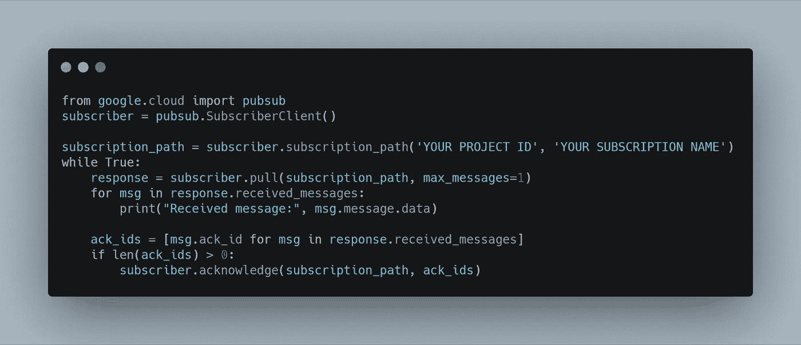

订户

订阅者获取其他 JSON 凭证，并简单地一个接一个地遍历主题的消息，打印其数据，并对收到的每条消息用预期的 ack 进行响应。

现在，我们已经准备好使用控制台运行我们的客户端进行测试。

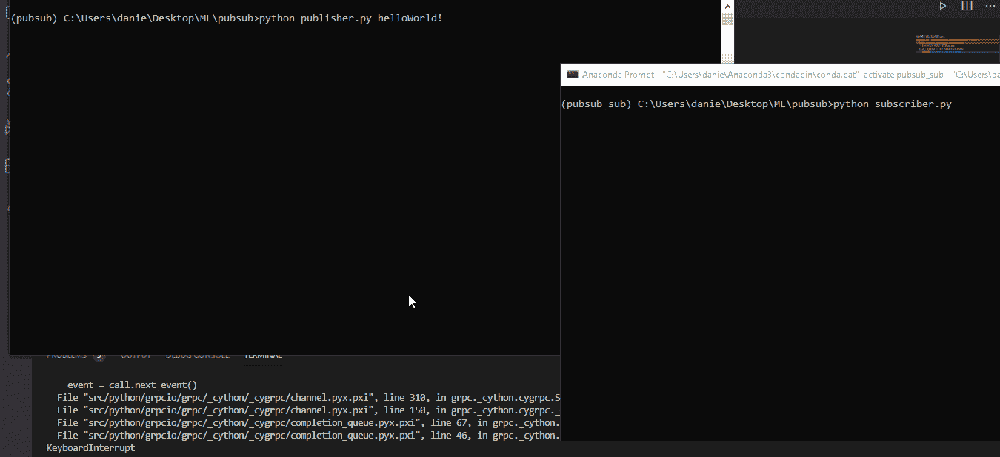

Python 客户端演示

可以看出，在发布者客户端发送其消息时，订阅者客户端响应打印该消息。

## 通过云功能扩展连接可能性

目前，我们有本地客户，他们完成了发行商和订户的基本功能。然而，使用任何类型的客户机来扩展我们的选择将是有趣的，因为我们目前受限于存在连接 API 的编程语言。

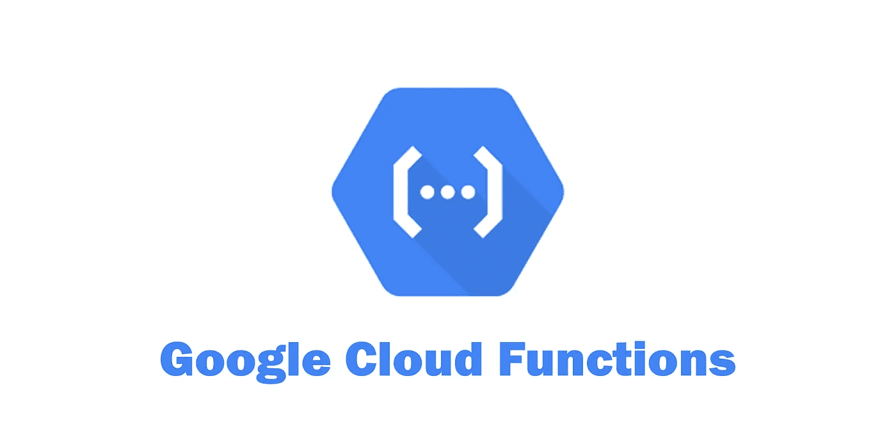

由[大卫·维尔德霍](https://medium.com/@daveresbk)在[媒体](https://medium.com/bluekiri/create-a-multiregional-http-monitor-in-less-than-five-minutes-with-google-cloud-function-8fbb5552f6e3)上拍摄的照片

为了解决这个问题，我们将使用 Google Cloud Functions，这是一个无服务器的解决方案，允许我们将发布客户端作为一个 web 服务公开，该服务通过 HTTP 协议接收消息，并使用 API 将它们发送到主题，就像我们刚刚构建的客户端一样。

首先，在 GCP 控制台中寻找云函数。

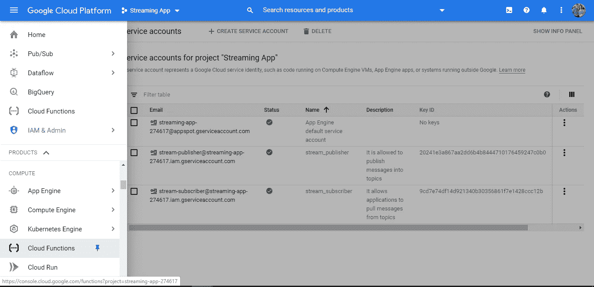

截图来自 [GCP 控制台](http://console.cloud.google.com/)

创建一个新函数，键入名称，选择适当的内存分配，并选择 HTTP 作为触发器。此外，出于测试目的，您可以允许未经身份验证的调用，在生产环境中，您会期望每个 HTTP 触发器中都有一个身份验证头。

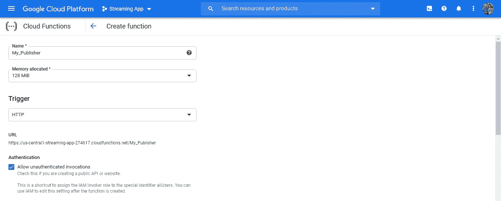

来自 [GCP 控制台](http://console.cloud.google.com/)的截图

对于源代码，您可以压缩一个完整的环境，并上传为直接文件、云存储中的文件或云源代码中的存储库。对于这个演示，内联编辑器就足够了，选择 Python 3。x 为运行时。

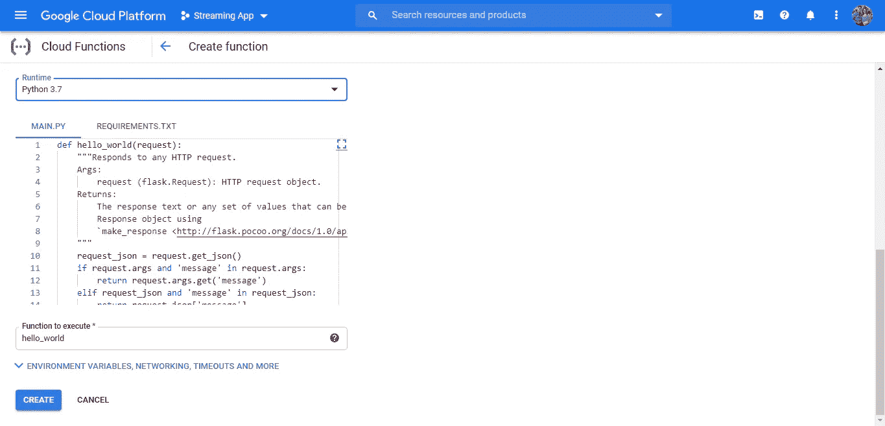

截图来自 [GCP 控制台](http://console.cloud.google.com/)

大体上。考虑到参数将在 JSON 请求中接收，我们将提供我们的函数代码。我们的本地 publisher 客户端的准确转换如下所示。

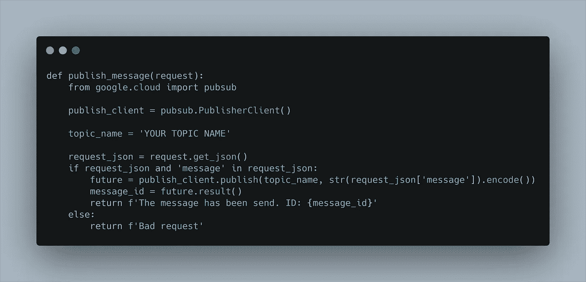

main.py

对于另一个选项卡，我们需要提供执行代码所需的库的名称。在这个演示中，我们只需要 google-cloud-pubsub 库。

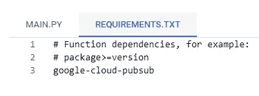

来自 [GCP 控制台](http://console.cloud.google.com/)的截图

在高级选项中，不需要在 JSON 文件中提供凭证，因为我们可以直接在 GCP 控制台中设置将在每个触发器执行期间使用的服务帐户。

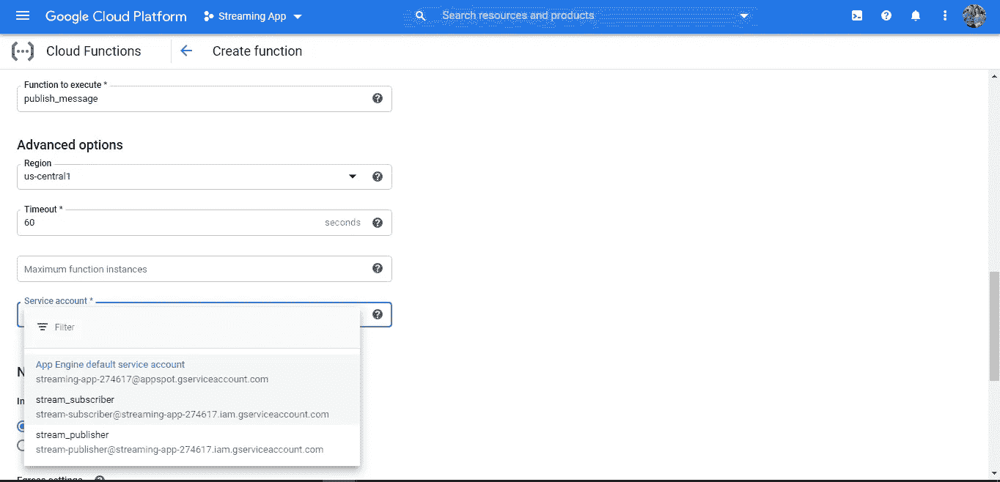

来自 [GCP 控制台](http://console.cloud.google.com/)的截图

另外，不要忘记在要执行的函数字段中提供正确的函数名。就这样，当函数准备就绪时，我们可以使用函数的 url 测试与任何 REST 消费者的连接，在这种情况下，我将使用 SOAP UI。

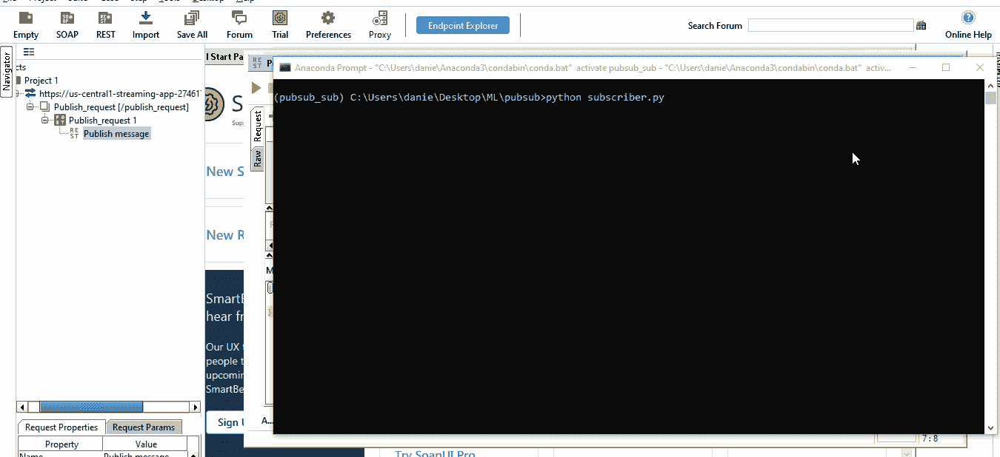

SOAP UI 测试

如您所见，我们的客户端订户能够接收使用 Google Cloud Functions web 服务的 SOAP UI 发送的消息。确保媒体类型为*应用程序/json。*

## 面向第三方出版商的 Salesforce Lightning 应用程序示例

为了演示我们与任何系统集成的能力是如何扩展的，我决定使用 Salesforce CRM 并在其中构建一个 lightning 应用程序，该应用程序由一个简单的文本字段和一个按钮组成，当按下该按钮时，通过 HTTP 将文本发送到 web 服务。

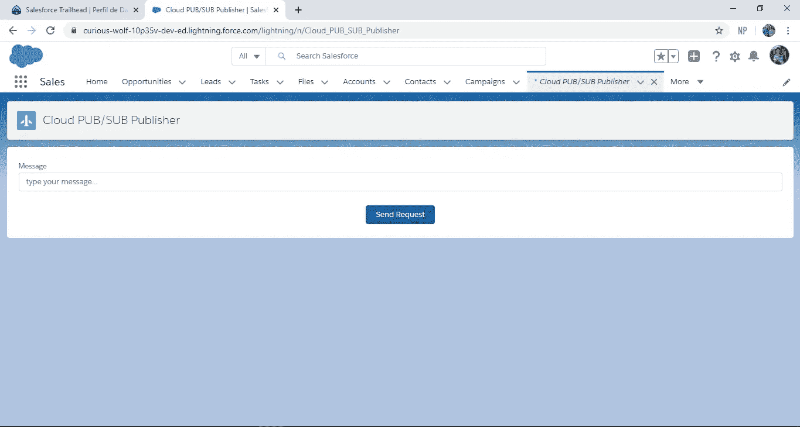

Salesforce publisher Lightning 应用。截图来自通过 [Trailhead](http://trailhead.salesforce.com/) 提供的免费 Saleforce 组织

为了避免深入研究这个工具的构造，我将简单地展示当您单击按钮时执行的源代码。

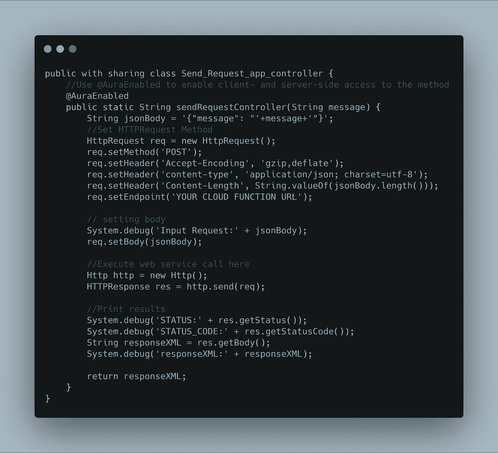

Apex 中的按钮 onClick 方法，Salesforce 编程语言

如你所见，这是创建一个对象，向 Google Cloud Function URL 发送一个 PUT 类型请求，其主体是一个 JSON，*内容类型*是*应用程序/json。*

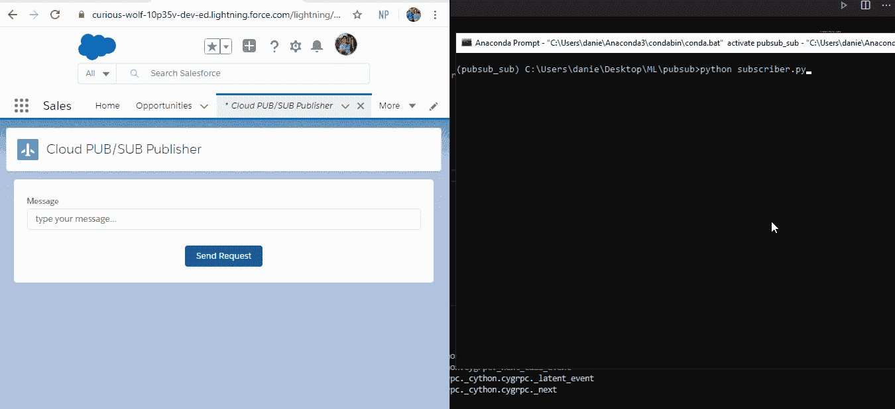

Salesforce 演示

## 如何包含数据摄取流

通过当前的架构，我们可以将我们的发布者和订阅者连接到任何应用程序，但我们没有考虑到需要对收到的记录进行一个或多个清理过程的情况，也没有及时存储记录。

使用谷歌云数据流，我们可以通过从模板创建一个清理流(或从头创建我们自己的)来扩展我们当前的架构，以将数据存储在数据仓库中，如 BigQuery，该数据仓库可由 Tableau 等分析客户端访问。

在 GCP 控制台的主题详细信息页面中，我们可以创建一个作业，使用 Google Dataflow 将主题的消息导出到 Google BigQuery。

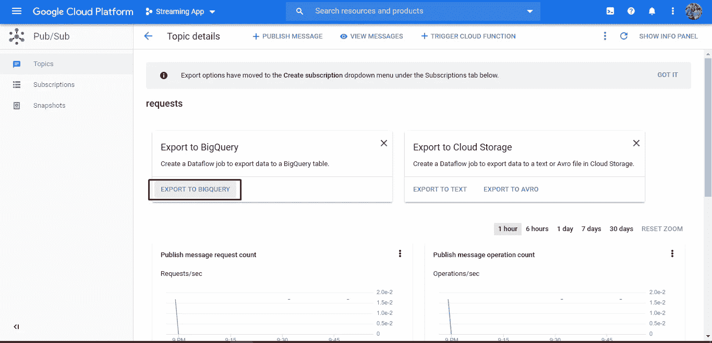

为 Google Cloud 发布/订阅主题创建数据流。截图来自 [GCP 控制台](http://console.cloud.google.com/)

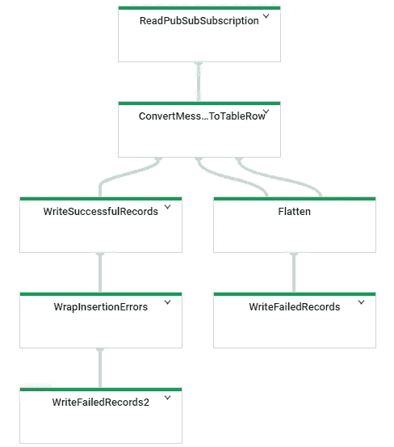

来自 [GCP 控制台](http://console.cloud.google.com/)的截图

使用对 BigQuery 模板的云发布/订阅，我们可以创建一个管道，从发布/订阅获取 JSON 编码的消息的云发布/订阅流，通过用户定义的 JavaScript 函数执行转换，并写入预先存在的 BigQuery 表。

然后，在 BigQuery 中，我们可以使用 Google data studio 或 Tableau 等第三方客户端构建实时报告和仪表板。

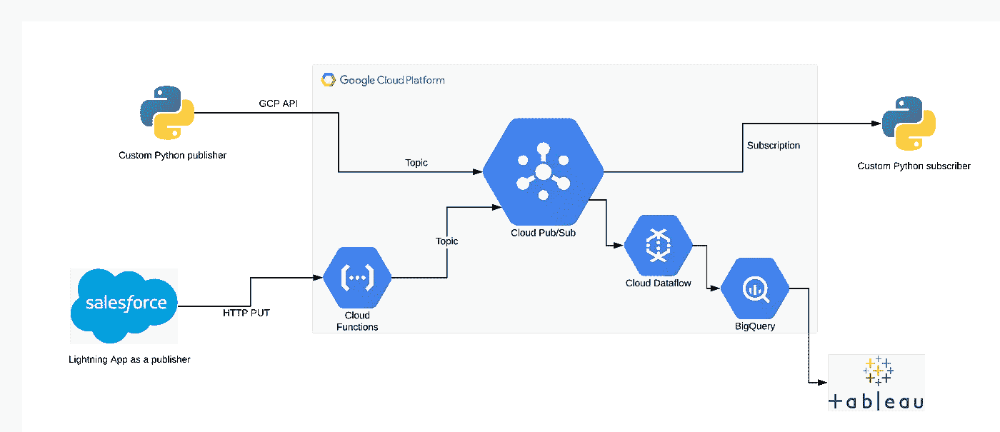

完整的架构:流发布/订阅应用+数据流

# 结论

本文解释了基于流的编程模型的架构和概念，解释了它的架构和与 Google Cloud 发布/订阅工具的使用，最后展示了一个演示，在这个演示中可以证实该模型提供的集成功能，无论是用于创建从流数据中心提供的应用程序，还是用于数据工程和实时报告的 ETL 流。

## 文献学

*   [https://cloud.google.com/pubsub/docs/concepts](https://cloud.google.com/pubsub/docs/concepts)
*   https://kafka.apache.org/documentation/#gettingStarted
*   【https://aws.amazon.com/pub-sub-messaging/ 
*   [https://googleapis.dev/python/pubsub/latest/index.html](https://googleapis.dev/python/pubsub/latest/index.html)
*   [https://Google APIs . dev/python/pubsub/latest/publisher/index . html](https://googleapis.dev/python/pubsub/latest/publisher/index.html)
*   [https://Google APIs . dev/python/pubsub/latest/subscriber/index . html #异步拉取订阅](https://googleapis.dev/python/pubsub/latest/subscriber/index.html#pulling-a-subscription-asynchronously)
*   [https://cloud . Google . com/functions/docs/writing/http # sample _ usage](https://cloud.google.com/functions/docs/writing/http#sample_usage)