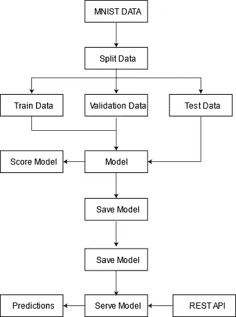

# 发布模型以从 Rest API 获得对新数据的预测

> 原文：<https://towardsdatascience.com/publishing-the-model-to-get-predictions-on-new-data-from-rest-api-3083cf81c45?source=collection_archive---------57----------------------->

## 通过使用 TensorFlow 服务托管的模型从 Rest API 获取数据预测。

所以，你有一个漂亮的模型，它在数据上非常有效。现在，您希望将该模型投入生产，并根据新数据进行预测。

让我向您介绍 TensorFlow 服务系统，该系统旨在为生产中经过培训的模型提供服务。默认情况下，它与 TensorFlow 模型无缝集成，但功能也可以扩展到其他模型。

# 保存模型

所以，让我们说，在遵循了这篇[文章](https://medium.com/swlh/understanding-the-mnist-and-building-classification-model-with-mnist-and-fashion-mnist-datasets-76b795da84b7)中的步骤之后，你有了一个训练有素的模型，并且你正在使用 Google Colab。

TensorFlow 服务的模型必须与版本和变量一起保存，这可以通过下面的代码来完成:

# 检查我们刚刚保存的模型

如果在 TF 服务中有几个模型，而我们不知道这些模型的细节，这是很有帮助的。这段代码变得非常有价值，在这种情况下，它将显示已保存模型的内容。

# 为模型服务并获得预测

服务使我们能够管理模型的版本，并确定使用哪个版本的优先级。这对于重新训练模型或者在不损害平台架构完整性的情况下促进迁移学习特别有用。

现在让我们使用 TensorFlow Serving 的 REST API 进行预测:

本主题到此结束，它涵盖了前面提到的[文章](https://medium.com/swlh/understanding-the-mnist-and-building-classification-model-with-mnist-and-fashion-mnist-datasets-76b795da84b7)中所涵盖的构建模型的端到端过程，然后托管模型以使用 Rest API 获得新数据的预测。

使用服务有多种方式，这个主题本身扩展并联系了使用 Google Cloud 服务模型。