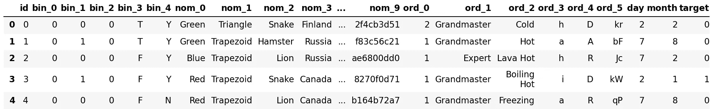
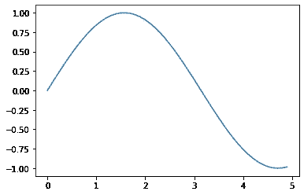
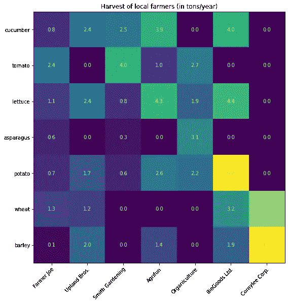
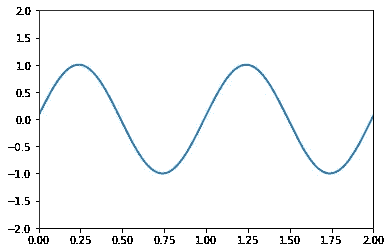
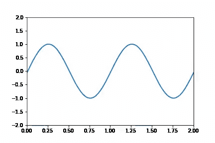
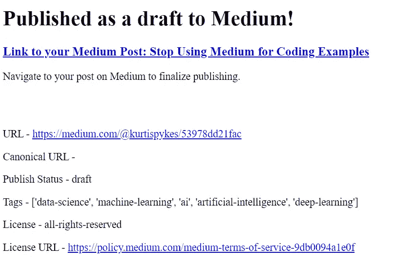

# 从 Jupyter 笔记本发布到媒体

> 原文：<https://towardsdatascience.com/publishing-to-medium-from-jupyter-notebooks-53978dd21fac?source=collection_archive---------33----------------------->


约翰·马特丘克在 [Unsplash](https://unsplash.com?utm_source=medium&utm_medium=referral) 上拍摄的照片

## 在媒体上创建技术职位的更有效方法

程序员们，当我们写一篇技术文章时，我们都知道写一个笔记本然后不得不将代码复制并粘贴到介质中的困难…头痛！让我高兴的是，可能也是你高兴的是，我发现了一个包，我相信它是我们关于媒体灾难的编程的拯救之恩。

[*Jupyter-to-Medium*](https://pypi.org/project/jupyter-to-medium/)*是由一位媒体作家同行 [Ted Petrou](https://medium.com/u/cf7f60f2eeb3?source=post_page-----53978dd21fac--------------------------------) 创造的。Ted 将这种挫折感转化成了我认为非常有创意的方案——[**点击此处**](https://pypi.org/project/jupyter-to-medium/) 阅读更多。*

*我在这篇文章中的动机很简单。我的目标是演示并测试 *Jupyter-to-Notebook* 包的全部功能，然后添加我对该包的想法以及对那些决定将它作为其博客工作流程一部分的人的建议。*

> *免责声明:我不是付费推广人，也没有被要求以任何方式在 Jupyter-to-Medium 上写这个故事——我只是觉得这是个很酷的想法。*

## *概观*

*那些精通 Jupyter 笔记本的人会知道 [LaTex](https://en.wikipedia.org/wiki/LaTeX) 是一个内置功能——如果你不知道，现在你知道了。我经常发现自己不得不在谷歌上搜索数学表达式的图像(这不违反任何版权协议)，或者在最糟糕的情况下，我不得不在将它作为图像导入 Medium 之前，自己动手设计它。*

*这一过程可能极其费力，更不用说它有多乏味了。有很多帖子我不得不推迟一个小时发表，因为我正在创建我的数学表达式的图像——不将 LaTex 纳入媒体的想法是一场灾难，但如果有合理的理由说明为什么不这样做(或者如果我不知道如何做),那么我就收回。*

*如前所述，LaTex 是 Jupyter 笔记本的一个特性，所以我希望当我在笔记本中实现 LaTex 时，它会在导入到介质中时自动解析为图像。但是—*

# *$ $ \ hat { y } = \ theta _ { 0 }+\ theta _ { 1 } X _ { 1 }+\ theta _ { 2 } X _ { 2 } $ $*

*显然事实并非如此(上面的**是我在 Jupyter 笔记本**中写的 LaTex 代码的一个例子)。*

*尽管如此，每当我打开 Jupyter 笔记本环境时，通常不是为了在 markdown 单元格中编写 LaTex 代码。相反，我通常使用笔记本来执行一些类型的原型制作、可视化、分析等。因此，这个属性不符合我最初的期望，无论如何不会损害这个包的前景。*

*在 Medium 上写技术故事的一个非常恼人的壮举是，当你不得不将你在 Jupyter 笔记本上写的所有代码复制并粘贴到 Medium 上时——想想它就让我更加恼火！*

**Jupyter-to-Medium* 将我们写在笔记本上的代码单元翻译成 Medium 中的代码块，然后发布到其他地方。*

```
*# example of code cell being translated to code block on medium

print("Hello World")Hello World*
```

***挺酷的吧！***

*进一步来说，当在我们的 Jupyter 笔记本环境中工作时，我们经常有一些我们试图探索的数据。我不知道其他人如何将他们的数据框架整合到他们的技术博客中，但我必须对每个单独的数据框架进行截图并裁剪，以便我可以将其作为图片上传到我的媒体故事中——这又是一个花费不必要时间的过程！*

*必须截图，然后在上传前保存也是相当漫长和繁琐的。当数据框有很多列时，笔记本会在数据框和滚动条上添加省略号，以显示更多的列……我想看看 *Jupyter-to-Medium* 如何处理这一壮举，令我高兴的是，我被深深打动了。*

*在*图 1* 中，您可以看到省略号是存在的，但是解析器提取了表格并以合适的大小将其粘贴到介质上。*

> *演示数据来自 Kaggle 分类特征工程竞赛— [**点击此处**](https://www.kaggle.com/c/cat-in-the-dat/data) 访问数据集。*

```
*import pandas as pd 

df = pd.read_csv("../data/categorical_feature_engineering_raw/train.csv")
df.head()*
```

**

*图 1*

*我经常使用 Plotly 来实现我的可视化，然而当我最初试图在这篇博客文章中使用它时，我的文章导致了 60 分钟的阅读，内容与我当前的文章完全相同。经过进一步的检查，我意识到我所有的 Plotly 代码都被转换成了一长串数字(我也不小心把这个发表到了《走向数据科学》上— **对不起，伙计们**)。*

***长话短说，我用 Matplotlib 做这个概述。***

*合并 Plotly 的失败可能会让那些已经从静态情节完全转换到交互情节的人，以及那些甚至没有体验过 matplotlib 的人感到不安。但是，如果你对框架不是那么挑剔，你会做得很好，而且 matplotlib 非常容易学习！*

> ***注**:我没有测试 Seaborn，所以如果你使用它，请让我知道结果 *t.**

```
*# https://matplotlib.org/api/pyplot_api.html

import numpy as np
import matplotlib.pyplot as plt

x = np.arange(0, 5, 0.1);
y = np.sin(x)
plt.plot(x, y)
plt.show()*
```

**

*图 2*

```
*# https://matplotlib.org/3.1.1/gallery/images_contours_and_fields/image_annotated_heatmap.html

vegetables = ["cucumber", "tomato", "lettuce", "asparagus",
              "potato", "wheat", "barley"]
farmers = ["Farmer Joe", "Upland Bros.", "Smith Gardening",
           "Agrifun", "Organiculture", "BioGoods Ltd.", "Cornylee Corp."]

harvest = np.array([[0.8, 2.4, 2.5, 3.9, 0.0, 4.0, 0.0],
                    [2.4, 0.0, 4.0, 1.0, 2.7, 0.0, 0.0],
                    [1.1, 2.4, 0.8, 4.3, 1.9, 4.4, 0.0],
                    [0.6, 0.0, 0.3, 0.0, 3.1, 0.0, 0.0],
                    [0.7, 1.7, 0.6, 2.6, 2.2, 6.2, 0.0],
                    [1.3, 1.2, 0.0, 0.0, 0.0, 3.2, 5.1],
                    [0.1, 2.0, 0.0, 1.4, 0.0, 1.9, 6.3]])

fig, ax = plt.subplots(figsize=(8, 10))
im = ax.imshow(harvest)

# We want to show all ticks...
ax.set_xticks(np.arange(len(farmers)))
ax.set_yticks(np.arange(len(vegetables)))
# ... and label them with the respective list entries
ax.set_xticklabels(farmers)
ax.set_yticklabels(vegetables)

# Rotate the tick labels and set their alignment.
plt.setp(ax.get_xticklabels(), rotation=45, ha="right",
         rotation_mode="anchor")

# Loop over data dimensions and create text annotations.
for i in range(len(vegetables)):
    for j in range(len(farmers)):
        text = ax.text(j, i, harvest[i, j],
                       ha="center", va="center", color="w")

ax.set_title("Harvest of local farmers (in tons/year)")
fig.tight_layout()
plt.show()*
```

**

*图 3*

> *那些关注我的故事的人会知道我喜欢给我的照片贴标签。如果你想知道我是在 Jupyter 笔记本上还是在 Medium 上标注数字，答案是“我在 Medium 上做的”。*

*最后但并非最不重要的，动画。我以前从未用过动画，所以我想尝试一下可能会很酷。*

```
*# http://louistiao.me/posts/notebooks/embedding-matplotlib-animations-in-jupyter-as-interactive-javascript-widgets/

from matplotlib import animation
from IPython.display import Image
%matplotlib inline

fig, ax = plt.subplots()

ax.set_xlim(( 0, 2))
ax.set_ylim((-2, 2))

line, = ax.plot([], [], lw=2)

def init():
    line.set_data([], [])
    return (line,)

def animate(i):
    x = np.linspace(0, 2, 1000)
    y = np.sin(2 * np.pi * (x - 0.01 * i))
    line.set_data(x, y)
    return (line,)

anim = animation.FuncAnimation(fig, animate, init_func=init,
                               frames=100, interval=20, 
                               blit=True)

anim.save('animation.gif', writer='imagemagick', fps=60)print("Static plot")
Static plot*
```

**

*图 4*

```
*anim.save('animation.gif', writer='imagemagick', fps=60)Image(url='animation.gif')*
```

**

*图 5*

> *注意:我确实不得不手动导入 gif，但这可能只是因为我对使用 gif 不熟悉，因为在 Ted done 的主要文章中有一个完整的 gif。*

**

*图 6:我的文章从 Jupyter 笔记本上发表的确认*

*要获得完整的代码，请点击下面的链接，但请注意，从我的 Jupyter 笔记本上最初上传的是我的第一份草稿，因此你可能会注意到笔记本上的大幅修改。*

*[](https://github.com/kurtispykes/demo/blob/master/notebook/kpy_jupyter_to_medium_test.ipynb) [## kurtispykes/演示

### permalink dissolve GitHub 是超过 5000 万开发人员的家园，他们一起工作来托管和审查代码，管理…

github.com](https://github.com/kurtispykes/demo/blob/master/notebook/kpy_jupyter_to_medium_test.ipynb)* 

## *我的概述*

*我想我已经清楚地表达了我的观点——我认为这个软件包非常有创意，我真诚地建议每个在 Medium 上写技术文章的人应该避免使用这个软件包。尽管如此，我还是要警告任何决定采用这种包装的人，要小心 Jupyter 笔记本和介质的用途形成了明显的对比，这一点应该被考虑在内。*

*媒体上的共享被优化以使写作更像样，Jupyter 笔记本是用来做整洁的探索的。当我们从笔记本中发布到 Medium 时，这一点变得非常明显，因为要让您的 Medium 故事看起来像样，至少在我看来是这样的。我不认为直接从 Jupyter 笔记本发布是一个好主意，你几乎总是想要编辑格式和样式(例如，首字下沉)。*

*我最好的建议是利用这两个平台的优势，这样你就可以对你最初的 Jupyter 笔记本进行调整，但同时，重要的是要意识到大部分繁重的工作已经为你完成了！*

*如果你想和我联系，最好的方式是通过 LinkedIn*

*[](https://www.linkedin.com/in/kurtispykes/) [## Kurtis Pykes -人工智能作家-走向数据科学| LinkedIn

### 在世界上最大的职业社区 LinkedIn 上查看 Kurtis Pykes 的个人资料。Kurtis 有一个工作列在他们的…

www.linkedin.com](https://www.linkedin.com/in/kurtispykes/)*