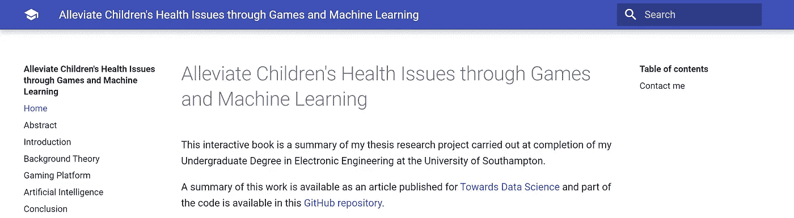

# 在网络上发布您自己的数据科学文档/书籍

> 原文：<https://towardsdatascience.com/publishing-your-own-data-science-documentation-book-on-the-web-d859caa07b46?source=collection_archive---------27----------------------->

## 关于如何使用免费的 MkDocs 和 GitHub 页面在线发布您自己的项目文档/书籍的指南。


帕特里克·托马索在 [Unsplash](https://unsplash.com?utm_source=medium&utm_medium=referral) 上的照片

# 介绍

你有没有想过图书馆通常如何在线发布他们的文档？在线发布项目文档最常见的方式之一是使用 [MkDocs](https://www.mkdocs.org/) 。

MkDocs 是一个静态站点生成器，它只使用一个 Markdown 文件列表和一个 YAML 配置文件来立即生成自己的网站，然后可以使用 GitHub 页面在一行代码中免费部署。

如果你正在寻找一个使用 MkDocs 生成的网站的例子，你可以在这里找到[我写的关于我的研究项目“通过游戏和机器学习缓解儿童健康问题”的书](https://pierpaolo28.github.io/thesis_book/)，我在[我的上一篇文章](/disability-diagnostic-using-eeg-time-series-analysis-8035300837ac)中谈到过它(图 1)。



图 1: [使用 Mkdocs 创建的示例文档项目。](https://pierpaolo28.github.io/thesis_book/)

在本文中，我将带您快速了解如何生成您自己的在线项目文档。

# 创建项目

首先，我们需要安装 MkDocs Python 库。

```
pip install mkdocs
```

一旦安装了这个库，我们就可以为我们的项目创建一个文件夹，并从这个位置打开一个命令提示符。运行以下命令，将自动为我们创建一个 Mkdocs 项目。

```
mkdocs new my-project-name
```

该项目将具有如下所示的结构:

```
-- my-project-name
  -- mkdocs.yml
  -- docs
     -- index.md
```

将使用 *mkdocs.yml* 文件来设计我们网站的结构，而 *docs* 文件夹中的所有 Markdown 文件将用于创建网站每个不同页面的内容。如果你不熟悉如何使用 Markdown 创建文本文件，你可以在这里找到介绍指南[。](https://www.markdownguide.org/getting-started/)

通过创建 mkdocs 项目自动生成的一个简单的 *mkdocs.yml* 文件如下所示:

```
site_name: MkLorum 
nav:     
  - Home: index.md
```

然后我们可以修改它来选择我们想要的网站名称(而不是 MkLorum ),并在网站导航栏上添加多个页面，只需在*导航标签*下添加新页面即可(在左侧指定导航按钮名称，在右侧指定 docs 文件夹中的文件名)。最后，也可以使用预装的主题(例如 *readthedocs* )或者从 [Mkdocs 社区](https://github.com/mkdocs/mkdocs/wiki/MkDocs-Themes)中选择一个主题来设计我们的网站。

下面是一个更加个性化的 *mkdocs.yml* 文件示例。

```
site_name: my_website_name
nav:     
  - Home: index.md     
  - About: about.md
  - Contacts: contacts.md
theme: readthedocs
```

在 *docs* 文件夹中，我们可以找到一个自动创建的 *index.md* 文件，然后我们可以为自己的网站定制这个文件。然后，我们可以通过在 docs 文件夹中添加新的 Markdown 文件，然后在 *mkdocs.yml* 文件中引用它们，向网站添加任意多的页面。

在开发阶段的每一点，我们都可以通过在命令行中从我们的项目位置运行以下命令来观察我们网站的外观:

```
mkdocs serve
```

这将激活一个本地服务器，然后我们就可以在这个地址看到我们的网站: [http://127.0.0.1:8000](http://127.0.0.1:8000) 。一旦我们的本地服务器运行，如果我们修改任何文件(并保存更改)，它们将自动显示在网站上。

将所有内容添加到网站并检查其显示是否正确后，我们可以通过运行以下命令来构建 HTML 和 CSS 文件:

```
mkdocs build
```

至此，我们已经准备好用 GitHub 库初始化我们的项目了。之后，我们可以从命令运行我们的最后一个命令，然后我们的项目将在线部署:

```
mkdocs gh-deploy
```

在命令提示符下，将会显示我们的网站将被激活的链接。或者，我们可以通过访问我们的存储库设置并查找 GitHub pages 选项来找到相同的链接(运行上面显示的命令，实际上会自动生成一个名为 *gh-pages* 的新分支，GitHub 将使用它来托管我们的文档网站)。

# 联系人

如果你想了解我最新的文章和项目[请关注我的媒体](https://medium.com/@pierpaoloippolito28?source=post_page---------------------------)并订阅我的[邮件列表](http://eepurl.com/gwO-Dr?source=post_page---------------------------)。以下是我的一些联系人详细信息:

*   [领英](https://uk.linkedin.com/in/pier-paolo-ippolito-202917146?source=post_page---------------------------)
*   [个人博客](https://pierpaolo28.github.io/blog/?source=post_page---------------------------)
*   [个人网站](https://pierpaolo28.github.io/?source=post_page---------------------------)
*   [中型型材](https://towardsdatascience.com/@pierpaoloippolito28?source=post_page---------------------------)
*   [GitHub](https://github.com/pierpaolo28?source=post_page---------------------------)
*   [卡格尔](https://www.kaggle.com/pierpaolo28?source=post_page---------------------------)