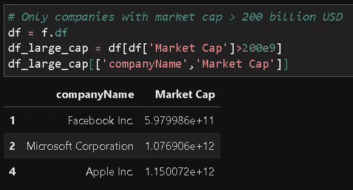

# 使用简单的 Python 包提取和分析金融数据

> 原文：<https://towardsdatascience.com/pull-and-analyze-financial-data-using-a-simple-python-package-83e47759c4a7?source=collection_archive---------7----------------------->

## 我们演示了一个简单的 Python 脚本/包来帮助您提取财务数据(所有您能想到的重要指标和比率)并绘制它们。


图片来源: [Pixabay(免费商业使用)](https://pixabay.com/photos/entrepreneur-idea-competence-vision-1340649/)

# 介绍

股票市场分析和良好的投资(为了长期增长)需要[仔细检查财务数据](https://finance.zacks.com/evaluate-stock-investments-using-financial-statement-analysis-8024.html)。各种[指标和比率](https://www.investopedia.com/financial-edge/0910/6-basic-financial-ratios-and-what-they-tell-you.aspx)经常在这种分析中使用，即**评估股票的内在质量**。你可能在金融和投资专家的谈话中听说过其中一些。

比如 [**市盈率**](https://www.investopedia.com/investing/use-pe-ratio-and-peg-to-tell-stocks-future/) 或者**市盈率**。它是股价与年收益/每股的比率。

或者， [**每股账面价值**](https://www.investopedia.com/terms/b/bookvaluepercommon.asp) 。它是一家公司的普通股除以其发行在外的股票数量的比率。当一只股票被低估时，它的每股账面价值相对于它在市场上的当前股价会更高。

[](https://www.investopedia.com/investing/use-pe-ratio-and-peg-to-tell-stocks-future/) [## 用市盈率和钉住率评估股票的未来

### 市盈率(P/E)是投资者和分析师用来确定股票价格的最广泛使用的指标之一

www.investopedia.com](https://www.investopedia.com/investing/use-pe-ratio-and-peg-to-tell-stocks-future/) 

通常这些数据可以从雅虎财经这样的网站上获得。但是，除非您使用某种付费的注册服务，否则您不能以编程方式下载或抓取数据。

[](https://finance.yahoo.com/) [## 雅虎财经-股市直播，报价，商业和金融新闻

### 在雅虎财经，你可以获得免费的股票报价、最新新闻、投资组合管理资源、国际市场…

finance.yahoo.com](https://finance.yahoo.com/) 

然而，有许多微服务通过简单的 API 调用提供这样的数据。为了利用这一点，我们将在本文中展示，**如何编写一个简单的 Python 类脚本来与** [**金融数据微服务**](https://financialmodelingprep.com/) **进行交互。**


图片来源:作者截屏([网站](https://financialmodelingprep.com/developer/docs/))

使用这个 Python 类，您可以通过调用一系列简单的方法来提取数据并构建一个包含几乎所有重要财务指标和比率的 Pandas 数据框架。

我们还提供简单的图表方法(条形图和散点图)来图形化分析数据。

**注意，你需要从网站获取自己的秘密 API key(免费)并在实例化类对象后注册。**

也就是说，让我们研究一下 Python 包/类和它附带的各种方法。

# Python 类和各种内置方法

核心 Python 类在我的 Github repo 上可用 [**。请随意开始和叉回购，并对其进行改进。您可以简单地克隆存储库，并开始在您自己的笔记本中使用脚本。**](https://github.com/tirthajyoti/Finance-with-Python/tree/master/financeAPI)

```
**> mkdir My_project
> cd My_Project
> git clone** [**https://github.com/tirthajyoti/Finance-with-Python.git**](https://github.com/tirthajyoti/Finance-with-Python.git) **> cd financeAPI** 
```

为了保持代码的整洁，在本文中，我们在一个测试 Jupyter 笔记本中展示了该类的用法。

我们从导入常规库和类对象开始。


## 从文件中读取秘密 API 密钥并注册它

注意，您需要在与代码文件相同的目录中有一个名为`Secret_Key.txt`的文件。没有它，你就不能进步。

**在这里报名:**[**https://financialmodelingprep.com/login**](https://financialmodelingprep.com/login)


## 创建一个类实例


## 它有一个描述


## 不注册密钥，我们无法访问数据

我们肯定想现在就开始提取数据。假设我们想为苹果公司(股票代码为“AAPL”)构建一个数据字典。我们可以尝试，但不会成功，因为我们还没有向类对象注册密钥。


## 所以，我们注册了密钥


## 现在让我们建立一个数据字典

对于这个类中的所有方法，我们必须传递公司的股票代码(在美国金融市场上)。对苹果公司来说，这是“AAPL”。


如果我们检查这个字典，我们会注意到大量的数据是从 API 端点提取的。下面提供了部分截图。


## 用多家公司的数据构建一个数据框架

使用 Python 字典很好，但是对于大规模数据分析，我们应该考虑构建一个 Pandas 数据框架。我们提供了一个内置的方法来做到这一点。构建一个数据框架就像传递一个股票代码列表一样简单，代码会为您完成所有的数据搜集和结构化工作。

假设我们想下载以下公司的所有财务数据，

*   推特
*   脸谱网
*   微软
*   英伟达
*   苹果
*   销售力量


一个格式良好的数据帧已经准备好供您使用了！


## 究竟什么样的数据是可用的？

我们可以很容易地检查从 API 服务中提取的数据类型。注意，我们传递一个参数“profile”、“metrics”或“ration”，并获取相应数据项的列表。


## 开始绘图—可视化分析

在这个包中，我们已经包含了对数据进行简单可视化分析的代码。

在简单的条形图中检查各种指标和财务比率通常很有帮助。为此，只需传递您想要绘制的变量的名称。您还可以包含常见的 Matplotlib 关键字参数，如颜色和透明度(alpha)。


您还可以绘制简单的散点图，直观地分析财务指标之间的相互关系。


您还可以传递第三个变量，用于缩放散点图中标记的大小。这有助于以一种间接的方式，在一个二维图中可视化两个以上的变量。例如，我们在下面的代码中将股价参数作为第三个变量传递。


# 使用底层数据框架进行自定义分析

通常，投资者可能希望利用现有数据创建自己的过滤器和投资逻辑。

例如，我们可能只想考虑那些市值超过 2000 亿美元的公司，然后在条形图中查看*企业价值相对于 EBIDTA* 的度量。

我们可以访问底层数据帧，创建自定义数据帧，然后将该自定义数据帧分配给新的`financeAPI()`对象，以利用现成的图表方法。

这样，我们就不需要再向 API 请求数据了。**我们要尽量避免数据读取，因为 free API key 读取数据的数量有限制。**



然后我们根据这个自定义数据框架(嵌入在自定义类对象中)绘制一个条形图。


# 摘要

我们展示了一个简单 Python 类/包的实现和用法，该类/包可用于从微服务中提取各种财务指标和比率。

需要向服务注册才能获得免费的 API 密钥。当然，就免费帐户读取的数据数量而言，这种使用是有限的。该网站还有[无限使用的付费计划](https://financialmodelingprep.com/developer/docs/pricing/)。

请注意，这项工作侧重于年度财务报表中可用的静态财务数据，而不是动态时序股票市场定价数据。它应该被用来衡量一家公司的长期财务实力，以进行增长型投资。

作为一名数据科学家，您可能经常需要编写定制的类/包来从微服务 API 中提取和分析数据，希望本文(以及相关的代码库)能够为您提供简单而有效的知识介绍。


图片来源: [Pixabay(免费商业使用)](https://pixabay.com/photos/money-coin-investment-business-2724241/)

答另外，你可以查看作者的 [**GitHub**](https://github.com/tirthajyoti?tab=repositories) **知识库**中机器学习和数据科学的代码、思想和资源。如果你和我一样，对人工智能/机器学习/数据科学充满热情，请随时[在 LinkedIn 上添加我](https://www.linkedin.com/in/tirthajyoti-sarkar-2127aa7/)或[在 Twitter 上关注我](https://twitter.com/tirthajyotiS)。

[](https://www.linkedin.com/in/tirthajyoti-sarkar-2127aa7/) [## Tirthajyoti Sarkar - Sr .首席工程师-半导体、人工智能、机器学习- ON…

### 通过写作使数据科学/ML 概念易于理解:https://medium.com/@tirthajyoti 开源和有趣…

www.linkedin.com](https://www.linkedin.com/in/tirthajyoti-sarkar-2127aa7/)