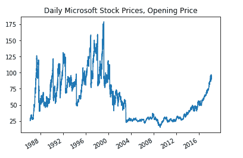

# 将金融时间序列数据引入 Python:一些免费选项

> 原文：<https://towardsdatascience.com/pulling-financial-time-series-data-into-python-some-free-options-dbc2df67d9b7?source=collection_archive---------16----------------------->

## 将股票价格数据直接导入 Python 进行下一步分析

获取金融时间序列数据集可能会很麻烦。幸运的是，互联网上有很多方法可以将金融时间序列数据直接导入 Python 进行分析。更好的是，这些选项中有许多是免费的。在本教程中，我们将使用以下免费 API 选项将金融时间序列数据导入 Python:

*   [阿尔法优势](https://www.alphavantage.co/)
*   [Quandl](https://www.quandl.com/)

在这两个 API 之间，我们应该能够访问绝大多数金融数据集，包括每日和当天的股票价格数据。

# 使用 Alpha Vantage API 提取数据

总部位于马萨诸塞州波士顿的 Alpha Vantage 是历史和实时股票数据、实物货币数据和加密货币数据的免费 API 的领先提供商。获得一个免费的 API 密钥来访问它的数据库很简单。进入[该网页](https://www.alphavantage.co/support/#api-key)，按照提示填写您的联系方式:


*填写您的联系方式，申领您的免费 API 密钥*

一旦你完成了，Alpha Vantage 会在它的网页上打印一个 API 密匙供你个人使用。您可以使用这个键将数据直接拉入 Python 进行分析。

## 下载所需的库

Alpha Vantage 有一个专门针对其 API 的 Python 库。进入命令提示符并输入以下内容来下载 Alpha Vantage 的 API 包:

```
pip install alpha-vantage
```

## 当天时间序列数据

通过 Alpha Vantage 的 API 提取时间序列数据有几个选项，这取决于您想要的数据频率级别。我们将介绍的第一种方法是日内数据，我们希望提取数据频率为 1 小时或更少的时间序列。

我们使用以下代码提取 Google 股票的时间序列数据，数据频率为 15 分钟:


*谷歌股价(高位)，15 分钟间隔数据*


*返回的当天 Google 股票时间序列数据快照。数据包括开盘价、最高价、最低价、收盘价和成交量信息。*

我们使用*pull _ intraday _ time _ series _ alpha _ vantage()*函数提取时间序列数据。该功能允许 1 分钟、5 分钟、15 分钟、30 分钟和 60 分钟的采样频率。

我们将 API 键、股票代码名称(' GOOGL ')和期望的采样频率作为参数传入。该函数以 15 分钟的数据采样频率返回包含股票数据(包括开盘价、最高价、最低价、收盘价和成交量数据)的数据帧，以及与时间序列相关联的元数据数据帧。

## 每日时间序列数据

除了日内数据之外，Alpha Vantage 的 API 还允许您提取每日时间序列数据。提取每日数据的调用方法类似于提取当天数据的调用方法，如下面的代码片段所示:


*伯克希尔·哈撒韦公司股价(高位)，每日数据*


*返回的每日伯克希尔哈撒韦股票数据的快照。数据包括开盘、盘高、盘低、收盘、调整收盘和成交量信息。*

在上面的代码块中，我们提取了伯克希尔哈撒韦公司股票的每日时间序列数据，追溯到 100 天前。我们在 *main()* 块中调用*pull _ daily _ time _ series _ alpha _ vantage()*函数。该函数接受我们的 API 键，股票代号(在本例中是“BRK。b”)和 *output_size* 作为参数。 *output_size* 变量与我们希望返回多少数据有关。默认设置“compact”返回股票过去 100 天的每日数据。如果我们将 *output_size* 设置为“full ”,则返回完整的时间序列。这可能是二十多年的日常数据！

***上面的例子只是对 Alpha Vantage 的 API 功能的简单介绍。有关使用他们的 API 的更多信息，请查看完整的 API 文档:***[***https://www.alphavantage.co/documentation/***](https://www.alphavantage.co/documentation/)

# 使用 Quandl API 提取数据

Quandl 位于加拿大多伦多，拥有超过 400，000 名用户，并提供对开放、商业和替代数据集的访问。数据以易于理解的格式提供，非常适合数据分析。

就个股数据而言，Alpha Vantage 胜过 Quandl，因为 Quandl 对访问大多数日内数据集收费(不过，每日股价数据是免费的)。然而，Quandl 免费提供了大量其他数据集。快速浏览[他们的“免费”数据集页面](https://www.quandl.com/search?filters=%5B%22Free%22%5D)会发现一个免费数据集的宝库，包括:

1.  [Wiki 连续期货数据](https://www.quandl.com/data/CHRIS-Wiki-Continuous-Futures)，其中包含 600 个期货的连续合约。基于芝加哥商品交易所、洲际交易所和伦敦国际期货交易所的数据。
2.  [Zillow 房地产数据](https://www.quandl.com/data/ZILLOW-Zillow-Real-Estate-Research)，包括房屋供求数据。该数据集还包括按大小、类型和层级划分的住房和租金数据，这些数据可以是按邮政编码、社区、城市和州划分的子集。
3.  [美联储经济数据](https://www.quandl.com/data/FRED-Federal-Reserve-Economic-Data)，包括美国的增长、就业、通胀、劳动力和制造业数据。

出于本教程的目的，我们将通过 Quandl 的 API 提取美联储数据，以及每日股票价格数据。

## 获取您的 Quandl API 密钥

要获得免费的 Quandl API 密匙，在这里注册一个 Quandl 账户[。](https://www.quandl.com/sign-up-modal?defaultModal=showSignUp)


*Quandl 报名页面*

一旦您成功创建了一个帐户，您应该会收到一封来自 Quandl 的电子邮件来验证您的帐户。验证并激活您的帐户后，请访问您的个人资料页面，该页面清楚地显示了您的 API 密钥:


*Quandl 个人资料页面，其中包含您的 API 密钥*

## 下载所需的库

Quandl 有一个特定的 Python 包来处理它的 API。转到命令提示符并输入以下内容来下载 Quandl API 库:

```
pip install quandl
```

## 提取时间序列数据

***美联储经济数据***

在我们编写任何代码之前，让我们通过其 [Quandl 文档页面](https://www.quandl.com/data/FRED-Federal-Reserve-Economic-Data/documentation)查看一下美国美联储经济数据(FRED)下可用的不同时间序列集:


*FRED 数据集中可用的一些时间序列的快照，可通过* [*FRED 文档页面*](https://www.quandl.com/data/FRED-Federal-Reserve-Economic-Data/documentation) 获得

正如您在上面的快照中看到的，有许多时间序列集可供使用。为简单起见，我们来拉一下国内生产总值(GDP)的时间序列。在下面的代码片段中，我们将季度美国 GDP 时间序列数据放入 Python:


*季度 GDP 数据*


*返回的 GDP 时间序列快照*

我们将 Quandl API 键定义为 *quandl。ApiConfig.api_key* 参数。我们使用 quandl 的 *get()* 函数调用 GDP 数据。“FRED/GDP”作为数据集名称传递——这是我们的时间序列的特定标识符。我们首先通过它所属的主数据存储库引用一个特定的数据集名称—在本例中是‘FRED’—后跟一个斜杠，然后是特定的数据集名称(这里是‘GDP’；该值可在[主数据集的文档页面](https://www.quandl.com/data/FRED-Federal-Reserve-Economic-Data/documentation)中找到。

***日终股价数据***

尽管 Quandl 不像 Alpha Vantage 那样提供免费的当日股价数据，但它确实提供每日收盘时的股价数据。我们可以使用以下代码获取微软股票的每日价格数据:



*每日微软股票价格，开盘价*

上面的代码与前面的例子略有不同，因为我们使用了 quandl 的 *get_table()* 函数，而不是它的 *get()* 函数。函数的作用是:返回一个包含多列的熊猫数据帧。相比之下， *get()* 返回单个时间序列。由 *get_table()* 调用返回的数据集快照如下所示:


每日微软股票数据，通过 quandl 的 get_table()函数返回

如您所见，返回的 Microsoft stock dataframe 包含股票的开盘价、最高价、最低价、收盘价、成交量和调整值的时间序列数据。

除了上面列出的两个例子，Quandl API 还提供了许多其他功能。有关 Quandl 的 Python API 插件的更多信息，请查看他们在 [***这个 Github repo***](https://github.com/quandl/quandl-python)***中的文档。***

# 结论

本文中涉及的两个 API 都免费为您的下一个时间序列分析提供了广泛的财务数据(如果您正在寻找一个特定的数据集，可以使用高级选项)。获取高质量的数据是数据科学中最大的挑战之一。幸运的是，像 Quandl 和 Alpha Vantage 这样的 API 服务使得获取用于数据探索和算法开发的金融时间序列集变得前所未有的容易。

# 我关于使用免费 API 将金融时间序列数据导入 Python 进行分析的教程到此结束！关于本教程中使用的完整代码，请查看 Github repo 。

# 查看我的其他时间序列分析教程:

[](https://techrando.com/2020/01/04/time-series-forecasting-using-a-seasonal-arima-model/) [## 使用季节性 ARIMA 模型的时间序列预测:Python 教程

### 时间序列预测中研究最广泛的模型之一是 ARIMA(自回归综合移动…

techrando.com](https://techrando.com/2020/01/04/time-series-forecasting-using-a-seasonal-arima-model/) [](https://techrando.com/2019/07/19/analyzing-electricity-price-time-series-data-using-python-time-series-decomposition-and-price-forecasting-using-a-vector-autoregression-var-model/) [## 使用 Python 分析电价时间序列数据:时间序列分解和价格…

### 欢迎来到科技兰多博客！本教程涵盖了时间序列分解和向量自回归(VAR)…

techrando.com](https://techrando.com/2019/07/19/analyzing-electricity-price-time-series-data-using-python-time-series-decomposition-and-price-forecasting-using-a-vector-autoregression-var-model/) [](https://techrando.com/2019/08/23/unsupervised-machine-learning-approaches-for-outlier-detection-in-time-series/) [## 时间序列中离群点检测的无监督机器学习方法

### 在这篇文章中，我将介绍一些我最喜欢的检测时间序列数据中异常值的方法。有许多不同的…

techrando.com](https://techrando.com/2019/08/23/unsupervised-machine-learning-approaches-for-outlier-detection-in-time-series/) 

*原载于 2020 年 1 月 12 日*[*【https://techrando.com】*](https://techrando.com/2020/01/12/pulling-financial-time-series-data-into-python-some-free-options/)*。*