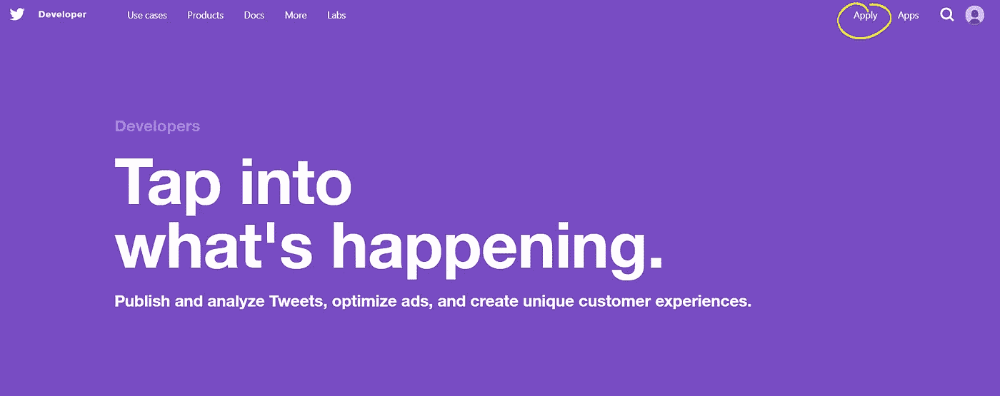
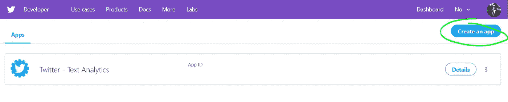
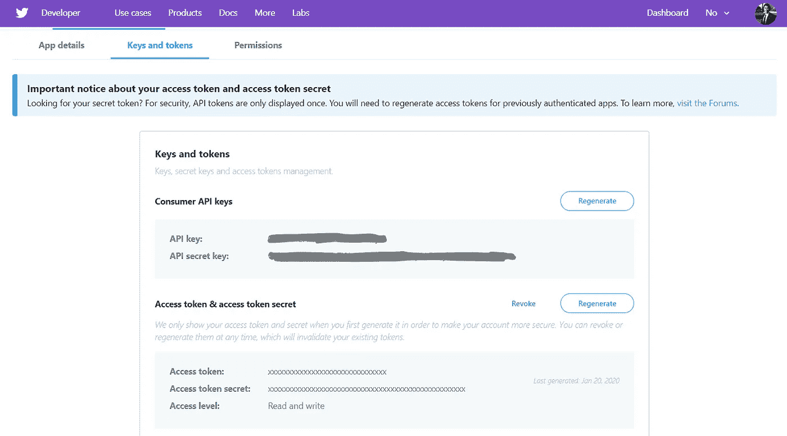
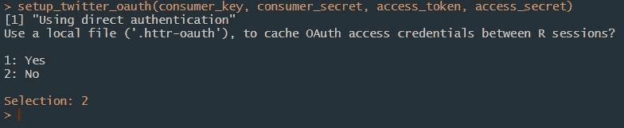
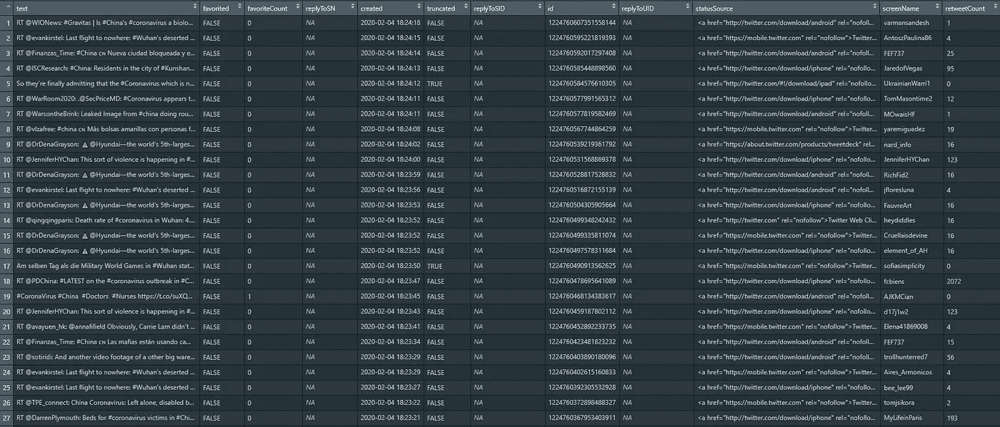

# 将推文拉入 R

> 原文：<https://towardsdatascience.com/pulling-tweets-into-r-e17d4981cfe2?source=collection_archive---------17----------------------->

## 链接 Twitter 的 API 的教程


Kon Karampelas 在 [Unsplash](https://unsplash.com?utm_source=medium&utm_medium=referral) 上拍摄的照片

在本教程中，我将向您展示建立 Twitter 开发者帐户所需的步骤，这样您就可以利用他们的 API，然后将 tweets 直接拉入您的 R Studio 环境中。

# 1.申请一个 Twitter 开发者账户

你需要一个 Twitter 开发者账户，因为它可以让你访问一个个性化的 API 密匙，这是我们以后需要的。这个密钥对每个帐户都是唯一的，所以你不能共享它。

访问 [Twitter 开发者](http://developer.twitter.com/)并创建一个账户。如果你愿意，你可以使用相同的登录凭证登录你的个人 Twitter 账户。

您将需要申请一个帐户，所以请确保按照步骤操作。设置帐户可能需要一些时间，因为您需要回答几个问题。大多数问题需要大量的输入，所以尽你所能回答它。

如果你被卡住了，这是一个关于如何申请的极好的视频。

[*设置 Twitter API 开发者账户*](https://www.youtube.com/watch?v=2o_qt9cXicM)



申请开发者账号

# 2.创建 Twitter API 应用程序

开发人员帐户可能需要几个小时或几天才能获得批准。这取决于你对申请的回答有多好。有时他们可能会联系你以获取更多信息。

批准后，前往导航栏的右上角，选择应用程序。在这里，您将希望创建一个应用程序，它是生成 API 密钥的一部分。

如果你迷路了，这是一个很好的 API 密匙后续视频。

[*创建 Twitter API 应用*](https://www.youtube.com/watch?v=IlSVJCBqxys)

现在你已经设置好了，让我们从 R Studio 开始吧！



创建应用程序后，您应该会在仪表板上看到您的第一个应用程序。

# 3.安装/加载 twitteR 包

twitteR 是一个 R 包，提供对 Twitter API 的访问。支持 API 的大部分功能，偏向于在数据分析中比日常交互更有用的 API 调用。

```
install.packages("twitteR") #install package
library(twitteR) #load package
```

# 4.将 API 链接到 R Studio

对于这一步，您需要访问您的 Twitter 开发者帐户，并导航到您创建的应用程序。如果您还没有这样做，请生成新的 API 密钥和访问令牌。



Twitter 应用程序密钥(为了隐私，我的密钥被隐藏了)

```
consumer_key <- 'XXXXXXXXXXXXXX'
consumer_secret <- 'XXXXXXXXXXXXXX'
access_token <- 'XXXXXXXXXXXXXX'
access_secret <- 'XXXXXXXXXXXXXX'
```

使用 R，复制上面的代码并将你的键粘贴到它们各自的变量中。(包括引号)

# 5.设置身份验证

使用函数 *setup_twitter_oauth()* 将您的键链接到 twitter 的 API。

```
setup_twitter_oauth(consumer_key, consumer_secret, access_token, access_secret)
```

运行上面的代码后，您会得到一个提示。您可以选择是否使用本地文件来缓存访问，但我通常不这样做。如果不想使用本地文件，请输入数字 2 并按 enter 键。



# 6.拉推文

既然我们已经完成了设置 API 的所有步骤，现在我们可以拉推了。下面我们来分解一下功能。

```
virus <- searchTwitter('#China + #Coronavirus', n = 1000, since = '2020-01-01', retryOnRateLimit = 1e3)virus_df = twListToDF(virus)
```

第一行代码使用了 *searchTwitter* 函数。我们传递尽可能多的与我们的搜索相关的#标签，在这个例子中，是#中国和#冠状病毒。

目前是 2020 年 2 月 4 日，此时， [**冠状病毒**](https://www.who.int/health-topics/coronavirus) 已经引起世界恐慌，因为它蔓延到中国以外的更多国家。

*   **n** 参数是我们想要获取的推文数量。
*   **因为—** 是您想要推文的时间段
*   **retryOnRateLimit** —指示当速率受限时是否等待并重试。仅当期望回报(n)超过可用请求的剩余限制时，此参数才有意义

最后一行代码使用了 twListToDF 函数，该函数将推文保存到数据帧中。



所有推文的数据框架

查看所有的推文，我们可以看到，有一个独特的列可以帮助识别他们的推文活动。

# 7.后续步骤

现在你已经把你的推文保存在一个数据框中，最好开始分析和发现任何模式或趋势。一个很好的开始方式是将推文标记化，并从文字中提取见解。如果你有兴趣了解更多，请查看我的[符号化](/text-analytics-in-r-ae23df8ee928?source=your_stories_page---------------------------&gi=204d29521350)教程。