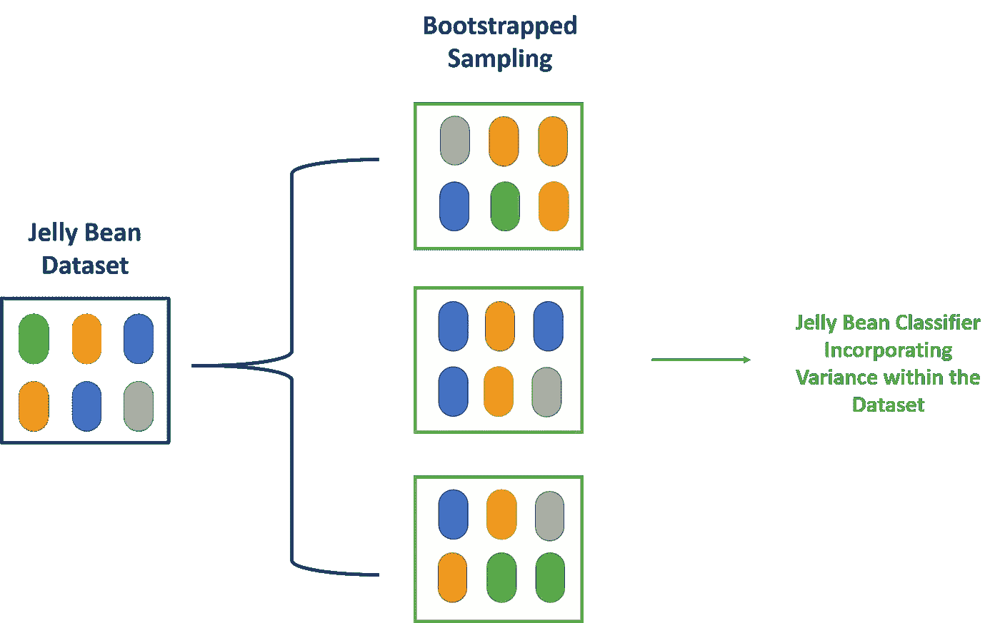

# 通过引导获取您的数据

> 原文：<https://towardsdatascience.com/pulling-your-data-up-by-the-bootstraps-3f9d2a904bec?source=collection_archive---------41----------------------->

## 什么是自举，我们为什么要使用它？


沙哈达特·拉赫曼在 [Unsplash](https://unsplash.com?utm_source=medium&utm_medium=referral) 上拍摄的照片

如果你使用任何大型数据集，你可能听说过 bootstrapping。如果你是一名新兴的统计学家或生物信息学家，这是你计算工具集的一部分。使用这个功能有什么意义？更重要的是，自举到底是什么？

布拉德利·埃夫隆在 1979 年首次发表了自举的观点。随着计算能力变得越来越便宜和可用，这种计算机密集型技术变得越来越流行和有用。事实上，研究人员已经引用了 bootstrapping 方法超过 2 万次。

当处理大型数据集时，我们的目标是对从中提取数据的总体进行推断。虽然我们可以计算平均值或中位数，但我们不知道这种估计的确定性。如果我们增加样本量，我们可以减少误差，接近总体参数。然而，如果我们正在进行 RNA 测序或收集大量数据，增加样本量是昂贵的，甚至是不可能的。Bootstrapping 是一种重采样方法，可以帮助我们确定误差和置信区间。无论你是在看股票市场数据、系统进化树还是基因转录本丰度，来自后来的自举的结果都会告诉你结论。

# 定义引导

自举是一种使用替换进行重采样的方法。我们将通过一个例子来解释这是如何工作的，以及这种方法的假设。

假设我们有一个数据集，显示篮球运动员在生日时露面的费用。但是，你很难联系到 8 个以上的玩家，所以你的数据集，本例中的 *D，*包含 8 个值。因为我们与各种不同的篮球运动员交谈，从冷板凳队员，以确保你的样本足够类似于整个群体的球员。

这就是我们的统计假设:我们的数据样本接近总体分布。

```
*D* = {100, 200, 200, 300, 500, 1000, 1000, 750}
```

这里我们样本的平均值是 506.25。如果我们对这个样本进行几次引导，我们将对这个数据集中的方差有一个更好的了解。引导包括替换重采样。我们重新采样的引导程序每个将有 8 个值，但是由于它们是用替换重新采样的，相同的值(即 100)可能会出现多次。这样，引导每次运行时都会生成不同的估计值。然而，有了足够的引导，我们可以生成数据中方差的近似值。请注意以下事项:

1.  我们不会向数据集添加任何新点。
2.  每个重新采样的 bootstrap 都包含与原始样本相同数量的值。
3.  由于我们使用替换进行重采样，因此在整个引导过程中，对任何值进行重采样的概率都是相同的。每个值都被绘制为独立的事件。如果我们重新采样的第一个值是 200，这不会改变该引导中第二个值也是 200 的概率。

```
*D₁* = {100, 1000, 500, 300, 200, 200, 200, 100}
*D₂* = {300, 1000, 1000, 300, 500, 100, 200, 750}
*D₃* = {750, 300, 200, 200, 100, 300, 750, 1000}
```

D₁、D₂、D₃的平均值为 325，518.75，450。然后，我们可以使用这些值来生成标准误差、置信区间和其他感兴趣的度量。使用 Python、R 或其他语言，很容易生成 50、100 甚至 1000 个自举样本。了解样本的偏差、方差和分布有助于我们对样本总体做出更好的推断。它有助于你将样本的稳健性融入到其余的推理中。

为了这个例子，我们使用了一个小的数据集。一般来说，自举不适用于小数据集、有许多离群值的数据集或涉及相关数据度量的数据集。

如果你在可视化这个方法上仍然有困难，我已经在下面展示了在一个软糖数据集上的引导过程。



由西蒙·斯皮切克创作

# 使用 Bootstrap 进行生物信息学研究

## 例子 1:系统进化树

Bootstrapping 帮助我们确定系统发育树中特定分支的置信度。我们可能正在寻找蛋白质的氨基酸序列或基因的核苷酸序列。我们的原始样本可以快速重采样 1000 次，重建 1000 棵自举树。如果你的原始树显示一个特定的蛋白质或基因序列分支，你可以检查你的引导树，看看这个分支出现的频率。如果它出现超过 950 次，您可以相当确定您的数据是健壮的。如果它只出现 400 次左右，那么它可能是由异常值引起的。

## 实施例 2:估计基因转录丰度

Sleuth 软件使用 bootstrap 方法估计基因转录丰度。通过重新采样我们的下一代测序读数，我们可以计算出一个更可靠的转录丰度估计值。重新采样让我们了解了数据中的技术可变性。当估计特定基因或转录物在数据集中是否增加时，技术变异与生物变异一起使用。

自举的其他用途包括为集成机器学习进行聚合。基本上，我们的数据集被多次重采样。每个自举样本然后通过我们的分类器或机器学习模型运行。我们可以一起使用所有的输出来生成更准确的分类器。这可以防止我们根据有限的样本过度拟合数据。

# **参考文献**

1.  自助方法:对折刀法的另一种看法。安。统计学家。第 7 卷(1979 年)，第 1 号，第 1 至 26 页。doi:10.1214/aos/1176344552。[https://projecteuclid.org/euclid.aos/1176344552](https://projecteuclid.org/euclid.aos/1176344552)
2.  埃夫隆，布拉德利，伊丽莎白哈洛兰和苏珊·霍尔曼。"种系发生树的引导置信水平."*美国国家科学院学报*93.23(1996):13429–13429。
3.  [https://hbctraining . github . io/DGE _ workshop _ salmon/lessons/09 _ sleuth . html](https://hbctraining.github.io/DGE_workshop_salmon/lessons/09_sleuth.html)