# 常用 Viz 的用途—数据科学和分析

> 原文：<https://towardsdatascience.com/purpose-of-frequently-used-viz-data-science-analytics-6b0ec8d2c2ad?source=collection_archive---------30----------------------->

在数据分析领域工作了 3 年多，我可以说数据可视化在提供有见地的建议方面发挥了巨大的作用。

无论是参加面试还是招聘分析师，我总是希望在准备面试时能有快速笔记。我走上前，提出了一些我多年来工作过的地块的集体信息。

以下是数据分析和数据科学领域中一些最广泛使用的图。这些只是对它们何时被广泛使用的快速注释。

**散点图:**

*   双变量分析
*   两个变量之间的趋势和模式
*   理解两个变量之间的关系

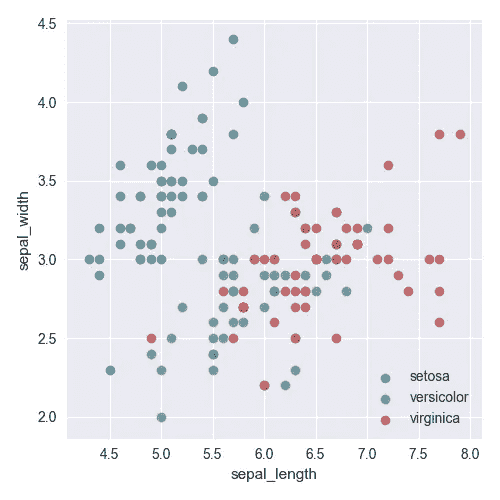

**结对剧情:**

*   多个散点图显示两个以上变量之间的关系
*   稍微调整一下，可以帮助我们了解变量之间的回归程度

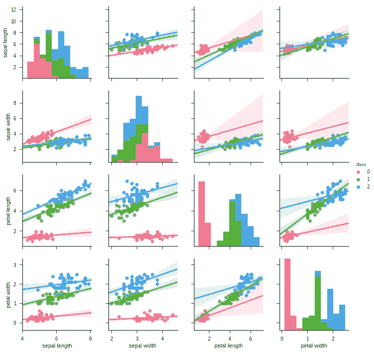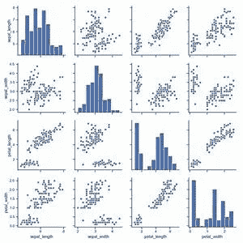

**热图:**

*   基于该措施的彩色视觉效果
*   配对图—了解正相关和负相关
*   混淆矩阵，用于根据 TP、TN 指标确定模型执行的好坏

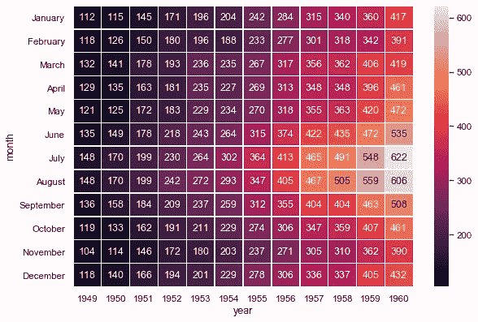

**条形图:**

*   双变量和多变量分析
*   比较分类变量的数字、频率
*   例如:活动前与活动后的表现

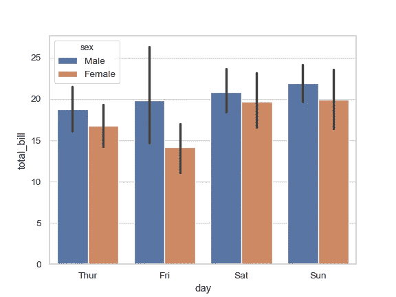

**计数图:**

*   从组中找到最常用的类别
*   单变量分析(年龄或性别频率)

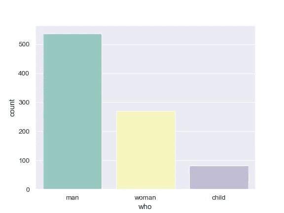

**堆积条形图:**

*   对整体的各个部分进行分类和比较
*   例子:在男性和女性群体中，有多少人幸存？

折线图:

*   分析一段时间或特定变量的趋势和模式
*   例如:时间序列分析图

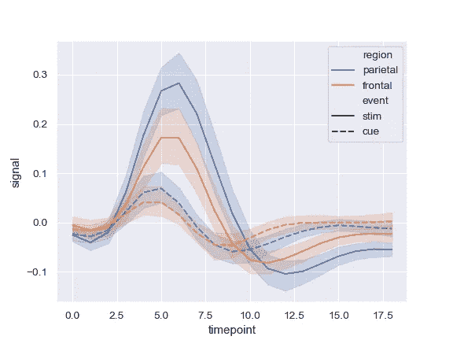

**方框图:**

*   数据准备的许多重要步骤之一
*   找出数据中的异常值
*   为我们提供四分位数范围(IQR)

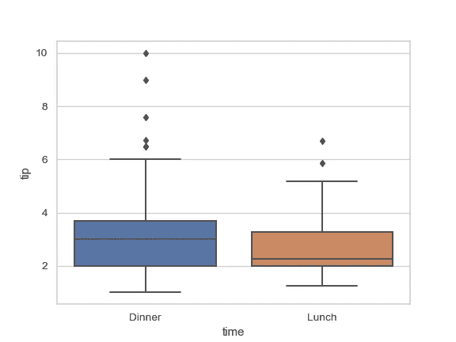

**直方图:**

*   允许我们分析数据分布
*   找出偏斜度——正偏斜度还是负偏斜度

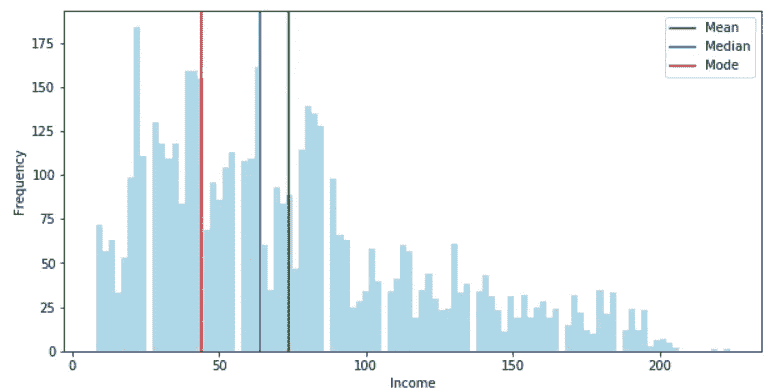

**仪表图:**

*   主要用作目的/目标指标
*   提供关于目标是否实现或指标绩效如何的见解

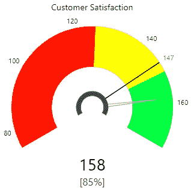

**饼图:**

*   变量占总数的比例
*   饼图的视觉变体是圆环图

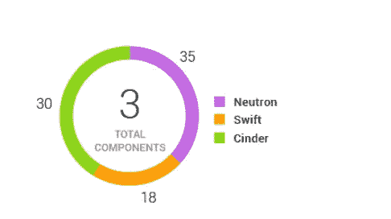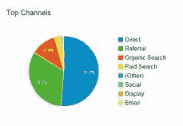

左图是“甜甜圈图”，右图是“饼图”

**漏斗图:**

*   了解一段时间内的数据流
*   最广泛用于分析活动和网站绩效

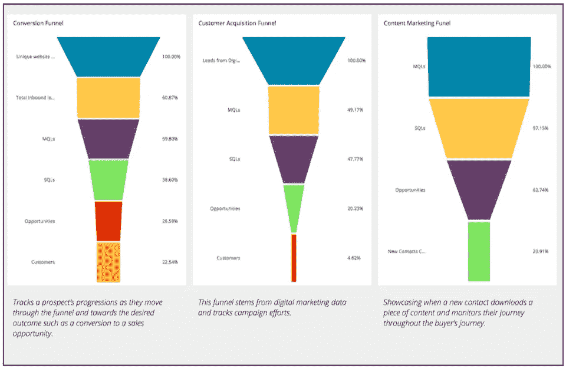

**带指标的表格图:**

*   简单显示带有 KPI(关键绩效指标)指标的数据
*   帮助我们显示绩效比率(例如，下图表示每周运动-开盘价)

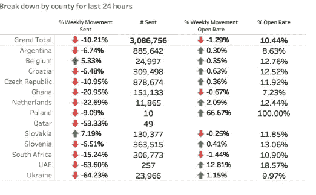

**树状图:**

*   数据的层次结构，由具有父子层次结构的嵌套矩形组成
*   根据颜色和大小提供深刻的分析

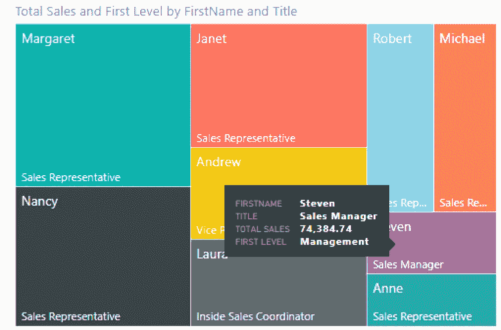

> **奖励:**
> 
> 热图和树状图的区别:
> 
> 在热图中，一个度量可以分配给颜色，另一个度量可以分配给大小。布局类似于值被编码为颜色的表格
> 
> 在树形图中，使用 1 个或多个维度&最多 2 个度量来创建。节点越大，值就越大。这些嵌套矩形的大小从图表的左上角到右下角，最大的位于左上角，最小的位于右下角。