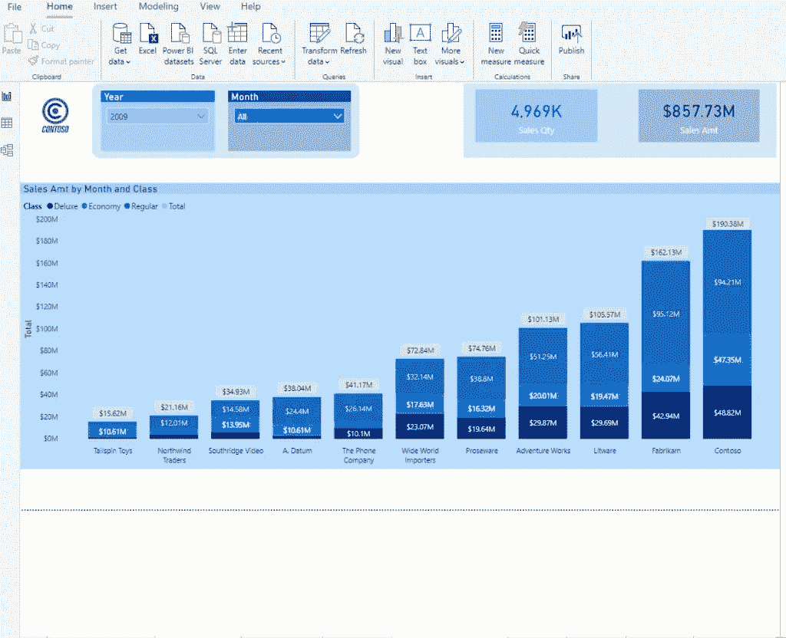
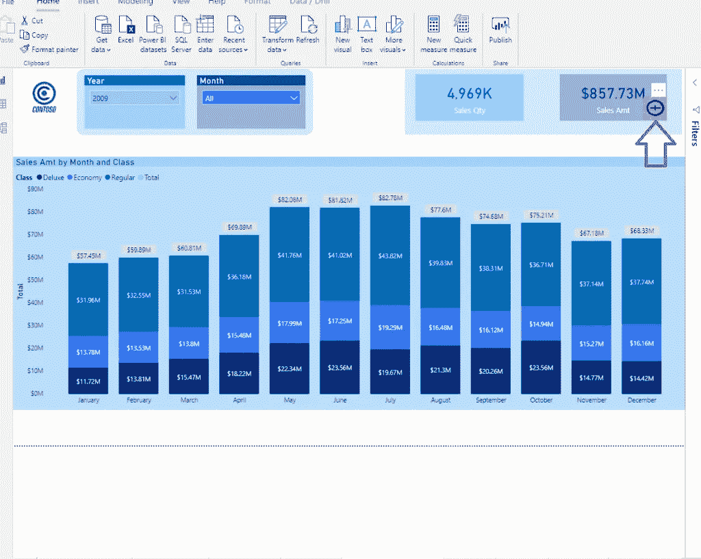
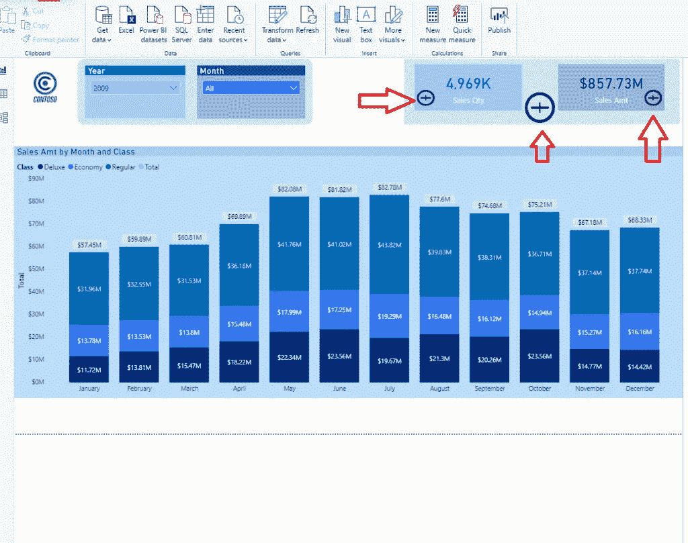
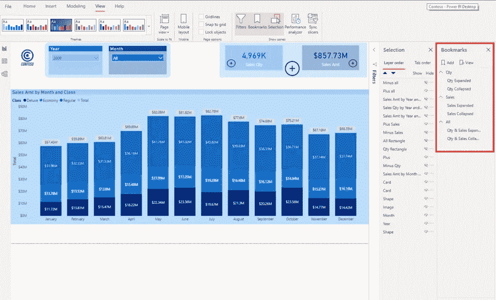
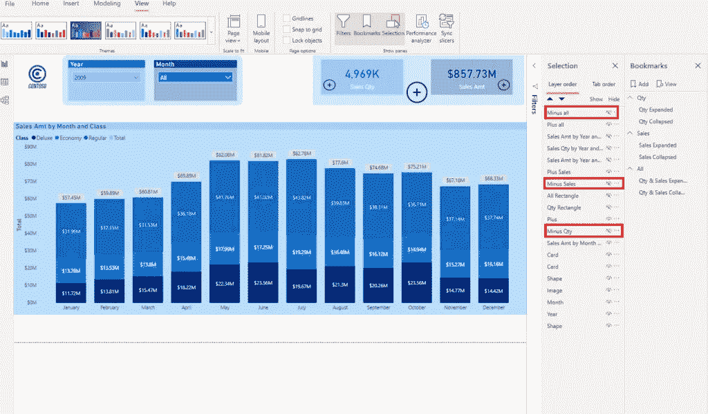
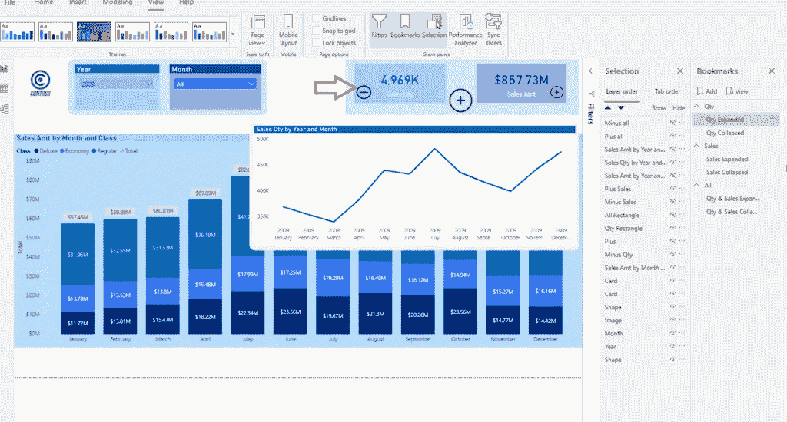
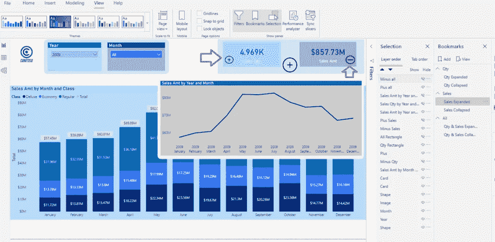
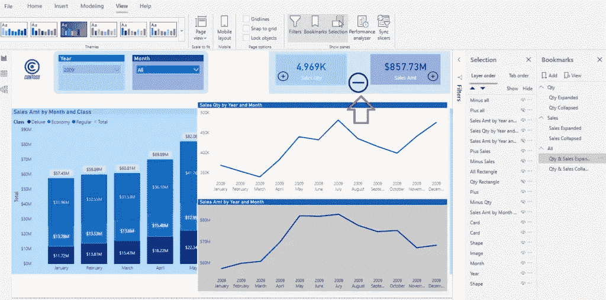
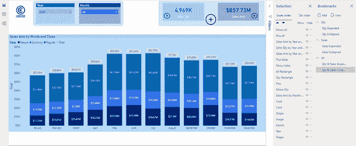

# 将显卡视觉效果提升到 Power BI 的新水平

> 原文：<https://towardsdatascience.com/push-card-visuals-to-a-new-level-in-power-bi-174db7deaa7?source=collection_archive---------18----------------------->

## 为传统的 Power BI 视觉效果注入新的活力，并了解如何通过简单的变通方法实现扩展/折叠功能

照片由 Nati Torjman 在 Pexels 上拍摄

我喜欢 Power BI，因为它提供了一整套可视化和[开箱即用的解决方案](/drillthrough-like-a-pro-in-power-bi-ed92effcfe72)来将几乎每一个业务请求转换成一个闪亮的报告。不要误解我的意思，Power BI 不仅仅是一个数据可视化工具，它可以作为一个全面的 ETL 解决方案在许多场景中使用。

然而，当涉及到特定的用户请求时，Power BI 当然有一些限制。在这些情况下，为了实现期望的功能，一些变通方法和调整是必要的。

## 展开/折叠功能

其中之一是扩展/折叠矩阵之外的视觉功能。即使在 Matrix visual 中，在 2019 年 11 月更新之前，也无法使用“+”符号进行扩展。

对于来自 SSRS 世界的我们来说，这是如此的奇怪和出乎意料。好了，矩阵已经包括在内了，但是如果我们想把同样的功能应用到其他视觉效果上，比如卡片视觉效果。

请继续关注，我将向您展示一个解决方法，这样您就可以实现这个目标。像往常一样，我将使用 Contoso 示例数据库进行演示。

## 方案

假设我有一个报表页面，在中间显示一个堆积柱形图，在右上角显示两个卡片图像，显示销售数量和销售金额:

现在，假设我想让我的用户有可能更深入地了解这些数字的细节。使用工具提示页面，我在[这篇文章](/enhance-power-bi-report-with-tooltip-pages-3ae472b43e2)中描述过，是一个简单快捷的解决方案。但是，工具提示是静态的，它们只显示底层数据，没有提供与之交互的机会。

因此，我决定用书签来模拟展开/折叠功能。书签是 Power BI 中非常有用的技术，我经常使用它们。

简而言之，书签捕获报告页面的当前状态(所有 ***可见*** 视觉效果都在上面),您可以通过将 Action 属性设置为 bookmark，使用按钮/图像在不同的书签之间导航。

关于书签的更广泛的解释超出了本文的范围，所以请记住，书签是一种非常有用的技术，可以定制您的报告并改善整体用户体验。

## 步骤 1 —插入图像并创建书签

我们需要做的第一件事是给我们的用户一个提示，告诉他们可以用卡片视觉效果做什么。我已经为“+”和“-”符号导入了两个透明图标，我相信这足够直观了。

将两个图标一个放在另一个上面，如下图所示:

对销售数量卡片视觉效果做同样的操作，我们也将在卡片中间放另一对。该图标将使用户能够同时展开/折叠两张卡片，而小图标将处理特定的卡片。

现在，真正的魔法需要被创造出来。在“视图”选项卡下，启用书签和选择窗格。我们将需要为每一个单独的场景两个书签:展开/折叠销售数量卡只；仅展开/折叠销售金额卡片；展开/折叠两张卡片。

这是我创建的书签窗格的屏幕截图:

## 步骤 2-设置书签内的可见性

现在，我们需要定义每个书签的外观。这意味着，当我打开报告页面时，只有“+”图标应该是可见的(这意味着我需要隐藏“-”图标)。

之后，您需要根据用户的选择设置所有视觉效果的显示/隐藏属性。说明每一个步骤需要花费大量的时间和图片，但是让我们只显示销售数量(销售金额的逻辑保持不变)。

打开“操作”字段，选择“类型”下的“书签”,然后选择“扩展书签数量”。这样，我们“告诉”这个图标将我们导航到一个专门创建的书签，该书签显示了我们需要显示的报告页面的捕获状态。

一旦您按住 CTRL 键并单击“+”号，您将看到报告页面发生了变化:

您首先会注意到的是一个新的折线图，它显示了每月的销售数量。此外，符号“+”消失了，取而代之的是“-”图标，提示用户一旦决定折叠这个扩展视图，就可以点击它。

## 第三步——摆弄书签

现在，如果用户点击销售金额“+”图标，会发生以下情况:

视觉已经改变，以显示每月的销售额数字！此外，同步“+”和“-”图标以跟随用户选择。

最后，如果用户想要通过一次点击来扩展两个卡片的视觉效果，他可以通过点击卡片之间的大“+”号来实现:

很酷吧，哈？

最后，这是最终的解决方案:

## 结论

正如我之前提到的，你可以通过工具提示页面给用户更多的洞察力，这也是一个合理的解决方案，但是它们是静态的。通过对书签的巧妙使用，你可以设置不同类型的额外视觉效果来满足用户的要求。此外，这些图像可以像常规图像一样用于交叉过滤或向下钻取，这是这种技术的最大优势。

成为会员，阅读 Medium 上的每一个故事！

订阅[这里](http://eepurl.com/gOH8iP)获取更多有见地的数据文章！