# 用 Pytorch 中的数值变量转换提高机器学习模型的精度

> 原文：<https://towardsdatascience.com/push-the-accuracy-of-machine-learning-model-with-numerical-variable-transformation-in-pytorch-9f56c56203fd?source=collection_archive---------38----------------------->


## 这个故事提供了在 Pytorch 中实现转换技术和提高代码准确性的完整指南

# 概观📙

任何机器学习的实践者都陷入了提高模型预测性能的困境。他们主要着眼于使用更强大的 SOTA 模型和更长的训练时间进行权衡。然而，在机器学习中，时间是宝贵的，模型的性能可以通过简单的一步，即**数据再处理，以更快的速度达到更好的结果。**这一步往往被遗忘或低估。

**数据预处理**的一些例子包括用**插补技术**【1】**填充**缺失值**，**用**编码**【2】转换或编码**分类变量**，通过**标准化**或**规格化**【3】转换为**数值变量**。因此，本文旨在为**转换数值变量**提供强大的方法论，以帮助机器学习模型捕捉数据中有意义的信息。

# 转化技术📄

的确，当变量的分布是正态分布时，许多机器学习算法(如线性回归和逻辑回归)会表现得更好，换句话说，对于非标准概率分布的变量，性能会下降。

**钟形的正态分布**是一个连续随机变量的概率函数，它出现在现实生活中的各种场合:人的身高、血压或考试成绩。其他非线性算法可能没有这一事实，但当数值变量具有**高斯分布**时，通常表现更好。

本文中介绍的各种有用的技术可以用来将变量转换成高斯分布，或者更可能是高斯分布。这些方法是**分位数变换**、**幂变换**和**离散化变换。**

*   **分位数变换**【4】**是一种非线性变换，它用同一等级或分位数的所有其他特征值的平均值替换某个特征值。这听起来很奇怪，但实际上非常简单。如下图所示，首先，数据按值排序。然后计算排序数据集所有列的平均值，并用平均值替换原始值。最后，将数据集返回到原始顺序，但保留规范化的值。**

**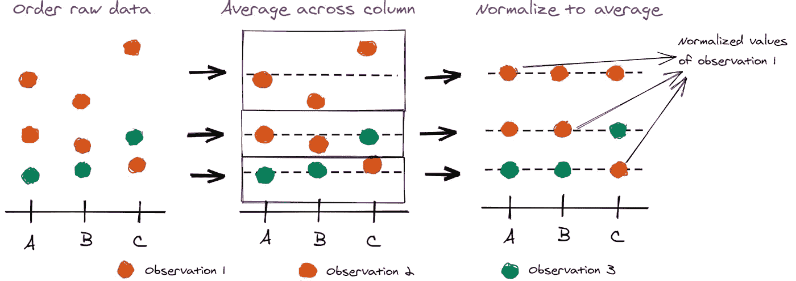**

**分位数标准化示意图(图片由作者提供)**

*   ****幂变换**【5】**属于参数单调变换家族，用于稳定方差和最小化与异方差(非恒定方差)相关的偏度问题，或其他需要正态性的情况。另一方面，当回归线周围的方差对于预测变量的所有值都不相同时，就会出现异方差。这种自动功率变换有两种流行的方法: **Box-Cox 变换**和 **Yeo-Johnson 变换**。λ是一个超参数，用于控制**幂变换的性质，**也是将变量变换为高斯概率分布的最佳方法。以下是 lambda 的一些常见值:****

****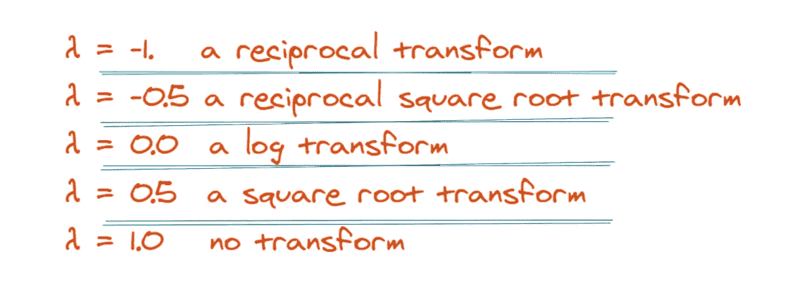****

****Lambda(图片由作者提供)****

*   ******离散化转换【6】**过程将定量
    数据转换为定性数据，也就是说，从数值属性
    转换为具有有限数量
    间隔的离散或名义属性，从而获得连续域的非重叠划分。对于用户和专家来说，离散的特性更容易理解、使用和解释。在实践中，离散化可以被视为一种数据简化方法，因为它将数据从大量的
    数值映射到一个大大减少的离散值子集，从而使学习更加准确和快速。离散化技术包括许多方法，如**宁滨、直方图、聚类、决策树、相关性等..**注意:在线性不可分数据集上，特征离散化提高了线性分类器模型的性能。然而，在线性可分的数据集上，特征离散化会降低线性分类器模型的性能(更多信息可以查看[此处](http://on%20the%20two%20linearly%20non-separable%20datasets%2C%20feature%20discretization%20largely%20increases%20the%20performance%20of%20linear%20classifiers.%20on%20the%20linearly%20separable%20dataset%2C%20feature%20discretization%20decreases%20the%20performance%20of%20linear%20classifiers./)****

# ****波士顿住房数据集实验****

****在本教程中，我将使用波士顿住房数据集，其中包含波士顿各种房屋的信息。有 506 个样本和 13 个特征变量。目标是使用给定的特征来预测房子的价格。首先是导入和加载数据****

```
**import pandas as pd DATASET_URL = "https://raw.githubusercontent.com/selva86/datasets/master/BostonHousing.csv"# read data
DATA_FILENAME = "Boston_Housing.csv"
TARGET_COLUMN = 'medv' 
dataframe = pd.read_csv(DATASET_URL)
dataframe.head()**
```

****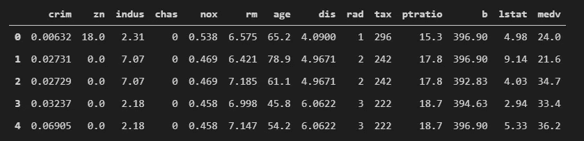****

****数据集信息****

****检查输入要素的分布****

```
**dataframe.drop('medv', axis=1).hist();**
```

****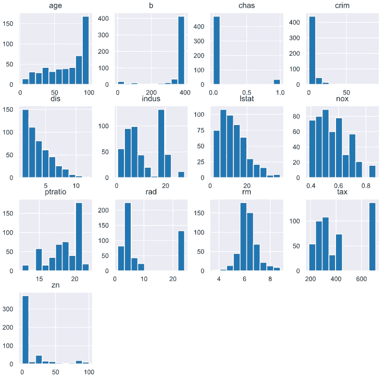****

****输入要素的分布呈偏态和非正态分布****

# ****基线模型****

****接下来，我将创建一个简单的线性模型来预测房价。****

****然后，我将输入和输出数据加载到 PyTorch 数据集并训练模型。****

****训练 10 个周期后，结果显示如下。****

****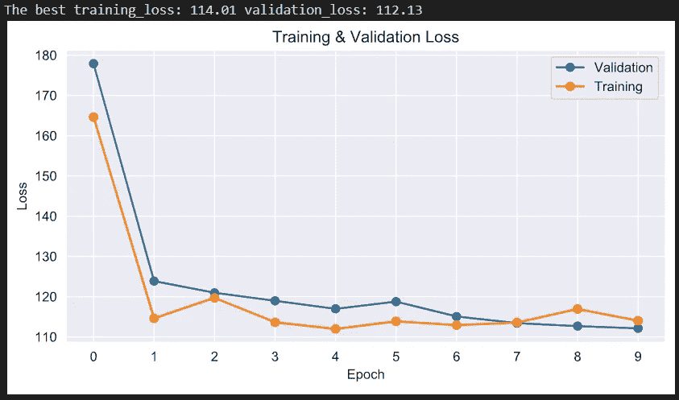****

# ****分位数变换****

****接下来，我将使用**分位数转换**来使数字变量更加高斯化。我可以使用 [sklearn](https://scikit-learn.org/stable/modules/generated/sklearn.preprocessing.QuantileTransformer.html) 中的 *QuantileTransformer* 类应用分位数转换，并将“ *output_distribution* ”参数设置为“ *normal* ”。我还必须将“ *n_quantiles* ”参数设置为小于训练数据集中观察值的值，在本例中为 100。****

```
**from sklearn.preprocessing import QuantileTransformer transformer = QuantileTransformer(n_quantiles=100, output_distribution='normal')
inputs = transformer.fit_transform(inputs_raw)**
```

****通过**分位数转换**将输入变量转换为正态概率分布后，输入分布如下图所示。****

****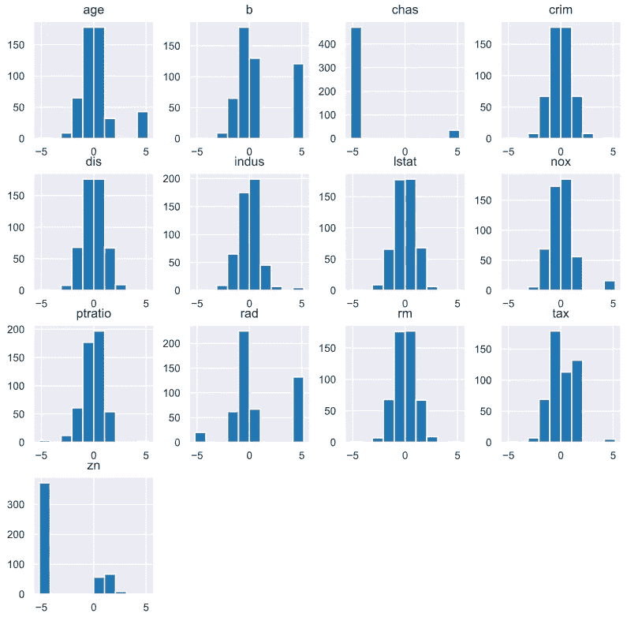****

****通过**分位数变换**变换后输入特征的分布****

****然后，我用上面同样的线性模型来预测波士顿的房价。****

****注意:在用**变换技术变换输入数据后，**我可以设置更高的学习率(在这种情况下学习率= 1e-2)以加速收敛到全局最小值。对于原始数据，如果学习率设置得太高，我们将面临不收敛误差。****

****训练 10 个周期后，结果显示如下。****

****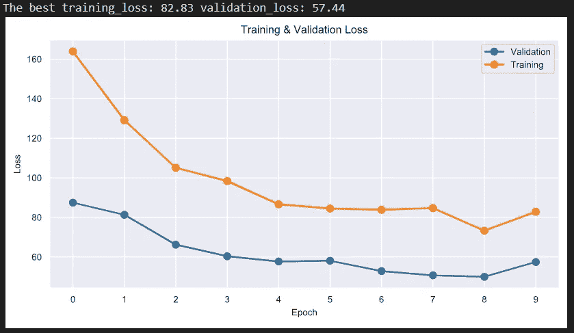****

# ****电力转换****

****在这个演示中，我使用了**功率变换的 **Box-Cox 变换**技术。******

**注意: **Box-Cox 变换**假设它所应用的输入变量值**严格为正**。这意味着不能使用 0 和负值(在这种情况下，我可以使用 **Yeo-Johnson 变换**)。在输入数据集中，我有负数据，因此，我必须在馈入 **Box-Cox 变换之前使用 [**MixMaxScaler 变换**](https://scikit-learn.org/stable/modules/generated/sklearn.preprocessing.MinMaxScaler.html) 。****

```
from sklearn.preprocessing import PowerTransformer, MinMaxScaler transformer = PowerTransformer(method='box-cox')
pipeline = Pipeline(steps=[('s', scaler),('t', transformer)])
scaler = MinMaxScaler(feature_range=(1, 2)) 
inputs = pipeline.fit_transform(inputs_raw)
```

**现在，输入分布如下图所示。**

**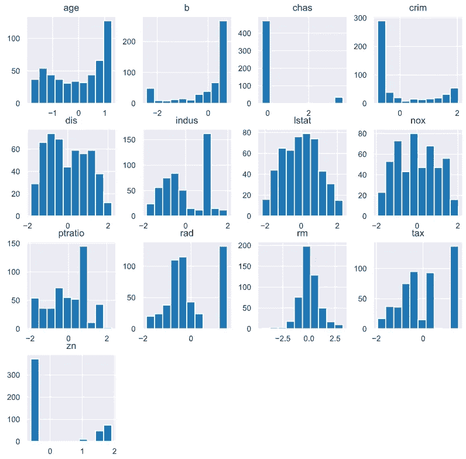**

**通过**功率变换**变换后的输入特性分布**

**同样，我将使用上面 10 个时期的相同线性模型**

**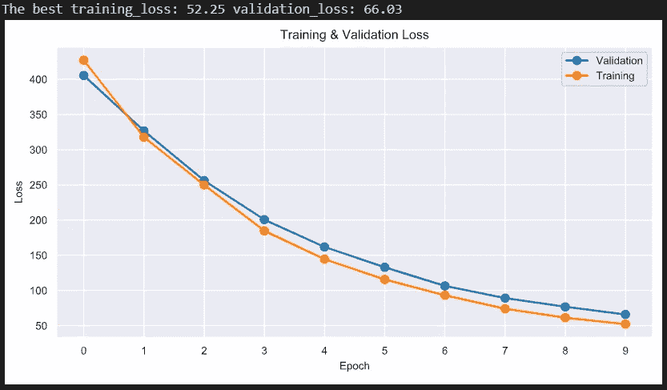**

# **离散化变换**

**最后但同样重要的是，我将应用强大的转换技术，**离散化转换。**统一的**离散化变换**将保持每个输入变量的概率分布，但会使其离散于指定数量的有序组或标签。我可以使用 [KBinsDiscretizer](https://scikit-learn.org/stable/modules/generated/sklearn.preprocessing.KBinsDiscretizer.html) 类应用统一离散化转换，并将“*策略*”参数设置为“*统一*”我还将通过“ *n_bins* ”参数设置的箱数设置为 10。**

```
from sklearn.preprocessing import KBinsDiscretizer transformer = KBinsDiscretizer(n_bins=10, encode='ordinal', strategy='uniform')
inputs = transformer.fit_transform(inputs_raw)
```

**输入数据的分布会像这样变化**

**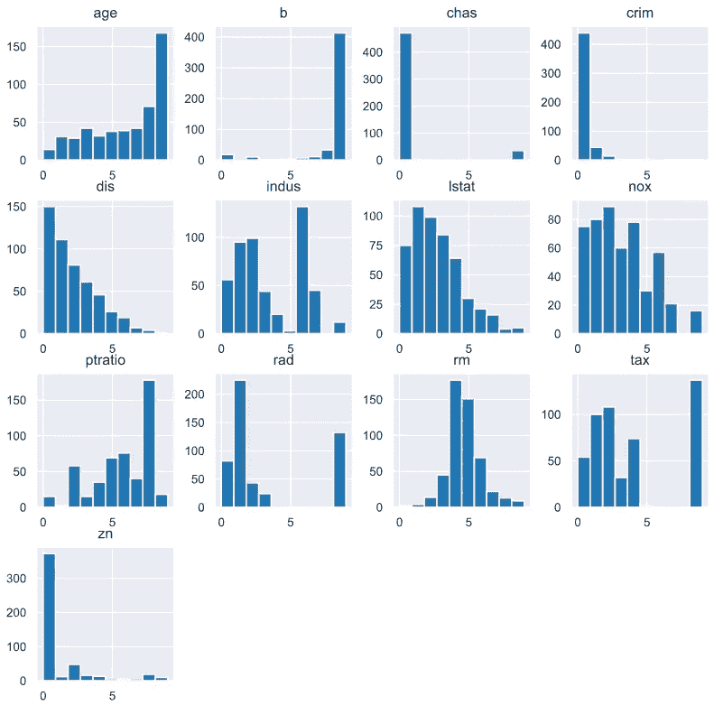**

**通过**离散化变换**变换后的输入特征分布**

**最后，我用 10 个时期运行上面相同的线性模型**

**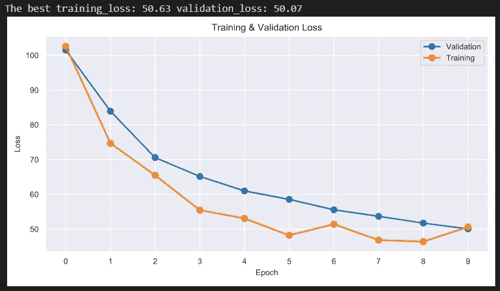**

# **最终想法📋**

**本文想展示一些将数字输入数据转换成类高斯分布的技巧。但是，如果输入数据已经近似于正态分布，这种技术将不会提高模型的性能。这个实验只使用默认的 hyper 参数，你可以自由地改变并应用到你的数据中以获得最优的结果。要进一步阅读，你可以参考下面的参考部分。最后，我想总结一下本文中所有实验的结果。**

**和平！**

**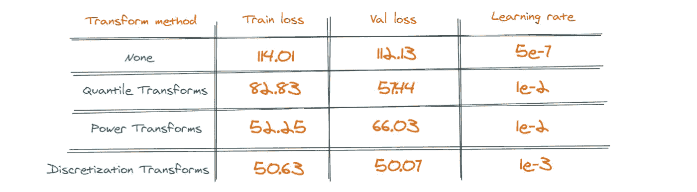**

**作者图片**

# **参考**

**[1] Stef vanBuuren，缺失数据的弹性插补，第二版，CRC 出版社，2018。**

**[2]Suresh Kumar Mukhiya Usman Ahmed，使用 Python 进行探索性数据分析:执行 EDA 技术以理解、总结和调查您的数据，Packt Publishing Ltd，2020 年。**

**[3]彭春燕，利用 SAS 进行数据分析，第七章|数据转换，2009。**

**[4] Amaratunga，d .，Cabrera，j .对来自病毒 DNA 微芯片的数据的分析。美国统计学家协会，2001 年，第 96 期。**

**[5] S. Gluzman，V.I. Yukalov，外推问题中的自相似幂变换，统计力学，2006。**

**[6]刘欢、法尔哈德·侯赛因、丘里姆·谭和马诺兰詹·达什，《离散化:一种使能技术》，2002 年。**

**[7]萨尔瓦多·加西亚；朱利安·卢恩戈；何塞·安东尼奥·塞斯；维多利亚·洛佩斯；弗朗西斯科·埃雷拉，离散化技术调查:监督学习中的分类和实证分析，2013 年。**