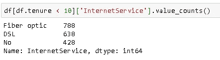
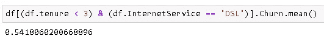

# 用熊猫挑战极限

> 原文：<https://towardsdatascience.com/push-the-limits-with-pandas-3132675c6ff2?source=collection_archive---------42----------------------->

## 熊猫的能力超乎你的想象。

Pandas 是一个非常强大和通用的 Python 数据分析库，可以加速项目的预处理步骤。Pandas 不仅用于预处理，还用于探索数据。你可以也应该挑战极限，看看熊猫有什么能力。在这篇文章中，我将重点讲述如何过滤数据帧，但更重要的是，我将努力传达这样的信息:

> 你在数据分析中使用熊猫越多，它就越有用。


Photo by [贝莉儿 DANIST](https://unsplash.com/@danist07?utm_source=unsplash&utm_medium=referral&utm_content=creditCopyText) on [Unsplash](https://unsplash.com/s/photos/plane?utm_source=unsplash&utm_medium=referral&utm_content=creditCopyText)

一如既往，我们从进口熊猫开始:

```
import pandas as pd
import numpy as np
```

我将使用 Kaggle 上的电信客户流失数据集的一部分。

```
df.head()
```


熊猫的好处是有多种方法来完成一项任务。Pandas 核心数据结构 DataFrame 由带标签的行和列组成。Pandas 在行和列上可以做什么方面非常灵活，这使得它非常容易处理存储在 DataFrame: data 中的内容。

> 尝试挑战极限，你会惊讶于熊猫的能力。

在这一节中，我将写下您在处理数据时可能会遇到的一些问题。然后用熊猫展示一个寻找答案的方法。请记住，几乎总是有其他方法来做同样的事情。所以请随意用不同的方式寻找答案。我认为这将是一个很好的练习。

> 注意:我还将把代码放在文本中，以防你想容易地修改或尝试不同的东西。

*   成为客户不到 10 个月的客户的互联网服务类型分布是什么？

```
df[df.tenure < 10]['InternetService'].value_counts()
```



任期变量显示客户持有合同的时间，以月为单位。

*   使用电子支票付款的客户每月平均费用是多少？

```
df[df.PaymentMethod == 'Electronic check']['MonthlyCharges'].mean()
```


*   有多少客户使用电子支票或邮寄支票付款，这些客户的平均月费用是多少？

```
method = ['Electronic check', 'Mailed check']
df[df.PaymentMethod.isin(method)].groupby('PaymentMethod').agg(['count','mean'])['MonthlyCharges']
```


*   入住不到三个月，使用 DSL 上网服务的客户流失率是多少？

**注意**:我们需要首先将 Churn 列中的值转换成数字值，以便能够计算聚合。“是”将转换为 1，“否”将转换为 0。然后我们可以应用聚合函数。

```
churn_numeric = {'Yes':1, 'No':0}
df.Churn.replace(churn_numeric, inplace=True)df[(df.tenure < 3) & (df.InternetService == 'DSL')].Churn.mean()
```



*   7 个月前 DSL 合同出现问题，持续了三个月。我想看看这个问题对流失率的影响。在此期间，**未签订**合同的客户流失率是多少？

```
df[(~df.tenure.isin([7,6,5])) & (df.InternetService == 'DSL')]['Churn'].mean()
```


> 注意:波浪号(~)运算符用作 NOT。

*   我想根据客户成为客户的时间长短将他们分为 3 类，并找出每一组的平均流失率。

```
df['tenure_cat']= pd.qcut(df.tenure, 3, labels=['short','medium','long'])df[['tenure_cat','Churn']].groupby('tenure_cat').mean()
```


*   我想大致了解一下流失率是如何根据性别、合同类型和是否是高管而变化的。

```
df.pivot_table(index=['gender','SeniorCitizen'], columns='Contract', values='Churn', aggfunc='mean', margins=True)
```


*   在该任期月份内，根据客户数量，属于前三名任期值的客户的互联网服务分布情况如何？

```
df[df.tenure.isin(df.tenure.value_counts().index[:3])]['InternetService'].value_counts()ORdf[df.tenure.isin(df.tenure.value_counts().nlargest(3).index)]['InternetService'].value_counts()
```


这只是你能为熊猫做的一小部分。你用它做得越多，你就会发现越多有用和实用的方法。我建议用不同的方法处理问题，永远不要给自己设限。

> 熟能生巧。

当你努力寻找问题的解决方案时，你学到的东西几乎总是比手头问题的解决方案多。您将逐步提高自己的技能，以建立一个强大而高效的数据分析流程。

感谢阅读。如果您有任何反馈，请告诉我。