# 把你的数据分析放在一个 R 包里——即使你不发表它

> 原文：<https://towardsdatascience.com/put-your-data-analysis-in-an-r-package-even-if-you-dont-publish-it-64f2bb8fd791?source=collection_archive---------14----------------------->

## 如何利用 R 的软件包开发环境来组织、记录和测试您的工作

一个数据分析项目由许多不同的文件组成:原始数据、脚本、降价报告和闪亮的应用程序。我们需要一个合理的项目文件夹结构来保持有序。为什么不利用 R 已经建立的包开发工作流程呢？

在 R 包中进行分析有四个好处:

1.  r 包提供了一个标准化的文件夹结构来**组织**你的文件
2.  r 包提供功能给**文档**的数据和功能
3.  r 包提供了一个框架来测试你的代码
4.  将精力放在第 1-3 点可以让你**重用**和**共享**你的代码

在本文中，我们将一步一步地在一个 R 包中完成一个数据分析例子。我们将看到这些好处几乎不需要任何开销。

对于数据分析示例，我们将:

1.  下载和**保存数据文件**
2.  编写一个脚本和一个 R 函数来处理数据
3.  创建一个最小的探索性数据分析报告
4.  用 Shiny 开发一个最小交互 R [flexdashboard](https://rmarkdown.rstudio.com/flexdashboard/)

最终结果可以在 [GitHub](https://github.com/gontcharovd/WineReviews.git) 上找到。

## 要求

我假设你用 RStudio。建议有 R 包开发经验，但不是必需的。我们需要以下 R 包:

*   r 包开发: *devtools，usethis，roxygen2*
*   r 代码测试: *assertive，testthat*
*   数据分析:**gg plot 2，dplyr**
*   *R Markdown 和闪亮:*针织机、rmarkdown、flexdashboard、闪亮**

# *1.创建 R 包*

*在 RStudio 中，导航到计算机上要创建包的文件夹。以下命令将打开一个新的 RStudio 会话，并创建一个名为“WineReviews”的准系统包。*

```
*devtools::create("WineReviews")*
```

*请注意附加选项卡*构建*是如何变得可用的。*

*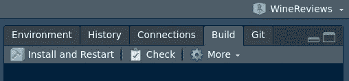*

*R 包开发的附加工具*

*如果您在 RStudio 中配置了版本控制，导航至*工具、版本控制、项目设置*，并从下拉菜单中选择您的版本控制软件。我们将选择 Git，它用一个**初始化一个本地 Git 存储库。gitignore** 文件。*

*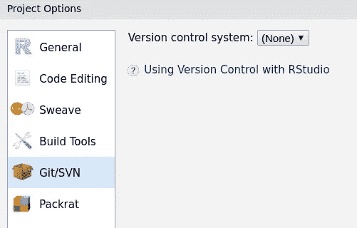*

*为此项目启用 Git*

*我们将使用 R 包 *roxygen2* 为我们的函数和数据自动生成文档。导航到*工具、项目选项、构建工具*，勾选“用 Roxygen 生成文档”前的复选框。我们将使用以下配置:*

*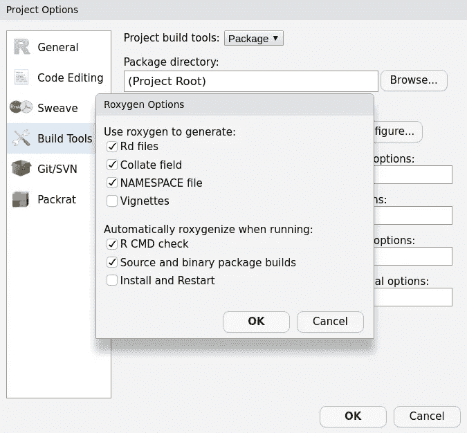*

*配置 Roxgen*

*在**描述**文件中，我们写入项目的基本信息:*

```
*Package: WineReviews
Title: Your data analysis project belongs in an R package
Version: 0.1.0
Authors@R:  person("Denis", "Gontcharov", role = c("aut", "cre"), 
                  email = "[gontcharovd@gmail.com](mailto:gontcharovd@gmail.com)")
Description: Demonstrates how to leverage the R package workflow to organize a data science project.
License: CC0
Encoding: UTF-8
LazyData: true*
```

*我们最初的包结构如下所示:*

```
***.** ├── .gitignore
├── .Rbuildignore
├── .Rhistory
├── DESCRIPTION
├── NAMESPACE
├── **R**
└── WineReviews.Rproj*
```

*让我们检查一下我们的包构建，看看是否一切正常。我们将定期这样做，以确保我们整个工作项目的完整性。*

```
*devtools::check()*
```

*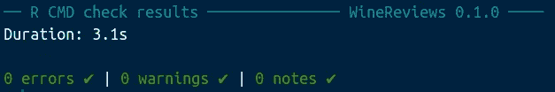*

*我们的初始包结构通过了检查*

# *2.使用数据*

## *保存和访问原始数据*

*在本例中，我们使用了来自 [Kaggle](https://www.kaggle.com/zynicide/wine-reviews) 上葡萄酒评论数据集的两个 csv 文件。我们创建了一个文件夹 **inst/** ，其中包含一个子文件夹 **extdata/** ，我们在其中保存了两个 csv 文件。(包构建时， **inst/** 的子文件夹是[安装的](https://stackoverflow.com/questions/13463103/inst-and-extdata-folders-in-r-packaging)。)*

```
***.** ├── .gitignore
├── .Rbuildignore
├── .Rhistory
├── DESCRIPTION
├── **inst**
│   └── **extdata**
│       ├── winemag-data-130k-v2.csv
│       └── winemag-data_first150k.csv
├── NAMESPACE
├── **R**
└── WineReviews.Rproj*
```

*为了使这些文件可用，我们必须*清理并重建*这个包。这将在您的计算机上安装 R 包。*

*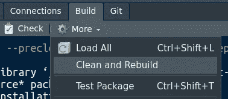*

*清理并重建以访问 inst/文件夹中的文件*

*为了在 **inst/** 中检索文件的路径，我们使用`system.file()`如下:*

```
*system.file(
  "extdata",
  "winemag-data-130k-v2.csv",
  package = "WineReviews"
)*
```

## *操纵数据*

*我们现在将把这些原始数据处理成有用的形式。葡萄酒评论分为两个 csv 文件。假设我们要把这两个文件合并成一个数据框，里面有四个变量:“国家”、“积分”、“价格”、“酒厂”。让我们称这个数据框架为“葡萄酒 _ 数据”**。***

*下面的代码用脚本 **wine_data 创建了 **data_raw/** 文件夹。R***

```
*usethis::use_data_raw(name = "wine_data")*
```

*下面的代码创建了我们想要的数据框。我们把它加到 **wine_data 里吧。R** 脚本并运行它。*

```
*## code to prepare `wine_data` dataset goes here# retrieve paths to datafiles
first.file <- system.file(
  "extdata",
  "winemag-data-130k-v2.csv",
  package = "WineReviews"
)second.file <- system.file(
  "extdata",
  "winemag-data_first150k.csv",
  package = "WineReviews"
)# read the two .csv files
data.part.one <- read.csv(
  first.file,
  stringsAsFactors = FALSE,
  encoding = "UTF-8"
)data.part.two <- read.csv(
  second.file,
  stringsAsFactors = FALSE,
  encoding = "UTF-8"
)# select 4 variables and merge the two files
wine.variables <- c("country", "points", "price", "winery")
data.part.one <- data.part.one[, wine.variables]
data.part.two <- data.part.two[, wine.variables]
wine_data <- rbind(data.part.one, data.part.two)# save the wine_data dataframe as an .rda file in WineReviews/data/
usethis::use_data(wine_data, overwrite = TRUE)*
```

*最后一行创建了 **data/** 文件夹，数据帧存储为 **wine_data.rda** 。在我们*清理并再次重建**之后，该数据可以像任何其他 R 数据一样加载到全局环境中:**

```
**data(“wine_data”, package = "WineReviews")**
```

## **记录数据**

**记录您创建的数据是一个很好的做法。数据的所有文档应保存在一个单独的 R 脚本中，该脚本保存在 **R/** 文件夹中。让我们用下面的内容创建这个脚本，并将其命名为 **data。R** :**

```
**#' Wine reviews for 51 countries.
#'
#' A dataset containing wine reviews.
#'
#' [@format](http://twitter.com/format) A data frame with 280901 rows and 4 variables:
#' \describe{
#' \item{country}{The country that the wine is from.}
#' \item{points}{The number of points rated by WineEnthusiast
#' on a scale of 1–100.}
#' \item{price}{The cost for a bottle of the wine.}
#' \item{winery}{The winery that made the wine.}
#' }
#' [@source](http://twitter.com/source) \url{[https://www.kaggle.com/zynicide/wine-reviews](https://www.kaggle.com/zynicide/wine-reviews)}
"wine_data"**
```

**为了基于这个脚本创建文档，我们运行:**

```
**devtools::document()**
```

**Roxygen 将上面的代码转换成一个 a **wine_data。Rd** 文件，并将其添加到 **man/** 文件夹中。我们可以通过在 R 控制台中键入`?winedata`在帮助窗格中查看该文档。**

**我们的包结构现在看起来像这样:**

```
****.** ├── .gitignore
├── .Rbuildignore
├── .Rhistory
├── **data**
│   └── wine_data.rda
├── **data-raw**
│   └── wine_data.R
├── DESCRIPTION
├── **inst**
│   └── **extdata**
│       ├── winemag-data-130k-v2.csv
│       └── winemag-data_first150k.csv
├── **man**
│   └── wine_data.Rd
├── NAMESPACE
├── **R**
│   └── data.R
└── WineReviews.Rproj**
```

# **3.中间检查**

**通过运行以下命令来定期检查我们的包的完整性是一个很好的做法:**

```
**devtools::check()**
```

**我们得到一个警告和一张便条。**

**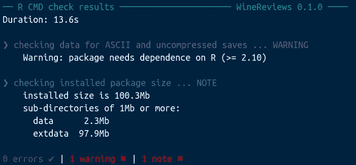**

**定期检查你的包裹，尽早发现问题**

**关于 R 版本依赖的警告是在调用`usethis::use_data(wine_data, overwrite = TRUE)`之后引入的，并通过在**描述**文件中添加`Depends: R (>= 2.10)`来解决。**

**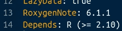**

**将第 14 行添加到描述文件中**

**因为 **inst/extdata** 中的数据超过 1 MB，所以该注释警告我们关于包的大小。我们不想在 [CRAN](https://cran.r-project.org/) 上发布这个 R 包，所以我们可以忽略它。但是，我们将通过将 **inst/extdata/** 文件夹添加到**来解决这个问题。Rbuildignore** 。**

```
**^WineReviews\.Rproj$
^\.Rproj\.user$
^data-raw$
^inst/extdata$**
```

**现在`devtools::check()`显示一切正常:**

**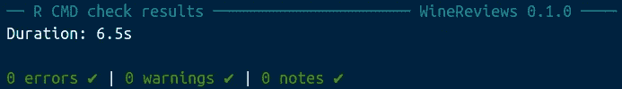**

**第二次检查完美地通过了**

# **4.插图中的数据分析**

**现在我们可以探索处理过的数据。我喜欢用 R 包插图写报告，因为它们有 R 用户熟悉的简洁布局。如果你不喜欢使用简介，你可以在一个标准的 R Markdown 文档中执行这些步骤，而不是简介，如第 7 章所示。**

**下面的函数用 **wine_eda 创建了一个 **vignettes/** 文件夹。我们将用于探索性数据分析的 Rmd** 插图。**

```
**usethis::use_vignette(name = “wine_eda”, title = “Wine Reviews EDA”)**
```

**我们将使用流行的 *dplyr* R 包来操作数据。在**描述**文件中声明我们使用的每个 R 包很重要。别担心:如果你忘了这个`devtools::check()` 会丢一张纸条。用以下内容申报包裹:**

```
**usethis::use_package(“dplyr”)**
```

**让我们向小插图添加一些代码来加载数据并显示摘要:**

```
**---
title: “Wine Reviews EDA”
output: rmarkdown::html_vignette
vignette: >
 %\VignetteIndexEntry{Wine Reviews EDA}
 %\VignetteEngine{knitr::rmarkdown}
 %\VignetteEncoding{UTF-8}
---```{r, include = FALSE}
knitr::opts_chunk$set(
 collapse = TRUE,
 comment = “#>”
)
``````{r setup}
library(WineReviews)
``````{r}
# load the previously created wine_data data frame
data(wine_data)
``````{r}
summary(wine_data)
```
```

**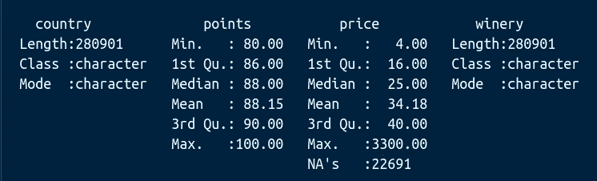**

**winedata 缺少 22691 个价格值**

**葡萄酒价格缺少 22691 个值。让我们转换数据来填充这些缺失的值。r 是一种函数式编程语言:我们应该通过应用函数来转换我们的数据。**

> **要理解 R 语言中的计算，有两个口号很有帮助:存在的一切都是对象。发生的一切都是函数调用。”**
> 
> **—约翰·钱伯斯**

**这是我们将分析放在 R 包中的决定将会得到回报的部分:包开发使得编写、记录和测试函数的过程变得非常顺利。**

# **5.使用函数**

**让我们用那个国家葡萄酒的平均价格来代替缺失的价格。从统计学的角度来说，这不一定是个好主意，但它将有助于证明这一点。**

## **编写和记录函数**

**替换将由一个名为“fill_na_mean”的函数来完成。我们创建一个新的 R 脚本**变量 _ 计算。R** 并将其保存在 **R/** 文件夹中。请注意，我们可以如何方便地将函数的文档写在其代码之上。(保留@export 标签，否则@examples 将不起作用。)**

```
**#' Replace missing values with the mean
#'
#' @param numeric.vector A vector with at least one numeric value.
#'
#' @return The input whose NAs are replaced by the input's mean.
#'
#' @export
#'
#' @examples fill_na_mean(c(1, 2, 3, NA, 5, 3, NA, 6))
fill_na_mean <- function(numeric.vector) {
  ifelse(
    is.na(numeric.vector),
    mean(numeric.vector, na.rm = TRUE),
    numeric.vector
  )
}**
```

**为了创建文档，我们再次运行:**

```
**devtools::document()**
```

**与记录数据的情况一样，Roxygen 将把这个文档转换成一个文件 **fill_na_mean。Rd** 并将其保存在 **man/** 文件夹中。我们可以通过在 R 控制台中键入`?fill_na_mean`在帮助窗格中查看该文档。**

**如果您希望在关闭或重启 R 会话后恢复工作，运行以下命令来加载您的函数以及在**描述**文件中声明的包:**

```
**devtools::load_all()** 
```

**接下来，我们将为新创建的函数编写两个测试:**

1.  **每次调用函数时运行的**运行时测试**警告*用户*输入错误。**
2.  **一个**开发时** **测试**，它根据命令运行以警告*开发者*在编写或修改函数时的错误。**

## **运行时测试**

**R 包*断言*提供运行时测试*的功能。***

```
**usethis::use_package(“assertive”)**
```

**我们的简单测试由一行代码组成，它检查输入是否是一个数字向量，如果不是，就抛出一个错误。注意，运行时测试不依赖于我们的包开发环境，因为它们是函数的一部分。**

```
**fill_na_mean <- function(numeric.vector) {
 assertive::assert_is_numeric(numeric.vector) **# ->** the run-time test
 ifelse(
   is.na(numeric.vector),
   mean(numeric.vector, na.rm = TRUE),
   numeric.vector
 )
}**
```

## **开发时测试**

**与运行时测试相反，使用*测试的开发时测试表明* R 包需要一个活动的包开发环境。让我们为函数编写一个单元测试，测试`fill_na_mean(c(2, 2, NA, 5, 3, NA))`是否返回向量`c(2, 2, 3, 5, 3, 3)`。**

**首先我们建立了*测试和*框架:**

```
**usethis::use_testthat()** 
```

**以下命令创建脚本 **test-variable_calculations。R** 包含对 **variable_calculations 中定义的函数的单元测试。R** :**

```
**usethis::use_test("variable_calculations")**
```

**我们修改了**测试变量计算中的代码。R** 代表我们的测试:**

```
**context(“Unit tests for fill_na_mean”)
test_that(“fill_na_mean fills the NA with 3”, {
 actual <- fill_na_mean(c(2, 2, NA, 5, 3, NA))
 expected <- c(2, 2, 3, 5, 3, 3)
 expect_equal(actual, expected)
})**
```

**下面的命令运行所有的测试并返回一个漂亮的报告:**

```
**devtools::test()** 
```

**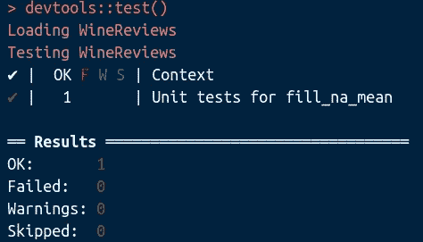**

**我们的单元测试成功通过**

# **6.(重新)组织你的代码**

**现在，我们可以填充我们的数据分析中缺少的值 **wine_eda。Rmd** 。但是如果我们想在其他报表或应用程序中做同样的事情呢？我们应该在每个文件中重复这个过程吗？**

**事实上，这个功能处理的是数据处理，而不是探索性分析。因此，它属于**葡萄酒数据。生成 **wine_data.rda** 的 R** 文件。将此代码放入 **winedata。R** 而不是 **wine_eda。Rmd** 有两个优点:**

1.  **我们的代码变得模块化:用于数据处理的代码与我们的数据分析报告明显分离。**
2.  **只有一个脚本生成所有其他文件使用的已处理数据。**

**填充缺失值后，六个观察值仍然没有葡萄酒价格，因此我们选择删除它们。这是最终脚本的样子:**

```
**## code to prepare `wine_data` dataset goes here
# retrieve paths to datafiles
first.file <- system.file(
  "extdata",
  "winemag-data-130k-v2.csv",
  package = "WineReviews"
)
second.file <- system.file(
  "extdata",
  "winemag-data_first150k.csv",
  package = "WineReviews"
)
# read the two .csv files
data.part.one <- read.csv(
  first.file,
  stringsAsFactors = FALSE,
  encoding = "UTF-8"
)
data.part.two <- read.csv(
  second.file,
  stringsAsFactors = FALSE,
  encoding = "UTF-8"
)
# select 4 variables and merge the two files
wine.variables <- c("country", "points", "price", "winery")
data.part.one <- data.part.one[, wine.variables]
data.part.two <- data.part.two[, wine.variables]
wine_data <- rbind(data.part.one, data.part.two)# fill missing prices with the mean price per country
wine_data <- wine_data %>%
  dplyr::group_by(country) %>%
  dplyr::mutate(price = fill_na_mean(price))# some countries don't have any non-missing price
# we omit these observations from the data
wine_data <- wine_data %>%
  dplyr::filter(!is.na(price))# save the wine_data dataframe as an .rda file in WineReviews/data/
usethis::use_data(wine_data, overwrite = TRUE)**
```

**因为我们改变了原始数据的处理方式，所以我们必须在**数据中记录这些变化。 **data-raw/** 文件夹中的 R** 文件:**

```
**#’ Wine reviews for 49 countries.
#’
#’ A dataset containing processed data of wine reviews.
#’ Missing price values have been filled with the mean price for 
#’ that country
#’ six observations coming from countries with no wine price were 
#’ deleted.
#’
#’ [@format](http://twitter.com/format) A data frame with 280895 rows and 4 variables:
#’ \describe{
#’ \item{country}{The country that the wine is from.}
#’ \item{points}{The number of points WineEnthusiast
#’ rated the wine on a scale of 1–100}
#’ \item{price}{The cost for a bottle of the wine}
#’ \item{winery}{The winery that made the wine}
#’ }
#’ [@source](http://twitter.com/source) \url{[https://www.kaggle.com/zynicide/wine-reviews](https://www.kaggle.com/zynicide/wine-reviews)}
“wine_data”**
```

**并更新文档:**

```
**devtools::document()**
```

**让我们编织我们的小图案。请注意，即使我们没有更改插图中的代码，也不再有丢失的值。在 **wine_data 中删除缺失的值。R** 脚本。在插图中，我们只是加载处理过的 **wine_data.rda** 。**

**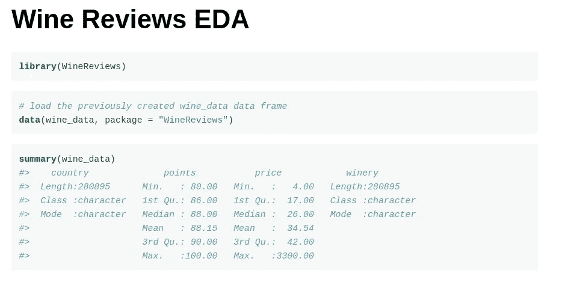**

**wine_data 摘要不包含缺失值**

# **7.使用 R Markdown**

**我们可以将任何 R Markdown 文件添加到我们的包中。类似于原始数据，我们在 **inst/** 文件夹中创建一个子文件夹 **rmd/** 。让我们创建一个简单的仪表板来查看每个国家的葡萄酒价格分布。我们创建一个 R Markdown 文件 **wine_dashboard。 **rmd/** 中的 Rmd** 内容如下:**

```
**---
title: "Wine dashboard"
output: 
 flexdashboard::flex_dashboard:
 orientation: columns
runtime: shiny
---```{r setup, include=FALSE}
library(flexdashboard)
library(ggplot2)
``````{r}
data(wine_data, package = "WineReviews")
```Inputs {.sidebar data-width=150}
-------------------------------------
```{r}
shiny::selectInput(
 "country",
 label = "select country",
 choices = sort(unique(wine_data$country))
)
```Column
-------------------------------------### Wine points versus price

```{r}
shiny::renderPlot(
 ggplot(wine_data[wine_data$country == input$country, ],
 aes(points, log10(price), group = points)) +
 geom_boxplot() +
 labs(x = "points scored by the wine on a 100 scale",
 y = "Base-10 logarithm of the wine price") +
 theme_bw()
)
```Column
-------------------------------------
### Wine price distribution

```{r}
shiny::renderPlot(
 ggplot(wine_data[wine_data$country == input$country, ], aes(price)) +
 geom_density() +
 labs(y = "Price density function") +
 theme_bw()
)
```
```

**让我们用*运行文件*查看仪表板:**

**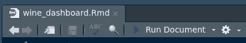**

**按“运行文档”查看仪表板**

**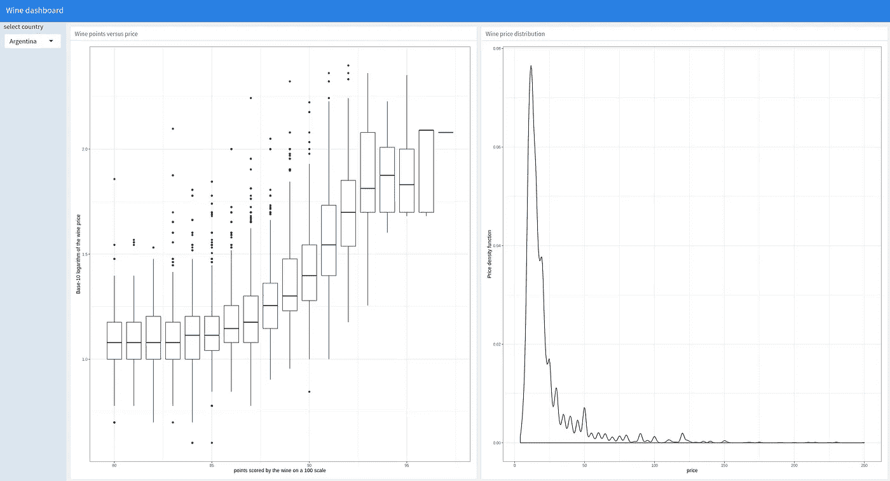**

# **8.使用版本控制**

**我们的数据分析示例现在已经完成。这是我们最终项目结构的样子:**

```
****.** ├── .gitignore
├── .Rbuildignore
├── .Rhistory
├── DESCRIPTION
├── **data**
│   └── wine_data.rda
├── **data-raw**
│   └── wine_data.R
├── **inst**
│   ├── **extdata**
│   │   ├── winemag-data-130k-v2.csv
│   │   └── winemag-data_first150k.csv
│   └── **rmd**
│       └── wine_dashboard.Rmd
├── **man**
│   ├── fill_na_mean.Rd
│   └── wine_data.Rd
├── NAMESPACE
├── **R**
│   ├── data.R
│   └── variable_calculation.R
├── **tests**
│   ├── **testthat**
│   │   └── test-variable_calculations.R
│   └── testthat.R
├── **vignettes**
│   └── wine_eda.Rmd
└── WineReviews.Rproj**
```

**这种结构是合适的版本控制。跟踪有代码的文件，而不跟踪 **inst/extdata** 中的原始数据和 **data/** 中的已处理数据。我们可以使用 **data-raw/** 中的 R 脚本从(重新)下载的原始数据中生成经过处理的数据。我建议将以下条目添加到**中。gitignore** :**

```
**.Rproj.user
.Rhistory
data/
inst/extdata/
inst/doc**
```

# **概述**

**下面是我们如何利用 R 包组件的:**

*   ****描述:**给出了项目及其依赖项的概述**
*   ****R/** :包含 R 脚本，其函数在整个包中使用**
*   ****测试/** :包含我们函数的开发时测试**
*   ****inst/extdata/** :包含我们的原始数据文件**
*   ****data-raw/** :包含将原始数据处理成整齐数据的 R 脚本**
*   ****数据/** :包含整齐的数据存储为。rda 文件**
*   ****man/** : 包含我们的对象和函数的文档**
*   ****vignettes/** :包含数据分析报告作为包 vignettes**
*   ****inst/rmd** :包含报告或应用程序的 R Markdown 文件**

**我希望你喜欢这篇文章。你会考虑用 R 包来存储你的作品吗？你喜欢如何组织你的项目？
在评论里告诉我吧！**

****

**照片由 chuttersnap 在 Unsplash 上拍摄**