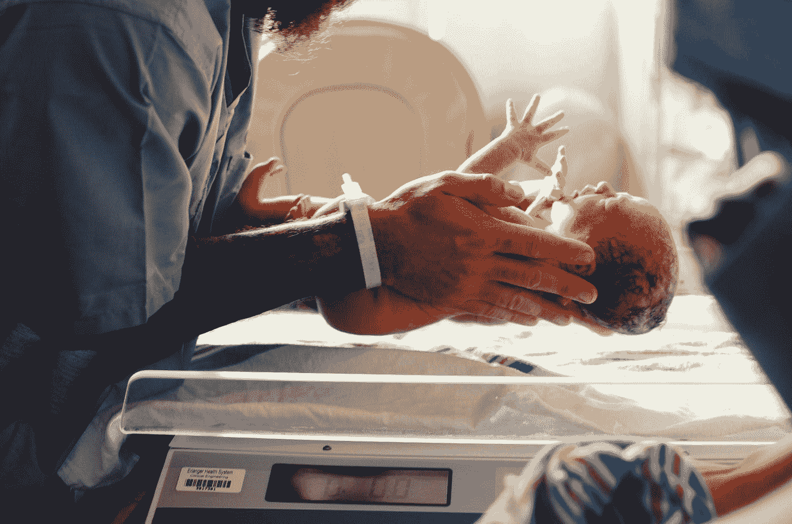
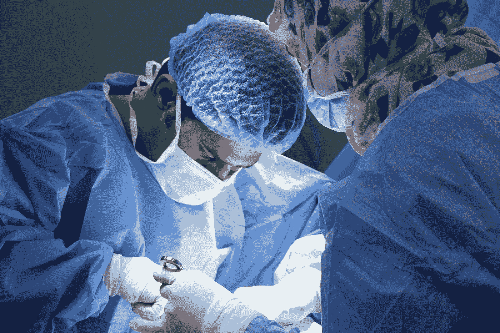

# 用人工智能把病人放在第一位

> 原文：<https://towardsdatascience.com/putting-patients-first-with-artificial-intelligence-751c49ab97a0?source=collection_archive---------32----------------------->

克里斯蒂安·鲍文在 [Unsplash](https://unsplash.com?utm_source=medium&utm_medium=referral) 上的照片

我们总有一天会用到医疗保健系统。然而，即使在过去的几十年里有了巨大的飞跃，仍然有几个缺点。健康信息系统与人工智能(AI)相结合，可以极大地改变患者的生活，同时帮助卫生从业人员开展日常工作。

重要的是要认识到情况并不总是像今天这样。在世纪之交，医学研究所报告说，在美国，每年大约有 100，000 人由于医疗失误而丧生。这一事实的可悲之处在于，许多这样的错误是很容易避免的。

已经有几例医生给对药物过敏的病人开了药。在这些案例中，医生没有注意到患者记录中的过敏记录，这一错误导致了患者的最终死亡。计算机化的系统有助于在系统内精确地建立类似的制衡机制，从而减少人为错误，使整个过程对病人来说更加安全。

如今，大多数现代医院已经有了这样的系统，但随着人工智能的最新进展，它们现在可以进入下一个阶段。以下是我们医院目前正在开发或使用的人工智能系统的一些例子。它们涉及三个非常不同的方面；第一个帮助医院管理，第二个帮助病人护理，第三个支持护理人员。

freestocks.org 在 [Unsplash](https://unsplash.com?utm_source=medium&utm_medium=referral) 上[拍照](https://unsplash.com/@freestocks?utm_source=medium&utm_medium=referral)

医院一直在努力提高效率，同时不牺牲给病人的服务。他们中的许多人正在部署医用机器人，旨在帮助医生和护士开出正确的药方。这种机器人能够追踪他们提供给病人的所有药物；他们可以准备准确的剂量，并仔细检查病人档案中指定的任何条件。一辆智能手推车能够自己在医院导航，然后将药物送到特定的病房。这种系统消除了处方错误，为医院节省了大约 30%的库存，并消除了与过期药物相关的所有损失。

由 [Jesper Aggergaard](https://unsplash.com/@aggergakker?utm_source=medium&utm_medium=referral) 在 [Unsplash](https://unsplash.com?utm_source=medium&utm_medium=referral) 上拍摄的照片

病人是医疗保健系统的核心。正因为如此，组织努力提高他们的服务，特别是当年轻的人参与进来的时候。许多医院正在使用[虚拟现实(VR)头戴设备来帮助年轻患者转移注意力](https://researchtrustmalta.eu/research-projects/virtual-reality-in-healthcare/)；从他们正在接受的治疗到娱乐性的东西，如电脑游戏。这种方法被称为注意力分散疗法，效果出奇的好；在某些情况下，患者报告疼痛减轻了近 50%。注意力分散疗法的伟大之处在于，患者不需要服用任何药物，从而降低了过敏、止痛药成瘾和其他许多风险。

照片由 [Jesper Aggergaard](https://unsplash.com/@aggergakker?utm_source=medium&utm_medium=referral) 在 [Unsplash](https://unsplash.com?utm_source=medium&utm_medium=referral) 上拍摄

护理人员做得很好，但我们都知道他们的工作很有挑战性，在某些情况下很乏味。正因为如此，人工智能正被用来促进那些可以自动化的任务。AI 的使用并不意味着它将取代护理员，远非如此。护理职业中人的因素仍然至关重要，而且短期内不会有任何变化。然而，人工智能将接管那些需要重复分析的任务，并帮助护理人员加快整个过程。一个恰当的例子是对人体运动的研究，通常称为“步态分析”。在这种情况下，一个摄像机跟踪系统拍摄病人的移动镜头。物理治疗师然后分析获得的大量数据。这一过程通常持续数小时；然而，人工智能系统可以将时间缩短到几秒钟。当然，人类的直觉对于验证自动化分析仍然非常重要，但是至少，对于护理人员来说，总体上节省了时间。

贾法尔·艾哈迈德在 [Unsplash](https://unsplash.com?utm_source=medium&utm_medium=referral) 上拍摄的照片

> 重要的是要记住，这种转变的核心是病人

在本文中，我们只选择了三个在许多医院都能找到的简单用例，但我们仅仅触及了冰山一角。医疗保健行业在许多应用中使用人工智能，例如在识别癌细胞、药物研发过程中、指导机器人外科医生、健康监测和许多其他方面。重要的是要记住，这种转变的核心是病人。人工智能是人类创造的最强大的工具，它的医疗应用将在未来几年拯救更多的生命。

【https://www.businesstoday.com.mt】本文原载于

*[**阿列克谢·丁力教授**](http://www.dingli.org/) 是马耳他[大学](https://www.um.edu.mt/)的 AI 教授。二十多年来，他一直在人工智能领域进行研究和工作，协助不同的公司实施人工智能解决方案。他的工作被国际专家评为世界级，并赢得了几个当地和国际奖项(如欧洲航天局、世界知识产权组织和联合国等)。他出版了几本同行评审的出版物，并且是马耳他[的一部分。由马耳他政府成立的人工智能工作组，旨在使马耳他成为世界上人工智能水平最高的国家之一。](https://malta.ai/)*