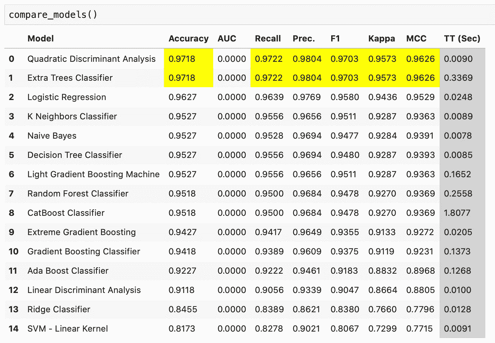
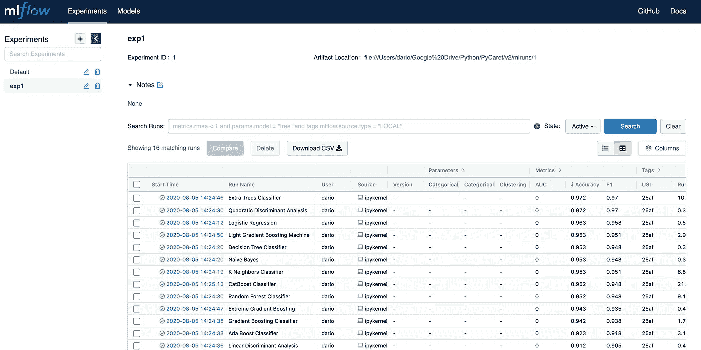

# PyCaret 2.0 已经发布了，有什么新内容吗？

> 原文：<https://towardsdatascience.com/pycaret-2-0-is-here-whats-new-34baa87a951e?source=collection_archive---------37----------------------->

## 机器学习爱好者的 3 大新功能

毫无疑问，PyCaret 是我最喜欢的机器学习库。它比 Scikit-Learn 对开发人员更友好，并提供了内置功能来轻松处理主要的机器学习任务。*那么，这个版本有什么新内容？*读一读就知道了。


[粘土银行](https://unsplash.com/@claybanks?utm_source=medium&utm_medium=referral)在 [Unsplash](https://unsplash.com?utm_source=medium&utm_medium=referral) 拍摄的照片

如果你以前没有使用过这个库，请随意查看下面的文章。它们是分类和回归任务的良好起点。

*   [PyCaret:用 Python 实现更好的机器学习](/pycaret-better-machine-learning-with-python-58b202806d1e)
*   [用 PyCaret 回归:一个更好的机器学习库](/regression-with-pycaret-a-better-machine-learning-library-e02762a0615c)
*   [用 PyCaret 分类:一个更好的机器学习库](/classification-with-pycaret-a-better-machine-learning-library-cff07a10a28c)

几天前发布了 2.0 版本，并带来了一些新功能。大多数都是次要的，但仍然值得一提，因为它们会节省您的时间或为您提供一些额外的信息。

这是完整的变更日志。

我们将在下一节看到如何安装这个库。

# 库安装

首先，打开终端/CMD 并执行下面一行:

```
pip install pycaret==2.0
```

我假设您已经安装并配置了 *Python* ，无论是作为独立安装还是通过 *Anaconda* 。由于大量的依赖项，安装将需要一分钟左右的时间才能完成。

完成后，您可以打开笔记本环境，导入库，并检查版本。

```
import pycaretpycaret.__version__ **>>> ‘2.0.0’**
```

这就是安装的基本内容。接下来我们将讨论最有用的新特性。

# 1.训练时间

这个特性无论如何都不是突破性的，但是拥有它很好。例如，在调用`compare_models()`函数时，您现在会得到一个表示训练时间的附加列:



这是原始虹膜数据集的性能。我们可以看到用明显的黄色标记的最佳算法，以及在最右边添加的以秒为单位的训练时间，作为一个新列。

这是一个很好的功能，因为它显示了体面的 QDA 速度训练速度的改善，而不是额外的树分类器算法，同时提供相同的性能。如果速度是一个问题，这些功能可能是有用的。

# 2.保存可视化效果

我在 PyCaret 上的前几篇文章展示了根据您的模型性能制作好看的可视化效果是多么容易。缺少的一件事是把情节保存到你的设备上。

使用 2.0 版，很容易将各种图保存到您的设备中。这里有一个例子:

```
plot_model(model, plot=’confusion_matrix’, save=True)
```

如您所见，这里唯一的新参数是`save`参数。当设置为`True`时，绘图保存在您的设备上。让我们快速浏览一下:


# 3.MLFlow UI

对于那些不知道的人来说， *PyCaret* 2.0 嵌入了一个 *MLflow* 跟踪组件，作为日志记录的后端 API 和 UI。你可以在这个链接上阅读更多关于 MLFlow [的内容，但总而言之，这是一个管理机器学习生命周期的很好的 GUI，在这种情况下，比较模型性能。](https://mlflow.org)

下面是导入数据、比较模型和启动后端服务的完整代码:

```
from pycaret.classification import * 
from pycaret.datasets import get_datairis = get_data(‘iris’)clf = setup(
    iris, 
    target=’species’, 
    session_id=42, 
    **log_experiment=True, 
    experiment_name=’exp1'**
)compare_models()!mlflow ui
```

这两行粗体字对于在应用程序中选择适当的实验特别重要，稍后您会看到原因。

执行完这段代码后，只需进入`[http://localhost:5000](http://localhost:5000)`查看应用程序:



# 在你走之前

根据我目前使用该库的经验，这是一篇相当快速的文章，展示了 PyCaret 2.0 最有用的新特性。你的答案可能会有所不同，所以请记住这一点。对于完整的变更日志，[请访问此链接](https://github.com/pycaret/pycaret/releases/tag/2.0)。

此外，你可以自由地自己进一步研究官方文档，因为这是最好的文档之一。

感谢阅读。

*喜欢这篇文章吗？成为* [*中等会员*](https://medium.com/@radecicdario/membership) *继续无限制学习。如果你使用下面的链接，我会收到你的一部分会员费，不需要你额外付费。*

[](https://medium.com/@radecicdario/membership) [## 通过我的推荐链接加入 Medium-Dario rade ci

### 作为一个媒体会员，你的会员费的一部分会给你阅读的作家，你可以完全接触到每一个故事…

medium.com](https://medium.com/@radecicdario/membership) 

[**加入我的私人邮件列表，获取更多有用的见解。**](https://mailchi.mp/46a3d2989d9b/bdssubscribe)