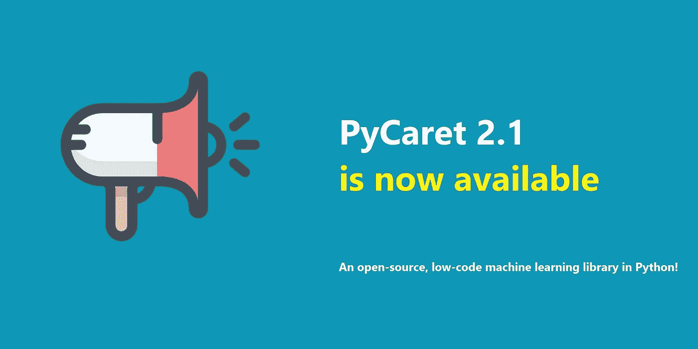
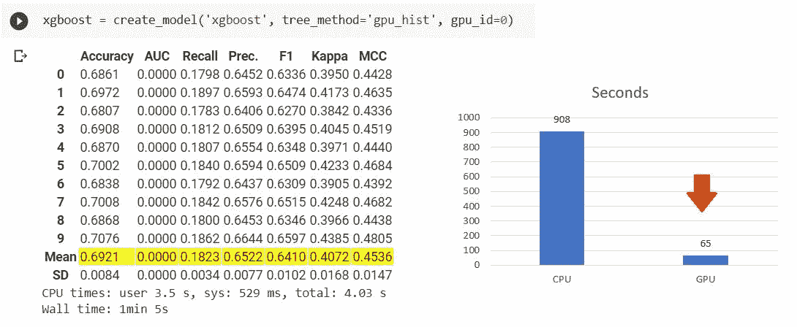
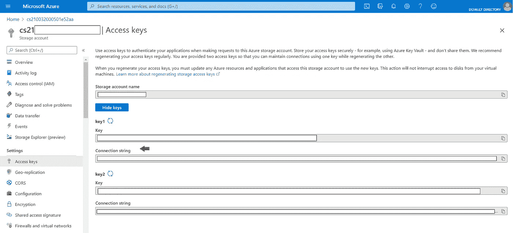
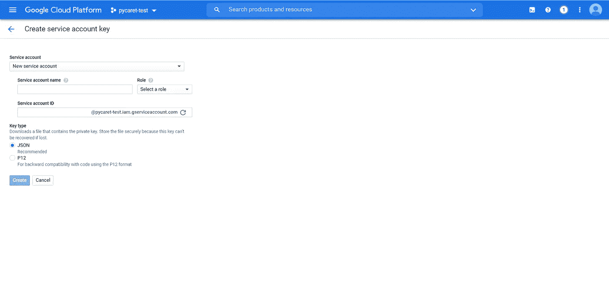
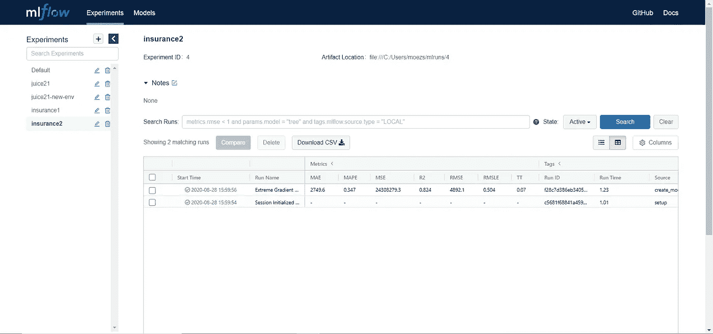
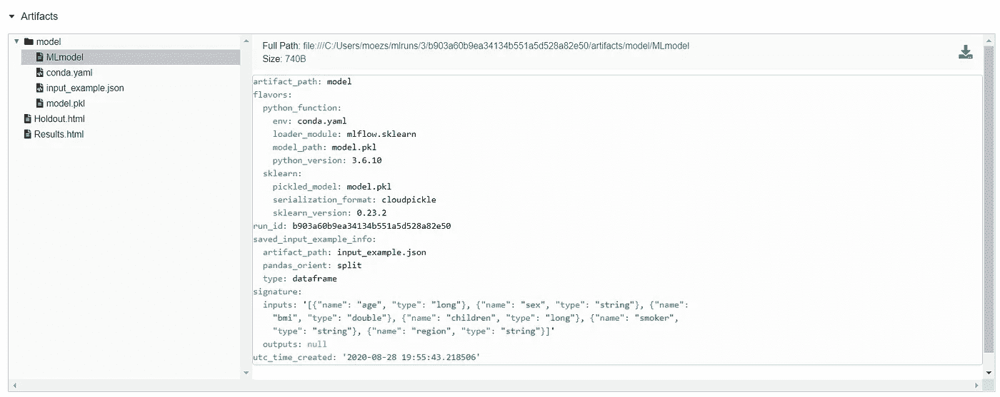
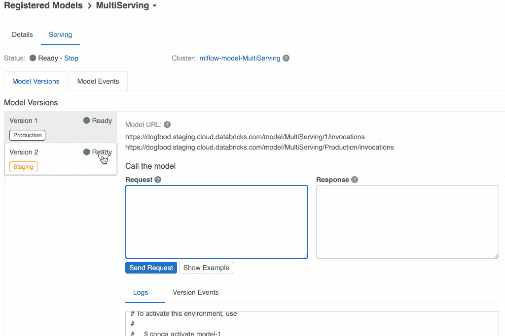

# PyCaret 2.1 已经发布了，有什么新内容吗？

> 原文：<https://towardsdatascience.com/pycaret-2-1-is-here-whats-new-4aae6a7f636a?source=collection_archive---------8----------------------->



PyCaret 2.1 现在可以使用 pip 下载。[https://www.pycaret.org](https://www.pycaret.org)

我们很高兴宣布 py caret 2.1—2020 年 8 月的更新。

PyCaret 是一个用 Python 编写的开源、**低代码**机器学习库，可以自动化机器学习工作流。它是一个端到端的机器学习和模型管理工具，可以加快机器学习实验周期，让您的工作效率提高 10 倍。

与其他开源机器学习库相比，PyCaret 是一个替代的低代码库，可以用来替换数百行代码。这使得实验快速有效。

如果你以前没有听说过或使用过 PyCaret，请查看我们的[之前的公告](/announcing-pycaret-2-0-39c11014540e)快速入门。

# 正在安装 PyCaret

安装 PyCaret 非常容易，只需要几分钟。我们强烈建议使用虚拟环境来避免与其他库的潜在冲突。参见下面的示例代码，创建一个 ***conda 环境*** 并在该 conda 环境中安装 pycaret:

```
**# create a conda environment** 
conda create --name yourenvname python=3.6 **# activate environment** 
conda activate yourenvname **# install pycaret** 
pip install pycaret**# create notebook kernel linked with the conda environment** python -mipykernel install --user --name yourenvname --display-name "display-name"
```

如果您已经安装了 PyCaret，您可以使用 pip 更新它:

```
pip install --upgrade pycaret
```

# **PyCaret 2.1 功能概述**


由[paweczerwiński](https://unsplash.com/@pawel_czerwinski?utm_source=medium&utm_medium=referral)在 [Unsplash](https://unsplash.com?utm_source=medium&utm_medium=referral) 上拍摄的照片

# 👉GPU 上的超参数调整

在 PyCaret 2.0 中，我们宣布了针对某些算法(XGBoost、LightGBM 和 Catboost)的支持 GPU 的培训。2.1 中的新功能是现在你还可以在 GPU 上调整这些模型的超参数。

```
**# train xgboost using gpu**
xgboost = create_model('xgboost', tree_method = 'gpu_hist')**# tune xgboost** tuned_xgboost **=** tune_model(xgboost)
```

在 **tune_model** 函数中不需要额外的参数，因为它自动从使用 **create_model** 函数创建的 xgboost 实例中继承 tree_method。如果你对小比较感兴趣，这里是:

> **100，000 行，88 个特征，8 个类的多类问题**



GPU 上的 XGBoost 培训(使用 Google Colab)

# 👉模型部署

自从 2020 年 4 月 PyCaret 的第一次发布以来，您可以简单地使用笔记本上的中的 **deploy_model** 在 AWS 上部署训练好的模型。在最近的版本中，我们增加了一些功能来支持在 GCP 和微软 Azure 上的部署。

## **微软 Azure**

若要在 Microsoft Azure 上部署模型，必须设置连接字符串的环境变量。可以从 Azure 中您的存储帐户的“访问密钥”中获取连接字符串。



https:/portal . azure . com-从存储帐户获取连接字符串

一旦复制了连接字符串，就可以将其设置为环境变量。请参见下面的示例:

```
**import os** os.environ['AZURE_STORAGE_CONNECTION_STRING'] = 'your-conn-string'**from pycaret.classification import deploy_model**
deploy_model(model = model, model_name = 'model-name', platform = 'azure', authentication = {'container' : 'container-name'})
```

嘣！就是这样。只需使用一行代码**，**你的整个机器学习管道现在就装在微软 Azure 的容器里了。您可以使用 **load_model** 函数来访问它。

```
**import os** os.environ['AZURE_STORAGE_CONNECTION_STRING'] = 'your-conn-string'**from pycaret.classification import load_model** loaded_model = load_model(model_name = 'model-name', platform = 'azure', authentication = {'container' : 'container-name'})**from pycaret.classification import predict_model** predictions = predict_model(loaded_model, data = new-dataframe)
```

## 谷歌云平台

要在 Google Cloud Platform (GCP)上部署模型，您必须首先使用命令行或 GCP 控制台创建一个项目。创建项目后，您必须创建一个服务帐户，并以 JSON 文件的形式下载服务帐户密钥，然后用它来设置环境变量。



创建新的服务帐户，并从 GCP 控制台下载 JSON

要了解更多关于创建服务账户的信息，请阅读[官方文档](https://cloud.google.com/docs/authentication/production)。一旦创建了服务帐户并从 GCP 控制台下载了 JSON 文件，就可以开始部署了。

```
**import os** os.environ['GOOGLE_APPLICATION_CREDENTIALS'] = 'c:/path-to-json-file.json'**from pycaret.classification import deploy_model** deploy_model(model = model, model_name = 'model-name', platform = 'gcp', authentication = {'project' : 'project-name', 'bucket' : 'bucket-name'})
```

模型已上传。现在，您可以使用 **load_model** 函数从 GCP 存储桶访问模型。

```
**import os** os.environ['GOOGLE_APPLICATION_CREDENTIALS'] = 'c:/path-to-json-file.json'**from pycaret.classification import load_model** loaded_model = load_model(model_name = 'model-name', platform = 'gcp', authentication = {'project' : 'project-name', 'bucket' : 'bucket-name'})**from pycaret.classification import predict_model** predictions = predict_model(loaded_model, data = new-dataframe)
```

# 👉MLFlow 部署

除了使用 PyCaret 的本地部署功能，您现在还可以使用所有 MLFlow 部署功能。要使用这些，您必须使用**设置**功能中的 **log_experiment** 参数记录您的实验。

```
**# init setup**
exp1 = setup(data, target = 'target-name', log_experiment = True, experiment_name = 'exp-name')**# create xgboost model** xgboost = create_model('xgboost')..
..
..# rest of your script**# start mlflow server on localhost:5000**
!mlflow ui
```

现在在你喜欢的浏览器上打开 [https://localhost:5000](https://localhost:5000) 。



[https://localhost:5000](https://localhost:5000) 上的 MLFlow UI

点击**【运行名称】**左侧的**【开始时间】**，可以看到运行的详细信息。你在里面看到的是一个训练模型的所有超参数和评分指标，如果你向下滚动一点，所有的工件也会显示出来(见下文)。



MLFLow 伪影

经过训练的模型以及其他元数据文件存储在“/model”目录下。MLFlow 遵循包装机器学习模型的标准格式，这些模型可用于各种下游工具中——例如，通过 REST API 或 Apache Spark 上的批处理推理进行实时服务。如果您愿意，您可以使用 MLFlow 命令行在本地为该模型提供服务。

```
mlflow models serve -m local-path-to-model
```

然后，您可以使用 CURL 将请求发送给 model 以获得预测。

```
curl [http://127.0.0.1:5000/invocations](http://127.0.0.1:5000/invocations) -H 'Content-Type: application/json' -d '{
    "columns": ["age", "sex", "bmi", "children", "smoker", "region"],
    "data": [[19, "female", 27.9, 0, "yes", "southwest"]]
}'
```

*(注意:Windows 操作系统尚不支持 MLFlow 的这一功能)。*

MLFlow 还提供与 AWS Sagemaker 和 Azure 机器学习服务的集成。您可以使用 SageMaker 兼容环境在 Docker 容器中本地训练模型，或者在 SageMaker 上远程训练模型。要远程部署到 SageMaker，您需要设置您的环境和 AWS 用户帐户。

**使用 MLflow CLI 的示例工作流**

```
mlflow sagemaker build-and-push-container 
mlflow sagemaker run-local -m <path-to-model>
mlflow sagemaker deploy <parameters>
```

要了解有关 MLFlow 所有部署功能的更多信息，[请单击此处](https://www.mlflow.org/docs/latest/models.html#)。

# 👉MLFlow 模型注册表

MLflow 模型注册组件是一个集中式模型存储、一组 API 和 UI，用于协作管理 MLflow 模型的整个生命周期。它提供了模型沿袭(MLflow 实验和运行产生了模型)、模型版本化、阶段转换(例如从阶段转换到生产)和注释。

如果运行您自己的 MLflow 服务器，您必须使用数据库支持的后端存储来访问模型注册表。[点击此处](https://www.mlflow.org/docs/latest/tracking.html#backend-stores)了解更多信息。然而，如果你使用的是 [Databricks](https://databricks.com/) 或者任何托管的 Databricks 服务，比如 [Azure Databricks](https://azure.microsoft.com/en-ca/services/databricks/) ，你不需要担心设置什么。它配有你所需要的所有铃铛和哨子。



[https://data bricks . com/blog/2020/06/25/announcing-ml flow-model-serving-on-data bricks . html](https://databricks.com/blog/2020/06/25/announcing-mlflow-model-serving-on-databricks.html)

# 👉高分辨率绘图

这并不是突破性的，但对于使用 PyCaret 进行研究和发表文章的人来说，确实是一个非常有用的补充。 **plot_model** 现在有一个名为“scale”的附加参数，通过它您可以控制分辨率并为您的出版物生成高质量的绘图。

```
**# create linear regression model**
lr = create_model('lr')**# plot in high-quality resolution** plot_model(lr, scale = 5) # default is 1
```


PyCaret 的高分辨率残差图

# 👉用户定义的损失函数

这是自第一版发布以来最受欢迎的特性之一。允许使用自定义/用户定义的函数调整模型的超参数为数据科学家提供了巨大的灵活性。现在可以通过使用 **tune_model** 函数中的 **custom_scorer** 参数来使用用户自定义损失函数。

```
**# define the loss function**
def my_function(y_true, y_pred):
...
...**# create scorer using sklearn**
from sklearn.metrics import make_scorermy_own_scorer = make_scorer(my_function, needs_proba=True)**# train catboost model** catboost = create_model('catboost')**# tune catboost using custom scorer** tuned_catboost = tune_model(catboost, custom_scorer = my_own_scorer)
```

# 👉特征选择

特征选择是机器学习中的一个基本步骤。您丢弃了一堆特征，并且希望只选择相关的特征，而丢弃其他的特征。目的是通过去除会引入不必要噪声的无用特征来简化问题。

在 PyCaret 2.1 中，我们介绍了用 Python 实现 Boruta 算法(最初用 R 实现)。Boruta 是一种非常智能的算法，可以追溯到 2010 年，旨在自动对数据集执行特征选择。要使用它，你只需在**设置**函数中传递**特征选择方法**。

```
exp1 = setup(data, target = 'target-var', feature_selection = True, feature_selection_method = 'boruta')
```

要阅读更多关于 Boruta 算法的内容，请点击这里。

# 👉其他变化

*   `compare_models`功能中的`blacklist`和`whitelist`参数现更名为`exclude`和`include`，功能不变。
*   为了在`compare_models`功能中设置训练时间的上限，增加了新参数`budget_time`。
*   PyCaret 现在与 Pandas 分类数据类型兼容。在内部，它们被转换成对象，并以与处理`object`或`bool`相同的方式进行处理。
*   在`setup`功能的`numeric_imputation`中添加了数字插补新方法`zero`。当方法设置为`zero`时，缺失值被常量 0 替换。
*   为了使输出更易于阅读，由`predict_model`函数返回的`Label`列现在返回原始值，而不是编码值。

要了解 PyCaret 2.1 中所有更新的更多信息，请参见[发布说明](https://github.com/pycaret/pycaret/releases/tag/2.1)。

使用 Python 中的轻量级工作流自动化库，您可以实现的目标是无限的。如果你觉得这有用，请不要忘记给我们 GitHub repo 上的⭐️。

想了解更多关于 PyCaret 的信息，请关注我们的 LinkedIn 和 Youtube。

# 重要链接

[用户指南](https://www.pycaret.org/guide)
[文档](https://pycaret.readthedocs.io/en/latest/)
[官方教程](https://github.com/pycaret/pycaret/tree/master/tutorials) [示例笔记本](https://github.com/pycaret/pycaret/tree/master/examples)
[其他资源](https://github.com/pycaret/pycaret/tree/master/resources)

# 想了解某个特定模块？

单击下面的链接查看文档和工作示例。

[分类](https://www.pycaret.org/classification)
[回归](https://www.pycaret.org/regression) [聚类](https://www.pycaret.org/clustering)
[异常检测](https://www.pycaret.org/anomaly-detection) [自然语言处理](https://www.pycaret.org/nlp)
关联规则挖掘