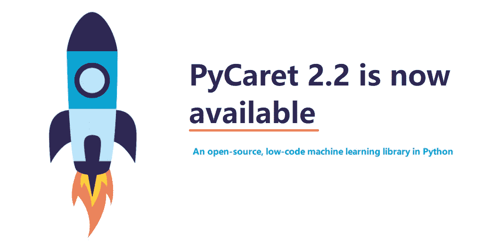
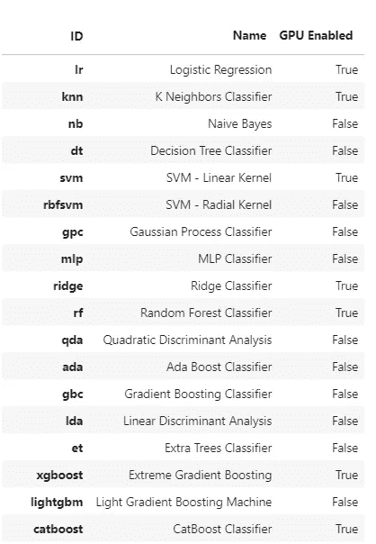
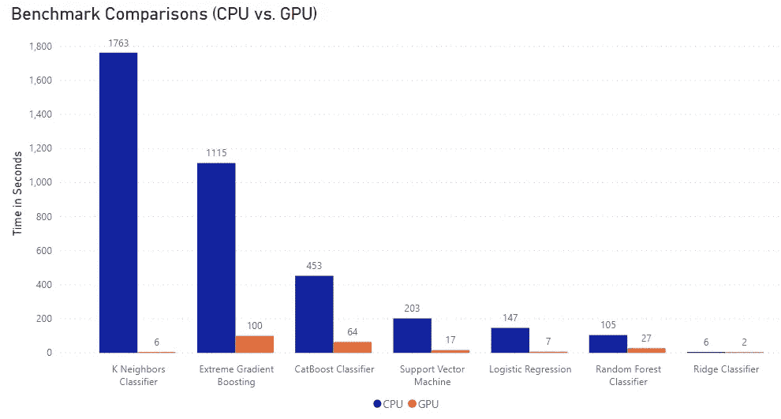
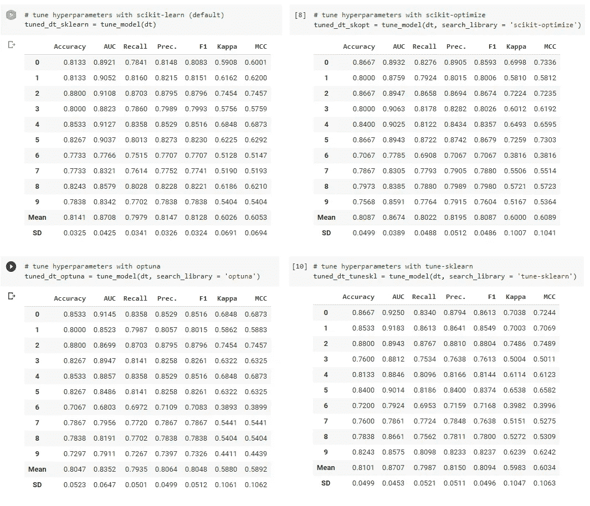
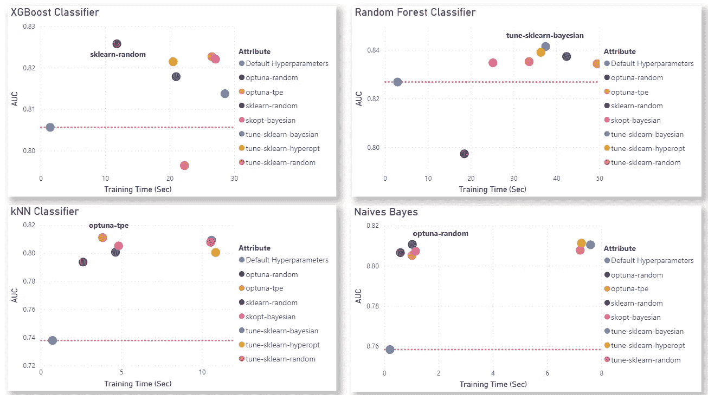
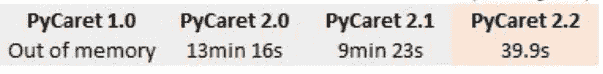
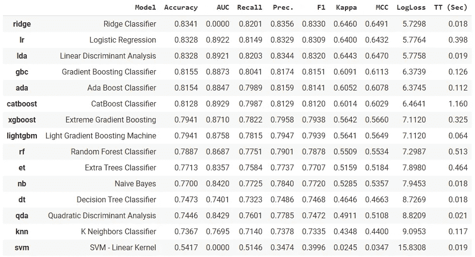
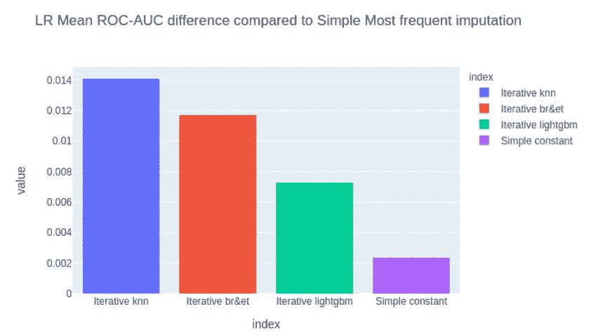
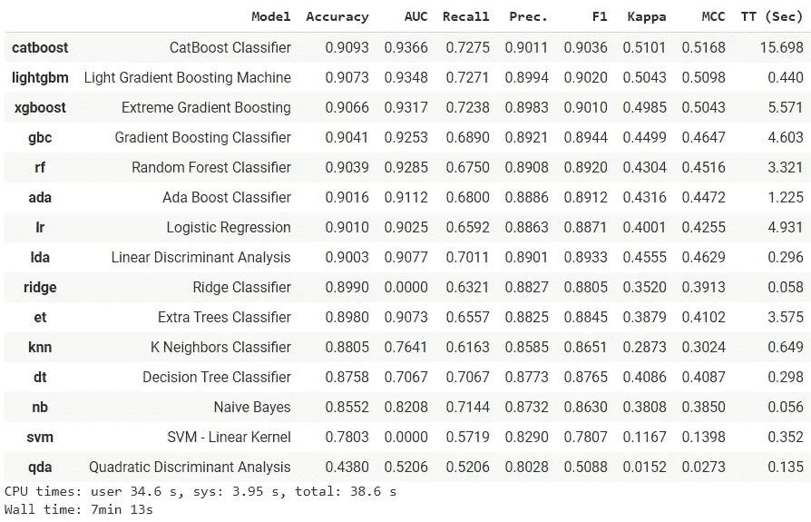
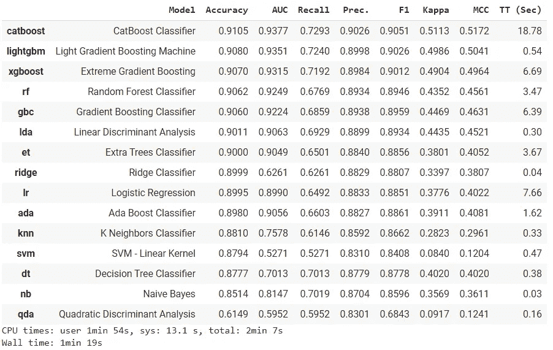

# PyCaret 2.2 已经发布了，有什么新消息吗？

> 原文：<https://towardsdatascience.com/pycaret-2-2-is-here-whats-new-ad7612ca63b?source=collection_archive---------3----------------------->



PyCaret 2.2 现在可以使用 pip 下载。[https://www.pycaret.org](https://www.pycaret.org)

我们很高兴宣布 py caret 2.2—2020 年 10 月的更新。

PyCaret 是一个用 Python 编写的开源、**低代码**机器学习库，可以自动化机器学习工作流。它是一个端到端的机器学习和模型管理工具，可以加快机器学习实验周期，让你更有效率。

与其他开源机器学习库相比，PyCaret 是一个替代的低代码库，可以用来替换数百行代码。这使得实验快速有效。

发行说明:【https://github.com/pycaret/pycaret/releases 

文档:[https://pycaret.readthedocs.io/en/latest/](https://pycaret.readthedocs.io/en/latest/)

# 正在安装 PyCaret

安装 PyCaret 非常容易，只需要几分钟。我们强烈建议使用虚拟环境来避免与其他库的潜在冲突。参见下面的示例代码，创建一个 conda 环境并在该 conda 环境中安装 pycaret:

```
**# create a conda environment** 
conda create --name yourenvname python=3.6 **# activate environment** 
conda activate yourenvname **# install pycaret** 
pip install pycaret**# create notebook kernel linked with the conda environment** python -mipykernel install --user --name yourenvname --display-name "display-name"
```

PyCaret 的默认安装是 pycaret 的精简版本，它只安装这里列出的[硬依赖项](https://github.com/pycaret/pycaret/blob/master/requirements.txt)。要安装 pycaret 的完整版本，请使用以下代码:

```
**# install the full version**
pip install pycaret[full]
```

当您安装 pycaret 的完整版本时，这里列出的所有可选依赖项[也会被安装。](https://github.com/pycaret/pycaret/blob/master/requirements-optional.txt)

# 安装每夜构建

PyCaret 进化非常快。通常，您希望获得最新的特性，但是希望避免从源代码编译 PyCaret 或者等待下一个版本。幸运的是，您现在可以使用 pip 安装 pycaret-nightly。

```
**# install the nightly build** pip install pycaret-nightly

**# or install the full version of the nightly build** pip install pycaret-nightly[full]
```

# PyCaret 2.2 功能概述

# 👉支持 GPU 的培训

PyCaret 2.2 提供了使用 GPU 进行选择模型训练和超参数调整的选项。API 的使用没有变化，但是，在某些情况下，必须安装额外的库，因为它们没有安装默认的精简版本或完整版本。以下模型现在可以在 GPU 上训练。

*   极端梯度增压(无需进一步安装)
*   CatBoost(无需进一步安装)
*   光线渐变增强器(需要安装 GPU:[https://lightgbm.readthedocs.io/en/latest/GPU-Tutorial.html](https://lightgbm.readthedocs.io/en/latest/GPU-Tutorial.html)
*   逻辑回归、岭分类器、随机森林、K 近邻分类器、K 近邻回归器、支持向量机、线性回归、岭回归、套索回归、K-均值聚类和基于密度的空间聚类(需要累积量> = 0.15【https://github.com/rapidsai/cuml】T2

要在 GPU 上启用光照梯度增强机器，您必须安装 LightGBM 的 GPU 启用版本。官方的分步指南是这里的。

如果你使用 Google Colab，你可以为 GPU 安装 Light Gradient Boosting Machine，但首先，你必须卸载 Light GBM-CPU 版本。在此之前，请确保在您的 Colab 会话中启用了 GPU。使用以下代码安装支持 GPU 的 LightGBM:

```
**# uninstall lightgbm CPU**
pip uninstall lightgbm -y**# install lightgbm GPU**
pip install lightgbm --install-option=--gpu --install-option="--opencl-include-dir=/usr/local/cuda/include/" --install-option="--opencl-library=/usr/local/cuda/lib64/libOpenCL.so"
```

截至今天，谷歌 Colab 上还不支持 cuML 0.15。这在未来可能会改变，但现在，你可以免费使用预装了 cuML 0.15 的 [blazingSQL](https://blazingsql.com/) 笔记本。


[https://blazingsql.com/](https://blazingsql.com/)

登录到您的帐户后，启动 Python 3 笔记本并使用以下代码安装 pycaret:

```
**# install pycaret on blazingSQL**
!/opt/conda-environments/rapids-stable/bin/python -m pip install --upgrade pycaret
```

或者，如果你在本地机器上有 GPU，或者你计划使用任何其他带有 GPU 的云服务，你可以遵循 cuML 的官方[安装指南](https://rapids.ai/start.html#rapids-release-selector)。

假设安装成功，在 GPU 上训练模型唯一需要做的就是在初始化设置函数时启用 GPU。

```
**# import dataset** from pycaret.datasets import get_data
data = get_data('poker')**# initialize the setup** from pycaret.classification import *clf = setup(data, target = 'CLASS', use_gpu = True)
```

就是这样。您现在可以像在 CPU 上一样使用 pycaret 了。它会自动使用 GPU 进行模型训练，如果可能的话，还会使用 CPU 等效算法。甚至在开始训练之前，您可以通过使用以下命令来检查 GPU 上启用了哪些模型:

```
models(internal=True)[['Name', 'GPU Enabled']]
```



模型输出(内部=真)

**CPU 与 GPU 的性能指标评测比较(以秒为单位)**



基准比较 CPU 与 GPU，数据集:扑克(100K x 88)

# 👉超参数调谐

现在有了新的超参数调谐方法。在 PyCaret 2.1 之前，在 PyCaret 中调整模型的超参数的唯一方法是使用 scikit-learn 中的随机网格搜索。2.2 中添加的新方法有:

*   scikit-learn(网格)
*   sci kit-优化(贝叶斯)
*   tune-sklearn(随机、网格、贝叶斯、超点、bohb)
*   optuna(随机，热塑性弹性体)

为了使用这些新方法，增加了两个新参数**‘搜索 _ 库’**和**‘搜索 _ 算法’**。

```
**# train dt using default hyperparameters**
dt = create_model('dt')**# tune hyperparameters with scikit-learn (default)**
tuned_dt_sklearn = tune_model(dt)**# tune hyperparameters with scikit-optimize**
tuned_dt_skopt = tune_model(dt, search_library = 'scikit-optimize')**# tune hyperparameters with optuna**
tuned_dt_optuna = tune_model(dt, search_library = 'optuna')**# tune hyperparameters with tune-sklearn**
tuned_dt_tuneskl = tune_model(dt, search_library = 'tune-sklearn')
```



tune_model 输出(dt，默认超参数 AUC = 0.7401

**搜索 _ 算法**依赖于**搜索 _ 库**。以下搜索算法可用于相应的搜索库:

*   scikit-learn → random(默认)，网格
*   sci kit-优化→贝叶斯(默认)
*   tune-sklearn →随机(默认)，网格，贝叶斯，超点，bohb
*   optuna →随机，tpe(默认)

具有 **partial_fit** 属性的估计器也支持提前停止。[在发行说明中阅读更多关于它的](https://github.com/pycaret/pycaret/releases)。

**不同调谐器的基准比较**



PyCaret 数据集:糖尿病中可用搜索库/搜索算法的基准比较

# 👉内存和性能改进

PyCaret 2.2 关注的是性能和功能。大量代码被重构，以在不影响用户体验的情况下改善内存占用和优化性能。

一个例子是所有的数字数据从以前的 64 位动态转换为 32 位，大大减少了内存占用。性能提升的另一个例子是跨所有功能的交叉验证，与以前按折叠顺序训练相比，现在跨多个内核自动并行化。

我们在著名的[纽约出租车数据集](https://www.kaggle.com/c/nyc-taxi-trip-duration)的 500 万个样本行上比较了 PyCaret 所有发布版本的性能。下图比较了完成设置初始化所需的时间:



来自纽约出租车数据集的 5M 行的基准性能比较

所有的比较都是在具有 8 个 CPU 内核的 AMD64 机器上进行的。

# 👉添加自定义指标

现在，您可以完全自定义(添加或删除)在交叉验证期间评估的指标。这意味着您不再局限于 PyCaret 的默认模型评估指标。增加了三个新功能**获取指标、添加指标、**和**移除指标**。用法超级简单。参见示例代码:

```
**# import dataset** from pycaret.datasets import get_data
data = get_data('juice')**# initialize the setup** from pycaret.classification import *clf = setup(data, target = 'Purchase')**# check all metrics used for model evaluation**get_metrics()**# add Log Loss metric in pycaret**
from sklearn.metrics import log_loss
add_metric('logloss', 'LogLoss', log_loss, greater_is_better=False)**# compare baseline models**best = compare_models()
```



添加自定义指标后的 compare_models 输出

请注意，在 TT 被添加到 **compare_models** 得分网格之前，一个新列“log loss”(*所有新指标被添加到右侧)，因为我们使用 **add_metric** 函数添加了指标。您可以使用 [scikit-learn](https://scikit-learn.org/stable/modules/classes.html#sklearn-metrics-metrics) 中可用的任何指标，或者您可以使用 [make_scorer](https://scikit-learn.org/stable/modules/generated/sklearn.metrics.make_scorer.html) 函数创建自己的指标。您可以使用以下命令删除度量:*

```
remove_metric('logloss')
```

# 👉迭代插补

迭代插补是一种使用回归和分类估计器来输入缺失数据的技术，将每个特征建模为其他特征的函数。每个特征以循环方式进行估算，以前的预测用于新的预测。为了提高估算的质量，这个过程要重复几次。与简单的插补相比，它可以创建更接近真实值的合成值，但需要额外的处理时间。

忠于 PyCaret 的精神，用法非常简单:

```
**# initialize setup**
from pycaret.classification import *clf = setup(data, target = 'Class', imputation_type="iterative")
```

默认情况下，它将使用光梯度增强机器作为分类特征(分类)和数值特征(回归)的估计器，这可以使用设置中的**分类 _ 迭代 _ 估算**和**数值 _ 迭代 _ 估算**参数进行更改。

**迭代插补与简单插补的基准比较**

为了比较简单均值插补和迭代插补的结果，我们使用了包含大量缺失值的[马疝气数据集](https://raw.githubusercontent.com/jbrownlee/Datasets/master/horse-colic.data)。下图比较了使用不同插补方法的逻辑回归的表现。



安东尼·鲍姆的一篇博文:[https://www . LinkedIn . com/pulse/iterative-attumation-py caret-22-安东尼-鲍姆/](https://www.linkedin.com/pulse/iterative-imputation-pycaret-22-antoni-baum/?trackingId=ByTfWY9y%2FogKIZV68ehF%2Bw%3D%3D)

与简单平均插补相比，使用 KNN 迭代插补作为分类和数值特征的估计量，平均 AUC 得分提高了 0.014 (1.59%)。要了解更多关于这个功能的信息，你可以在这里阅读完整的博文。

# 👉折叠策略

PyCaret 2.2 提供了定义折叠策略的灵活性。在 PyCaret 2.1 之前，您不能定义交叉验证策略。它使用**‘StratifiedKFold’**进行分类，使用**‘k fold’**进行回归，这限制了 PyCaret 在某些用例中的使用，例如时间序列数据。

为了克服这个问题，在设置功能中增加了一个新参数**‘fold _ strategy’****。它可以采用以下值:**

*   **`kfold`为 KFold CV**
*   **`stratifiedkfold`为分层 KFold CV**
*   **`groupkfold`为集团 KFold CV**
*   **`timeseries`为 TimeSeriesSplit CV 或者**
*   **与 scikit-learn 兼容的自定义 CV 生成器对象。**

# **👉比较保留集上的模型**

**如果你之前用过 PyCaret，你一定熟悉它最常用的函数 **compare_models。**此功能使用交叉验证来训练和评估模型库中所有可用估计器的性能。然而，问题是如果你正在处理非常大的数据集，compare_models 可能要花很长时间才能完成。原因是它适合模型库中每个估计器的 10 倍。对于分类，这意味着总共有 15 x 10 = 150 个评估者。**

**在 PyCaret 2.2 中，我们在 compare_models 函数中引入了一个新参数 **cross_validation** ，当该参数设置为 False 时，将对维持集上的所有指标进行评估，而不是进行交叉验证。而单独依赖维持指标可能并不可取，尤其是当数据集太小时。在处理大型数据集时，这无疑可以节省大量时间。**

**为了量化影响，我们比较了 **compare_models** 在两种场景中的性能(交叉验证=真，交叉验证=假)。用于比较的数据集是[这里是](https://github.com/pycaret/pycaret/blob/master/datasets/bank.csv) (45K x 50)**

*****交叉验证(耗时 7 分 13 秒):*****

****

**compare_models 的输出(cross_validation = True)**

*****无交叉验证(耗时 1 分 19 秒):*****

****

**compare_models 的输出(cross_validation = False)**

# **👉自定义转换**

**谈到灵活性，这是一个全垒打。一个新的参数 **custom_pipeline** 被添加到 setup 函数中，该函数可以接受任何转换器并附加到 PyCaret 的预处理管道中。所有自定义变换都在 train_test_split 之后分别应用于每个 CV 折叠，以避免目标泄漏的风险。用法非常简单:**

```
**# import dataset** from pycaret.datasets import get_data
data = get_data('juice')**# build custom transformations** from imblearn.over_sampling import SMOTE
from sklearn.decomposition import PCA
custom_pp = [("PCA",PCA()),("smote", SMOTE())]**# initialize setup** from pycaret.classification import *clf = setup(data, target = 'Purchase', custom_pipeline = custom_pp)
```

# **👉独立的训练和测试设备**

**这是期待已久的，也是自第一次发布以来最受欢迎的特性之一。现在可以通过单独的测试集，而不是依赖 pycaret 内部的 train_test_split **。**设置中增加了一个新参数**‘测试数据’**。当一个数据帧被传入 test_data 时，它被用作一个测试集，并且 **train_size** 参数被忽略。test_data 必须加标签。请参见下面的示例代码:**

```
**# loading dataset**import pandas as pd
train_data = pd.read_csv('/path/train.csv')
test_data = pd.read_csv('/path/test.csv')**# initializing setup**from pycaret.classification import *
clf = setup(data = train_data, test_data = test_data)
```

# **👉禁用预处理**

**如果您不想使用 PyCaret 的默认预处理管道，或者您已经有了转换后的数据集，而只想使用 PyCaret 的建模功能，这在以前是不可能的，但现在我们已经为您做好了准备。只需关闭设置中的'**预处理'**参数。当预处理设置为 False 时，除了在 **custom_pipeline** 参数中传递的 train_test_split 和自定义转换之外，不应用任何转换。**

```
**# initializing setup**from pycaret.classification import *
clf = setup(data = train_data, preprocess = False) 
```

**然而，当在设置中关闭预处理时，您必须确保您的数据是建模就绪的，即没有缺失值、没有日期/时间戳、分类数据被编码等。)**

# **👉其他变化**

*   **在 **plot_model** 中添加了新的图“提升”、“增益”和“树”。**
*   **CatBoost 现在与 **plot_model** 功能兼容。它需要 catboost > = 0.23.2。**
*   **为了使使用和开发更容易，根据最佳实践，所有更新的 pycaret 函数都添加了类型提示。用户可以通过使用支持类型提示的 IDE 来利用它们。**

**要了解 PyCaret 2.2 中所有更新的更多信息，请参见[发行说明](https://github.com/pycaret/pycaret/releases)。**

**使用 Python 中的轻量级工作流自动化库，您可以实现的目标是无限的。如果你觉得这有用，请不要忘记给我们 GitHub repo 上的⭐️。**

**想了解更多关于 PyCaret 的信息，请在 LinkedIn 和 Youtube 上关注我们。**

# **重要链接**

**[用户指南](https://www.pycaret.org/guide)
[文档](https://pycaret.readthedocs.io/en/latest/)
[官方教程](https://github.com/pycaret/pycaret/tree/master/tutorials) [示例笔记本](https://github.com/pycaret/pycaret/tree/master/examples)
[其他资源](https://github.com/pycaret/pycaret/tree/master/resources)**

# **想了解某个特定模块？**

**单击下面的链接查看文档和工作示例。**

**[分类](https://pycaret.readthedocs.io/en/latest/api/classification.html)
[回归](https://pycaret.readthedocs.io/en/latest/api/regression.html)
[聚类](https://pycaret.readthedocs.io/en/latest/api/clustering.html)
[异常检测](https://pycaret.readthedocs.io/en/latest/api/anomaly.html)
[自然语言处理](https://pycaret.readthedocs.io/en/latest/api/nlp.html) 关联规则挖掘**