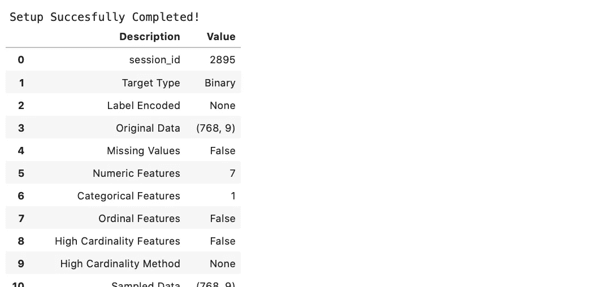
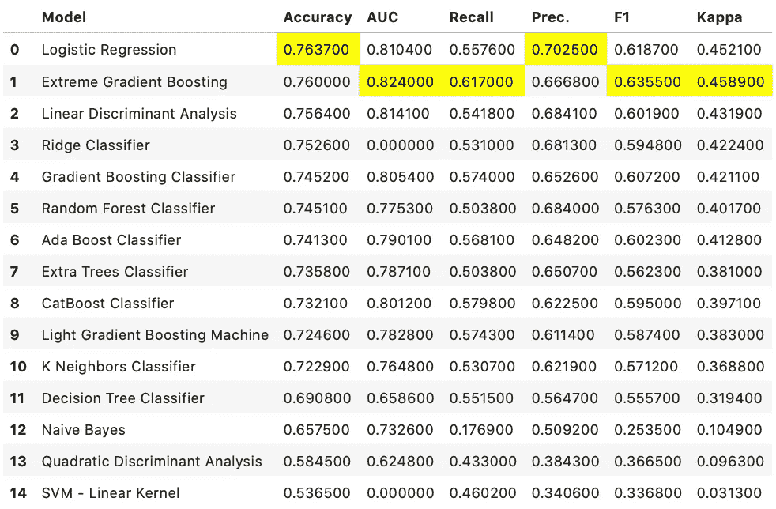
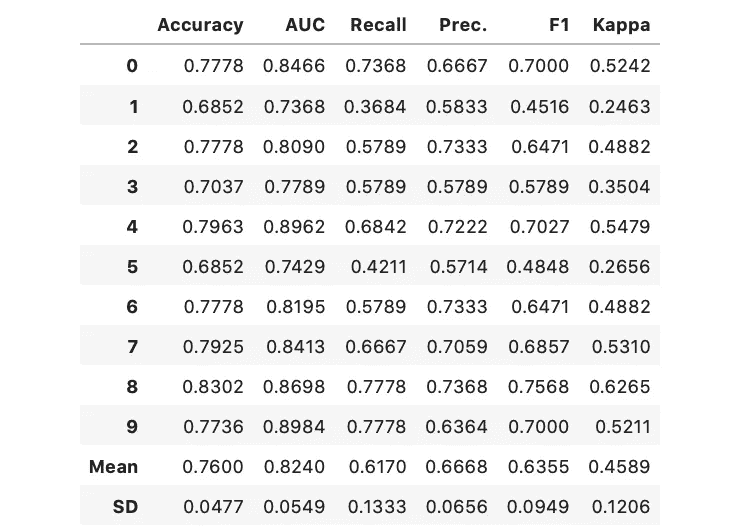
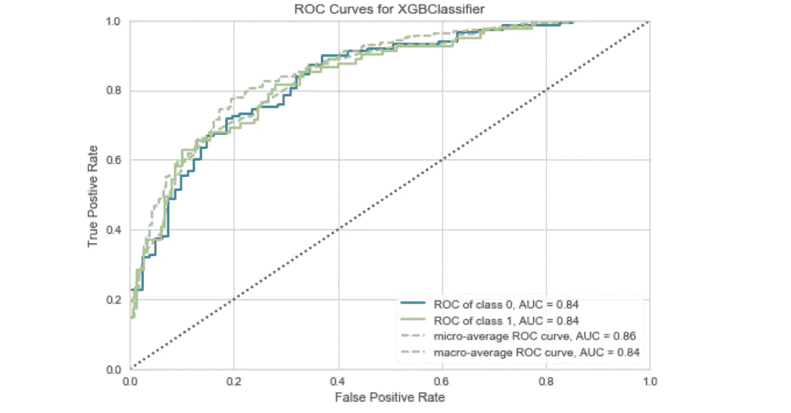
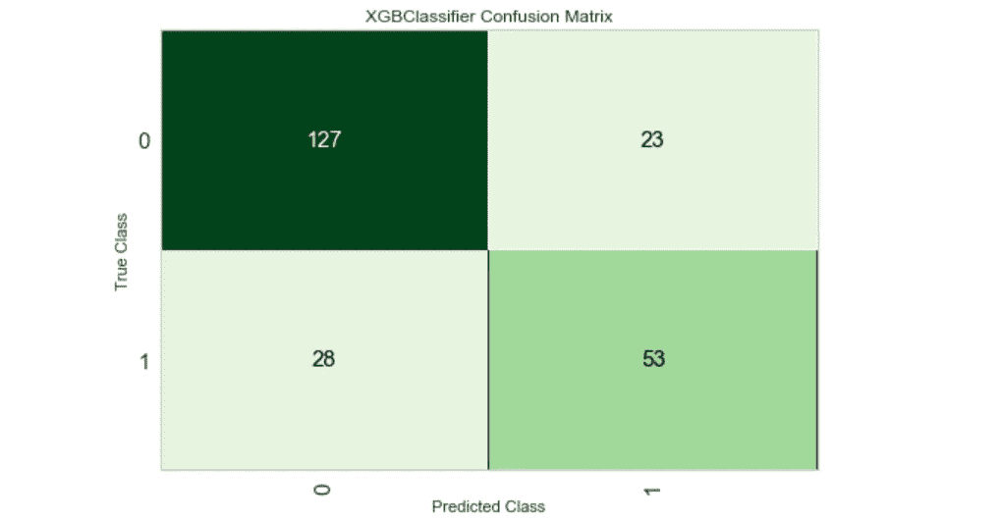
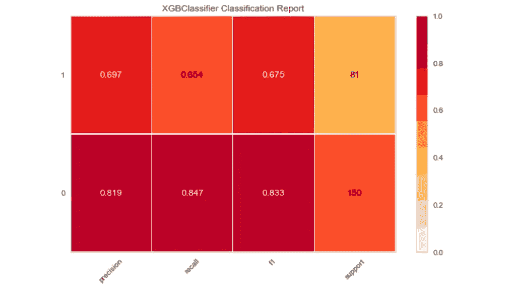
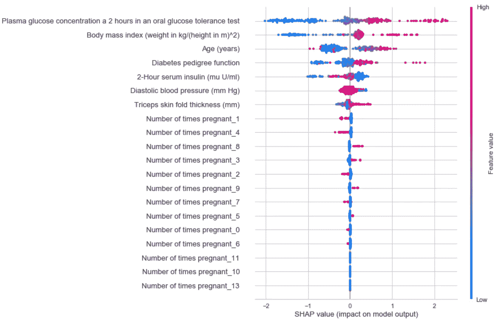
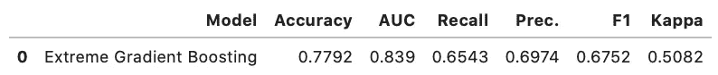
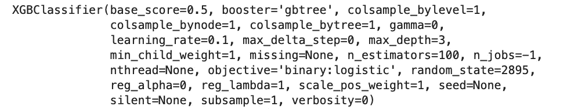
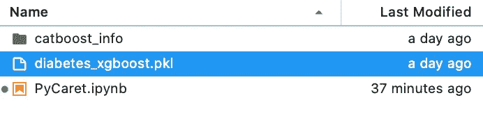

# PyCaret:用 Python 实现更好的机器学习

> 原文：<https://towardsdatascience.com/pycaret-better-machine-learning-with-python-58b202806d1e?source=collection_archive---------19----------------------->

## Scikit 的替代——使用 Python 学习机器

挑选任何数据科学书籍或在线课程。我敢打赌，唯一涵盖的机器学习库是 Scikit-Learn。这是一个很好的起点，不要误会我的意思，但在 2020 年，我们需要更加自动化和节省时间的东西。


安德烈·本兹在 [Unsplash](https://unsplash.com?utm_source=medium&utm_medium=referral) 上拍摄的照片

这就是 PyCaret 的用武之地。这是一个相对较新的库，所以没有太多的教程可用——尽管官方文档做了一项惊人的工作。下面是一句话的总结:

> PyCaret 是 Python 中的一个开源、低代码机器学习库，允许您在几秒钟内从准备数据到在您选择的笔记本环境中部署模型。[1]

如果你更喜欢视频，或者只是想巩固你的知识，请随意观看我们关于这个主题的视频。[源代码](https://github.com/betterdatascience/YouTube/blob/master/0005_PyCaret.ipynb)包含:

本文的目标读者是熟悉机器学习概念的人，他们也知道如何使用 Scikit-Learn 等库中的各种算法。理想的读者意识到自动化的需要，并且不想花费数天或数周时间寻找最佳算法及其超参数。

这将是一篇相当短的实践性文章，因为其目的只是展示该库能够做什么。未来的文章将更多地关注回归/分类/聚类任务。

好了，我们开始吧！

# Python 演示

[安装过程](https://pycaret.org/install/)因操作系统而异。我在 macOS 上，所以在安装库之前需要一些步骤。

一旦完成，你就可以开始了。我们将从两个导入开始:

```
from pycaret.classification import * 
from pycaret.datasets import get_data
```

第一种方法是开始分类任务的推荐方法——尽管你们中的一些人可能不习惯使用 **import *** 语法。如果你不喜欢，就避开它。第二个导入允许我们使用内置数据集。

我们将使用内置的*糖尿病*数据集，以及 **get_data()** 函数来获取它。接下来，我们需要做一些设置，并告诉 PyCaret 目标变量是什么:

```
diabetes = get_data(‘diabetes’)
exp_clf = setup(diabetes, target=’Class variable’)
```

执行此代码将导致以下结果:



这个结果数据帧相当长，并且报告了大量关于数据的信息。我们现在可以继续机器学习部分。

## 寻找最佳算法

这一步很简单。键入以下内容:

```
compare_models()
```

这是结果:



是的， **compare_models()** 函数完成了所有这些工作。它还用黄色突出显示得分最高的单元格，这样更容易看到。逻辑回归似乎在准确性方面做得最好，但是 XGBoost 算法总体上执行得最好——所以这是我们将使用的算法。

*如何？*再一次，再简单不过了:

```
xgb = create_model(‘xgboost’)
```



在[这个链接](https://pycaret.org/create-model/)上，你会找到所有的模型缩写，所以你可以使用 XGBoost 以外的东西。接下来，让我们直观地看看我们的模型表现如何。

## 可视化模型性能

我们可以使用 **plot_model()** 函数来可视化模型性能:

```
plot_model(xgb)
```



它默认显示 ROC 曲线，但这很容易改变。这是混淆矩阵:

```
plot_model(xgb, ‘confusion_matrix’)
```



和分类报告:

```
plot_model(xgb, ‘class_report’)
```



*整齐，对吧？*这里是[链接](https://pycaret.org/plot-model/)到你可以制作的所有可视化效果。让我们继续模型的可解释性。

## SHAP 的模型解释

SHAP，或 *SHapley 附加解释，*是一种解释机器学习模型输出的方法。通过绘制每个样本的每个特征的 SHAP 值，我们可以使用它来查看哪些特征最重要。

PyCaret 又一次让事情变得非常简单:

```
interpret_model(xgb)
```



上图根据所有样本的 SHAP 值大小的总和对要素进行排序，并使用 SHAP 值来显示每个要素对模型输出的影响分布[2]。相当长的句子，所以通读几遍。颜色代表特征值，红色代表高，蓝色代表低。

简而言之，它指出，在口服葡萄糖耐量试验的 2 小时内*血浆葡萄糖浓度水平较高(无论这意味着什么)，导致患糖尿病的几率较高(由于红色)。*

我计划在其他文章中更深入地讨论 SHAP，所以我在这里就不赘述了。让我们继续在测试集上进行模型评估。

## 模型评估和预测

PyCaret 在加载时将数据分成训练和测试部分(70:30)，因此我们不必手动完成。

我们现在可以根据以前未见过的数据来评估模型:

```
predictions = predict_model(xgb)
```

上述代码会产生以下结果:



好了，现在当这个已经完成了，让我们看看如何保存和加载模型。

## 模型保存和加载

在保存模型之前，我们需要完成它:

```
finalize_model(xgb)
```



猜猜保存模型有多简单:

```
save_model(xgb, ‘diabetes_xgboost’)
```



模型以 pickle 格式保存。

尝试猜测加载已保存模型的函数的名称:

```
model = load_model(‘diabetes_xgboost’)
```

你准备再次使用它。

我们今天已经讲了很多东西，所以让我们在下一部分总结一下。更多类似的文章即将发布，敬请关注。

# 结论

今天我们简要介绍了 PyCaret 所提供的内容。我的想法是把这个变成一个系列，既有基于文章的，也有基于视频的，并且更深入地覆盖这个库。

当使用像这样的库时，像 Scikit-Learn 这样的库很快就会成为过去。不是因为他们不好，而是这些人在各方面都很优秀。

我希望你喜欢它，并设法从中获得一些有用的东西。感谢阅读。

*喜欢这篇文章吗？成为* [*中等会员*](https://medium.com/@radecicdario/membership) *继续无限制学习。如果你使用下面的链接，我会收到你的一部分会员费，不需要你额外付费。*

[](https://medium.com/@radecicdario/membership) [## 通过我的推荐链接加入 Medium-Dario rade ci

### 作为一个媒体会员，你的会员费的一部分会给你阅读的作家，你可以完全接触到每一个故事…

medium.com](https://medium.com/@radecicdario/membership) 

# 参考

[1][https://pycaret.org](https://pycaret.org)

[2][https://github.com/slundberg/shap](https://github.com/slundberg/shap)